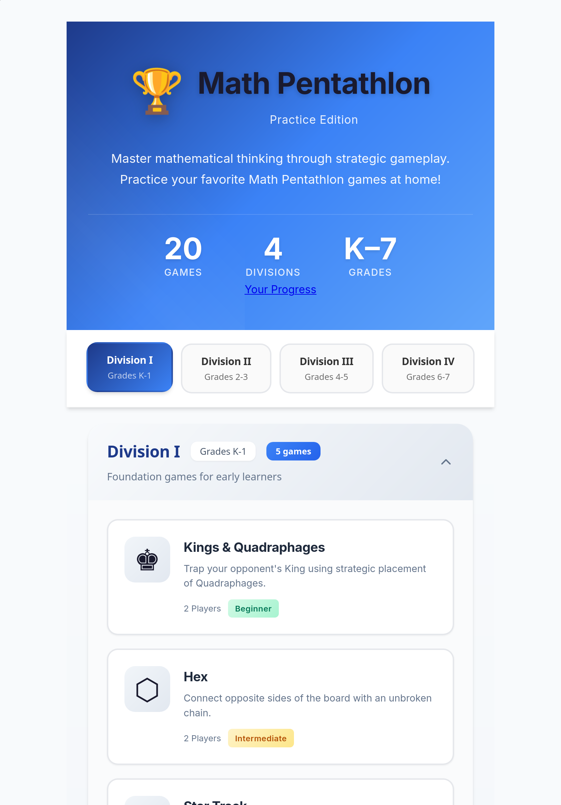
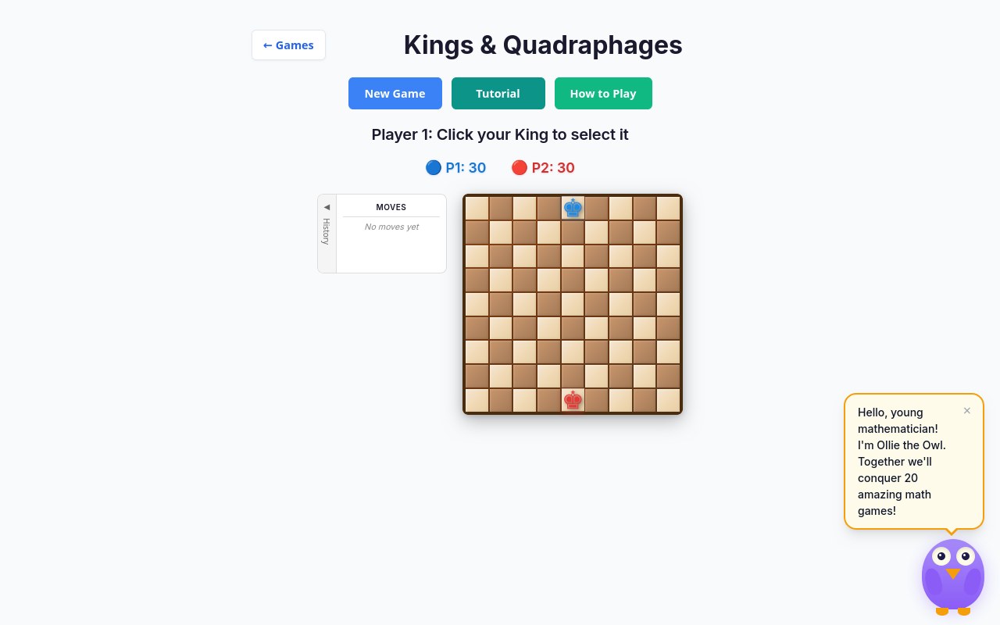
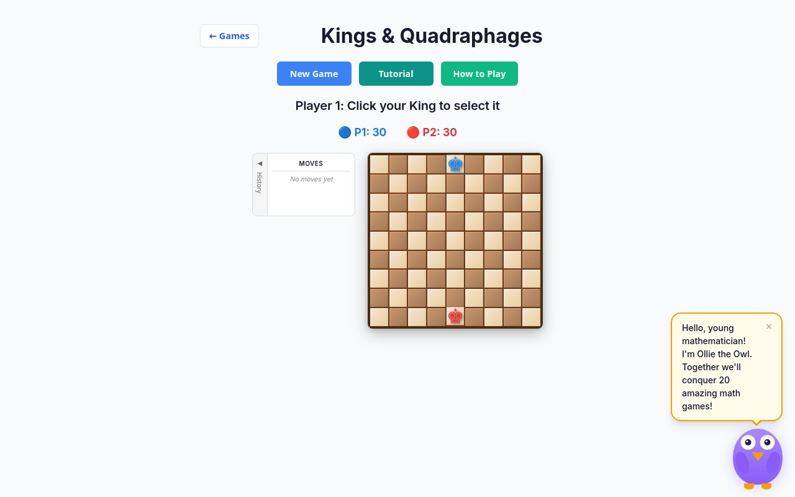
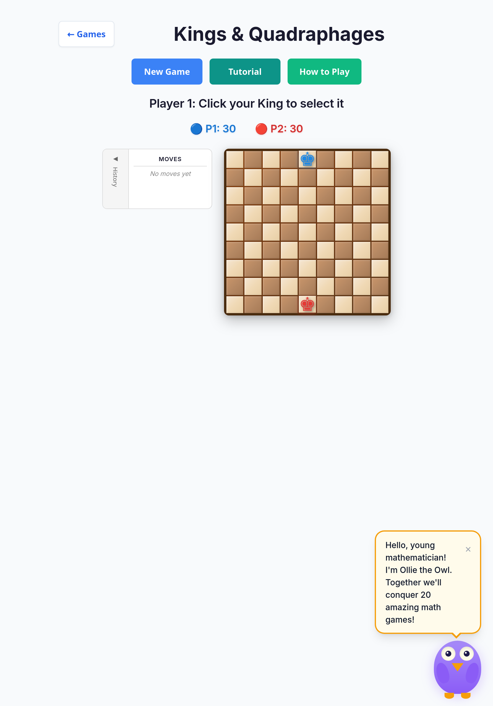

# Cross-browser smoke — 2026-10-07

Branch: `cursor/cross-browser-smoke-2987`  
Base: `cursor/overnight-polish-integration-0494`  
Suite: `tests/e2e/smoke.spec.ts` via opt-in Playwright projects.

## Scope

- **Engines:** Desktop Firefox, Desktop WebKit (Safari), iPad Pro 11 (WebKit device profile)
- **Allowed fixes:** shared shell / CSS only (`index.html`, `src/style.css`, `src/ui/styles/mobile-play-shell.css`)
- **Out of scope:** per-game rules, scoring, controllers, board logic

## How to run (opt-in)

Required CI path stays Chromium-only:

```bash
npm run test:e2e:chromium
```

Cross-browser smoke (local or optional CI):

```bash
npx playwright install --with-deps firefox webkit
npm run test:e2e:cross -- tests/e2e/smoke.spec.ts
```

Or select projects explicitly:

```bash
npm run test:e2e -- --project=firefox --project=webkit --project=ipad-webkit -- tests/e2e/smoke.spec.ts
```

CI opt-in (not required on PRs):

- Workflow dispatch input `cross_browser: true`, or
- Repository variable `CROSS_BROWSER_E2E=true`

See `.github/workflows/ci.yml` job `e2e-cross-browser`.

## Results (this run)

| Project       | Device / browser              | Smoke (`smoke.spec.ts`) |
| ------------- | ----------------------------- | ----------------------- |
| `firefox`     | Desktop Firefox               | **41/41 passed**        |
| `webkit`      | Desktop Safari (WebKit)       | **41/41 passed**        |
| `ipad-webkit` | iPad Pro 11 (WebKit)          | **41/41 passed**        |
| **Total**     |                               | **123/123 passed** (~1.6m) |

No game-logic failures. Shared shell CSS was hardened for known engine quirks even where smoke stayed green (defensive viewport / touch / safe-area).

## Shared shell / CSS changes

| Change | Why |
| ------ | --- |
| `viewport-fit=cover` on the viewport meta | Enables `env(safe-area-inset-*)` on iPad / notched WebKit |
| `min-height: 100vh` + `100dvh` on `body` and `.game-selector` | Avoids mobile Safari URL-bar jump; keeps Firefox/older fallback |
| Modal + tutorial overlay `height: 100%` + `100dvh` | Full-viewport covers track dynamic viewport on WebKit |
| `safe-area-inset-top` on play-shell `body` padding | Notch / status bar clearance (left/right/bottom already present) |
| Star Track board: `100vh` then `100dvh` caps | Older engines without `dvh` still get a height cap |
| `touch-action: manipulation` on shell buttons + tutorial hit proxy | Removes legacy WebKit 300ms tap delay on iPad |

`:has()` is not used in shared CSS today, so no selector fallback was required. Smoke locators that use `:has()` run inside Playwright’s engine and passed on Firefox/WebKit.

## Screenshots

### Landing — Firefox


### Landing — WebKit


### Landing — iPad WebKit



### Kings & Quadraphages — Firefox



### Kings & Quadraphages — WebKit



### Kings & Quadraphages — iPad WebKit



## Follow-ups (not in this PR)

- Optional: expand tablet media queries beyond `max-width: 480px` for landscape iPad gutters
- Keep cross-browser job opt-in until wall time is acceptable in default CI
