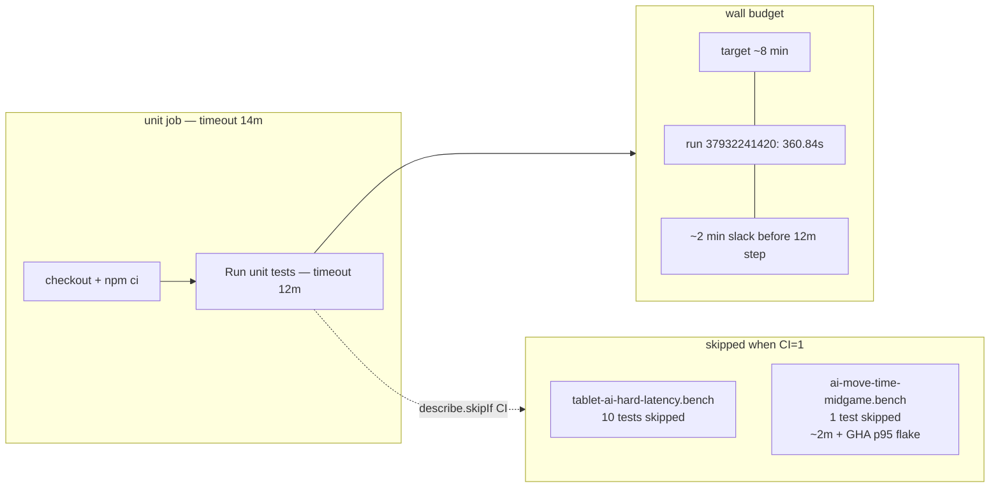

# AI-timing benches skipped under CI — inventory (2026-10-09)

**Task id:** `q-mp-165`  
**Role:** worker (report-only)  
**Tip audited:** `cursor/mp-tip-post477` @ `66b683a5` (full SHA `66b683a55853e3f70b825b01c4664da02bd72318`)  
**Evidence CI run:** [`37932241420`](https://github.com/fuzzywigg/math-pentathlon/actions/runs/37932241420) (unit job success; head SHA at run time `2083a96d`)  
**Scope:** Documentation only — inventory of `describe.skipIf(!!process.env.CI)` AI latency / move-time benches. **No** test, AI, rules, or workflow edits.

## Explicit HOLD (workers)

**Do not change AI timing asserts.** Hex Hard play deadline stays **450ms**.

| Pin | Live tip citation |
| --- | --- |
| Hex Hard deadline | `src/games/hex/ai.ts:21` — `hard: 450,` |
| Hex Hard comment | `src/games/hex/ai.ts:14` — `Hard targets ≤500ms wall think-time (deadline 450ms leaves abort slack;` |
| Unit assert | `tests/unit/ai-hard-midgame-identity.test.ts:63` — `expect(HEX_MS.hard).toBeLessThanOrEqual(450);` |
| Midgame Hard flag (local bench only) | `tests/unit/ai-move-time-midgame.bench.test.ts:122` — `HARD_FLAG_MS = 500` (p95 flag for local report; not a CI gate) |

Related report-only hard-assert recheck: open draft [#630](https://github.com/fuzzywigg/math-pentathlon/pull/630) (`q-mp-030b`).

## Duplicate check (open drafts / in-flight)

| Draft / agent | Topic | Overlap with this inventory |
| --- | --- | --- |
| **q-mp-151** [agent](https://cursor.com/agents/bc-dcef020e-f346-5a46-8b31-76ff3c3e4f1d) — *AI-timing flake inventory* | Flake history / rates for AI-timing suites | **Sibling, not duplicate.** That task inventories flakes; this task inventories the **CI skip gate** and unit-budget rationale. Cross-link when that draft PR lands. |
| [#630](https://github.com/fuzzywigg/math-pentathlon/pull/630) `q-mp-030b` | Hex Hard 450ms + Stars & Bars history-cap absent | HOLD pin only — linked above |
| [#661](https://github.com/fuzzywigg/math-pentathlon/pull/661) / tip `docs/dev/testing-layers-2026-10-09.md` | Testing-layer counts | One-line note that the two benches use `skipIf(CI)` — this doc is the full inventory |
| [#597](https://github.com/fuzzywigg/math-pentathlon/pull/597) `q-mp-073` | CI blocking vs report-only Mermaid | Orthogonal (job graph, not bench skip policy) |
| No open draft already owns `docs/dev/ai-timing-ci-skip-inventory-2026-10-09.md` | — | This PR |

## Live `rg` (tip tree)

```bash
rg 'skipIf\(!!process\.env\.CI\)' tests/unit
```

Exact matches on tip @ `66b683a5` (AI latency / move-time benches only):

| File | Line | Construct |
| --- | --- | --- |
| `tests/unit/tablet-ai-hard-latency.bench.test.ts` | **100** | `describe.skipIf(!!process.env.CI)('Tablet Hard AI latency bench', …)` |
| `tests/unit/ai-move-time-midgame.bench.test.ts` | **574** | `describe.skipIf(!!process.env.CI)('AI move-time mid-game bench …', …)` |

No other `describe.skipIf(!!process.env.CI)` hits under `tests/unit`. (Other files may use different CI skip helpers, e.g. `it.skipIf(skipIdentityUnderCi)` in `ai-hard-midgame-identity.test.ts` — out of scope for this inventory.)

## Inventory: every CI-skipped AI latency / move-time bench

### 1. Tablet Hard AI latency bench

| Field | Value |
| --- | --- |
| File | `tests/unit/tablet-ai-hard-latency.bench.test.ts` |
| Gate | `describe.skipIf(!!process.env.CI)` at **:100** |
| Header rationale | **:8–9** — “Skipped under CI — offline/local keeper; tip unit step needs the wall for the required suite.” |
| Soft tablet budget | `TABLET_BUDGET_MS = 2500` (:49) |
| Local run | `npx vitest run tests/unit/tablet-ai-hard-latency.bench.test.ts` |
| Cases under the skipped describe | **10** `it(...)` arms (Calla, Hex, Queens, Fab capped/unlimited, FIAR, Kings, Pent, Kwatro, Stars & Bars) |
| Tip CI evidence | Run `37932241420` unit log: `tests/unit/tablet-ai-hard-latency.bench.test.ts (10 tests \| 10 skipped)` |

### 2. AI move-time mid-game bench (all games × difficulties)

| Field | Value |
| --- | --- |
| File | `tests/unit/ai-move-time-midgame.bench.test.ts` |
| Gate | `describe.skipIf(!!process.env.CI)` at **:574** |
| Header rationale | **:7–8** — “Skipped under CI: ~2m wall + fab-a-diffy Hard p95 often flags >500ms on GHA runners, and the unit step cannot absorb both this bench and the tip suite.” |
| Hard flag (local) | `HARD_FLAG_MS = 500` (:122); Hard p95 > 500ms flags in the written report |
| Local run | `npx vitest run tests/unit/ai-move-time-midgame.bench.test.ts` |
| Cases under the skipped describe | **1** `it(...)` (measures p50/p95; writes `docs/ai-move-time-2026-10-07.md`) |
| Tip CI evidence | Run `37932241420` unit log: `tests/unit/ai-move-time-midgame.bench.test.ts (1 test \| 1 skipped)` |

Together these two files are the **2 skipped test files** in the suite summary (`Test Files 3121 passed | 2 skipped (3123)`).

## Tip unit duration budget (why the skips stay)

From `.github/workflows/ci.yml`:

| Knob | Location | Value |
| --- | --- | --- |
| Job comment | `:113–114` | Tip fold suite targets **~8 min**; notes AI benches skipped under CI |
| Job timeout | `:117` | `timeout-minutes: 14` |
| Step timeout | `:129` | `timeout-minutes: 12` |
| Step echo | `:133` | `unit suite: ${count} files (budget ~8 min; step timeout 12m / job 14m)` |

### Evidence from CI run `37932241420`

| Metric | Value |
| --- | --- |
| Unit step file count | `unit suite: 3123 files (budget ~8 min; step timeout 12m / job 14m)` |
| Vitest summary | `Test Files 3121 passed \| 2 skipped (3123)` |
| Tests | `12031 passed \| 35 skipped \| 22 todo (12088)` |
| Duration | **360.84s** (~6.0 min) — inside the ~8 min budget, with ~2 min slack before the 12m step timeout |
| tablet bench | **10 skipped** |
| midgame bench | **1 skipped** |

Enabling either bench on GHA would add wall time the tip suite cannot absorb (midgame alone ~2m locally) and would re-expose fab-a-diffy Hard p95 >500ms flakes on shared runners — without changing the Hex Hard **450ms** product assert (workers must not “fix” that by widening deadlines).

## Optional Mermaid — unit job time budget



## What workers must not do

- Do **not** remove or weaken `describe.skipIf(!!process.env.CI)` on these benches to “get coverage in CI.”
- Do **not** raise Hex Hard `AI_PLAY_DEADLINE_MS.hard` above **450**, or loosen `toBeLessThanOrEqual(450)`.
- Do **not** edit `*/ai.ts` search/scoring/difficulty/timing or `*/rules.ts` legal-move / scoring paths for this task.
- Local keepers remain: run the benches offline with the commands in the tables above.

## Verification (this task)

```bash
rg 'skipIf\(!!process\.env\.CI\)' tests/unit
npm run check:dev-docs
```

Expected: the two bench paths above; `check:dev-docs` reports no new missing-path problems introduced by this file (report-only checker; always exits 0).
