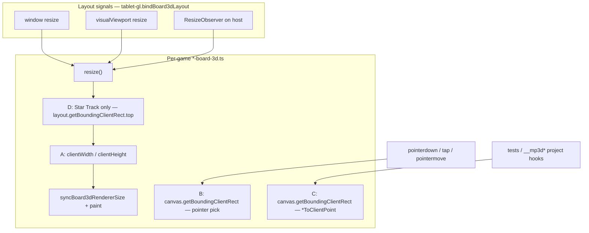

# q-mp-239 — `src/ui/three/*-board-3d` layout-read inventory

> **Superseded stamp:** current tip inventory is [`board3d-layout-reads-inventory-post865-2026-10-10.md`](./board3d-layout-reads-inventory-post865-2026-10-10.md) (`q-mp-415`). Intermediate post830 stamp: [`board3d-layout-reads-inventory-post830-2026-10-10.md`](./board3d-layout-reads-inventory-post830-2026-10-10.md).

**Task id:** `q-mp-239`  
**Role:** worker (docs / visual only)  
**Tip audited:** `cursor/mp-tip-post748` @ `ce673656` (full `ce673656202db8a9eae4e3c404c55a680bb40cd0`)  
**Scope:** Inventory + diagram of layout-forcing DOM reads in board-3d hosts and shared `tablet-gl` binders. **No `src/` edits.**

## Purpose

Document every `getBoundingClientRect` / `clientWidth` / `clientHeight` site under `src/ui/three/*-board-3d.ts`, plus related viewport helpers in `src/ui/three/tablet-gl.ts`, so a later non-behavior-changing cache pass has a single map. Orthogonal to open owl gBCR work (`#723`), par-55 layout (`#680`), and Star Track move-p95 HOLD (`#687`) — do not change those product timings here.

## Duplicate check

| Related draft / prior | Overlap | Action |
| --- | --- | --- |
| `#723` q-mp-197 owl-component gBCR | Different tree (`src/ui/owl/`) | Leave open; this doc does not touch owl |
| `#680` q-mp-134 par-55 layout | 2D board-ui, not three | Leave open |
| `#687` q-mp-135 Star Track p95 HOLD | Timing / harness HOLD | Inventory only; **no** Star Track timing edits |
| `#717` q-mp-187 tablet-gl knip exports | Export demotion, not layout reads | Leave open |
| `docs/dev/canvas-dpr-resize-audit-2026-10.md` | DPR / resize binder already fixed | Complementary; this doc is the **read-site** map |
| Open tip drafts `#749`–`#753` | emit-identity / demos lint / knip / backlog | No board-3d layout inventory |

No open draft already owns this inventory → full task proceeds.

## Live tip measurements (evidence @ `ce673656`)

```text
$ git rev-parse HEAD
  ce673656202db8a9eae4e3c404c55a680bb40cd0

$ rg -n 'getBoundingClientRect|clientWidth|clientHeight' src/ui/three
  # 32 hits across 8 *-board-3d.ts hosts (4 each); tablet-gl.ts = 0
  # (tablet-gl uses visualViewport / innerWidth — see shared helpers)

$ per-host counts (getBoundingClientRect|clientWidth|clientHeight):
  fiar-board-3d.ts                 4
  hex-a-gone-board-3d.ts           4
  kings-quadraphages-board-3d.ts   4
  kwatro-sinko-board-3d.ts         4
  pent-em-in-board-3d.ts           4
  prime-gold-board-3d.ts           4
  queens-guards-board-3d.ts        4
  star-track-board-3d.ts           4
  tablet-gl.ts                     0

$ npm run lint:ratchet   # ceilings after #748 fold (unchanged by this docs PR)
  ok curly 538; nnnull 254; void 132; radix 6; default-case 5;
     dup-imports 105; nullish 65; optional-chain 21; switch 8; no-shadow 13

$ knip baseline unusedTypes: 89  (docs-only; baseline not edited)
```

## Pattern summary

Every 3D host follows the same three roles (Star Track adds a fourth fit step):

| Role | Typical APIs | When it runs | Force layout? |
| --- | --- | --- | --- |
| **A. Resize sizing** | `container.clientWidth` / `clientHeight` | `resize()` via `bindBoard3dLayout` | Yes (reflow → size) |
| **B. Pointer → NDC pick** | `canvas.getBoundingClientRect()` | Tap / pointermove → ray or screen pick | Yes (geometry) |
| **C. World → client project** | `canvas.getBoundingClientRect()` | `*ToClientPoint` (tests / `__mp3d*` hooks) | Yes (geometry) |
| **D. Star Track host fit** | `layout.getBoundingClientRect().top` then host `clientWidth`/`Height` | Inside `fitHostToViewport` → `resize` | Yes (viewport fit) |

Shared binder `bindBoard3dLayout` in `src/ui/three/tablet-gl.ts` already coalesces window / `visualViewport` / `ResizeObserver` into one `onLayout` callback; it does **not** cache CSS rects for pick/project.

## Per-host inventory

| Host | Lines (tip `ce673656`) | Sites | Hot path notes |
| --- | --- | --- | --- |
| `src/ui/three/fiar-board-3d.ts` | 233–234, 243, 471 | A×2, B, C | Pick on tap (`onTap`); project for `nodeToClientPoint` |
| `src/ui/three/hex-a-gone-board-3d.ts` | 252–253, 281, 561 | A×2, B, C | **B on pointermove** (hover ghost) — densest interaction path |
| `src/ui/three/kings-quadraphages-board-3d.ts` | 249–250, 259, 309 | A×2, B, C | Pick on tap; project for `cellToClientPoint` |
| `src/ui/three/kwatro-sinko-board-3d.ts` | 396–397, 431, 745 | A×2, B, C | Pick on tap via `pickNodeId`; project for `nodeToClientPoint` |
| `src/ui/three/pent-em-in-board-3d.ts` | 267–268, 274, 573 | A×2, B, C | **B on pointermove** (hover) — same class as hex-a-gone |
| `src/ui/three/prime-gold-board-3d.ts` | 320–321, 574, 630 | A×2, B, C | Pick on tap while `phase === 'placing'`; project for cell/value hooks |
| `src/ui/three/queens-guards-board-3d.ts` | 352–353, 360, 725 | A×2, B, C | Pick on tap (`pickCoord`); project for `cellToClientPoint` |
| `src/ui/three/star-track-board-3d.ts` | 357, 374–375, 569 | D, A×2, C | Extra gBCR on **layout** for viewport fit; **no** canvas pick gBCR (DOM chain). HOLD `#687` timing |

### Role detail (shared shape)

**A — resize sizing** (all eight hosts):

```text
const resize = (): void => {
  // …
  const w = Math.max(container.clientWidth || <fallback>, 120);
  const h = Math.max(container.clientHeight || <fallback>, 120);
  syncBoard3dRendererSize(renderer, camera, w, h);
  paint();
};
// wired as: bindBoard3dLayout(host, () => resize())
```

Star Track sizes from `canvasHost` after `fitHostToViewport()` (role D).

**B — pointer pick** (seven hosts with canvas pick; not Star Track):

```text
const rect = canvas.getBoundingClientRect();
// → NDC / raycast from (clientX - rect.left) / rect.width …
```

**C — project helpers** (all eight; exposed on `window.__mp3d*` and/or return API):

```text
projectScratch.set(…).project(camera);
const rect = canvas.getBoundingClientRect();
// → client x/y from NDC × rect
```

**D — Star Track only** (`fitHostToViewport` @ `:357`):

```text
const top = layout.getBoundingClientRect().top;
// → remaining viewport height → square host maxWidth/maxHeight
```

## Shared helpers (`tablet-gl.ts`)

| Helper | Layout APIs | Notes |
| --- | --- | --- |
| `resolveCssViewportSize` | `visualViewport.width/height`, fallback `innerWidth`/`innerHeight` | Not `clientWidth` / gBCR; used for viewport CSS size |
| `syncBoard3dRendererSize` | none (takes width/height args) | Consumers still supply client sizes (role A) |
| `bindBoard3dLayout` | none on read path | Fires `onLayout` on window resize, VV resize, host `ResizeObserver` |

`rg` of the three inventory APIs against `tablet-gl.ts` is intentionally **0**; viewport reads use the visualViewport path above.

## Diagram — read flow



## Recommended cache opportunities (non-behavior-changing)

Docs-only recommendations for a **future** worker. Do **not** change AI timing, Star Track `#687` HOLD, or player-facing copy.

| Priority | Opportunity | Why safe if done carefully |
| --- | --- | --- |
| P1 | Cache canvas CSS rect for **B** on pointermove hosts (`hex-a-gone`, `pent-em-in`); invalidate on `bindBoard3dLayout` / resize | Same pick math; fewer forced layouts per hover frame |
| P1 | Share one cached `{left,top,width,height}` between **B** and **C** within a host | Both read the same canvas element |
| P2 | Prefer `ResizeObserver` `contentRect` (or border-box) for role **A** instead of synchronous `clientWidth`/`clientHeight` inside `resize`, when the callback already came from RO | Avoids an extra layout read when RO already measured |
| P2 | Star Track role **D**: cache `layout` top + viewport height across rAF; invalidate on VV/window | Fit logic unchanged; fewer gBCR on repeated resize storms — **coordinate with `#687` HOLD** before coding |
| P3 | Coalesce double-fire from window + RO + VV with a single rAF-batched `resize` | Already one callback shape; batching is optional polish |
| Leave | Role **C** when only tests / `__mp3d*` call it infrequently | Low runtime cost vs pick/hover |

## Non-goals / left alone

- No `src/` product edits in this PR
- AI search / scoring / difficulty / move timing; Hex Hard **450ms**; Stars & Bars history cap
- Player-facing copy / rules text; `*/rules.ts` / legal-move paths
- Lint ceilings / knip baseline (docs-only; no ratchet JSON)
- Owl (`#723`), par-55 (`#680`), Star Track p95 harness (`#687`)

## Verify

```bash
rg -n 'getBoundingClientRect|clientWidth|clientHeight' src/ui/three
npm run check:dev-docs
# full worker gate (docs-only; expect green, no ceiling change):
npm run lint
npm run typecheck
npm run verify
npm run lint:ratchet
```

## Related docs

- `docs/dev/canvas-dpr-resize-audit-2026-10.md` — DPR / resize binder fixes already landed
- `docs/dev/q-mp-197-owl-layout-reads.md` — owl-component cache pattern (different tree)
- `docs/dev/q-mp-113-layout-reads.md` / `docs/dev/q-mp-134-layout-reads.md` — 2D board layout cuts

**Next action: fold into tip by the tip owner.**
