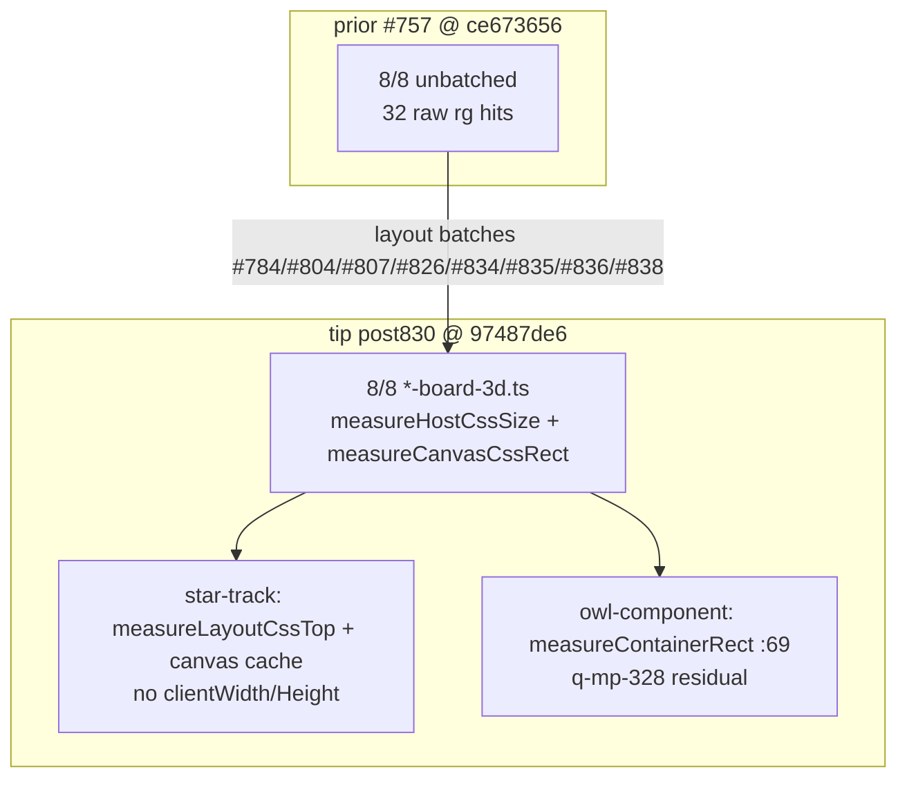

# q-mp-384 — board-3d layout-reads inventory refresh (tip post830)

**Task id:** `q-mp-384`  
**Role:** worker (docs / visual only)  
**Tip audited:** `cursor/mp-tip-post830` @ `97487de6` (full `97487de6b6ad16a2f47a07dcff1076ff1d544aa4`)  
**Prior inventory:** [`board3d-layout-reads-inventory-2026-10-09.md`](./board3d-layout-reads-inventory-2026-10-09.md) (`q-mp-239`, tip post748 @ `ce673656`) — leave open `#757` with `contained`  
**Visual:** [`board3d-layout-reads-inventory-post830-2026-10-10.svg`](./board3d-layout-reads-inventory-post830-2026-10-10.svg)  
**Scope:** Re-`rg` layout-forcing reads on live post830 tip. **No `src/` edits. No test behavior changes.**

## Purpose

Publish a dated inventory after the five board-3d layout batches (`#826` / `#834` / `#835` / `#836` / `#838`) landed on tip via fold `#830`, so agents stop treating the post748 inventory (all hosts unbatched, 32 raw hits) or the stale post785 backlog note (only hex/queens/prime-gold batched) as current.

## Spec staleness note

Backlog `q-mp-384` was written against tip post785 @ `06126841` and claimed:

- tip already batched hex / queens / prime-gold
- open drafts still owned fiar / kwatro / pent / kings (`#835` / `#836` / `#838` / `#834`)
- **30** raw `rg` hits across board-3d files

**Live post830 @ `97487de6`:** all eight `*-board-3d.ts` hosts use the batched host-size / canvas-rect pattern (including the five batches above). Raw board-3d `rg` total remains **30** (comments that mention `clientWidth`/`clientHeight` still match). Trust the live tree.

## Duplicate check (open drafts)

| Related draft / prior | Base | Overlap | Action |
| --- | --- | --- | --- |
| Open drafts into `cursor/mp-tip-post830` (`#853`/`#854` at audit) | post830 | CI pin / bundle headroom — not layout inventory | No overlap |
| `#757` q-mp-239 inventory (post748 @ `ce673656`) | post748 | Same topic; older tip stamp | Leave open; **contained** |
| `#826` / `#834` / `#835` / `#836` / `#838` layout batches | post785 | Code already on tip via `#830` fold | Leave open; **contained** |
| `#784` / `#804` / `#807` hex / queens / star-track batches | post755 | Code already on tip | Leave open; **contained** |
| Undrafted `q-mp-328` owl-component layout | — | Outside board-3d; `:69` funnel noted below | Leave for that owner |

No open draft into post830 owns a post830-dated layout-reads inventory → full refresh proceeds.

## Method (live tip)

```text
$ git rev-parse HEAD
  97487de6b6ad16a2f47a07dcff1076ff1d544aa4

$ rg -n 'getBoundingClientRect|clientWidth|clientHeight' \
    src/ui/three/*board-3d*.ts src/ui/owl/owl-component.ts src/ui/three/tablet-gl.ts
```

| Field | Value |
| --- | --- |
| **Command** | `rg -n 'getBoundingClientRect\|clientWidth\|clientHeight' src/ui/three src/ui/owl/owl-component.ts` |
| **board-3d raw hits** | **30** (7 hosts × 4 + star-track × 2) |
| **board-3d code sites** | **23** (7 × 3 + star-track × 2) — excludes doc comments that mention `clientWidth`/`Height` |
| **owl** | **1** (`owl-component.ts:69` inside `measureContainerRect`) |
| **tablet-gl** | **0** (viewport via `visualViewport` / `innerWidth`) |
| **Hosts with `measureHostCssSize` / `measureCanvasCssRect`** | **8 / 8** |

## Before → after metrics (report-only refresh)

| Metric | Before (`#757` / post748 @ `ce673656`) | Spec claim (post785 @ `06126841`) | After (live post830 @ `97487de6`) |
| --- | ---: | ---: | ---: |
| board-3d raw `rg` hits | 32 | 30 | **30** |
| Per-host raw (typical) | 4 × 8 | 4 × most | **4** × 7 + **2** star-track |
| Batched host-size pattern | 0 / 8 | hex / queens / prime-gold only | **8 / 8** |
| Open draft code claims (fiar/kwatro/pent/kings) | n/a (pre-batch) | still open | **tip-contained** via `#830` |
| owl gBCR sites | not in prior inventory | `:69` | **1** (funnel; see below) |
| Tip SHA stamp | `ce673656` | `06126841` | **`97487de6`** |

**Delta vs `#757`:** tip advanced through layout batches; raw count −2 (star-track dropped host `clientWidth`/`clientHeight` in favor of `fitHostToViewport` side); every board-3d host now funnels reads through measure helpers + cache.

## Pattern summary (post830)

| Role | Helper | APIs | When | Force layout? |
| --- | --- | --- | --- | --- |
| **A. Host size** | `measureHostCssSize()` | `container.clientWidth` / `clientHeight` (adjacent) | `resize()` via `bindBoard3dLayout` | Yes — once per layout epoch |
| **B/C. Canvas CSS rect** | `measureCanvasCssRect()` / `getCanvasCssRect()` | one `canvas.getBoundingClientRect()` | pick + project share cache; invalidate on resize | Yes — first use after invalidate |
| **D. Star Track fit** | `measureLayoutCssTop()` | `layout.getBoundingClientRect().top` | inside `fitHostToViewport` → resize | Yes — viewport fit |
| **Owl funnel** | `measureContainerRect()` | `container.getBoundingClientRect()` | size cache / eye center | Yes — funneled; RO also updates cache |

Shared binder `bindBoard3dLayout` in `src/ui/three/tablet-gl.ts` still coalesces window / `visualViewport` / `ResizeObserver` into one `onLayout` callback.

## Per-host inventory (tip `97487de6`)

| Host | Raw `rg` | Code sites | Batched? | Site lines (code) | Notes |
| --- | ---: | ---: | :---: | --- | --- |
| `src/ui/three/fiar-board-3d.ts` | 4 | 3 | yes (`#836`) | gBCR `:242`; W/H `:257`–`:258` | pick + project → `getCanvasCssRect` |
| `src/ui/three/hex-a-gone-board-3d.ts` | 4 | 3 | yes (`#784`) | gBCR `:257`; W/H `:272`–`:273` | pointermove hover uses cache |
| `src/ui/three/kings-quadraphages-board-3d.ts` | 4 | 3 | yes (`#834`) | gBCR `:254`; W/H `:269`–`:270` | tip-contained |
| `src/ui/three/kwatro-sinko-board-3d.ts` | 4 | 3 | yes (`#835`) | gBCR `:401`; W/H `:416`–`:417` | tip-contained |
| `src/ui/three/pent-em-in-board-3d.ts` | 4 | 3 | yes (`#838`) | gBCR `:276`; W/H `:291`–`:292` | pointermove hover uses cache |
| `src/ui/three/prime-gold-board-3d.ts` | 4 | 3 | yes (`#826`) | gBCR `:328`; W/H `:343`–`:344` | tip-contained |
| `src/ui/three/queens-guards-board-3d.ts` | 4 | 3 | yes (`#804`) | gBCR `:355`; W/H `:370`–`:371` | tip-contained |
| `src/ui/three/star-track-board-3d.ts` | 2 | 2 | yes (`#807`) | canvas gBCR `:361`; layout top `:375` | no host `clientWidth`/`Height`; fit via side px |
| `src/ui/owl/owl-component.ts` | 1 | 1 | funnel | `:69` in `measureContainerRect` | undrafted `q-mp-328` owner; RO path updates cache too |
| `src/ui/three/tablet-gl.ts` | 0 | 0 | n/a | — | visualViewport path |

Raw count includes one doc-comment match per non–star-track host (`Sole host size reads — keep clientWidth/Height adjacent`).

## Visual — batched status bars

See [`board3d-layout-reads-inventory-post830-2026-10-10.svg`](./board3d-layout-reads-inventory-post830-2026-10-10.svg): eight board-3d hosts at post830 are **batched** (green); owl remains a single funnel read (amber).



## Recommended residual opportunities (docs-only; do not code here)

| Priority | Opportunity | Owner / note |
| --- | --- | --- |
| P1 | owl-component layout cut / further cache (`:69` funnel) | undrafted `q-mp-328` — serialize; no copy edits |
| P2 | Optional: stop mentioning `clientWidth`/`Height` in comments if raw `rg` noise matters | cosmetics only; not a product win |
| Leave | Star Track `#687` p95 HOLD | timing / harness — inventory only |
| Leave | Role C when only tests / `__mp3d*` call infrequently | already shares B cache |

## Non-goals / left alone

- No `src/` product edits; no test behavior changes
- AI search / scoring / difficulty / move timing; Hex Hard **450ms**; Stars & Bars history cap
- Player-facing copy / rules text; `*/rules.ts` / legal-move / scoring paths
- Lint ceilings / knip baseline / ratchet JSON
- Closing prior drafts — leave with `contained` / `superseded` comments only

## Verify

```bash
git rev-parse HEAD
rg -n 'getBoundingClientRect|clientWidth|clientHeight' \
  src/ui/three src/ui/owl/owl-component.ts
npm run check:dev-docs
npm run verify
npm run test:unit
```

## Related docs

- [`board3d-layout-reads-inventory-2026-10-09.md`](./board3d-layout-reads-inventory-2026-10-09.md) — prior post748 inventory (`#757`)
- `docs/dev/q-mp-282-hex-board3d-layout-reads.md` … `q-mp-352-kwatro-sinko-board3d-layout-reads.md` — per-host batch notes
- `docs/dev/q-mp-197-owl-layout-reads.md` — owl tree (different owner)

**Next action: fold into tip by the tip owner.**
