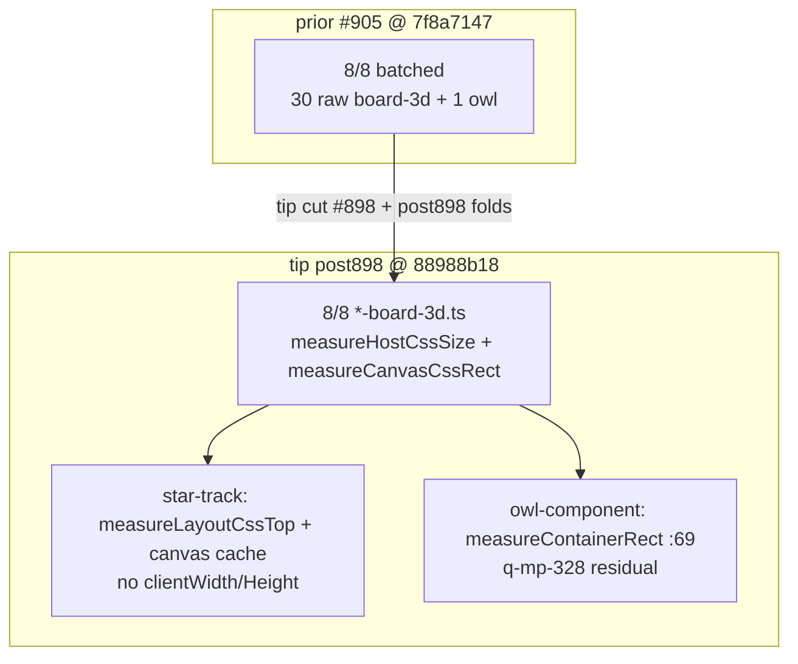

# q-mp-440 — board-3d layout-reads inventory refresh (tip post898)

**Task id:** `q-mp-440`  
**Role:** worker (docs / visual only)  
**Tip audited:** `cursor/mp-tip-post898` @ `88988b18` (full `88988b18e9bcf7734ca28993958cbd373adcdc86`)  
**Prior inventory:** [`board3d-layout-reads-inventory-post865-2026-10-10.md`](./board3d-layout-reads-inventory-post865-2026-10-10.md) (`q-mp-415`, tip post865 @ `7f8a7147`) — leave open `#905` with `contained`  
**Visual:** [`board3d-layout-reads-inventory-post898-2026-10-10.svg`](./board3d-layout-reads-inventory-post898-2026-10-10.svg)  
**Scope:** Re-`rg` layout-forcing reads on live post898 tip. **No `src/` edits. No test behavior changes.**

## Purpose

Publish a dated inventory after tip cut post898 (`#898` fold from alpha `946d6f95`) so agents stop treating the post865 stamp (`#905` / `7f8a7147`) as the current tip measurement. Layout batch code is already on tip; this ticket is report-only.

## Spec staleness note

Backlog `q-mp-440` (from `q-mp-090n` / `#921`) claimed:

- tip audited @ `788e8215`
- live `rg` **31** layout-forcing reads across `src/ui/three/*board-3d*.ts` + owl-component (**4** on most hosts; star-track **2**; owl **1**)
- prior inventory stamps post865 / post830

**Live post898 @ `88988b18`:** tip HEAD advanced past the backlog audit SHA (UI-cov / dice / docs folds + `#916` board-a11y nnnull clear after tip cut). Raw board-3d `rg` total remains **30** + owl **1** = **31**. All eight `*-board-3d.ts` hosts still use the batched host-size / canvas-rect pattern. Unit-file count at audit: **3239** (backlog snapshot **3224** — tip advanced). Trust the live tree.

## Duplicate check (open drafts)

| Related draft / prior | Base | Overlap | Action |
| --- | --- | --- | --- |
| Open drafts into tip post898 at start (915-921); tip later folded those plus 916/448/439/090n | post898 | backlog / UI-cov / dice / a11y / CI pin — not layout inventory | No overlap |
| `#905` q-mp-415 inventory (post865 @ `7f8a7147`) | post865 | Same topic; older tip stamp | Leave open; **contained** |
| `#861` q-mp-384 inventory (post830 @ `97487de6`) | post830 | Same topic; older tip stamp (payload on tip via `#865`) | Leave open; **contained** |
| `#757` q-mp-239 inventory (post748 @ `ce673656`) | post748 | Same topic; older tip stamp | Leave open; **contained** |
| `#826` / `#834` / `#835` / `#836` / `#838` / `#784` / `#804` / `#807` layout batches | older tips | Code already on tip via folds | Leave open; **contained** |
| `#887` q-mp-388 CI unit wall budget (+ undrafted `446`) | post865 | Wall-budget ownership — orthogonal | Leave open (per backlog) |
| Undrafted `q-mp-328` owl-component layout | — | Outside board-3d; `:69` funnel noted below | Leave for that owner |

No open draft into post898 owns a post898-dated layout-reads inventory → full refresh proceeds.

## Method (live tip)

```text
$ git rev-parse HEAD
  88988b18e9bcf7734ca28993958cbd373adcdc86

$ rg -n 'getBoundingClientRect|clientWidth|clientHeight' \
    src/ui/three/*board-3d*.ts src/ui/owl/owl-component.ts src/ui/three/tablet-gl.ts
```

| Field | Value |
| --- | --- |
| **Command** | `rg -n 'getBoundingClientRect\|clientWidth\|clientHeight' src/ui/three src/ui/owl/owl-component.ts` |
| **board-3d raw hits** | **30** (7 hosts × 4 + star-track × 2) |
| **board-3d code sites** | **23** (7 × 3 + star-track × 2) — excludes doc comments that mention `clientWidth`/`Height` |
| **owl** | **1** (`owl-component.ts:69` inside `measureContainerRect`) |
| **combined (board-3d + owl)** | **31** |
| **tablet-gl** | **0** (viewport via `visualViewport` / `innerWidth`) |
| **Hosts with `measureHostCssSize` / `measureCanvasCssRect`** | **8 / 8** |
| **Unit files** (test.ts / spec.ts, excl. archive) | **3239** |

## Before → after metrics (report-only refresh)

| Metric | Before (`#905` / post865 @ `7f8a7147`) | Spec claim (backlog @ `788e8215`) | After (live post898 @ `88988b18`) |
| --- | ---: | ---: | ---: |
| board-3d raw `rg` hits | 30 | 30 (in 31 w/ owl) | **30** |
| board-3d + owl combined | 31 | **31** | **31** |
| Per-host raw (typical) | 4 × 7 + 2 star-track | 4 × most; star-track 2; owl 1 | **4** × 7 + **2** star-track + owl **1** |
| Batched host-size pattern | 8 / 8 | unchanged | **8 / 8** |
| owl gBCR sites | 1 (`:69`) | 1 | **1** (funnel; see below) |
| Unit files | 3211 | 3224 | **3239** |
| Tip SHA stamp | `7f8a7147` | `788e8215` | **`88988b18`** |

**Delta vs `#905`:** tip advanced post898; layout-read counts **unchanged**. Inventory value is the new tip SHA / branch stamp so agents stop citing post865 as current.

## Pattern summary (post898)

| Role | Helper | APIs | When | Force layout? |
| --- | --- | --- | --- | --- |
| **A. Host size** | `measureHostCssSize()` | `container.clientWidth` / `clientHeight` (adjacent) | `resize()` via `bindBoard3dLayout` | Yes — once per layout epoch |
| **B/C. Canvas CSS rect** | `measureCanvasCssRect()` / `getCanvasCssRect()` | one `canvas.getBoundingClientRect()` | pick + project share cache; invalidate on resize | Yes — first use after invalidate |
| **D. Star Track fit** | `measureLayoutCssTop()` | `layout.getBoundingClientRect().top` | inside `fitHostToViewport` → resize | Yes — viewport fit |
| **Owl funnel** | `measureContainerRect()` | `container.getBoundingClientRect()` | size cache / eye center | Yes — funneled; RO also updates cache |

Shared binder `bindBoard3dLayout` in `src/ui/three/tablet-gl.ts` still coalesces window / `visualViewport` / `ResizeObserver` into one `onLayout` callback.

## Per-host inventory (tip `88988b18`)

| Host | Raw `rg` | Code sites | Batched? | Site lines (code) | Notes |
| --- | ---: | ---: | :---: | --- | --- |
| `src/ui/three/fiar-board-3d.ts` | 4 | 3 | yes (`#836`) | gBCR `:242`; W/H `:257`–`:258` | pick + project → `getCanvasCssRect` |
| `src/ui/three/hex-a-gone-board-3d.ts` | 4 | 3 | yes (`#784`) | gBCR `:257`; W/H `:272`–`:273` | pointermove hover uses cache |
| `src/ui/three/kings-quadraphages-board-3d.ts` | 4 | 3 | yes (`#834`) | gBCR `:254`; W/H `:269`–`:270` | tip-contained |
| `src/ui/three/kwatro-sinko-board-3d.ts` | 4 | 3 | yes (`#835`) | gBCR `:401`; W/H `:416`–`:417` | tip-contained |
| `src/ui/three/pent-em-in-board-3d.ts` | 4 | 3 | yes (`#838`) | gBCR `:276`; W/H `:291`–`:292` | pointermove hover uses cache |
| `src/ui/three/prime-gold-board-3d.ts` | 4 | 3 | yes (`#826`) | gBCR `:328`; W/H `:343`–`:344` | tip-contained |
| `src/ui/three/queens-guards-board-3d.ts` | 4 | 3 | yes (`#804`) | gBCR `:355`; W/H `:370`–`:371` | tip-contained |
| `src/ui/three/star-track-board-3d.ts` | 2 | 2 | yes (`#807`) | canvas gBCR `:361`; layout top `:375` | no host `clientWidth`/`Height`; fit via side px |
| `src/ui/owl/owl-component.ts` | 1 | 1 | funnel | `:69` in `measureContainerRect` | undrafted `q-mp-328` owner; RO path updates cache too |
| `src/ui/three/tablet-gl.ts` | 0 | 0 | n/a | — | visualViewport path |

Raw count includes one doc-comment match per non–star-track host (`Sole host size reads — keep clientWidth/Height adjacent`).

## Visual — batched status bars

See [`board3d-layout-reads-inventory-post898-2026-10-10.svg`](./board3d-layout-reads-inventory-post898-2026-10-10.svg): eight board-3d hosts at post898 remain **batched** (green); owl remains a single funnel read (amber). Counts match post865; tip SHA is the refresh.



## Recommended residual opportunities (docs-only; do not code here)

| Priority | Opportunity | Owner / note |
| --- | --- | --- |
| P1 | owl-component layout cut / further cache (`:69` funnel) | undrafted `q-mp-328` — serialize; no copy edits |
| P2 | Optional: stop mentioning `clientWidth`/`Height` in comments if raw `rg` noise matters | cosmetics only; not a product win |
| Leave | Star Track `#687` p95 HOLD | timing / harness — inventory only |
| Leave | Role C when only tests / `__mp3d*` call infrequently | already shares B cache |
| Leave | Wall-budget / suite timing | open `#887` (`q-mp-388`) + undrafted `446` |

## Non-goals / left alone

- No `src/` product edits; no test behavior changes
- AI search / scoring / difficulty / move timing; Hex Hard **450ms**; Stars & Bars history cap
- Player-facing copy / rules text; `*/rules.ts` / legal-move / scoring paths
- Lint ceilings / knip baseline / ratchet JSON
- Closing prior drafts — leave with `contained` / `superseded` comments only (this worker does not comment on other PRs)

## Verify

```bash
git rev-parse HEAD
rg -n 'getBoundingClientRect|clientWidth|clientHeight' \
  src/ui/three src/ui/owl/owl-component.ts
npm run check:dev-docs
npm run verify
npm run test:unit
```

## Related docs

- [`board3d-layout-reads-inventory-post865-2026-10-10.md`](./board3d-layout-reads-inventory-post865-2026-10-10.md) — prior post865 inventory (`#905`)
- [`board3d-layout-reads-inventory-post830-2026-10-10.md`](./board3d-layout-reads-inventory-post830-2026-10-10.md) — prior post830 inventory (`#861`)
- [`board3d-layout-reads-inventory-2026-10-09.md`](./board3d-layout-reads-inventory-2026-10-09.md) — prior post748 inventory (`#757`)
- `docs/dev/q-mp-282-hex-board3d-layout-reads.md` … `q-mp-352-kwatro-sinko-board3d-layout-reads.md` — per-host batch notes
- `docs/dev/q-mp-197-owl-layout-reads.md` — owl tree (different owner)

**Next action: fold into tip by the tip owner.**
