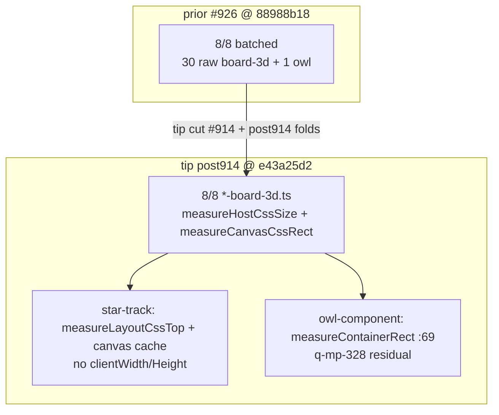

# q-mp-490 — board-3d layout-reads inventory refresh (tip post914)

**Task id:** `q-mp-490`  
**Role:** worker (docs / visual only)  
**Tip audited:** `cursor/mp-tip-post914` @ `e43a25d2` (full `e43a25d22b081819664bc631e4fe34f793847004`)  
**Prior inventory:** [`board3d-layout-reads-inventory-post898-2026-10-10.md`](./board3d-layout-reads-inventory-post898-2026-10-10.md) (`q-mp-440` / open `#926`, tip post898 @ `88988b18`) — leave open with `contained`  
**Visual:** [`board3d-layout-reads-inventory-post914-2026-10-10.svg`](./board3d-layout-reads-inventory-post914-2026-10-10.svg)  
**Scope:** Re-`rg` layout-forcing reads on live post914 tip. **No `src/` edits. No test behavior changes.**

## Purpose

Publish a dated inventory after tip cut post914 (`#914` squash from alpha `753052a6`) so agents stop treating the post898 stamp (`#926` / `88988b18`) as the current tip measurement. Layout batch code is already on tip; this ticket is report-only.

## Spec staleness note

Backlog `q-mp-490` (from `q-mp-090p` / `#955`) claimed:

- tip audited @ `e43a25d2` (matches live tip HEAD at measurement)
- live layout-forcing reads across **9** board-3d / owl hosts (densest queens/prime/pent/kwatro/kings/hex-a-gone/fiar **4** each; star-track **2**; owl-component **1**)
- prior inventory stamps post898 / `#926` / `#440` — leave with `contained`

**Live post914 @ `e43a25d2`:** tip HEAD matches the backlog audit SHA. Raw board-3d `rg` total remains **30** + owl **1** = **31**. Acceptance-pattern also includes `offsetWidth`/`offsetHeight` — **0** hits under `src/ui/three` + `src/ui/owl`. All eight `*-board-3d.ts` hosts still use the batched host-size / canvas-rect pattern. Unit-file count under `tests/unit`: **3242**. Trust the live tree.

## Duplicate check (open drafts)

| Related draft / prior | Base | Overlap | Action |
| --- | --- | --- | --- |
| Open drafts into tip post914 (`#939`–`#957` at audit) | post914 | backlog / UI-cov / knip / dead-CSS / emit-identity / soft-fail / slowest-unit — not layout inventory | No overlap |
| `#926` q-mp-440 inventory (post898 @ `88988b18`) | post898 | Same topic; older tip stamp; **counts unchanged** | Leave open; **contained** |
| `#905` q-mp-415 inventory (post865 @ `7f8a7147`) | post865 | Same topic; older tip stamp | Leave open; **contained** |
| `#861` / `#757` older inventories | post830 / post748 | Same topic; older tip stamps | Leave open; **contained** |
| `#826` / `#834` / `#835` / `#836` / `#838` / `#784` / `#804` / `#807` layout batches | older tips | Code already on tip via folds | Leave open; **contained** |
| Undrafted `q-mp-328` owl-component layout | — | Outside board-3d; `:69` funnel noted below | Leave for that owner |

No open draft into post914 owns a post914-dated layout-reads inventory → refresh proceeds. Prompt note “Contains `#926` if unchanged”: **narrowed to tip SHA / branch stamp** — layout-read counts and site lines match `#926`.

## Method (live tip)

```text
$ git rev-parse HEAD
  e43a25d22b081819664bc631e4fe34f793847004

$ rg -n 'getBoundingClientRect|clientWidth|clientHeight|offsetWidth|offsetHeight' \
    src/ui/three src/ui/owl
```

| Field | Value |
| --- | --- |
| **Command** | `rg -n 'getBoundingClientRect\|clientWidth\|clientHeight\|offsetWidth\|offsetHeight' src/ui/three src/ui/owl` |
| **board-3d raw hits** | **30** (7 hosts × 4 + star-track × 2) |
| **board-3d code sites** | **23** (7 × 3 + star-track × 2) — excludes doc comments that mention `clientWidth`/`Height` |
| **owl** | **1** (`owl-component.ts:69` inside `measureContainerRect`) |
| **combined (board-3d + owl)** | **31** |
| **offsetWidth / offsetHeight** | **0** |
| **tablet-gl** | **0** (viewport via `visualViewport` / `innerWidth`) |
| **Hosts with `measureHostCssSize` / `measureCanvasCssRect`** | **8 / 8** |
| **Unit files** (`tests/unit` `*.test.ts`) | **3242** |

## Before → after metrics (report-only refresh)

| Metric | Before (`#926` / post898 @ `88988b18`) | Spec claim (backlog @ `e43a25d2`) | After (live post914 @ `e43a25d2`) |
| --- | ---: | ---: | ---: |
| board-3d raw `rg` hits | 30 | (in 9-host summary) | **30** |
| board-3d + owl combined | 31 | **31** (4×7 + 2 + 1) | **31** |
| Per-host raw (typical) | 4 × 7 + 2 star-track | 4 × densest; star-track 2; owl 1 | **4** × 7 + **2** star-track + owl **1** |
| Batched host-size pattern | 8 / 8 | unchanged | **8 / 8** |
| owl gBCR sites | 1 (`:69`) | 1 | **1** (funnel; see below) |
| offsetWidth / offsetHeight | 0 | (acceptance pattern) | **0** |
| Unit files (`tests/unit`) | 3239 | 3242 | **3242** |
| Tip SHA stamp | `88988b18` | `e43a25d2` | **`e43a25d2`** |

**Delta vs `#926`:** tip advanced post914; layout-read counts and site lines **unchanged**. Inventory value is the new tip SHA / branch stamp so agents stop citing post898 as current. Suite file count advanced 3239 → 3242 (orthogonal to layout reads).

## Pattern summary (post914)

| Role | Helper | APIs | When | Force layout? |
| --- | --- | --- | --- | --- |
| **A. Host size** | `measureHostCssSize()` | `container.clientWidth` / `clientHeight` (adjacent) | `resize()` via `bindBoard3dLayout` | Yes — once per layout epoch |
| **B/C. Canvas CSS rect** | `measureCanvasCssRect()` / `getCanvasCssRect()` | one `canvas.getBoundingClientRect()` | pick + project share cache; invalidate on resize | Yes — first use after invalidate |
| **D. Star Track fit** | `measureLayoutCssTop()` | `layout.getBoundingClientRect().top` | inside `fitHostToViewport` → resize | Yes — viewport fit |
| **Owl funnel** | `measureContainerRect()` | `container.getBoundingClientRect()` | size cache / eye center | Yes — funneled; RO also updates cache |

Shared binder `bindBoard3dLayout` in `src/ui/three/tablet-gl.ts` still coalesces window / `visualViewport` / `ResizeObserver` into one `onLayout` callback.

## Per-host inventory (tip `e43a25d2`)

| Host | Raw `rg` | Code sites | Batched? | Site lines (code) | Notes |
| --- | ---: | ---: | :---: | --- | --- |
| `src/ui/three/fiar-board-3d.ts` | 4 | 3 | yes (`#836`) | gBCR `:242`; W/H `:257`–`:258` | pick + project → `getCanvasCssRect` |
| `src/ui/three/hex-a-gone-board-3d.ts` | 4 | 3 | yes (`#784`) | gBCR `:257`; W/H `:272`–`:273` | pointermove hover uses cache |
| `src/ui/three/kings-quadraphages-board-3d.ts` | 4 | 3 | yes (`#834`) | gBCR `:254`; W/H `:269`–`:270` | tip-contained |
| `src/ui/three/kwatro-sinko-board-3d.ts` | 4 | 3 | yes (`#835`) | gBCR `:401`; W/H `:416`–`:417` | tip-contained |
| `src/ui/three/pent-em-in-board-3d.ts` | 4 | 3 | yes (`#838`) | gBCR `:276`; W/H `:291`–`:292` | pointermove hover uses cache |
| `src/ui/three/prime-gold-board-3d.ts` | 4 | 3 | yes (`#826`) | gBCR `:328`; W/H `:343`–`:344` | tip-contained |
| `src/ui/three/queens-guards-board-3d.ts` | 4 | 3 | yes (`#804`) | gBCR `:355`; W/H `:370`–`:371` | tip-contained |
| `src/ui/three/star-track-board-3d.ts` | 2 | 2 | yes (`#807`) | canvas gBCR `:361`; layout top `:375` | no host `clientWidth`/`Height`; fit via side px |
| `src/ui/owl/owl-component.ts` | 1 | 1 | funnel | `:69` in `measureContainerRect` | undrafted `q-mp-328` owner; RO path updates cache too |
| `src/ui/three/tablet-gl.ts` | 0 | 0 | n/a | — | visualViewport path |

Raw count includes one doc-comment match per non–star-track host (`Sole host size reads — keep clientWidth/Height adjacent`).

## Visual — batched status bars

See [`board3d-layout-reads-inventory-post914-2026-10-10.svg`](./board3d-layout-reads-inventory-post914-2026-10-10.svg): eight board-3d hosts at post914 remain **batched** (green); owl remains a single funnel read (amber). Counts match `#926` / post898; tip SHA is the refresh.



## Recommended residual opportunities (docs-only; do not code here)

| Priority | Opportunity | Owner / note |
| --- | --- | --- |
| P1 | owl-component layout cut / further cache (`:69` funnel) | undrafted `q-mp-328` — serialize; no copy edits |
| P2 | Optional: stop mentioning `clientWidth`/`Height` in comments if raw `rg` noise matters | cosmetics only; not a product win |
| Leave | Star Track `#687` p95 HOLD | timing / harness — inventory only |
| Leave | Role C when only tests / `__mp3d*` call infrequently | already shares B cache |
| Leave | Wall-budget / suite timing | orthogonal owners |

## Non-goals / left alone

- No `src/` product edits; no test behavior changes
- AI search / scoring / difficulty / move timing; Hex Hard **450ms**; Stars & Bars history cap
- Player-facing copy / rules text; `*/rules.ts` / legal-move / scoring paths
- Lint ceilings / knip baseline / ratchet JSON
- Closing prior drafts — leave with `contained` / `superseded` comments only (this worker does not comment on other PRs)

## Verify

```bash
git rev-parse HEAD
rg -n 'getBoundingClientRect|clientWidth|clientHeight|offsetWidth|offsetHeight' \
  src/ui/three src/ui/owl
npm run check:dev-docs
npm run verify
npm run test:unit
```

## Related docs

- [`board3d-layout-reads-inventory-post898-2026-10-10.md`](./board3d-layout-reads-inventory-post898-2026-10-10.md) — prior post898 inventory (`#926` / `q-mp-440`)
- [`board3d-layout-reads-inventory-post865-2026-10-10.md`](./board3d-layout-reads-inventory-post865-2026-10-10.md) — prior post865 inventory (`#905`)
- [`board3d-layout-reads-inventory-post830-2026-10-10.md`](./board3d-layout-reads-inventory-post830-2026-10-10.md) — prior post830 inventory (`#861`)
- [`board3d-layout-reads-inventory-2026-10-09.md`](./board3d-layout-reads-inventory-2026-10-09.md) — prior post748 inventory (`#757`)
- `docs/dev/q-mp-282-hex-board3d-layout-reads.md` … `q-mp-352-kwatro-sinko-board3d-layout-reads.md` — per-host batch notes
- `docs/dev/q-mp-197-owl-layout-reads.md` — owl tree (different owner)

**Next action: fold into tip by the tip owner.**
