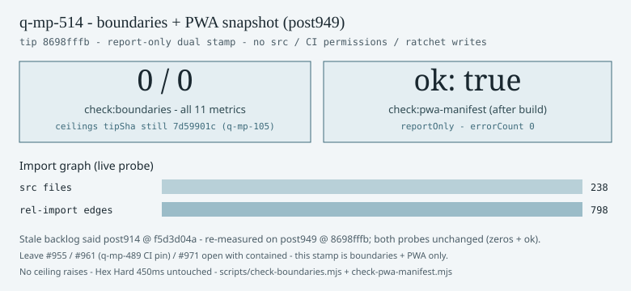

# Module-boundaries + PWA-manifest tip snapshot — tip post949 (2026-10-10)

**Task id:** `q-mp-514`  
**Role:** worker (docs / chart only)  
**Tip measured:** `cursor/mp-tip-post949` @ `8698fffb` (`8698fffb85b1e3d2289e54a665fac6162d3bdee4`)  
**Measured at:** `2026-10-10T12:21:23Z` (UTC)  
**Tip note:** head advanced from fold `5f24bdfe` via tip-owner docs `q-mp-026o` (`266ff1bc` / `8698fffb`); probes re-run after rebase — unchanged.  
**Data:** [`boundaries-pwa-snapshot-post949-2026-10-10.json`](./boundaries-pwa-snapshot-post949-2026-10-10.json)  
**Chart:** 

## Purpose

Backlog `q-mp-514` (round-17 Oct 10h) asked for a dated dual tip snapshot of `npm run check:boundaries` and (after `npm run build`) `npm run check:pwa-manifest`. The backlog label still said **tip post914** — re-measured on live **post949** head. Round-16 did not claim this combined stamp. **No** `src/` edits. **No** CI `permissions` / allowlist / apt / network-in-tests changes. **No** ratchet / ceiling raises. Ceiling file `tipSha` remains historical `7d59901c` (q-mp-105); live counts stay all **0**.

## Duplicate check (open drafts)

| PR                                                            | Title                                  | Overlap                                                                     |
| ------------------------------------------------------------- | -------------------------------------- | --------------------------------------------------------------------------- |
| [#971](https://github.com/fuzzywigg/math-pentathlon/pull/971) | `q-mp-090q` backlog 10h                | Spec owner only (lists `q-mp-514`); no snapshot files                       |
| [#961](https://github.com/fuzzywigg/math-pentathlon/pull/961) | `q-mp-489` CI permissions pin re-audit | Orthogonal (workflow permissions pin) — leave open with **contained**       |
| [#955](https://github.com/fuzzywigg/math-pentathlon/pull/955) | `q-mp-090p` backlog 10g                | Prior backlog; no boundaries+PWA dual stamp — leave open with **contained** |
| Open drafts into `cursor/mp-tip-post949`                      | _(none at measure time)_               | No competing owner for this combined stamp                                  |

No open draft into `cursor/mp-tip-post949` owned a post949 boundaries + PWA-manifest dual snapshot before this PR. Leave `#955` / `#961` / `#971` open with **contained** (do not close).

## Stale backlog → live tip

| Probe                         | Stale backlog (`q-mp-514` @ post914 / `f5d3d04a`) | Live tip (`8698fffb` / post949) | Δ         |
| ----------------------------- | ------------------------------------------------: | ------------------------------: | --------- |
| `check:boundaries` all counts |                                             **0** |                           **0** | unchanged |
| ceilings (all keys)           |                                             **0** |                           **0** | unchanged |
| ceilings file `tipSha`        |                                        `7d59901c` |                      `7d59901c` | unchanged |
| `check:pwa-manifest` `ok`     |                                          **true** |                        **true** | unchanged |
| report-only                   |                                               yes |                             yes | —         |

## Chart


```text
boundaries  ███████████████████████████████████████████████████  0 / 0  (11 metrics)
pwa-manifest ███████████████████████████████████████████████████  ok: true

import graph:
  src files          238
  rel-import edges   798
```

## Command transcripts (live tip)

### `git rev-parse HEAD`

```text
8698fffb85b1e3d2289e54a665fac6162d3bdee4
```

### `npm run check:boundaries`

```text
Module boundary audit (src/)
  files: 238  relative-import edges: 798

Counts:
  cycles: 0
  cycles_including_type_only: 0
  engine_imports_ui: 0
  engine_imports_ai: 0
  cross_game_imports: 0
  core_imports_games: 0
  core_imports_ui: 0
  ai_imports_ui: 0
  engine_or_ai_dom_globals: 0
  dead_barrels: 0
  mixed_ui_barrels: 0

Ceiling file: docs/dev/module-boundaries-ceilings.json
OK: all counts at or under committed ceiling (may only go down).
```

Exit code: **0**.

### `npm run build` then `npm run check:pwa-manifest`

Build exit code: **0** (Vite production + PWA `generateSW`; `dist/site.webmanifest` emitted).

```text
# PWA manifest installability check

- ok: **true**
- reportOnly: true
- manifest: `dist/site.webmanifest`

All installability contract checks passed.

_Task: burn-1008-mp-pwa-manifest_
```

Exit code: **0**. Summary JSON: `{ "ok": true, "reportOnly": true, "errorCount": 0, "errors": [] }`.

Manifest facts (post-build `dist/site.webmanifest`): `name` / `short_name` = Math Pentathlon; `display` = standalone; `start_url` = `/`; 5 icons (192 / 512 / 512-maskable / favicon.svg / favicon.ico); `dist/icons/icon-180.png` present.

## Boundary counts vs ceilings

Ceilings from [`module-boundaries-ceilings.json`](./module-boundaries-ceilings.json) (historical `tipSha` `7d59901c` from q-mp-105; **not** rewritten here):

| Metric                       | Live | Ceiling | Headroom |
| ---------------------------- | ---: | ------: | -------: |
| `cycles`                     |    0 |       0 |        0 |
| `cycles_including_type_only` |    0 |       0 |        0 |
| `engine_imports_ui`          |    0 |       0 |        0 |
| `engine_imports_ai`          |    0 |       0 |        0 |
| `cross_game_imports`         |    0 |       0 |        0 |
| `core_imports_games`         |    0 |       0 |        0 |
| `core_imports_ui`            |    0 |       0 |        0 |
| `ai_imports_ui`              |    0 |       0 |        0 |
| `engine_or_ai_dom_globals`   |    0 |       0 |        0 |
| `dead_barrels`               |    0 |       0 |        0 |
| `mixed_ui_barrels`           |    0 |       0 |        0 |

Packaging smell (Vite `mp3d` circular chunks) remains **reported_not_changed** in the ceilings file / [`vite-circular-chunks-mp3d.md`](./vite-circular-chunks-mp3d.md) — source SCCs stay 0; not chased here.

## Acceptance checklist

| Criterion                                                        | Status                     |
| ---------------------------------------------------------------- | -------------------------- |
| Dated snapshot + tip SHA + both command transcripts              | **yes**                    |
| Optional visual (SVG)                                            | **yes**                    |
| No `src/` edits                                                  | **yes**                    |
| No CI `permissions` / allowlist / apt / network-in-tests changes | **yes**                    |
| No ratchet / ceiling raises                                      | **yes**                    |
| `check:dev-docs` clean                                           | (verify)                   |
| Leave `#955` / `#489`/`#961` / `#971` with **contained**         | noted (no comments posted) |

## Helpers

- Boundaries: `scripts/check-boundaries.mjs` via `npm run check:boundaries`
- PWA: `scripts/check-pwa-manifest.mjs` via `npm run check:pwa-manifest` (after `npm run build`)
- Dev-doc links: `npm run check:dev-docs`

## Hard-rule holds (untouched)

Hex Hard **450ms**; no AI / `*/rules.ts` / legal-move / scoring / player-facing copy edits; ratchets only go down; CI `permissions: contents: read` + `persist-credentials: false` unchanged.
