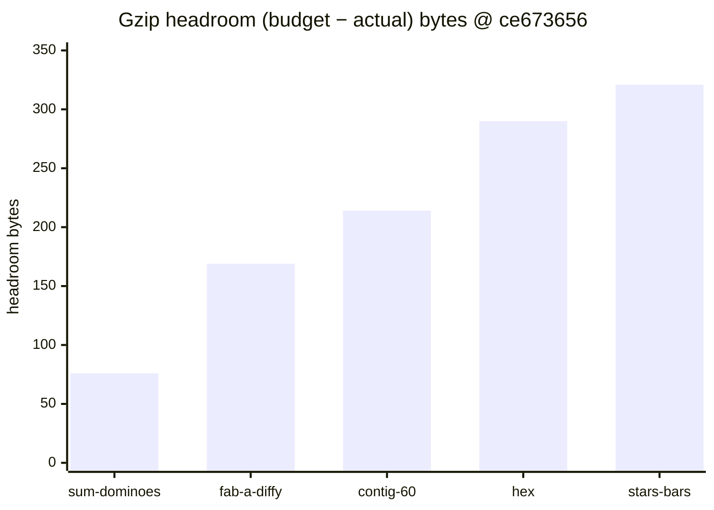
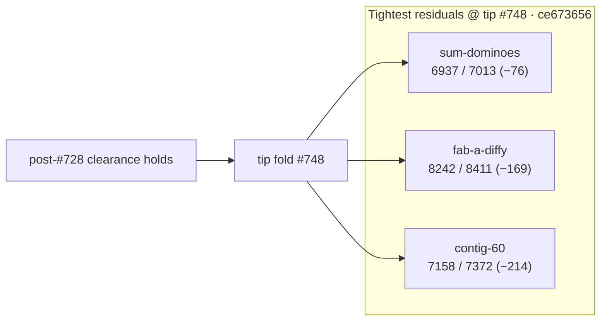

# Bundle size:check — post-clearance headroom (2026-10-09)

**Task id:** `q-mp-237` (docs follow-up to open `#739` / `q-mp-213`)  
**Tip measured (live):** `cursor/mp-tip-post748` @ `ce673656`  
**Measured on:** 2026-10-09 (UTC) · stamp `2026-10-09T20:24:54.838Z`  
**Scope:** Report-only headroom table after tip fold `#748` (post-#728 clearance already on tip). **No budget raise.** No `bundle-budgets.json` / allowlist edits.

## Outcome

`npm run build && npm run size:check` on tip `ce673656` reports **All 21 budgets within limit** (`knownOvers` still `[]`). `--fail-on-new-over` also exits **0**.

Tightest residual headroom: **`game-sum-dominoes` −76 B** (6.77 / 6.85 kB).

### Sub-200 B margins (and next-tightest)

| Bundle | Gzip (B) | Budget (B) | Headroom (B) | kB display |
| --- | ---: | ---: | ---: | --- |
| `game-sum-dominoes` | **6937** | 7013 | **−76** | 6.77 / 6.85 kB |
| `game-fab-a-diffy` | **8242** | 8411 | **−169** | 8.05 / 8.21 kB |
| `game-contig-60` | **7158** | 7372 | **−214** | 6.99 / 7.20 kB (just outside 200 B) |

Any further growth in `game-sum-dominoes` or `game-fab-a-diffy` is the first place a NEW OVER would appear. Do **not** raise budgets to absorb drift — trim the chunk first.

## Full green table (exact gzip bytes @ `ce673656`)

Sorted tightest → widest headroom. Exact bytes use the same `zlib.gzipSync` path as `scripts/check-bundle-budgets.mjs`.

| Bundle | Dist chunk (hash) | Gzip (B) | Budget (B) | Delta (B) | Status |
| --- | --- | ---: | ---: | ---: | --- |
| `game-sum-dominoes` | `game-sum-dominoes-DkrG629n.js` | **6937** | 7013 | **−76** | OK |
| `game-fab-a-diffy` | `game-fab-a-diffy-DLhbr3yQ.js` | **8242** | 8411 | **−169** | OK |
| `game-contig-60` | `game-contig-60-DiTAtoe9.js` | **7158** | 7372 | **−214** | OK |
| `game-hex` | `game-hex-CbJ4FWll.js` | **5766** | 6056 | **−290** | OK |
| `game-stars-bars` | `game-stars-bars-CjN8Cbqf.js` | **7097** | 7418 | **−321** | OK |
| `game-par-55` | `game-par-55-Di-KfjFB.js` | **7601** | 7929 | **−328** | OK |
| `game-queens-guards` | `game-queens-guards-ifUc6OCJ.js` | **8278** | 8628 | **−350** | OK |
| `game-kwatro-sinko` | `game-kwatro-sinko-DLkneEIe.js` | **8199** | 8576 | **−377** | OK |
| `game-frac-fact` | `game-frac-fact-DSWOIiJ8.js` | **5958** | 6350 | **−392** | OK |
| `game-fraction-pinball` | `game-fraction-pinball-CRzVHCaO.js` | **5750** | 6177 | **−427** | OK |
| `game-calla` | `game-calla-Cs8mBk4k.js` | **6494** | 6967 | **−473** | OK |
| `game-remainder-islands` | `game-remainder-islands-LXkxxQr3.js` | **6351** | 6878 | **−527** | OK |
| `game-star-track` | `game-star-track-Bh-oaG-o.js` | **5464** | 6035 | **−571** | OK |
| `game-hex-a-gone` | `game-hex-a-gone-BReeH2B6.js` | **6807** | 7387 | **−580** | OK |
| `game-prime-gold` | `game-prime-gold-BbhG4TYA.js` | **8022** | 8686 | **−664** | OK |
| `game-kings-quadraphages` | `game-kings-quadraphages-DJBX89wE.js` | **7214** | 7903 | **−689** | OK |
| `game-pent-em-in` | `game-pent-em-in-DnL7QFws.js` | **6594** | 7284 | **−690** | OK |
| `game-juggle` | `game-juggle-BuZvlVKp.js` | **7379** | 8181 | **−802** | OK |
| `game-fiar` | `game-fiar-BsITZrNJ.js` | **11177** | 12156 | **−979** | OK |
| `game-ramrod` | `game-ramrod-CNEHzMeM.js` | **5502** | 7261 | **−1759** | OK |
| `menu-critical-path` | (sum of index.html JS/CSS) | **25860** | 46822 | **−20962** | OK |

## Headroom visual (tightest five game chunks)





## Delta vs post-#728 clearance snapshot (`q-mp-213`)

| Bundle | Post-#728 @ `b5884207` | Post-#748 @ `ce673656` | Δgzip |
| --- | ---: | ---: | ---: |
| `game-sum-dominoes` | 6930 (−83) | **6937 (−76)** | **+7 B** |
| `game-fab-a-diffy` | 8235 (−176) | **8242 (−169)** | **+7 B** |
| `game-contig-60` | 7156 (−216) | **7158 (−214)** | **+2 B** |
| `menu-critical-path` | 25882 (−20940) | **25860 (−20962)** | −22 B |

Hashes moved with tip `#748`; clearance status is unchanged (all OK, allowlist 0). Historical NEW OVER / clearance narrative stays in [`docs/dev/bundle-over-2026-10-09.md`](./bundle-over-2026-10-09.md).

## Open-PR narrow (post748)

| Open draft | Overlap | Action |
| --- | --- | --- |
| #739 `q-mp-213` bundle-budget clearance (base `cursor/mp-tip-post728`) | Clearance addendum on `bundle-over-2026-10-09.md`; tip `#748` already carries that content | **contained** — leave open; this sibling is the live post-#748 headroom remeasure |
| #753 `q-mp-090f` round-6 backlog | Spec source for this task | Orthogonal |
| Unfolded post748 drafts `#749`–`#752` | emit-identity / demos dup-imports / demos void / dismissOwl knip | Orthogonal — no `bundle-budgets.json` overlap |
| #727 `q-mp-186` nullish | HOLD | Untouched |

## How measured

```bash
npm run build
npm run size:check
# Same classification CI uses (soft; continue-on-error on build job):
npm run size:check -- --fail-on-new-over
```

Checker: `scripts/check-bundle-budgets.mjs` against committed `bundle-budgets.json`. Policy: [`docs/bundle-budget.md`](../bundle-budget.md).

## Allowlist policy (live tip)

| Field | Value |
| --- | --- |
| `knownOvers` in `bundle-budgets.json` | **`[]` (0 ids)** |
| Default `npm run size:check` exit | **0** |
| `npm run size:check -- --fail-on-new-over` | **0** on tip after `#748` (no NEW OVER) |

Do **not** grow `knownOvers` or raise budgets. Allowlist only shrinks (ratchet down).

## Pointers

- Clearance / NEW OVER history: [`docs/dev/bundle-over-2026-10-09.md`](./bundle-over-2026-10-09.md)
- Local / CI usage and allowlist rules: [`docs/bundle-budget.md`](../bundle-budget.md)
- Soft step inside blocking `build`: [`docs/dev/ci-gates-mermaid-q-mp-073.md`](./ci-gates-mermaid-q-mp-073.md)

## Verification (`q-mp-237`)

```bash
npm run build          # exit 0
npm run size:check     # exit 0; All 21 budgets within limit; sum-dominoes −76 B
npm run check:dev-docs # report-only; paths in this note should resolve
```
