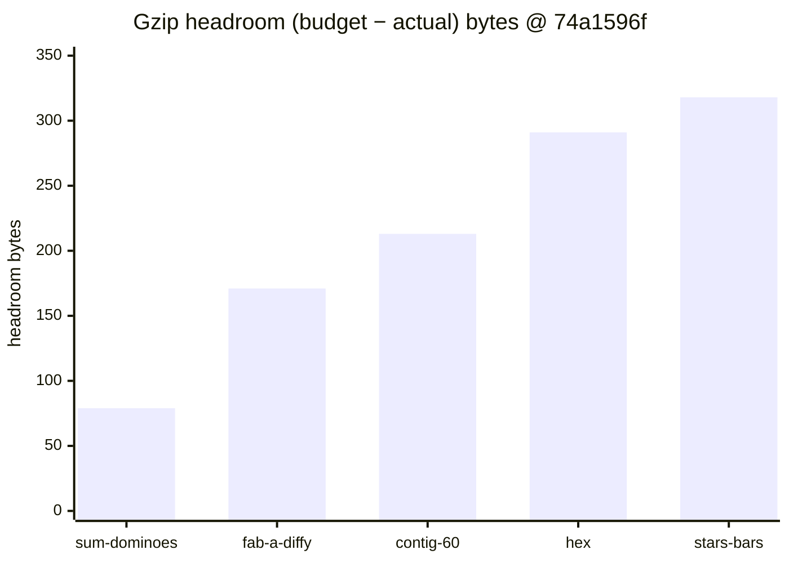
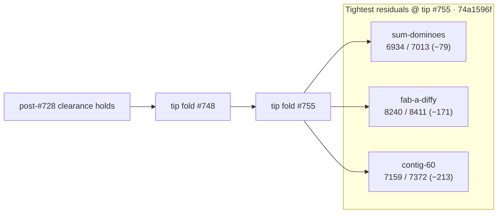

# Bundle size:check — post-#755 headroom remeasure (2026-10-09)

**Task id:** `q-mp-263` (docs follow-up after tip fold `#755`; leaves open `#756` / `q-mp-237` **contained**)  
**Tip measured (live):** `cursor/mp-tip-post755` @ `74a1596f`  
**Measured on:** 2026-10-09 (UTC) · stamp `2026-10-09T21:50:54.161Z`  
**Scope:** Report-only headroom table after tip fold `#755` (squash of `#749`–`#753` onto post748). **No budget raise.** No `bundle-budgets.json` / allowlist edits.

## Outcome

`npm run build && npm run size:check` on tip `74a1596f` reports **All 21 budgets within limit** (`knownOvers` still `[]`). `--fail-on-new-over` also exits **0**.

Tightest residual headroom: **`game-sum-dominoes` −79 B** (6.77 / 6.85 kB).

### Sub-200 B margins (and next-tightest)

| Bundle | Gzip (B) | Budget (B) | Headroom (B) | kB display |
| --- | ---: | ---: | ---: | --- |
| `game-sum-dominoes` | **6934** | 7013 | **−79** | 6.77 / 6.85 kB |
| `game-fab-a-diffy` | **8240** | 8411 | **−171** | 8.05 / 8.21 kB |
| `game-contig-60` | **7159** | 7372 | **−213** | 6.99 / 7.20 kB (just outside 200 B) |

Any further growth in `game-sum-dominoes` or `game-fab-a-diffy` is the first place a NEW OVER would appear. Do **not** raise budgets to absorb drift — trim the chunk first.

## Full green table (exact gzip bytes @ `74a1596f`)

Sorted tightest → widest headroom. Exact bytes use the same `zlib.gzipSync` path as `scripts/check-bundle-budgets.mjs`.

| Bundle | Dist chunk (hash) | Gzip (B) | Budget (B) | Delta (B) | Status |
| --- | --- | ---: | ---: | ---: | --- |
| `game-sum-dominoes` | `game-sum-dominoes-D9rwTBFS.js` | **6934** | 7013 | **−79** | OK |
| `game-fab-a-diffy` | `game-fab-a-diffy-BsmWcl-6.js` | **8240** | 8411 | **−171** | OK |
| `game-contig-60` | `game-contig-60-DeDQFL_3.js` | **7159** | 7372 | **−213** | OK |
| `game-hex` | `game-hex-CfFuRvV3.js` | **5765** | 6056 | **−291** | OK |
| `game-stars-bars` | `game-stars-bars-BxaQ_zDO.js` | **7100** | 7418 | **−318** | OK |
| `game-par-55` | `game-par-55-CAJkyuAb.js` | **7600** | 7929 | **−329** | OK |
| `game-queens-guards` | `game-queens-guards-KEimTA3Y.js` | **8275** | 8628 | **−353** | OK |
| `game-kwatro-sinko` | `game-kwatro-sinko-BOERZ4v0.js` | **8200** | 8576 | **−376** | OK |
| `game-frac-fact` | `game-frac-fact-CHDGw1DT.js` | **5959** | 6350 | **−391** | OK |
| `game-fraction-pinball` | `game-fraction-pinball-CuGcBsq-.js` | **5750** | 6177 | **−427** | OK |
| `game-calla` | `game-calla-BdJrBTmW.js` | **6497** | 6967 | **−470** | OK |
| `game-remainder-islands` | `game-remainder-islands-CsMhojYF.js` | **6350** | 6878 | **−528** | OK |
| `game-star-track` | `game-star-track-CKYYPGFJ.js` | **5461** | 6035 | **−574** | OK |
| `game-hex-a-gone` | `game-hex-a-gone-DGy7Mk-a.js` | **6809** | 7387 | **−578** | OK |
| `game-prime-gold` | `game-prime-gold-Cl-z30p-.js` | **8024** | 8686 | **−662** | OK |
| `game-kings-quadraphages` | `game-kings-quadraphages-CCwTbXaC.js` | **7216** | 7903 | **−687** | OK |
| `game-pent-em-in` | `game-pent-em-in-BHZY0iwX.js` | **6595** | 7284 | **−689** | OK |
| `game-juggle` | `game-juggle-DKAjVjJo.js` | **7381** | 8181 | **−800** | OK |
| `game-fiar` | `game-fiar-dNqcZUc_.js` | **11178** | 12156 | **−978** | OK |
| `game-ramrod` | `game-ramrod-KQgAL6bw.js` | **5502** | 7261 | **−1759** | OK |
| `menu-critical-path` | (sum of index.html JS/CSS) | **26235** | 46822 | **−20587** | OK |

## Headroom visual (tightest five game chunks)





## Delta vs post-#748 headroom snapshot (`q-mp-237` / open `#756`)

| Bundle | Post-#748 @ `ce673656` | Post-#755 @ `74a1596f` | Δgzip |
| --- | ---: | ---: | ---: |
| `game-sum-dominoes` | 6937 (−76) | **6934 (−79)** | **−3 B** |
| `game-fab-a-diffy` | 8242 (−169) | **8240 (−171)** | **−2 B** |
| `game-contig-60` | 7158 (−214) | **7159 (−213)** | **+1 B** |
| `menu-critical-path` | 25860 (−20962) | **26235 (−20587)** | **+375 B** |

Hashes moved with tip `#755`; clearance status is unchanged (all OK, allowlist 0). The older post-#748 table in [`docs/dev/bundle-headroom-2026-10-09.md`](./bundle-headroom-2026-10-09.md) (open `#756`) is **contained** by this sibling — leave `#756` open. Historical NEW OVER / clearance narrative stays in [`docs/dev/bundle-over-2026-10-09.md`](./bundle-over-2026-10-09.md).

## Open-PR narrow (post755)

| Open draft | Overlap | Action |
| --- | --- | --- |
| #756 `q-mp-237` post-#748 headroom (−76 B) | Stale vs tip `#755` HEAD; −76 B table | **contained** — leave open; this sibling is the live post-#755 remeasure |
| #739 `q-mp-213` bundle-budget clearance | Clearance already on tip | **contained** (unchanged) |
| Round-7 backlog `#775` / other post748 drafts | Orthogonal | No `bundle-budgets.json` overlap |
| #727 `q-mp-186` nullish | HOLD | Untouched |

## How measured

```bash
npm run build
npm run size:check
# Same classification CI uses (soft; continue-on-error on build job):
npm run size:check -- --fail-on-new-over
```

Checker: `scripts/check-bundle-budgets.mjs` against committed `bundle-budgets.json`. Policy: [`docs/bundle-budget.md`](../bundle-budget.md).

## Allowlist policy (live tip)

| Field | Value |
| --- | --- |
| `knownOvers` in `bundle-budgets.json` | **`[]` (0 ids)** |
| Default `npm run size:check` exit | **0** |
| `npm run size:check -- --fail-on-new-over` | **0** on tip after `#755` (no NEW OVER) |

Do **not** grow `knownOvers` or raise budgets. Allowlist only shrinks (ratchet down).

## Pointers

- Prior post-#748 headroom (open `#756`, contained): [`docs/dev/bundle-headroom-2026-10-09.md`](./bundle-headroom-2026-10-09.md)
- Clearance / NEW OVER history: [`docs/dev/bundle-over-2026-10-09.md`](./bundle-over-2026-10-09.md)
- Local / CI usage and allowlist rules: [`docs/bundle-budget.md`](../bundle-budget.md)
- Soft step inside blocking `build`: [`docs/dev/ci-gates-mermaid-q-mp-073.md`](./ci-gates-mermaid-q-mp-073.md)

## Verification (`q-mp-263`)

```bash
npm run build          # exit 0
npm run size:check     # exit 0; All 21 budgets within limit; sum-dominoes −79 B
npm run check:dev-docs # report-only; paths in this note should resolve
```
