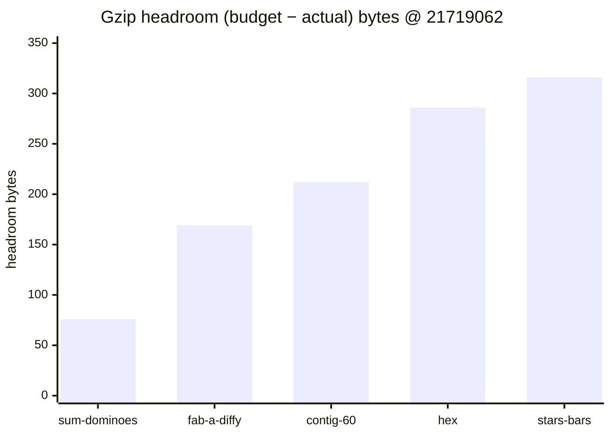
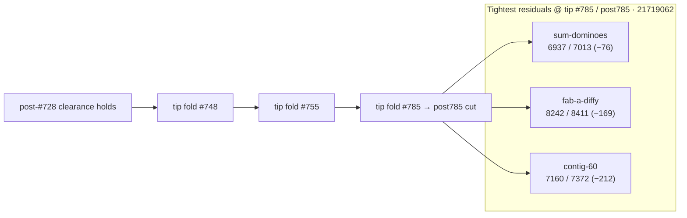

# Bundle size:check — post-#785 headroom remeasure (2026-10-10)

**Task id:** `q-mp-313` (supersedes round-8 `q-mp-288`; docs follow-up after tip fold `#785` onto alpha / tip cut `cursor/mp-tip-post785`)  
**Tip measured (live):** `cursor/mp-tip-post785` @ `21719062`  
**Measured on:** 2026-10-10 (UTC) · stamp `2026-10-10T01:27:20.287Z`  
**Scope:** Report-only headroom table on the post785 tree (everything folded through `#823`/`#824` ancestry via `#785` squash @ `21719062`). **No budget raise.** No `bundle-budgets.json` / allowlist edits.

Leaves open older tables **contained**:

- `#792` / `q-mp-263` — post-#755 table @ `74a1596f` (−79 B hashes)
- `#756` / `q-mp-237` — post-#748 table @ `ce673656` (−76 B hashes)
- Undrafted `q-mp-288` — same topic on post755; **superseded** by this launch-one-only post785 remeasure

## Outcome

`npm run build && npm run size:check` on tip `21719062` reports **All 21 budgets within limit** (`knownOvers` still `[]`). `--fail-on-new-over` also exits **0**.

Tightest residual headroom: **`game-sum-dominoes` −76 B** (6.77 / 6.85 kB).

Stale backlog evidence for `q-mp-313` cited −79 B @ post755 `89e40ad7`; live post785 hashes have drifted **+3 B** on that chunk (still OK, still tightest).

### Sub-200 B margins (and next-tightest)

| Bundle | Gzip (B) | Budget (B) | Headroom (B) | kB display |
| --- | ---: | ---: | ---: | --- |
| `game-sum-dominoes` | **6937** | 7013 | **−76** | 6.77 / 6.85 kB |
| `game-fab-a-diffy` | **8242** | 8411 | **−169** | 8.05 / 8.21 kB |
| `game-contig-60` | **7160** | 7372 | **−212** | 6.99 / 7.20 kB (just outside 200 B) |

Any further growth in `game-sum-dominoes` or `game-fab-a-diffy` is the first place a NEW OVER would appear. Do **not** raise budgets to absorb drift — trim the chunk first.

## Full green table (exact gzip bytes @ `21719062`)

Sorted tightest → widest headroom. Exact bytes use the same `zlib.gzipSync` path as `scripts/check-bundle-budgets.mjs`.

| Bundle | Dist chunk (hash) | Gzip (B) | Budget (B) | Delta (B) | Status |
| --- | --- | ---: | ---: | ---: | --- |
| `game-sum-dominoes` | `game-sum-dominoes-Cj6z0LAX.js` | **6937** | 7013 | **−76** | OK |
| `game-fab-a-diffy` | `game-fab-a-diffy-ByITp3yM.js` | **8242** | 8411 | **−169** | OK |
| `game-contig-60` | `game-contig-60-4jbSZg1V.js` | **7160** | 7372 | **−212** | OK |
| `game-hex` | `game-hex-CXBpOvjP.js` | **5770** | 6056 | **−286** | OK |
| `game-stars-bars` | `game-stars-bars-DFcx0V3a.js` | **7102** | 7418 | **−316** | OK |
| `game-par-55` | `game-par-55-DLFkqSEM.js` | **7603** | 7929 | **−326** | OK |
| `game-queens-guards` | `game-queens-guards-RzEU0gh1.js` | **8279** | 8628 | **−349** | OK |
| `game-kwatro-sinko` | `game-kwatro-sinko-Bj6E2D2Y.js` | **8202** | 8576 | **−374** | OK |
| `game-frac-fact` | `game-frac-fact-IJUNLyTP.js` | **5960** | 6350 | **−390** | OK |
| `game-fraction-pinball` | `game-fraction-pinball-BWGWXWTg.js` | **5750** | 6177 | **−427** | OK |
| `game-calla` | `game-calla-rB_yWkAC.js` | **6500** | 6967 | **−467** | OK |
| `game-remainder-islands` | `game-remainder-islands-gsBU8Lev.js` | **6352** | 6878 | **−526** | OK |
| `game-star-track` | `game-star-track-Cp7y8kGj.js` | **5468** | 6035 | **−567** | OK |
| `game-hex-a-gone` | `game-hex-a-gone-CTss9M_4.js` | **6811** | 7387 | **−576** | OK |
| `game-prime-gold` | `game-prime-gold-sbW0n39-.js` | **8030** | 8686 | **−656** | OK |
| `game-kings-quadraphages` | `game-kings-quadraphages-B4tojaVb.js` | **7221** | 7903 | **−682** | OK |
| `game-pent-em-in` | `game-pent-em-in-B3ksNhP-.js` | **6597** | 7284 | **−687** | OK |
| `game-juggle` | `game-juggle-C1Tou5HE.js` | **7381** | 8181 | **−800** | OK |
| `game-fiar` | `game-fiar-QQiuHVfn.js` | **11180** | 12156 | **−976** | OK |
| `game-ramrod` | `game-ramrod-Cqn9mLUt.js` | **5504** | 7261 | **−1757** | OK |
| `menu-critical-path` | (sum of index.html JS/CSS) | **26240** | 46822 | **−20582** | OK |

## Headroom visual (tightest five game chunks)





## Delta vs prior headroom snapshots

| Bundle | Post-#748 @ `ce673656` | Post-#755 @ `74a1596f` | Post-#785 @ `21719062` | Δgzip (755→785) |
| --- | ---: | ---: | ---: | ---: |
| `game-sum-dominoes` | 6937 (−76) | 6934 (−79) | **6937 (−76)** | **+3 B** |
| `game-fab-a-diffy` | 8242 (−169) | 8240 (−171) | **8242 (−169)** | **+2 B** |
| `game-contig-60` | 7158 (−214) | 7159 (−213) | **7160 (−212)** | **+1 B** |
| `menu-critical-path` | 25860 (−20962) | 26235 (−20587) | **26240 (−20582)** | **+5 B** |

Hashes moved with tip `#785` / post785 cut; clearance status is unchanged (all OK, allowlist 0). Older tables in [`docs/dev/bundle-headroom-post755-2026-10-09.md`](./bundle-headroom-post755-2026-10-09.md) (open `#792`) and [`docs/dev/bundle-headroom-2026-10-09.md`](./bundle-headroom-2026-10-09.md) (open `#756`) are **contained** by this sibling — leave those drafts open. Historical NEW OVER / clearance narrative stays in [`docs/dev/bundle-over-2026-10-09.md`](./bundle-over-2026-10-09.md).

## Open-PR narrow (post785)

| Open draft | Overlap | Action |
| --- | --- | --- |
| #792 `q-mp-263` post-#755 headroom (−79 B @ `74a1596f`) | Stale vs post785 HEAD; −79 B table | **contained** — leave open; this sibling is the live post-#785 remeasure |
| #756 `q-mp-237` post-#748 headroom (−76 B) | Older tip; hashes stale | **contained** — leave open |
| Undrafted `q-mp-288` (round-8 same topic) | Superseded by launch-one-only `q-mp-313` | **superseded** — no separate draft |
| #813 `q-mp-295` owl UI cov r16 | Orthogonal (tests) | No overlap |
| #822 `q-mp-292` no-shadow controllers | Orthogonal (lint rename) | No overlap |
| No open drafts into `cursor/mp-tip-post785` at launch | — | This is the first post785 headroom report |

## How measured

```bash
npm run build
npm run size:check
# Same classification CI uses (soft; continue-on-error on build job):
npm run size:check -- --fail-on-new-over
```

Checker: `scripts/check-bundle-budgets.mjs` against committed `bundle-budgets.json`. Policy: [`docs/bundle-budget.md`](../bundle-budget.md).

## Allowlist policy (live tip)

| Field | Value |
| --- | --- |
| `knownOvers` in `bundle-budgets.json` | **`[]` (0 ids)** |
| Default `npm run size:check` exit | **0** |
| `npm run size:check -- --fail-on-new-over` | **0** on tip after `#785` / post785 (no NEW OVER) |

Do **not** grow `knownOvers` or raise budgets. Allowlist only shrinks (ratchet down).

## Pointers

- Prior post-#755 headroom (open `#792`, contained): [`docs/dev/bundle-headroom-post755-2026-10-09.md`](./bundle-headroom-post755-2026-10-09.md)
- Prior post-#748 headroom (open `#756`, contained): [`docs/dev/bundle-headroom-2026-10-09.md`](./bundle-headroom-2026-10-09.md)
- Clearance / NEW OVER history: [`docs/dev/bundle-over-2026-10-09.md`](./bundle-over-2026-10-09.md)
- Local / CI usage and allowlist rules: [`docs/bundle-budget.md`](../bundle-budget.md)
- Soft step inside blocking `build`: [`docs/dev/ci-gates-mermaid-q-mp-073.md`](./ci-gates-mermaid-q-mp-073.md)

## Verification (`q-mp-313`)

```bash
npm run build          # exit 0
npm run size:check     # exit 0; All 21 budgets within limit; sum-dominoes −76 B
npm run check:dev-docs # report-only; paths in this note should resolve
```
