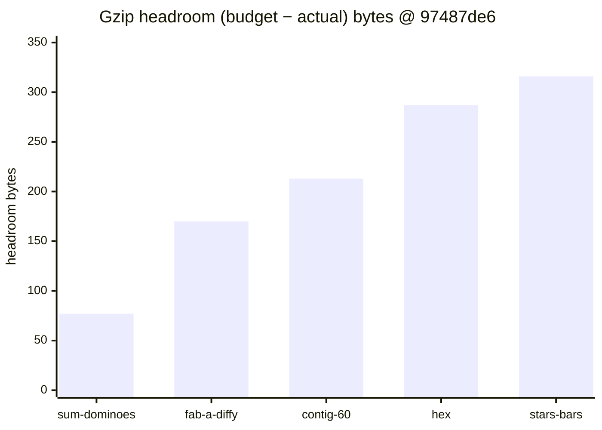
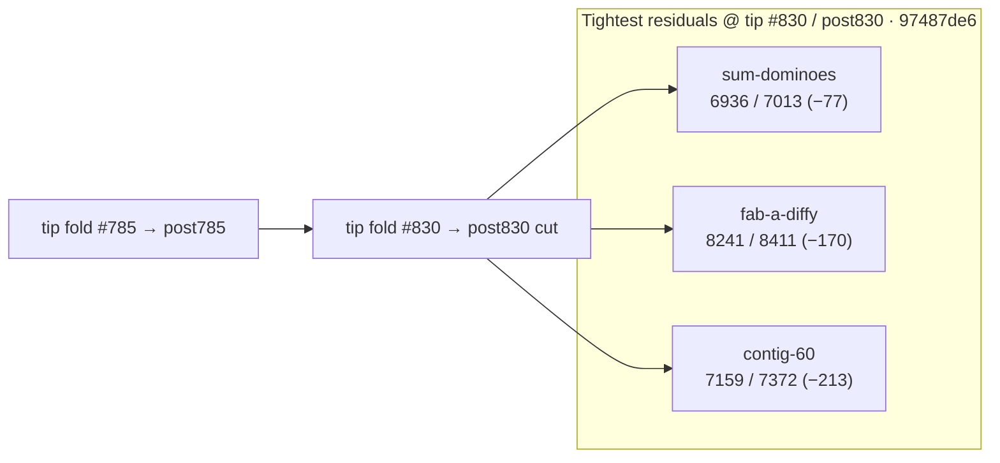

# Bundle size:check — post-#830 headroom remeasure (2026-10-10)

**Task id:** `q-mp-361` (remeasure after tip cut `cursor/mp-tip-post830` / fold `#830`; docs follow-up to open `#828` / `q-mp-313`)  
**Tip measured (live):** `cursor/mp-tip-post830` @ `97487de6`  
**Measured on:** 2026-10-10 (UTC) · stamp `2026-10-10T03:54:02.212Z`  
**Scope:** Report-only headroom table on the post830 tree (alpha tip cut after `#830` squash; live HEAD of `cursor/mp-tip-post830`). **No budget raise.** No `bundle-budgets.json` / allowlist edits.

Leaves open older tables **contained**:

- `#828` / `q-mp-313` — post-#785 table @ `21719062` (−76 B hashes)
- `#792` / `q-mp-263` — post-#755 table @ `74a1596f` (−79 B hashes)
- `#756` / `q-mp-237` — post-#748 table @ `ce673656` (−76 B hashes)

Stale backlog evidence for `q-mp-361` cited tip `06126841` / sum-dominoes **−78 B** (written against old post785 tip before the post830 cut). Live post830 hashes differ; this note is the tip-HEAD remeasure.

## Outcome

`npm run build && npm run size:check` on tip `97487de6` reports **All 21 budgets within limit** (`knownOvers` still `[]`). `--fail-on-new-over` also exits **0**.

Tightest residual headroom: **`game-sum-dominoes` −77 B** (6.77 / 6.85 kB).

### Sub-200 B margins (and next-tightest)

| Bundle | Gzip (B) | Budget (B) | Headroom (B) | kB display |
| --- | ---: | ---: | ---: | --- |
| `game-sum-dominoes` | **6936** | 7013 | **−77** | 6.77 / 6.85 kB |
| `game-fab-a-diffy` | **8241** | 8411 | **−170** | 8.05 / 8.21 kB |
| `game-contig-60` | **7159** | 7372 | **−213** | 6.99 / 7.20 kB (just outside 200 B) |

Any further growth in `game-sum-dominoes` or `game-fab-a-diffy` is the first place a NEW OVER would appear. Do **not** raise budgets to absorb drift — trim the chunk first.

## Full green table (exact gzip bytes @ `97487de6`)

Sorted tightest → widest headroom. Exact bytes use the same `zlib.gzipSync` path as `scripts/check-bundle-budgets.mjs`.

| Bundle | Dist chunk (hash) | Gzip (B) | Budget (B) | Delta (B) | Status |
| --- | --- | ---: | ---: | ---: | --- |
| `game-sum-dominoes` | `game-sum-dominoes-T3SdBqJb.js` | **6936** | 7013 | **−77** | OK |
| `game-fab-a-diffy` | `game-fab-a-diffy-Wv0J7NjX.js` | **8241** | 8411 | **−170** | OK |
| `game-contig-60` | `game-contig-60-BVkl5V_V.js` | **7159** | 7372 | **−213** | OK |
| `game-hex` | `game-hex-CCv5f0e8.js` | **5769** | 6056 | **−287** | OK |
| `game-stars-bars` | `game-stars-bars-D-JKGSxk.js` | **7102** | 7418 | **−316** | OK |
| `game-par-55` | `game-par-55-BwwhnDoZ.js` | **7601** | 7929 | **−328** | OK |
| `game-queens-guards` | `game-queens-guards-CQtxkSh-.js` | **8280** | 8628 | **−348** | OK |
| `game-kwatro-sinko` | `game-kwatro-sinko-tKUNyczA.js` | **8202** | 8576 | **−374** | OK |
| `game-frac-fact` | `game-frac-fact-DbUdMviH.js` | **5960** | 6350 | **−390** | OK |
| `game-fraction-pinball` | `game-fraction-pinball-BiYWzzzz.js` | **5752** | 6177 | **−425** | OK |
| `game-calla` | `game-calla-D469JJOg.js` | **6499** | 6967 | **−468** | OK |
| `game-remainder-islands` | `game-remainder-islands-CLSzhMet.js` | **6351** | 6878 | **−527** | OK |
| `game-star-track` | `game-star-track-Dt1OsjkP.js` | **5465** | 6035 | **−570** | OK |
| `game-hex-a-gone` | `game-hex-a-gone-CAYOWXa5.js` | **6813** | 7387 | **−574** | OK |
| `game-prime-gold` | `game-prime-gold-QpVJdk5p.js` | **8027** | 8686 | **−659** | OK |
| `game-kings-quadraphages` | `game-kings-quadraphages-63YX0t3k.js` | **7218** | 7903 | **−685** | OK |
| `game-pent-em-in` | `game-pent-em-in-3eKDjvHs.js` | **6595** | 7284 | **−689** | OK |
| `game-juggle` | `game-juggle-CrAGG9BI.js` | **7380** | 8181 | **−801** | OK |
| `game-fiar` | `game-fiar-BaLv9B3e.js` | **11180** | 12156 | **−976** | OK |
| `game-ramrod` | `game-ramrod-DdjGkta3.js` | **5504** | 7261 | **−1757** | OK |
| `menu-critical-path` | (sum of index.html JS/CSS) | **26235** | 46822 | **−20587** | OK |

## Headroom visual (tightest five game chunks)





## Delta vs prior headroom snapshots

| Bundle | Post-#755 @ `74a1596f` | Post-#785 @ `21719062` | Post-#830 @ `97487de6` | Δgzip (785→830) |
| --- | ---: | ---: | ---: | ---: |
| `game-sum-dominoes` | 6934 (−79) | 6937 (−76) | **6936 (−77)** | **−1 B** |
| `game-fab-a-diffy` | 8240 (−171) | 8242 (−169) | **8241 (−170)** | **−1 B** |
| `game-contig-60` | 7159 (−213) | 7160 (−212) | **7159 (−213)** | **−1 B** |
| `menu-critical-path` | 26235 (−20587) | 26240 (−20582) | **26235 (−20587)** | **−5 B** |

Hashes moved with tip `#830` / post830 cut; clearance status is unchanged (all OK, allowlist 0). Older tables in [`docs/dev/bundle-headroom-post785-2026-10-10.md`](./bundle-headroom-post785-2026-10-10.md) (open `#828`), [`docs/dev/bundle-headroom-post755-2026-10-09.md`](./bundle-headroom-post755-2026-10-09.md) (open `#792`), and [`docs/dev/bundle-headroom-2026-10-09.md`](./bundle-headroom-2026-10-09.md) (open `#756`) are **contained** by this sibling — leave those drafts open. Historical NEW OVER / clearance narrative stays in [`docs/dev/bundle-over-2026-10-09.md`](./bundle-over-2026-10-09.md).

## Open-PR narrow (post830)

| Open draft | Overlap | Action |
| --- | --- | --- |
| #828 `q-mp-313` post-#785 headroom (−76 B @ `21719062`) | Stale vs post830 HEAD; −76 B table | **contained** — leave open; this sibling is the live post-#830 remeasure |
| #792 `q-mp-263` post-#755 headroom (−79 B @ `74a1596f`) | Older tip; hashes stale | **contained** — leave open |
| #756 `q-mp-237` post-#748 headroom (−76 B) | Older tip; hashes stale | **contained** — leave open |
| No open drafts into `cursor/mp-tip-post830` covering bundle-headroom at launch | — | This is the first post830 headroom report |

## How measured

```bash
npm run build
npm run size:check
# Same classification CI uses (soft; continue-on-error on build job):
npm run size:check -- --fail-on-new-over
```

Checker: `scripts/check-bundle-budgets.mjs` against committed `bundle-budgets.json`. Policy: [`docs/bundle-budget.md`](../bundle-budget.md).

## Allowlist policy (live tip)

| Field | Value |
| --- | --- |
| `knownOvers` in `bundle-budgets.json` | **`[]` (0 ids)** |
| Default `npm run size:check` exit | **0** |
| `npm run size:check -- --fail-on-new-over` | **0** on tip after `#830` / post830 (no NEW OVER) |

Do **not** grow `knownOvers` or raise budgets. Allowlist only shrinks (ratchet down).

## Pointers

- Prior post-#785 headroom (open `#828`, contained): [`docs/dev/bundle-headroom-post785-2026-10-10.md`](./bundle-headroom-post785-2026-10-10.md)
- Prior post-#755 headroom (open `#792`, contained): [`docs/dev/bundle-headroom-post755-2026-10-09.md`](./bundle-headroom-post755-2026-10-09.md)
- Prior post-#748 headroom (open `#756`, contained): [`docs/dev/bundle-headroom-2026-10-09.md`](./bundle-headroom-2026-10-09.md)
- Clearance / NEW OVER history: [`docs/dev/bundle-over-2026-10-09.md`](./bundle-over-2026-10-09.md)
- Local / CI usage and allowlist rules: [`docs/bundle-budget.md`](../bundle-budget.md)
- Soft step inside blocking `build`: [`docs/dev/ci-gates-mermaid-q-mp-073.md`](./ci-gates-mermaid-q-mp-073.md)

## Verification (`q-mp-361`)

```bash
npm run build          # exit 0
npm run size:check     # exit 0; All 21 budgets within limit; sum-dominoes −77 B
npm run check:dev-docs # report-only; paths in this note should resolve
```
