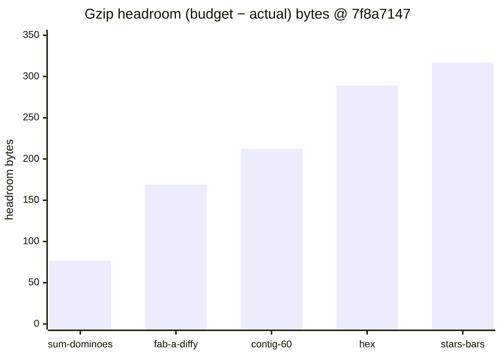
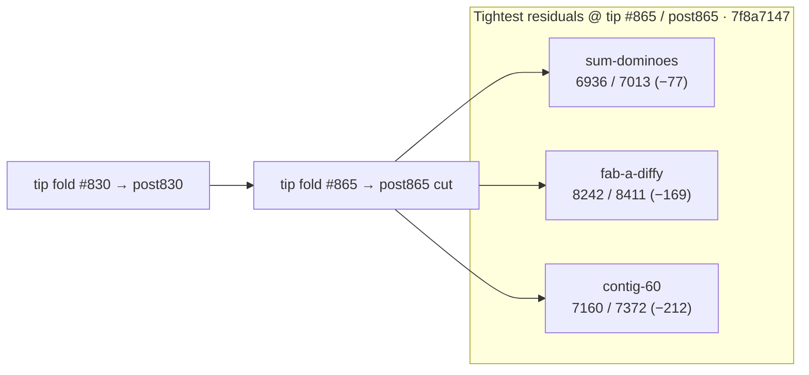

# Bundle size:check — post-#865 headroom remeasure (2026-10-10)

**Task id:** `q-mp-413` (remeasure after tip cut `cursor/mp-tip-post865` / fold `#865`; docs follow-up to open `#854` / `q-mp-361`)  
**Tip measured (live):** `cursor/mp-tip-post865` @ `7f8a7147`  
**Tip cut SHA (alpha after `#865`):** `3908809d` (tip HEAD has since absorbed folded drafts `#877`–`#899` during this run)  
**Measured on:** 2026-10-10 (UTC) · stamp `2026-10-10T06:21:23.694Z`  
**Scope:** Report-only headroom table on the post865 tree (live HEAD of `cursor/mp-tip-post865`). **No budget raise.** No `bundle-budgets.json` / allowlist edits.

Leaves open older tables **contained**:

- `#854` / `q-mp-361` — post-#830 table @ `97487de6` (−77 / −170 / −213 B)
- `#828` / `q-mp-313` — post-#785 table @ `21719062` (−76 B hashes)
- `#792` / `q-mp-263` — post-#755 table @ `74a1596f` (−79 B hashes)
- `#756` / `q-mp-237` — post-#748 table @ `ce673656` (−76 B hashes)
- `#879` / `q-mp-090l` — Oct 10c backlog checklist ownership (post830); leave open with **contained**

Stale backlog evidence for `q-mp-413` cited live tip `3908809d` / fab-a-diffy **−170 B** / contig-60 **−213 B** (written against the post865 cut before later tip folds). Live tip HEAD `7f8a7147` still has sum-dominoes **−77 B**; fab / contig drifted by **+1 B** each vs that stamp.

## Outcome

`npm run build && npm run size:check` on tip `7f8a7147` reports **All 21 budgets within limit** (`knownOvers` still `[]`). `--fail-on-new-over` also exits **0**.

Tightest residual headroom: **`game-sum-dominoes` −77 B** (6.77 / 6.85 kB).

### Sub-200 B margins (and next-tightest)

| Bundle | Gzip (B) | Budget (B) | Headroom (B) | kB display |
| --- | ---: | ---: | ---: | --- |
| `game-sum-dominoes` | **6936** | 7013 | **−77** | 6.77 / 6.85 kB |
| `game-fab-a-diffy` | **8242** | 8411 | **−169** | 8.05 / 8.21 kB |
| `game-contig-60` | **7160** | 7372 | **−212** | 6.99 / 7.20 kB (just outside 200 B) |

Any further growth in `game-sum-dominoes` or `game-fab-a-diffy` is the first place a NEW OVER would appear. Do **not** raise budgets to absorb drift — trim the chunk first.

## Full green table (exact gzip bytes @ `7f8a7147`)

Sorted tightest → widest headroom. Exact bytes use the same `zlib.gzipSync` path as `scripts/check-bundle-budgets.mjs`.

| Bundle | Dist chunk (hash) | Gzip (B) | Budget (B) | Delta (B) | Status |
| --- | --- | ---: | ---: | ---: | --- |
| `game-sum-dominoes` | `game-sum-dominoes-DQV68etC.js` | **6936** | 7013 | **−77** | OK |
| `game-fab-a-diffy` | `game-fab-a-diffy-Bf7ajTiR.js` | **8242** | 8411 | **−169** | OK |
| `game-contig-60` | `game-contig-60-Jn4OXSzu.js` | **7160** | 7372 | **−212** | OK |
| `game-hex` | `game-hex-B7nPd4IZ.js` | **5767** | 6056 | **−289** | OK |
| `game-stars-bars` | `game-stars-bars-CO0xR3bu.js` | **7101** | 7418 | **−317** | OK |
| `game-par-55` | `game-par-55-B_d6Wbtc.js` | **7602** | 7929 | **−327** | OK |
| `game-queens-guards` | `game-queens-guards-BUmjR2qg.js` | **8278** | 8628 | **−350** | OK |
| `game-kwatro-sinko` | `game-kwatro-sinko-C1hBDTJd.js` | **8202** | 8576 | **−374** | OK |
| `game-frac-fact` | `game-frac-fact-WS1sH9dq.js` | **5961** | 6350 | **−389** | OK |
| `game-fraction-pinball` | `game-fraction-pinball-ogX8Pf7N.js` | **5751** | 6177 | **−426** | OK |
| `game-calla` | `game-calla-CL745gSZ.js` | **6500** | 6967 | **−467** | OK |
| `game-remainder-islands` | `game-remainder-islands-C0FR9Pl1.js` | **6352** | 6878 | **−526** | OK |
| `game-star-track` | `game-star-track-DKdzz3bi.js` | **5467** | 6035 | **−568** | OK |
| `game-hex-a-gone` | `game-hex-a-gone-DPms8nRr.js` | **6814** | 7387 | **−573** | OK |
| `game-prime-gold` | `game-prime-gold-tEHc9uQq.js` | **8026** | 8686 | **−660** | OK |
| `game-kings-quadraphages` | `game-kings-quadraphages-DTWLFz95.js` | **7218** | 7903 | **−685** | OK |
| `game-pent-em-in` | `game-pent-em-in-B82b7O-G.js` | **6597** | 7284 | **−687** | OK |
| `game-juggle` | `game-juggle-DcIkZj_y.js` | **7381** | 8181 | **−800** | OK |
| `game-fiar` | `game-fiar-CH1VguAV.js` | **11180** | 12156 | **−976** | OK |
| `game-ramrod` | `game-ramrod-CFyLFjPD.js` | **5504** | 7261 | **−1757** | OK |
| `menu-critical-path` | (sum of index.html JS/CSS) | **26246** | 46822 | **−20576** | OK |

Menu critical files @ `7f8a7147`: `core-BvnLZvlI.js` (6909) + `index-EeyPZ6Ct.js` (3303) + `index-PzJzeRBN.css` (4587) + `ui-CAV4hcGs.css` (3158) + `ui-D4OMQPQH.js` (7639) + `vendor/vite-preload-BXl3LOEh.js` (650) = **26246** B.

## Headroom visual (tightest five game chunks)





## Delta vs prior headroom snapshots

| Bundle | Post-#785 @ `21719062` | Post-#830 @ `97487de6` | Post-#865 @ `7f8a7147` | Δgzip (830→865) |
| --- | ---: | ---: | ---: | ---: |
| `game-sum-dominoes` | 6937 (−76) | 6936 (−77) | **6936 (−77)** | **0 B** |
| `game-fab-a-diffy` | 8242 (−169) | 8241 (−170) | **8242 (−169)** | **+1 B** |
| `game-contig-60` | 7160 (−212) | 7159 (−213) | **7160 (−212)** | **+1 B** |
| `menu-critical-path` | 26240 (−20582) | 26235 (−20587) | **26246 (−20576)** | **+11 B** |

Hashes moved with tip `#865` / post865 folds; clearance status is unchanged (all OK, allowlist 0). Older tables in [`docs/dev/bundle-headroom-post830-2026-10-10.md`](./bundle-headroom-post830-2026-10-10.md) (open `#854`), [`docs/dev/bundle-headroom-post785-2026-10-10.md`](./bundle-headroom-post785-2026-10-10.md) (open `#828`), [`docs/dev/bundle-headroom-post755-2026-10-09.md`](./bundle-headroom-post755-2026-10-09.md) (open `#792`), and [`docs/dev/bundle-headroom-2026-10-09.md`](./bundle-headroom-2026-10-09.md) (open `#756`) are **contained** by this sibling — leave those drafts open. Historical NEW OVER / clearance narrative stays in [`docs/dev/bundle-over-2026-10-09.md`](./bundle-over-2026-10-09.md).

## Open-PR narrow (post865)

| Open draft | Overlap | Action |
| --- | --- | --- |
| #854 `q-mp-361` post-#830 headroom (−77 / −170 / −213 @ `97487de6`) | Stale vs post865 HEAD; chunk hashes differ | **contained** — leave open; this sibling is the live post-#865 remeasure |
| #879 `q-mp-090l` Oct 10c backlog (post830 checklist) | Checklist ownership only; no competing post865 table | **contained** — leave open |
| #828 `q-mp-313` post-#785 headroom (−76 B @ `21719062`) | Older tip; hashes stale | **contained** — leave open |
| #792 `q-mp-263` post-#755 headroom (−79 B @ `74a1596f`) | Older tip; hashes stale | **contained** — leave open |
| #756 `q-mp-237` post-#748 headroom (−76 B) | Older tip; hashes stale | **contained** — leave open |
| No open drafts into `cursor/mp-tip-post865` covering bundle-headroom at launch | — | This is the first post865 headroom report |

## How measured

```bash
npm run build
npm run size:check
# Same classification CI uses (soft; continue-on-error on build job):
npm run size:check -- --fail-on-new-over
```

Checker: `scripts/check-bundle-budgets.mjs` against committed `bundle-budgets.json`. Policy: [`docs/bundle-budget.md`](../bundle-budget.md).

## Allowlist policy (live tip)

| Field | Value |
| --- | --- |
| `knownOvers` in `bundle-budgets.json` | **`[]` (0 ids)** |
| Default `npm run size:check` exit | **0** |
| `npm run size:check -- --fail-on-new-over` | **0** on tip after `#865` / post865 (no NEW OVER) |

Do **not** grow `knownOvers` or raise budgets. Allowlist only shrinks (ratchet down).

## Pointers

- Prior post-#830 headroom (open `#854`, contained): [`docs/dev/bundle-headroom-post830-2026-10-10.md`](./bundle-headroom-post830-2026-10-10.md)
- Prior post-#785 headroom (open `#828`, contained): [`docs/dev/bundle-headroom-post785-2026-10-10.md`](./bundle-headroom-post785-2026-10-10.md)
- Prior post-#755 headroom (open `#792`, contained): [`docs/dev/bundle-headroom-post755-2026-10-09.md`](./bundle-headroom-post755-2026-10-09.md)
- Prior post-#748 headroom (open `#756`, contained): [`docs/dev/bundle-headroom-2026-10-09.md`](./bundle-headroom-2026-10-09.md)
- Clearance / NEW OVER history: [`docs/dev/bundle-over-2026-10-09.md`](./bundle-over-2026-10-09.md)
- Local / CI usage and allowlist rules: [`docs/bundle-budget.md`](../bundle-budget.md)
- Soft step inside blocking `build`: [`docs/dev/ci-gates-mermaid-q-mp-073.md`](./ci-gates-mermaid-q-mp-073.md)

## Verification (`q-mp-413`)

```bash
npm run build          # exit 0
npm run size:check     # exit 0; All 21 budgets within limit; sum-dominoes −77 B
npm run check:dev-docs # report-only; paths in this note should resolve
```
