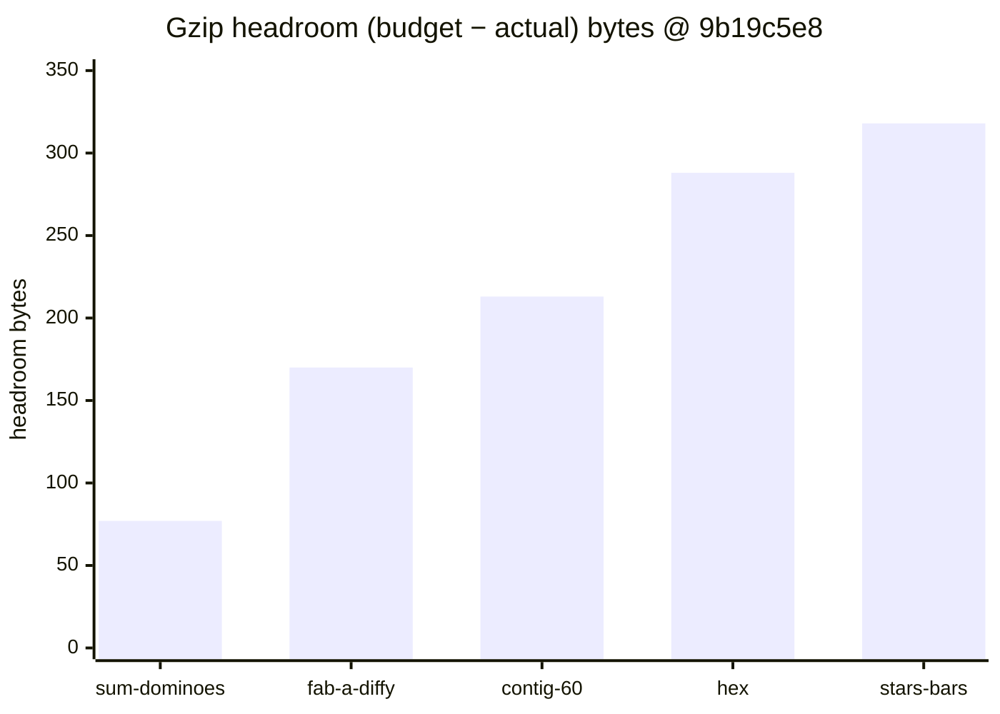
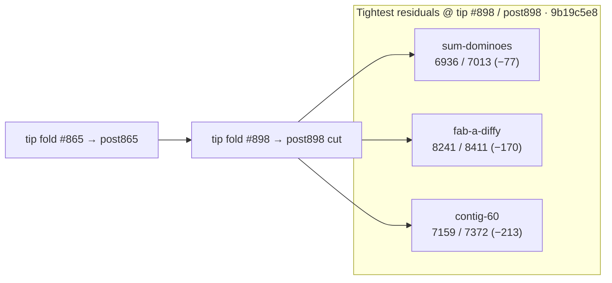

# Bundle size:check — post-#898 headroom remeasure (2026-10-10)

**Task id:** `q-mp-438` (remeasure after tip cut `cursor/mp-tip-post898` / fold `#898`; docs follow-up to tip-folded `#900` / `q-mp-413`)  
**Tip measured (live):** `cursor/mp-tip-post898` @ `9b19c5e8`  
**Tip cut SHA (alpha after `#898`):** `946d6f95` (tip HEAD has since absorbed folded drafts `#900`–`#913` / `#915`–`#921` via tip PR `#914`)  
**Measured on:** 2026-10-10 (UTC) · stamp `2026-10-10T08:27:08.195Z`  
**Scope:** Report-only headroom table on the post898 tree (live HEAD of `cursor/mp-tip-post898`). **No budget raise.** No `bundle-budgets.json` / allowlist edits.

Machine-readable twin: [`bundle-headroom-post898-2026-10-10.json`](./bundle-headroom-post898-2026-10-10.json) · visual: [`bundle-headroom-post898-2026-10-10.svg`](./bundle-headroom-post898-2026-10-10.svg)

Leaves older tables **contained** (do not close those drafts):

- `#900` / `q-mp-413` — post-#865 table @ `7f8a7147` (−77 / −169 / −212 B)
- `#854` / `q-mp-361` — post-#830 table @ `97487de6` (−77 / −170 / −213 B)
- `#828` / `q-mp-313` — post-#785 table @ `21719062` (−76 B hashes)
- `#792` / `q-mp-263` — post-#755 table @ `74a1596f` (−79 B hashes)
- `#756` / `q-mp-237` — post-#748 table @ `ce673656` (−76 B hashes)

Stale backlog evidence for `q-mp-438` cited tip `788e8215` / sum-dominoes **−77 B** / fab-a-diffy **−169 B** / contig-60 **−212 B**. Live tip HEAD `9b19c5e8` still has sum-dominoes **−77 B**; fab / contig each gained **1 B** of headroom vs that stamp (−170 / −213). Chunk hashes moved with tip folds after the post898 cut.

## Outcome

`npm run build && npm run size:check` on tip `9b19c5e8` reports **All 21 budgets within limit** (`knownOvers` still `[]`). `--fail-on-new-over` also exits **0**.

Tightest residual headroom: **`game-sum-dominoes` −77 B** (6.77 / 6.85 kB).

### Sub-200 B margins (and next-tightest)

| Bundle              | Gzip (B) | Budget (B) | Headroom (B) | kB display                          |
| ------------------- | -------: | ---------: | -----------: | ----------------------------------- |
| `game-sum-dominoes` | **6936** |       7013 |      **−77** | 6.77 / 6.85 kB                      |
| `game-fab-a-diffy`  | **8241** |       8411 |     **−170** | 8.05 / 8.21 kB                      |
| `game-contig-60`    | **7159** |       7372 |     **−213** | 6.99 / 7.20 kB (just outside 200 B) |

Any further growth in `game-sum-dominoes` or `game-fab-a-diffy` is the first place a NEW OVER would appear. Do **not** raise budgets to absorb drift — trim the chunk first.

## Full green table (exact gzip bytes @ `9b19c5e8`)

Sorted tightest → widest headroom. Exact bytes use the same `zlib.gzipSync` path as `scripts/check-bundle-budgets.mjs`.

| Bundle                    | Dist chunk (hash)                     |  Gzip (B) | Budget (B) |  Delta (B) | Status |
| ------------------------- | ------------------------------------- | --------: | ---------: | ---------: | ------ |
| `game-sum-dominoes`       | `game-sum-dominoes-D55_Rb_E.js`       |  **6936** |       7013 |    **−77** | OK     |
| `game-fab-a-diffy`        | `game-fab-a-diffy-BWpkF_7V.js`        |  **8241** |       8411 |   **−170** | OK     |
| `game-contig-60`          | `game-contig-60-BjQMrZTI.js`          |  **7159** |       7372 |   **−213** | OK     |
| `game-hex`                | `game-hex-Bw5wAGup.js`                |  **5768** |       6056 |   **−288** | OK     |
| `game-stars-bars`         | `game-stars-bars-DcNDWAye.js`         |  **7100** |       7418 |   **−318** | OK     |
| `game-par-55`             | `game-par-55-CVe0XwLt.js`             |  **7602** |       7929 |   **−327** | OK     |
| `game-queens-guards`      | `game-queens-guards-BeKAdCkk.js`      |  **8278** |       8628 |   **−350** | OK     |
| `game-kwatro-sinko`       | `game-kwatro-sinko-CFBJh9rp.js`       |  **8199** |       8576 |   **−377** | OK     |
| `game-frac-fact`          | `game-frac-fact-2rhg_9Ei.js`          |  **5960** |       6350 |   **−390** | OK     |
| `game-fraction-pinball`   | `game-fraction-pinball-FPV9fdZY.js`   |  **5751** |       6177 |   **−426** | OK     |
| `game-calla`              | `game-calla-BSVbEhJG.js`              |  **6499** |       6967 |   **−468** | OK     |
| `game-remainder-islands`  | `game-remainder-islands-F0KNhLVJ.js`  |  **6351** |       6878 |   **−527** | OK     |
| `game-star-track`         | `game-star-track-ajZ2KdP5.js`         |  **5466** |       6035 |   **−569** | OK     |
| `game-hex-a-gone`         | `game-hex-a-gone-Bs28tymM.js`         |  **6810** |       7387 |   **−577** | OK     |
| `game-prime-gold`         | `game-prime-gold-BCQeZ_W-.js`         |  **8028** |       8686 |   **−658** | OK     |
| `game-kings-quadraphages` | `game-kings-quadraphages-BWjH5j_q.js` |  **7222** |       7903 |   **−681** | OK     |
| `game-pent-em-in`         | `game-pent-em-in-DUu_R3c7.js`         |  **6594** |       7284 |   **−690** | OK     |
| `game-juggle`             | `game-juggle-C9XPAzw4.js`             |  **7380** |       8181 |   **−801** | OK     |
| `game-fiar`               | `game-fiar-u0DKmDhW.js`               | **11180** |      12156 |   **−976** | OK     |
| `game-ramrod`             | `game-ramrod-DsUBfzNq.js`             |  **5504** |       7261 |  **−1757** | OK     |
| `menu-critical-path`      | (sum of index.html JS/CSS)            | **26261** |      46822 | **−20561** | OK     |

Menu critical files @ `9b19c5e8`: `core-BvnLZvlI.js` (6909) + `index-D2_JzoV2.js` (3301) + `index-PzJzeRBN.css` (4587) + `ui-CAV4hcGs.css` (3158) + `ui-GRjcKRcQ.js` (7656) + `vendor/vite-preload-BXl3LOEh.js` (650) = **26261** B.

## Headroom visual (tightest five game chunks)






## Delta vs prior headroom snapshots

| Bundle               | Post-#830 @ `97487de6` | Post-#865 @ `7f8a7147` | Post-#898 @ `9b19c5e8` | Δgzip (865→898) |
| -------------------- | ---------------------: | ---------------------: | ---------------------: | --------------: |
| `game-sum-dominoes`  |             6936 (−77) |             6936 (−77) |         **6936 (−77)** |         **0 B** |
| `game-fab-a-diffy`   |            8241 (−170) |            8242 (−169) |        **8241 (−170)** |        **−1 B** |
| `game-contig-60`     |            7159 (−213) |            7160 (−212) |        **7159 (−213)** |        **−1 B** |
| `menu-critical-path` |         26235 (−20587) |         26246 (−20576) |     **26261 (−20561)** |       **+15 B** |

Hashes moved with tip `#898` / post898 folds; clearance status is unchanged (all OK, allowlist 0). Older tables in [`docs/dev/bundle-headroom-post865-2026-10-10.md`](./bundle-headroom-post865-2026-10-10.md) (open `#900`), [`docs/dev/bundle-headroom-post830-2026-10-10.md`](./bundle-headroom-post830-2026-10-10.md) (open `#854`), [`docs/dev/bundle-headroom-post785-2026-10-10.md`](./bundle-headroom-post785-2026-10-10.md) (open `#828`), [`docs/dev/bundle-headroom-post755-2026-10-09.md`](./bundle-headroom-post755-2026-10-09.md) (open `#792`), and [`docs/dev/bundle-headroom-2026-10-09.md`](./bundle-headroom-2026-10-09.md) (open `#756`) are **contained** by this sibling — leave those drafts open. Historical NEW OVER / clearance narrative stays in [`docs/dev/bundle-over-2026-10-09.md`](./bundle-over-2026-10-09.md).

## Open-PR narrow (post898)

| Open draft                                                                     | Overlap                                                      | Action                                                                   |
| ------------------------------------------------------------------------------ | ------------------------------------------------------------ | ------------------------------------------------------------------------ |
| #900 `q-mp-413` post-#865 headroom (−77 / −169 / −212 @ `7f8a7147`)            | Tip-folded twin / stale vs post898 HEAD; chunk hashes differ | **contained** — leave open; this sibling is the live post-#898 remeasure |
| #854 `q-mp-361` post-#830 headroom (−77 / −170 / −213 @ `97487de6`)            | Older tip; hashes stale                                      | **contained** — leave open                                               |
| #828 `q-mp-313` post-#785 headroom (−76 B @ `21719062`)                        | Older tip; hashes stale                                      | **contained** — leave open                                               |
| #792 `q-mp-263` post-#755 headroom (−79 B @ `74a1596f`)                        | Older tip; hashes stale                                      | **contained** — leave open                                               |
| #756 `q-mp-237` post-#748 headroom (−76 B)                                     | Older tip; hashes stale                                      | **contained** — leave open                                               |
| No open drafts into `cursor/mp-tip-post898` covering bundle-headroom at launch | —                                                            | This is the first post898 headroom report                                |

## How measured

```bash
npm run build
npm run size:check
# Same classification CI uses (soft; continue-on-error on build job):
npm run size:check -- --fail-on-new-over
```

Checker: `scripts/check-bundle-budgets.mjs` against committed `bundle-budgets.json`. Policy: [`docs/bundle-budget.md`](../bundle-budget.md).

## Allowlist policy (live tip)

| Field                                      | Value                                             |
| ------------------------------------------ | ------------------------------------------------- |
| `knownOvers` in `bundle-budgets.json`      | **`[]` (0 ids)**                                  |
| Default `npm run size:check` exit          | **0**                                             |
| `npm run size:check -- --fail-on-new-over` | **0** on tip after `#898` / post898 (no NEW OVER) |

Do **not** grow `knownOvers` or raise budgets. Allowlist only shrinks (ratchet down).

## Pointers

- Prior post-#865 headroom (open `#900`, contained): [`docs/dev/bundle-headroom-post865-2026-10-10.md`](./bundle-headroom-post865-2026-10-10.md)
- Prior post-#830 headroom (open `#854`, contained): [`docs/dev/bundle-headroom-post830-2026-10-10.md`](./bundle-headroom-post830-2026-10-10.md)
- Prior post-#785 headroom (open `#828`, contained): [`docs/dev/bundle-headroom-post785-2026-10-10.md`](./bundle-headroom-post785-2026-10-10.md)
- Prior post-#755 headroom (open `#792`, contained): [`docs/dev/bundle-headroom-post755-2026-10-09.md`](./bundle-headroom-post755-2026-10-09.md)
- Prior post-#748 headroom (open `#756`, contained): [`docs/dev/bundle-headroom-2026-10-09.md`](./bundle-headroom-2026-10-09.md)
- Clearance / NEW OVER history: [`docs/dev/bundle-over-2026-10-09.md`](./bundle-over-2026-10-09.md)
- Local / CI usage and allowlist rules: [`docs/bundle-budget.md`](../bundle-budget.md)
- Soft step inside blocking `build`: [`docs/dev/ci-gates-mermaid-q-mp-073.md`](./ci-gates-mermaid-q-mp-073.md)

## Verification (`q-mp-438`)

```bash
npm run build          # exit 0
npm run size:check     # exit 0; All 21 budgets within limit; sum-dominoes −77 B
npm run check:dev-docs # report-only; paths in this note should resolve
```
