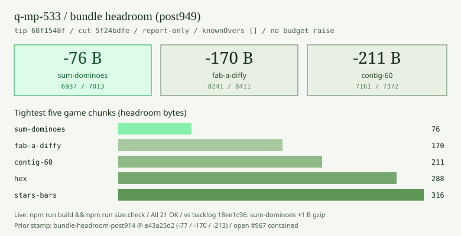
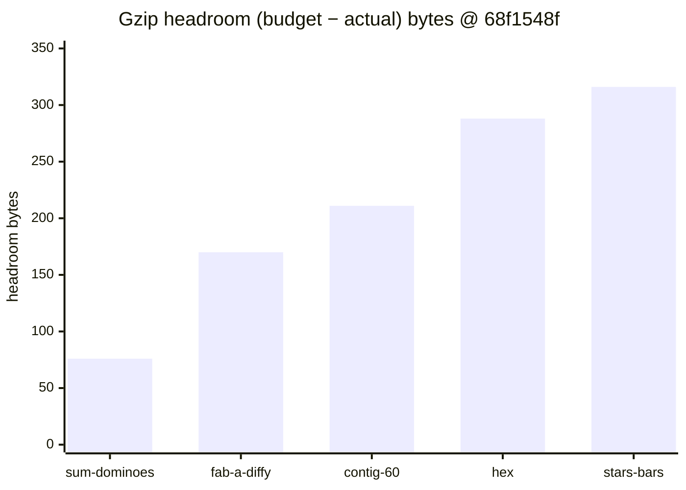
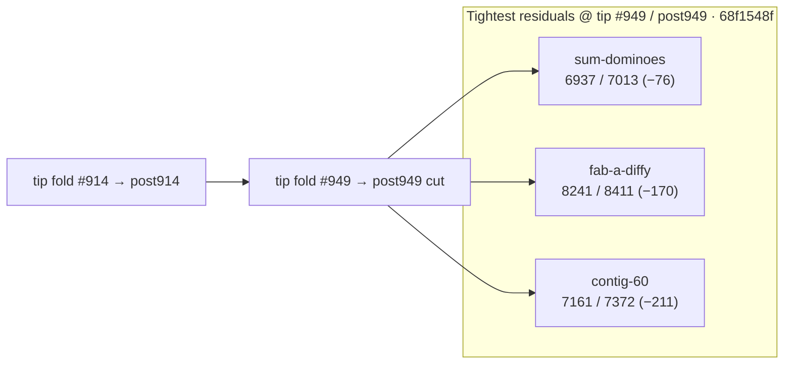

# Bundle size:check — post-#949 headroom remeasure (2026-10-10)

**Task id:** `q-mp-533` (remeasure after tip cut `cursor/mp-tip-post949` / fold `#949`; docs follow-up to open `#967` / `q-mp-488` post914 and `#930` / `q-mp-438` post898)  
**Tip measured (live):** `cursor/mp-tip-post949` @ `68f1548f`  
**Tip cut SHA (alpha after `#949`):** `5f24bdfe`  
**Backlog baseline SHA (round-18 stamp):** `18ee1c96` (sum-dominoes **−77 B** / fab **−170 B** / contig **−213 B**)  
**Measured on:** 2026-10-10 (UTC) · stamp `2026-10-10T13:47:04.609Z`  
**Scope:** Report-only headroom table on the post949 tree (live HEAD of `cursor/mp-tip-post949`). **No budget raise.** No `bundle-budgets.json` / allowlist edits.

Machine-readable twin: [`bundle-headroom-post949-2026-10-10.json`](./bundle-headroom-post949-2026-10-10.json) · visual: [`bundle-headroom-post949-2026-10-10.svg`](./bundle-headroom-post949-2026-10-10.svg)

Leaves older tables **contained** (do not close those drafts):

- `#967` / `q-mp-488` — post-#914 table @ `e43a25d2` (−77 / −170 / −213 B)
- `#930` / `q-mp-438` — post-#898 table @ `b7e518b4` (−77 / −170 / −213 B)
- `#900` / `q-mp-413` — post-#865 table @ `7f8a7147` (−77 / −169 / −212 B)
- `#854` / `q-mp-361` — post-#830 table @ `97487de6` (−77 / −170 / −213 B)
- `#828` / `q-mp-313` — post-#785 table @ `21719062` (−76 B hashes)
- `#792` / `q-mp-263` — post-#755 table @ `74a1596f` (−79 B hashes)
- `#756` / `q-mp-237` — post-#748 table @ `ce673656` (−76 B hashes)

Backlog stamp for `q-mp-533` (from `#995` / `q-mp-090r` @ tip `18ee1c96`) cited sum-dominoes **−77 B** / fab-a-diffy **−170 B** / contig-60 **−213 B**. Live re-measure on tip HEAD `68f1548f` (post mid-fold of round-17/18 drafts) shows sum-dominoes **−76 B** (+1 B gzip), fab-a-diffy still **−170 B**, contig-60 **−211 B** (+2 B gzip). Most game chunk hashes moved vs post914; menu critical path is **+5 B** gzip vs post914 (`index-*.js` / `ui-*.js` hashes moved).

## Outcome

`npm run build && npm run size:check` on tip `68f1548f` reports **All 21 budgets within limit** (`knownOvers` still `[]`). `--fail-on-new-over` also exits **0**.

Tightest residual headroom: **`game-sum-dominoes` −76 B** (6.77 / 6.85 kB).

### Sub-200 B margins (and next-tightest)

| Bundle              | Gzip (B) | Budget (B) | Headroom (B) | kB display                          |
| ------------------- | -------: | ---------: | -----------: | ----------------------------------- |
| `game-sum-dominoes` | **6937** |       7013 |      **−76** | 6.77 / 6.85 kB                      |
| `game-fab-a-diffy`  | **8241** |       8411 |     **−170** | 8.05 / 8.21 kB                      |
| `game-contig-60`    | **7161** |       7372 |     **−211** | 6.99 / 7.20 kB (just outside 200 B) |

Any further growth in `game-sum-dominoes` or `game-fab-a-diffy` is the first place a NEW OVER would appear. Do **not** raise budgets to absorb drift — trim the chunk first.

## Full green table (exact gzip bytes @ `68f1548f`)

Sorted tightest → widest headroom. Exact bytes use the same `zlib.gzipSync` path as `scripts/check-bundle-budgets.mjs`.

| Bundle                    | Dist chunk (hash)                     |  Gzip (B) | Budget (B) |  Delta (B) | Status |
| ------------------------- | ------------------------------------- | --------: | ---------: | ---------: | ------ |
| `game-sum-dominoes`       | `game-sum-dominoes-DK1Wm3ia.js`       |  **6937** |       7013 |    **−76** | OK     |
| `game-fab-a-diffy`        | `game-fab-a-diffy-BRTBU2zF.js`        |  **8241** |       8411 |   **−170** | OK     |
| `game-contig-60`          | `game-contig-60-BQ59EEXa.js`          |  **7161** |       7372 |   **−211** | OK     |
| `game-hex`                | `game-hex-BO3Ib7R_.js`                |  **5768** |       6056 |   **−288** | OK     |
| `game-stars-bars`         | `game-stars-bars-8Q1N7fE4.js`         |  **7102** |       7418 |   **−316** | OK     |
| `game-par-55`             | `game-par-55-BSe11Ywj.js`             |  **7603** |       7929 |   **−326** | OK     |
| `game-queens-guards`      | `game-queens-guards-BOtK4JP9.js`      |  **8279** |       8628 |   **−349** | OK     |
| `game-kwatro-sinko`       | `game-kwatro-sinko-Co7jJYsb.js`       |  **8200** |       8576 |   **−376** | OK     |
| `game-frac-fact`          | `game-frac-fact-1cZaYjFo.js`          |  **5961** |       6350 |   **−389** | OK     |
| `game-fraction-pinball`   | `game-fraction-pinball-hZH1v3ek.js`   |  **5752** |       6177 |   **−425** | OK     |
| `game-calla`              | `game-calla-DgXd6Qwb.js`              |  **6501** |       6967 |   **−466** | OK     |
| `game-remainder-islands`  | `game-remainder-islands-uHil-OTt.js`  |  **6352** |       6878 |   **−526** | OK     |
| `game-star-track`         | `game-star-track-BmWnX0Y9.js`         |  **5468** |       6035 |   **−567** | OK     |
| `game-hex-a-gone`         | `game-hex-a-gone-VctQCPMQ.js`         |  **6814** |       7387 |   **−573** | OK     |
| `game-prime-gold`         | `game-prime-gold-Cq-UKjGa.js`         |  **8029** |       8686 |   **−657** | OK     |
| `game-kings-quadraphages` | `game-kings-quadraphages-G0TKCQFe.js` |  **7221** |       7903 |   **−682** | OK     |
| `game-pent-em-in`         | `game-pent-em-in-D1WFbzd2.js`         |  **6597** |       7284 |   **−687** | OK     |
| `game-juggle`             | `game-juggle-CEtNftR2.js`             |  **7384** |       8181 |   **−797** | OK     |
| `game-fiar`               | `game-fiar-BxskX4G_.js`               | **11181** |      12156 |   **−975** | OK     |
| `game-ramrod`             | `game-ramrod-DmtdkOkN.js`             |  **5505** |       7261 |  **−1756** | OK     |
| `menu-critical-path`      | (sum of index.html JS/CSS)            | **26267** |      46822 | **−20555** | OK     |

Menu critical files @ `68f1548f`: `core-BvnLZvlI.js` (6909) + `index-CHb5irpS.js` (3308) + `index-PzJzeRBN.css` (4587) + `ui-CAV4hcGs.css` (3158) + `ui-6bJ58Gw3.js` (7655) + `vendor/vite-preload-BXl3LOEh.js` (650) = **26267** B.

## Headroom visual (tightest five game chunks)







## Delta vs prior headroom snapshots

| Bundle               | Post-#898 @ `b7e518b4` | Post-#914 @ `e43a25d2` | Backlog @ `18ee1c96` | Live post949 @ `68f1548f` | Δgzip (914→949 live) |
| -------------------- | ---------------------: | ---------------------: | -------------------: | ------------------------: | -------------------: |
| `game-sum-dominoes`  |         **6936 (−77)** |         **6936 (−77)** |            **−77 B** |            **6937 (−76)** |             **+1 B** |
| `game-fab-a-diffy`   |        **8241 (−170)** |        **8241 (−170)** |           **−170 B** |           **8241 (−170)** |              **0 B** |
| `game-contig-60`     |        **7159 (−213)** |        **7159 (−213)** |           **−213 B** |           **7161 (−211)** |             **+2 B** |
| `menu-critical-path` |     **26261 (−20561)** |     **26262 (−20560)** |                    — |        **26267 (−20555)** |             **+5 B** |

Game chunk hashes moved on post949 mid-fold (sum-dominoes `D55_Rb_E` → `DK1Wm3ia`, contig-60 `BjQMrZTI` → `BQ59EEXa`, etc.). Clearance status is unchanged (all OK, allowlist 0). Older tables in [`docs/dev/bundle-headroom-post914-2026-10-10.md`](./bundle-headroom-post914-2026-10-10.md) (open `#967`), [`docs/dev/bundle-headroom-post898-2026-10-10.md`](./bundle-headroom-post898-2026-10-10.md) (open `#930`), [`docs/dev/bundle-headroom-post865-2026-10-10.md`](./bundle-headroom-post865-2026-10-10.md) (open `#900`), [`docs/dev/bundle-headroom-post830-2026-10-10.md`](./bundle-headroom-post830-2026-10-10.md) (open `#854`), [`docs/dev/bundle-headroom-post785-2026-10-10.md`](./bundle-headroom-post785-2026-10-10.md) (open `#828`), [`docs/dev/bundle-headroom-post755-2026-10-09.md`](./bundle-headroom-post755-2026-10-09.md) (open `#792`), and [`docs/dev/bundle-headroom-2026-10-09.md`](./bundle-headroom-2026-10-09.md) (open `#756`) are **contained** by this sibling — leave those drafts open. Historical NEW OVER / clearance narrative stays in [`docs/dev/bundle-over-2026-10-09.md`](./bundle-over-2026-10-09.md).

## Open-PR narrow (post949)

| Open draft                                                                     | Overlap                                                    | Action                                                                   |
| ------------------------------------------------------------------------------ | ---------------------------------------------------------- | ------------------------------------------------------------------------ |
| #967 `q-mp-488` post-#914 headroom (−77 / −170 / −213 @ `e43a25d2`)            | Prior tip; live post949 sum-dominoes −76 B / contig −211 B | **contained** — leave open; this sibling is the live post-#949 remeasure |
| #930 `q-mp-438` post-#898 headroom (−77 / −170 / −213 @ `b7e518b4`)            | Older tip; hashes stale                                    | **contained** — leave open                                               |
| #900 `q-mp-413` post-#865 headroom (−77 / −169 / −212 @ `7f8a7147`)            | Older tip; hashes stale                                    | **contained** — leave open                                               |
| #854 `q-mp-361` post-#830 headroom (−77 / −170 / −213 @ `97487de6`)            | Older tip; hashes stale                                    | **contained** — leave open                                               |
| #828 `q-mp-313` post-#785 headroom (−76 B @ `21719062`)                        | Older tip; hashes stale                                    | **contained** — leave open                                               |
| #792 `q-mp-263` post-#755 headroom (−79 B @ `74a1596f`)                        | Older tip; hashes stale                                    | **contained** — leave open                                               |
| #756 `q-mp-237` post-#748 headroom (−76 B)                                     | Older tip; hashes stale                                    | **contained** — leave open                                               |
| #992 `q-mp-519` sum-dominoes UI cov r50 (tests-only)                           | Orthogonal tests; does not own headroom table              | leave open (orthogonal)                                                  |
| No open drafts into `cursor/mp-tip-post949` covering bundle-headroom at launch | —                                                          | This is the first post949 headroom report                                |

## How measured

```bash
npm run build
npm run size:check
# Same classification CI uses (soft; continue-on-error on build job):
npm run size:check -- --fail-on-new-over
```

Checker: `scripts/check-bundle-budgets.mjs` against committed `bundle-budgets.json`. Policy: [`docs/bundle-budget.md`](../bundle-budget.md).

## Allowlist policy (live tip)

| Field                                      | Value                                             |
| ------------------------------------------ | ------------------------------------------------- |
| `knownOvers` in `bundle-budgets.json`      | **`[]` (0 ids)**                                  |
| Default `npm run size:check` exit          | **0**                                             |
| `npm run size:check -- --fail-on-new-over` | **0** on tip after `#949` / post949 (no NEW OVER) |

Do **not** grow `knownOvers` or raise budgets. Allowlist only shrinks (ratchet down).

## Pointers

- Prior post-#914 headroom (open `#967`, contained): [`docs/dev/bundle-headroom-post914-2026-10-10.md`](./bundle-headroom-post914-2026-10-10.md)
- Prior post-#898 headroom (open `#930`, contained): [`docs/dev/bundle-headroom-post898-2026-10-10.md`](./bundle-headroom-post898-2026-10-10.md)
- Prior post-#865 headroom (open `#900`, contained): [`docs/dev/bundle-headroom-post865-2026-10-10.md`](./bundle-headroom-post865-2026-10-10.md)
- Prior post-#830 headroom (open `#854`, contained): [`docs/dev/bundle-headroom-post830-2026-10-10.md`](./bundle-headroom-post830-2026-10-10.md)
- Prior post-#785 headroom (open `#828`, contained): [`docs/dev/bundle-headroom-post785-2026-10-10.md`](./bundle-headroom-post785-2026-10-10.md)
- Prior post-#755 headroom (open `#792`, contained): [`docs/dev/bundle-headroom-post755-2026-10-09.md`](./bundle-headroom-post755-2026-10-09.md)
- Prior post-#748 headroom (open `#756`, contained): [`docs/dev/bundle-headroom-2026-10-09.md`](./bundle-headroom-2026-10-09.md)
- Clearance / NEW OVER history: [`docs/dev/bundle-over-2026-10-09.md`](./bundle-over-2026-10-09.md)
- Local / CI usage and allowlist rules: [`docs/bundle-budget.md`](../bundle-budget.md)
- Soft step inside blocking `build`: [`docs/dev/ci-gates-mermaid-q-mp-073.md`](./ci-gates-mermaid-q-mp-073.md)

## Verification (`q-mp-533`)

```bash
npm run build          # exit 0
npm run size:check     # exit 0; All 21 budgets within limit; sum-dominoes −76 B
npm run check:dev-docs # report-only; paths in this note should resolve
```
