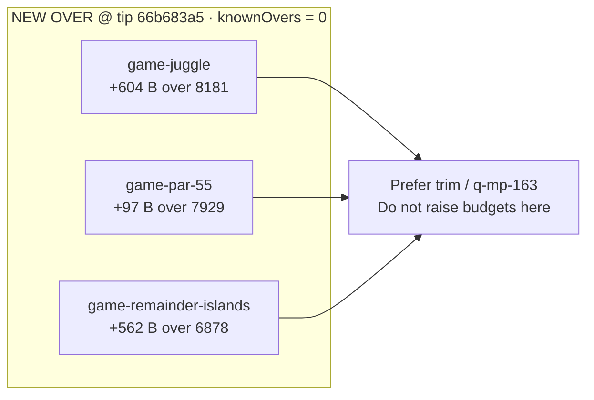

# Bundle size:check — NEW OVER snapshot (2026-10-09)

**Task id:** `q-mp-172`  
**Tip measured:** `cursor/mp-tip-post477` @ `66b683a5` (full SHA `66b683a55853e3f70b825b01c4664da02bd72318`)  
**Measured on:** 2026-10-09 (UTC)  
**Scope:** Report-only documentation of live gzip NEW OVER rows. **No budget raise.** No `bundle-budgets.json` / allowlist edits in this PR.

Pairs with trim work (`q-mp-163`); this note can land before or after a trim. Until trim lands, these three games remain loud NEW OVER under an empty `knownOvers` allowlist.

## Open-PR narrow

| Open draft | Overlap | Action |
| --- | --- | --- |
| #652 `q-mp-123` size:check allowlist ratchet | Implements known-vs-new OVER classifier (already on tip) | Orthogonal; leave open |
| #636 `q-mp-110` ramrod gzip trim | Historical trim that cleared prior OVER set | Not this snapshot |
| #625 `q-mp-058` perf/memory/bundle re-audit | Older tip re-measure; does not document current three NEW OVER rows with diagram | Narrow: this PR is the dated NEW OVER table + Mermaid only |
| No open draft titled `q-mp-172` / `bundle-over` | — | Proceed |

## How measured

```bash
npm run build
npm run size:check
# Same classification CI uses (soft; continue-on-error on build job):
npm run size:check -- --fail-on-new-over
```

Checker: `scripts/check-bundle-budgets.mjs` against committed `bundle-budgets.json`. Policy: [`docs/bundle-budget.md`](../bundle-budget.md).

## Allowlist policy (live tip)

| Field | Value |
| --- | --- |
| `knownOvers` in `bundle-budgets.json` | **`[]` (0 ids)** |
| Classification of the three OVER rows below | **NEW OVER** (not allowlisted) |
| Default `npm run size:check` exit | **0** (report-only) |
| `npm run size:check -- --fail-on-new-over` | exits **1** when any NEW OVER exists; CI keeps the step `continue-on-error: true` so the build job stays green |

Do **not** grow `knownOvers` or raise budgets to silence this report. Prefer chunk trim (`q-mp-163` or tip-owner-approved follow-up). Allowlist only shrinks (ratchet down).

## NEW OVER exact byte table

Live gzip bytes from `zlib.gzipSync` on `dist/assets/game-<id>-*.js` after `npm run build` at tip SHA above. Budgets are the committed `games.<id>` entries in `bundle-budgets.json`.

| Bundle | Dist chunk (hash) | Gzip (B) | Budget (B) | Delta (B) | Status |
| --- | --- | ---: | ---: | ---: | --- |
| `game-juggle` | `game-juggle-CMPqvnRE.js` | **8785** | 8181 | **+604** | NEW OVER |
| `game-par-55` | `game-par-55-BTWk-Tv7.js` | **8026** | 7929 | **+97** | NEW OVER |
| `game-remainder-islands` | `game-remainder-islands-CQWO68QW.js` | **7440** | 6878 | **+562** | NEW OVER |

Checker human-readable echo (same rows):

| Bundle | Gzip | Budget | Delta | Status |
| --- | --- | --- | --- | --- |
| `game-juggle` | 8.58 kB | 7.99 kB | +604 B | OVER |
| `game-par-55` | 7.84 kB | 7.74 kB | +97 B | OVER |
| `game-remainder-islands` | 7.27 kB | 6.72 kB | +562 B | OVER |

All other `game-*` rows and `menu-critical-path` were **OK** on this tip build (menu critical path **25.28 kB** vs budget **45.72 kB**).

## Budget vs actual (Mermaid)

Bar values are exact gzip bytes from the table above (budget series first, actual series second).

```mermaid
xychart-beta
    title "NEW OVER gzip: budget vs actual (bytes)"
    x-axis ["juggle", "par-55", "remainder-islands"]
    y-axis "gzip bytes" 0 --> 10000
    bar [8181, 7929, 6878]
    bar [8785, 8026, 7440]
```



Over-budget headroom needed to clear each row (trim target, not a proposed budget bump):



## Pointers

- Local / CI usage and allowlist rules: [`docs/bundle-budget.md`](../bundle-budget.md)
- npm scripts: `npm run size:check` · `npm run size:check -- --fail-on-new-over`
- Soft step inside blocking `build`: [`docs/dev/ci-gates-mermaid-q-mp-073.md`](./ci-gates-mermaid-q-mp-073.md)
- Testing-layer index link: [`docs/dev/testing-layers-2026-10-09.md`](./testing-layers-2026-10-09.md)

## Verification (authoring machine)

```bash
npm run build          # exit 0
npm run size:check     # exit 0; prints 3 NEW OVER rows above
npm run check:dev-docs # report-only; paths in this note should resolve
```
