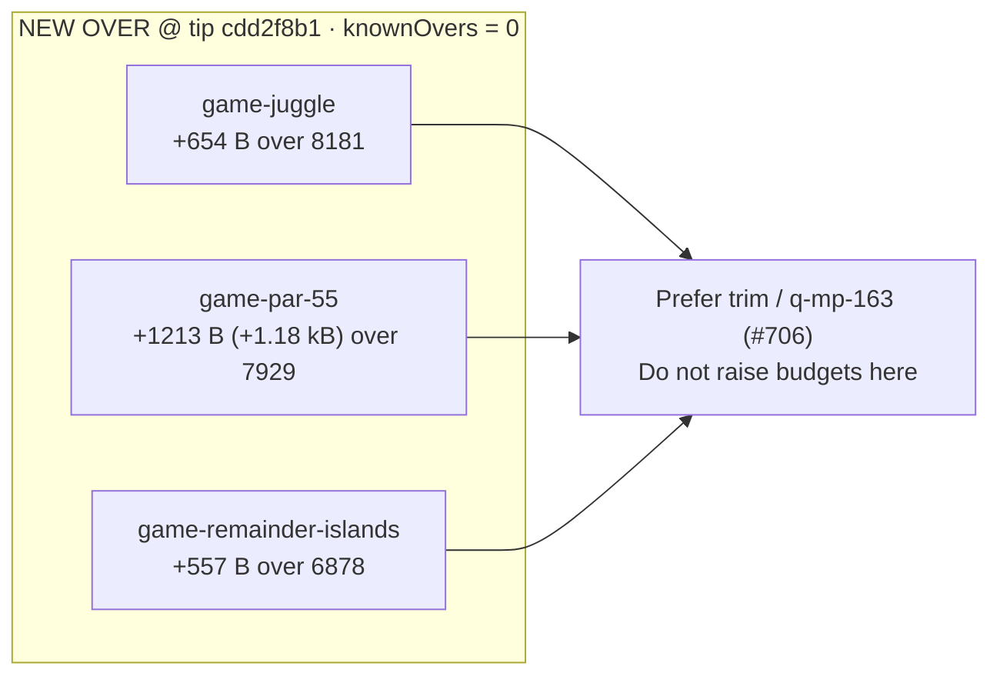
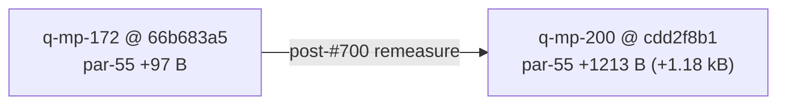

# Bundle size:check — NEW OVER snapshot (2026-10-09)

**Task id:** `q-mp-200` (addendum / refresh after tip #700; prior authoring `q-mp-172`)  
**Tip measured:** `cursor/mp-tip-post709` @ `cdd2f8b1` (full SHA `cdd2f8b12e1699d90812016049798480e79c3eeb`)  
**Measured on:** 2026-10-09 (UTC)  
**Scope:** Report-only documentation of live gzip NEW OVER rows after tip fold batch 5 (`#700` @ `3320d897`) and batch 6 (`#709`). **No budget raise.** No `bundle-budgets.json` / allowlist edits in this PR.

Pairs with trim work (`q-mp-163` / open #706); this note can land before or after a trim. Until trim lands, these three games remain loud NEW OVER under an empty `knownOvers` allowlist.

## Why refresh (post-#700)

Folded `q-mp-172` still described tip `66b683a5` with **par-55 only +97 B** over budget. After `#700` / live tip remeasure, **par-55 is +1.18 kB** (+1213 B) — the loudest of the three NEW OVER rows. This file keeps the older table as a prior snapshot and updates the primary table + Mermaid to the post-#700 tip.

| Snapshot | Tip SHA | `game-par-55` delta | Notes |
| --- | --- | ---: | --- |
| Prior (`q-mp-172`) | `66b683a5` | **+97 B** | Pre-#700 tip `cursor/mp-tip-post477` |
| Ticket evidence (`#700`) | `3320d897` | **+1.18 kB** | Same three NEW OVER ids; allowlist 0 |
| This refresh (`q-mp-200`) | `cdd2f8b1` | **+1.18 kB** (+1213 B) | Live tip after `#709`; juggle/par-55 match `#700` evidence; remainder **+557 B** (ticket cited +559 B @ `3320d897`) |

## Open-PR narrow

| Open draft | Overlap | Action |
| --- | --- | --- |
| #692 `q-mp-172` bundle-over table + Mermaid | Same doc path; stale tip/`+97 B` par-55 | **contained** — tip already has the file; this PR refreshes numbers. Leave #692 open |
| #706 `q-mp-163` trim three NEW OVER chunks | Implementation trim (not docs) | Orthogonal; leave open |
| #652 `q-mp-123` size:check allowlist ratchet | Classifier already on tip | Orthogonal; leave open |
| #636 `q-mp-110` ramrod gzip trim | Historical; cleared prior OVER set | Not this snapshot |
| No open draft titled `q-mp-200` | — | Proceed |

## How measured

```bash
npm run build
npm run size:check
# Same classification CI uses (soft; continue-on-error on build job):
npm run size:check -- --fail-on-new-over
```

Checker: `scripts/check-bundle-budgets.mjs` against committed `bundle-budgets.json`. Policy: [`docs/bundle-budget.md`](../bundle-budget.md).

## Allowlist policy (live tip)

| Field | Value |
| --- | --- |
| `knownOvers` in `bundle-budgets.json` | **`[]` (0 ids)** |
| Classification of the three OVER rows below | **NEW OVER** (not allowlisted) |
| Default `npm run size:check` exit | **0** (report-only) |
| `npm run size:check -- --fail-on-new-over` | exits **1** when any NEW OVER exists; CI keeps the step `continue-on-error: true` so the build job stays green |

Do **not** grow `knownOvers` or raise budgets to silence this report. Prefer chunk trim (`q-mp-163` / #706 or tip-owner-approved follow-up). Allowlist only shrinks (ratchet down).

## NEW OVER exact byte table (live tip `cdd2f8b1`)

Live gzip bytes from `zlib.gzipSync` on `dist/assets/game-<id>-*.js` after `npm run build` at tip SHA above. Budgets are the committed `games.<id>` entries in `bundle-budgets.json`.

| Bundle | Dist chunk (hash) | Gzip (B) | Budget (B) | Delta (B) | Status |
| --- | --- | ---: | ---: | ---: | --- |
| `game-juggle` | `game-juggle-D18nh0NU.js` | **8835** | 8181 | **+654** | NEW OVER |
| `game-par-55` | `game-par-55-DXoPBqyy.js` | **9142** | 7929 | **+1213** | NEW OVER |
| `game-remainder-islands` | `game-remainder-islands-Bo90jove.js` | **7435** | 6878 | **+557** | NEW OVER |

Checker human-readable echo (same rows):

| Bundle | Gzip | Budget | Delta | Status |
| --- | --- | --- | --- | --- |
| `game-juggle` | 8.63 kB | 7.99 kB | +654 B | OVER |
| `game-par-55` | 8.93 kB | 7.74 kB | +1.18 kB | OVER |
| `game-remainder-islands` | 7.26 kB | 6.72 kB | +557 B | OVER |

All other `game-*` rows and `menu-critical-path` were **OK** on this tip build (menu critical path **25.27 kB** vs budget **45.72 kB**).

### Growth vs prior `q-mp-172` snapshot (`66b683a5`)

| Bundle | Prior gzip (B) | Live gzip (B) | Δgzip (B) | Prior over budget | Live over budget |
| --- | ---: | ---: | ---: | ---: | ---: |
| `game-juggle` | 8785 | 8835 | +50 | +604 | **+654** |
| `game-par-55` | 8026 | 9142 | **+1116** | +97 | **+1213** (+1.18 kB) |
| `game-remainder-islands` | 7440 | 7435 | −5 | +562 | **+557** |

## Budget vs actual (Mermaid)

Bar values are exact gzip bytes from the live tip table above (budget series first, actual series second).

```mermaid
xychart-beta
    title "NEW OVER gzip: budget vs actual (bytes) @ cdd2f8b1"
    x-axis ["juggle", "par-55", "remainder-islands"]
    y-axis "gzip bytes" 0 --> 10000
    bar [8181, 7929, 6878]
    bar [8835, 9142, 7435]
```



Over-budget headroom needed to clear each row (trim target, not a proposed budget bump):



par-55 growth callout (prior snapshot → live tip):



## Prior snapshot (`q-mp-172` @ `66b683a5`) — retained for delta

| Bundle | Dist chunk (hash) | Gzip (B) | Budget (B) | Delta (B) | Status |
| --- | --- | ---: | ---: | ---: | --- |
| `game-juggle` | `game-juggle-CMPqvnRE.js` | **8785** | 8181 | **+604** | NEW OVER |
| `game-par-55` | `game-par-55-BTWk-Tv7.js` | **8026** | 7929 | **+97** | NEW OVER |
| `game-remainder-islands` | `game-remainder-islands-CQWO68QW.js` | **7440** | 6878 | **+562** | NEW OVER |

## Pointers

- Local / CI usage and allowlist rules: [`docs/bundle-budget.md`](../bundle-budget.md)
- npm scripts: `npm run size:check` · `npm run size:check -- --fail-on-new-over`
- Soft step inside blocking `build`: [`docs/dev/ci-gates-mermaid-q-mp-073.md`](./ci-gates-mermaid-q-mp-073.md)
- Testing-layer index link: [`docs/dev/testing-layers-2026-10-09.md`](./testing-layers-2026-10-09.md)
- Trim follow-up (not this PR): `q-mp-163` / open #706

## Verification (authoring machine)

```bash
npm run build          # exit 0
npm run size:check     # exit 0; prints 3 NEW OVER rows above
npm run check:dev-docs # report-only; paths in this note should resolve
```
