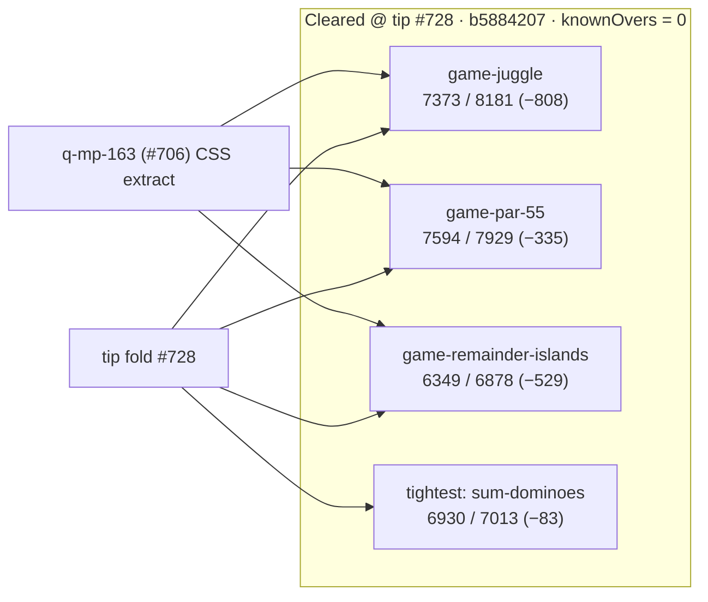

# Bundle size:check — NEW OVER history + post-#728 clearance (2026-10-09)

**Task id:** `q-mp-213` (post-#728 clearance addendum; prior `q-mp-200` / `q-mp-172`)  
**Tip measured (live):** `cursor/mp-tip-post728` @ `b5884207`  
**Measured on:** 2026-10-09 (UTC) · stamp `2026-10-09T18:53:41.288Z`  
**Scope:** Report-only documentation of gzip budget state after tip fold `#728` landed on `cursor/mp-tip-post728`. **No budget raise.** No `bundle-budgets.json` / allowlist edits.

## Outcome (live tip after #728)

`npm run build && npm run size:check` on tip `b5884207` reports **All 21 budgets within limit** (`knownOvers` still `[]`). `--fail-on-new-over` also exits **0**. Tip fold `#728` did not reintroduce the post-#700 NEW OVER rows; the three former OVER game chunks keep the same Vite hashes as the post-`q-mp-163` clearance.

Tightest residual headroom: **`game-sum-dominoes` −83 B**.

### Full green table (exact gzip bytes)

| Bundle | Dist chunk (hash) | Gzip (B) | Budget (B) | Delta (B) | Status |
| --- | --- | ---: | ---: | ---: | --- |
| `menu-critical-path` | (sum of index.html JS/CSS) | **25882** | 46822 | **−20940** | OK |
| `game-calla` | `game-calla--ayTldAF.js` | **6493** | 6967 | **−474** | OK |
| `game-contig-60` | `game-contig-60-BiHjc8w0.js` | **7156** | 7372 | **−216** | OK |
| `game-fab-a-diffy` | `game-fab-a-diffy-CVjbjx7P.js` | **8235** | 8411 | **−176** | OK |
| `game-fiar` | `game-fiar-DS2ffT4q.js` | **11178** | 12156 | **−978** | OK |
| `game-frac-fact` | `game-frac-fact-DqOaw7nu.js` | **5957** | 6350 | **−393** | OK |
| `game-fraction-pinball` | `game-fraction-pinball-Bh0Vt5A8.js` | **5749** | 6177 | **−428** | OK |
| `game-hex` | `game-hex-BeNFx5Sn.js` | **5764** | 6056 | **−292** | OK |
| `game-hex-a-gone` | `game-hex-a-gone-DCfwr_xm.js` | **6812** | 7387 | **−575** | OK |
| `game-juggle` | `game-juggle-ASjp2W6Q.js` | **7373** | 8181 | **−808** | OK |
| `game-kings-quadraphages` | `game-kings-quadraphages-BALb377S.js` | **7214** | 7903 | **−689** | OK |
| `game-kwatro-sinko` | `game-kwatro-sinko-D1bqCqFn.js` | **8197** | 8576 | **−379** | OK |
| `game-par-55` | `game-par-55-BD9zEfOk.js` | **7594** | 7929 | **−335** | OK |
| `game-pent-em-in` | `game-pent-em-in-BiYipm2K.js` | **6594** | 7284 | **−690** | OK |
| `game-prime-gold` | `game-prime-gold-CwJaqgTv.js` | **8023** | 8686 | **−663** | OK |
| `game-queens-guards` | `game-queens-guards-qO2BZPYu.js` | **8276** | 8628 | **−352** | OK |
| `game-ramrod` | `game-ramrod-BeLCYFPl.js` | **5495** | 7261 | **−1766** | OK |
| `game-remainder-islands` | `game-remainder-islands-CMK4zQXr.js` | **6349** | 6878 | **−529** | OK |
| `game-star-track` | `game-star-track-Ku5XV45t.js` | **5464** | 6035 | **−571** | OK |
| `game-stars-bars` | `game-stars-bars-DTYkuoXA.js` | **7091** | 7418 | **−327** | OK |
| `game-sum-dominoes` | `game-sum-dominoes-Ddv58ZlU.js` | **6930** | 7013 | **−83** | OK |

### Former NEW OVER trio (unchanged hashes vs post-#706 clearance)

| Bundle | Dist chunk (hash) | Gzip (B) | Budget (B) | Delta (B) | Status |
| --- | --- | ---: | ---: | ---: | --- |
| `game-juggle` | `game-juggle-ASjp2W6Q.js` | **7373** | 8181 | **−808** | OK |
| `game-par-55` | `game-par-55-BD9zEfOk.js` | **7594** | 7929 | **−335** | OK |
| `game-remainder-islands` | `game-remainder-islands-CMK4zQXr.js` | **6349** | 6878 | **−529** | OK |

## Snapshot timeline

| Snapshot | Tip SHA | `game-par-55` delta | Notes |
| --- | --- | ---: | --- |
| Prior (`q-mp-172`) | `66b683a5` | **+97 B** | Pre-#700 tip `cursor/mp-tip-post477` |
| Ticket evidence (`#700`) | `3320d897` | **+1.18 kB** | Three NEW OVER ids; allowlist 0 |
| `q-mp-200` refresh | `cdd2f8b1` | **+1.18 kB** (+1213 B) | Pre-trim tip after `#709` |
| Tip fold + `q-mp-163` | `1322606b` | **−335 B** | Cleared via CSS extract fold on `cursor/mp-tip-post709` |
| **`q-mp-213` post-#728** | **`b5884207`** | **−335 B** | Live tip `cursor/mp-tip-post728`; all 21 OK; allowlist 0 |

## Why this file still exists

`q-mp-200` / #721 refreshed the pre-trim NEW OVER table at `cdd2f8b1` so tip history retains the loud deltas that motivated the CSS extract. Tip-owner fold of `#706` / `q-mp-163` cleared those rows; tip `#728` kept them clear. This `q-mp-213` addendum stamps the live post-#728 SHA and the full 21-budget green table. Pre-trim numbers stay below as archives. Open draft #721 remains historical (do not close from worker). Trim ticket `q-mp-163` is effectively obsolete on tip after clearance — tip owner may mark `#706` / related drafts `contained` when convenient.

## Open-PR narrow (post728)

| Open draft | Overlap | Action |
| --- | --- | --- |
| #721 `q-mp-200` bundle-over remeasure (base `cursor/mp-tip-post709`) | Same doc path; pre-trim / pre-#728 tip | **historical** — leave open; this addendum is the live post-#728 clearance |
| #692 `q-mp-172` bundle-over table + Mermaid | Same doc path; stale tip/`+97 B` par-55 | **contained** |
| #706 `q-mp-163` trim three NEW OVER chunks | Implementation trim | **contained** in tip after fold (clearance holds on `#728`) |
| #652 `q-mp-123` size:check allowlist ratchet | Classifier already on tip | Orthogonal |
| #636 `q-mp-110` ramrod gzip trim | Historical | Not this snapshot |
| Unfolded post728 drafts `#730`–`#735` | no-console / knip / testing-layers / void / coverage-map / backlog | Orthogonal — no `bundle-budgets.json` overlap |

## How measured

```bash
npm run build
npm run size:check
# Same classification CI uses (soft; continue-on-error on build job):
npm run size:check -- --fail-on-new-over
```

Checker: `scripts/check-bundle-budgets.mjs` against committed `bundle-budgets.json`. Policy: [`docs/bundle-budget.md`](../bundle-budget.md). Exact byte table above uses the same `zlib.gzipSync` path as the checker.

## Allowlist policy (live tip)

| Field | Value |
| --- | --- |
| `knownOvers` in `bundle-budgets.json` | **`[]` (0 ids)** |
| Default `npm run size:check` exit | **0** |
| `npm run size:check -- --fail-on-new-over` | **0** on tip after `#728` (no NEW OVER) |

Do **not** grow `knownOvers` or raise budgets. Allowlist only shrinks (ratchet down).

## Archive — NEW OVER exact byte table (pre-trim tip `cdd2f8b1`)

Live gzip bytes from `zlib.gzipSync` on `dist/assets/game-<id>-*.js` after `npm run build` at tip SHA `cdd2f8b1` (before #706 fold).

| Bundle | Dist chunk (hash) | Gzip (B) | Budget (B) | Delta (B) | Status |
| --- | --- | ---: | ---: | ---: | --- |
| `game-juggle` | `game-juggle-D18nh0NU.js` | **8835** | 8181 | **+654** | NEW OVER |
| `game-par-55` | `game-par-55-DXoPBqyy.js` | **9142** | 7929 | **+1213** | NEW OVER |
| `game-remainder-islands` | `game-remainder-islands-Bo90jove.js` | **7435** | 6878 | **+557** | NEW OVER |

### Growth vs prior `q-mp-172` snapshot (`66b683a5`)

| Bundle | Prior gzip (B) | Pre-trim gzip (B) | Δgzip (B) | Prior over budget | Pre-trim over budget |
| --- | ---: | ---: | ---: | ---: | ---: |
| `game-juggle` | 8785 | 8835 | +50 | +604 | **+654** |
| `game-par-55` | 8026 | 9142 | **+1116** | +97 | **+1213** (+1.18 kB) |
| `game-remainder-islands` | 7440 | 7435 | −5 | +562 | **+557** |

## Budget vs actual (Mermaid)




## Prior snapshot (`q-mp-172` @ `66b683a5`) — retained for delta

| Bundle | Dist chunk (hash) | Gzip (B) | Budget (B) | Delta (B) | Status |
| --- | --- | ---: | ---: | ---: | --- |
| `game-juggle` | `game-juggle-CMPqvnRE.js` | **8785** | 8181 | **+604** | NEW OVER |
| `game-par-55` | `game-par-55-BTWk-Tv7.js` | **8026** | 7929 | **+97** | NEW OVER |
| `game-remainder-islands` | `game-remainder-islands-CQWO68QW.js` | **7440** | 6878 | **+562** | NEW OVER |

## Pointers

- Local / CI usage and allowlist rules: [`docs/bundle-budget.md`](../bundle-budget.md)
- npm scripts: `npm run size:check` · `npm run size:check -- --fail-on-new-over`
- Soft step inside blocking `build`: [`docs/dev/ci-gates-mermaid-q-mp-073.md`](./ci-gates-mermaid-q-mp-073.md)
- Testing-layer index link: [`docs/dev/testing-layers-2026-10-09.md`](./testing-layers-2026-10-09.md)
- Trim that cleared NEW OVER: `q-mp-163` / #706 (contained in tip; clearance holds after `#728`)

## Verification (`q-mp-213`)

```bash
npm run build          # exit 0
npm run size:check     # exit 0; All 21 budgets within limit
npm run check:dev-docs # report-only; paths in this note should resolve
```
