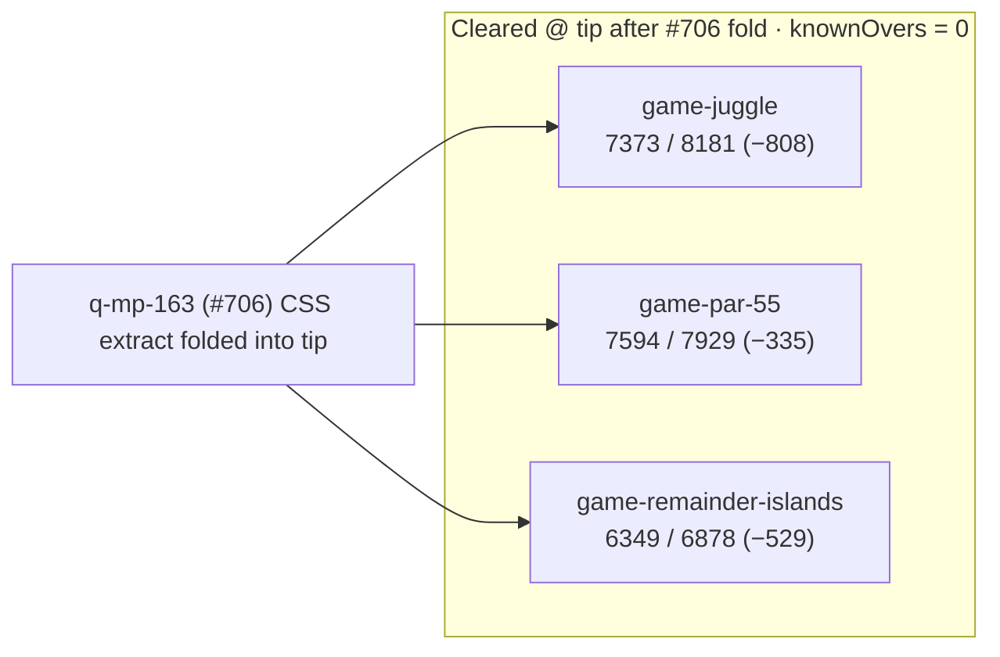

# Bundle size:check — NEW OVER snapshot (2026-10-09)

**Task id:** `q-mp-200` (addendum / refresh; prior authoring `q-mp-172`)  
**Tip measured (post-trim):** `cursor/mp-tip-post709` @ `1322606b`  
**Measured on:** 2026-10-09 (UTC)  
**Scope:** Report-only documentation of gzip NEW OVER history after tip fold batch 5 (`#700`), batch 6 (`#709`), and tip-owner fold of `q-mp-163` (#706 CSS extract). **No budget raise.** No `bundle-budgets.json` / allowlist edits.

## Outcome (live tip after #706 fold)

`npm run size:check` on tip after folding #706 reports **All 21 budgets within limit** (`knownOvers` still `[]`). The three former NEW OVER game chunks are under budget:

| Bundle | Dist chunk (hash) | Gzip (B) | Budget (B) | Delta (B) | Status |
| --- | --- | ---: | ---: | ---: | --- |
| `game-juggle` | `game-juggle-ASjp2W6Q.js` | **7373** | 8181 | **−808** | OK |
| `game-par-55` | `game-par-55-BD9zEfOk.js` | **7594** | 7929 | **−335** | OK |
| `game-remainder-islands` | `game-remainder-islands-CMK4zQXr.js` | **6349** | 6878 | **−529** | OK |

## Why this file still exists

`q-mp-200` / #721 refreshed the pre-trim NEW OVER table at `cdd2f8b1` so tip history retains the loud deltas that motivated the CSS extract. Tip-owner remeasure after folding #706 supersedes that live table with the cleared outcome above; pre-trim numbers stay below as archives.

| Snapshot | Tip SHA | `game-par-55` delta | Notes |
| --- | --- | ---: | --- |
| Prior (`q-mp-172`) | `66b683a5` | **+97 B** | Pre-#700 tip `cursor/mp-tip-post477` |
| Ticket evidence (`#700`) | `3320d897` | **+1.18 kB** | Three NEW OVER ids; allowlist 0 |
| `q-mp-200` refresh | `cdd2f8b1` | **+1.18 kB** (+1213 B) | Pre-trim tip after `#709` |
| Tip fold + `q-mp-163` | `1322606b` | **−335 B** | Cleared via CSS extract fold |

## Open-PR narrow

| Open draft | Overlap | Action |
| --- | --- | --- |
| #692 `q-mp-172` bundle-over table + Mermaid | Same doc path; stale tip/`+97 B` par-55 | **contained** |
| #706 `q-mp-163` trim three NEW OVER chunks | Implementation trim | **contained** in tip after fold |
| #652 `q-mp-123` size:check allowlist ratchet | Classifier already on tip | Orthogonal |
| #636 `q-mp-110` ramrod gzip trim | Historical | Not this snapshot |

## How measured

```bash
npm run build
npm run size:check
# Same classification CI uses (soft; continue-on-error on build job):
npm run size:check -- --fail-on-new-over
```

Checker: `scripts/check-bundle-budgets.mjs` against committed `bundle-budgets.json`. Policy: [`docs/bundle-budget.md`](../bundle-budget.md).

## Allowlist policy (live tip)

| Field | Value |
| --- | --- |
| `knownOvers` in `bundle-budgets.json` | **`[]` (0 ids)** |
| Default `npm run size:check` exit | **0** |
| `npm run size:check -- --fail-on-new-over` | **0** on tip after #706 fold (no NEW OVER) |

Do **not** grow `knownOvers` or raise budgets. Allowlist only shrinks (ratchet down).

## Archive — NEW OVER exact byte table (pre-trim tip `cdd2f8b1`)

Live gzip bytes from `zlib.gzipSync` on `dist/assets/game-<id>-*.js` after `npm run build` at tip SHA `cdd2f8b1` (before #706 fold).

| Bundle | Dist chunk (hash) | Gzip (B) | Budget (B) | Delta (B) | Status |
| --- | --- | ---: | ---: | ---: | --- |
| `game-juggle` | `game-juggle-D18nh0NU.js` | **8835** | 8181 | **+654** | NEW OVER |
| `game-par-55` | `game-par-55-DXoPBqyy.js` | **9142** | 7929 | **+1213** | NEW OVER |
| `game-remainder-islands` | `game-remainder-islands-Bo90jove.js` | **7435** | 6878 | **+557** | NEW OVER |

### Growth vs prior `q-mp-172` snapshot (`66b683a5`)

| Bundle | Prior gzip (B) | Pre-trim gzip (B) | Δgzip (B) | Prior over budget | Pre-trim over budget |
| --- | ---: | ---: | ---: | ---: | ---: |
| `game-juggle` | 8785 | 8835 | +50 | +604 | **+654** |
| `game-par-55` | 8026 | 9142 | **+1116** | +97 | **+1213** (+1.18 kB) |
| `game-remainder-islands` | 7440 | 7435 | −5 | +562 | **+557** |

## Budget vs actual (Mermaid) — pre-trim archive




## Prior snapshot (`q-mp-172` @ `66b683a5`) — retained for delta

| Bundle | Dist chunk (hash) | Gzip (B) | Budget (B) | Delta (B) | Status |
| --- | --- | ---: | ---: | ---: | --- |
| `game-juggle` | `game-juggle-CMPqvnRE.js` | **8785** | 8181 | **+604** | NEW OVER |
| `game-par-55` | `game-par-55-BTWk-Tv7.js` | **8026** | 7929 | **+97** | NEW OVER |
| `game-remainder-islands` | `game-remainder-islands-CQWO68QW.js` | **7440** | 6878 | **+562** | NEW OVER |

## Pointers

- Local / CI usage and allowlist rules: [`docs/bundle-budget.md`](../bundle-budget.md)
- npm scripts: `npm run size:check` · `npm run size:check -- --fail-on-new-over`
- Soft step inside blocking `build`: [`docs/dev/ci-gates-mermaid-q-mp-073.md`](./ci-gates-mermaid-q-mp-073.md)
- Testing-layer index link: [`docs/dev/testing-layers-2026-10-09.md`](./testing-layers-2026-10-09.md)
- Trim that cleared NEW OVER: `q-mp-163` / #706 (contained in tip)

## Verification (tip owner)

```bash
npm run build          # exit 0
npm run size:check     # exit 0; All 21 budgets within limit
npm run check:dev-docs # report-only; paths in this note should resolve
```
