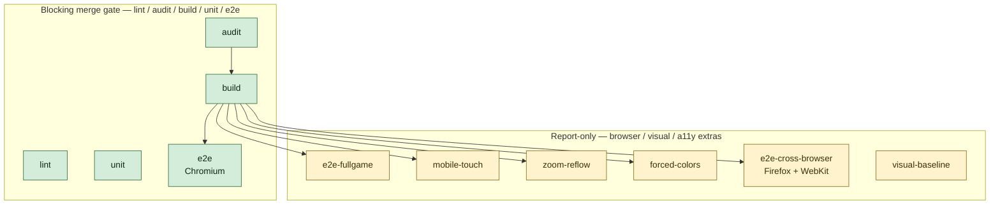

# q-mp-073 — CI gates Mermaid map (docs only)

**Task id:** `q-mp-073`  
**Depends on:** `q-mp-056` / [#593](https://github.com/fuzzywigg/math-pentathlon/pull/593) (required-checks recommendation)  
**Workflow (live tree):** `.github/workflows/ci.yml` (`name: CI`)  
**Tip context at authoring:** `cursor/integration-fold-wave5-tip-4af0`  
**Scope:** Documentation only — no workflow edits, no branch-protection changes.

## Alignment with q-mp-056 (#593)

| Set | Jobs | Role |
| --- | --- | --- |
| **Merge gate (recommended required)** | `lint`, `audit`, `build`, `unit`, `e2e` | Blocking today; #593 recommends these as alpha required checks |
| **Report-only** | `e2e-fullgame`, `mobile-touch`, `zoom-reflow`, `forced-colors`, `e2e-cross-browser`, `visual-baseline` | `continue-on-error: true`; do **not** require for merge |

Owner still decides whether/when to enable protection on `alpha`. This doc only maps the live job graph and local repro commands.

## Job graph (matches `ci.yml`)

Notes from the live workflow:

- `lint` and `unit` have **no** `needs:` — they run in parallel with `audit`.
- `build` `needs: audit`. All browser jobs except `visual-baseline` `needs: build`.
- `visual-baseline` has **no** `needs:` (runs in parallel with lint/audit/unit).
- Inside **blocking** `build`, two steps are soft: `size:check` and `check:pwa-manifest` (`continue-on-error: true`). The job still fails on `npm run build`, missing `dist/`, or JS chunks over **250 kB**.

## Per-job: what it catches + local reproduce

Commands match the npm scripts / invocations in `.github/workflows/ci.yml` (plus `npm ci` / Playwright browser install, omitted locally if already set up).

### Blocking (`lint` / `audit` / `build` / `unit` / `e2e`)

| Job | Catches | Local reproduce |
| --- | --- | --- |
| `lint` | ESLint on `src`; curly `all` ratchet ceiling; Prettier drift; `tsc --noEmit`; type-ratchet Phase-2 ceiling; module-boundary import graph (`engine_imports_ui` must stay 0) | `npm run lint` · `npm run lint:ratchet` · `npm run format:check` · `npm run typecheck` · `npm run typecheck:ratchet` · `npm run check:boundaries` |
| `audit` | High+ npm advisory holes in the lockfile | `npm audit --audit-level=high` |
| `build` | Production compile (`tsc && vite build`); `dist/` + `dist/health.txt`; hard **250 kB** per JS chunk under `dist/assets`; (soft) gzip budgets + PWA manifest contract | `npm run build` then confirm `dist/` + `dist/health.txt`; soft: `npm run size:check` · `npm run check:pwa-manifest` |
| `unit` | Vitest unit suite under `tests/unit` (excl. `_tokenmaxx_archive`) — rules/state/shell regressions | `npm run test:unit` |
| `e2e` | Playwright **Chromium** smoke, bug-guards, mp3d; `@fullgame` excluded | `npm run test:e2e:chromium` |

### Report-only (browser / visual / a11y)

| Job | Catches | Local reproduce |
| --- | --- | --- |
| `e2e-fullgame` | One complete HvH match per game (Chromium); long-tail timeouts | `npm run test:e2e:fullgame` |
| `mobile-touch` | Phone + tablet Chromium device profiles (iPhone 13 / Pixel 7 / iPad) touch smoke | `npm run test:e2e:mobile` |
| `zoom-reflow` | WCAG 1.4.4 / 1.4.10 zoom + 320 CSS px reflow | `npm run test:e2e:zoom-reflow` |
| `forced-colors` | Forced-colors + reduced-motion + color-scheme smoke | `npm run test:e2e:forced-colors` |
| `e2e-cross-browser` | Full e2e suite on **Firefox + WebKit** (excludes mobile/visual/zoom/forced/fullgame specs in the CI file count) | `npm run test:e2e -- --project=firefox --project=webkit` (equiv. `npm run test:e2e:firefox-webkit`) |
| `visual-baseline` | Start screen + each game opening screenshots @ desktop + phone | `npm run test:e2e:visual` |

## Soft-success caveat

Several report-only jobs set `continue-on-error: true` on the job **and** on the test step, then finish with `exit 0` after a warning. Job-level green ≠ suite clean. `e2e-cross-browser` is the exception: the job conclusion tracks real failures while the workflow stays green via job-level `continue-on-error`.

## Related

- q-mp-056 recommendation (pass rates / required set): PR [#593](https://github.com/fuzzywigg/math-pentathlon/pull/593) → `docs/dev/alpha-required-checks-q-mp-056.md` once folded
- Public CI posture summary: [`docs/wiki/development.md`](../wiki/development.md#ci-posture-public)
- Workflow contract unit tests: `tests/unit/workflow-contract.test.ts` and `*-ci-report-only.test.ts`
