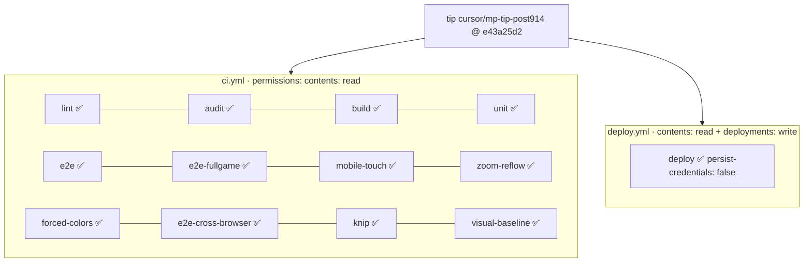
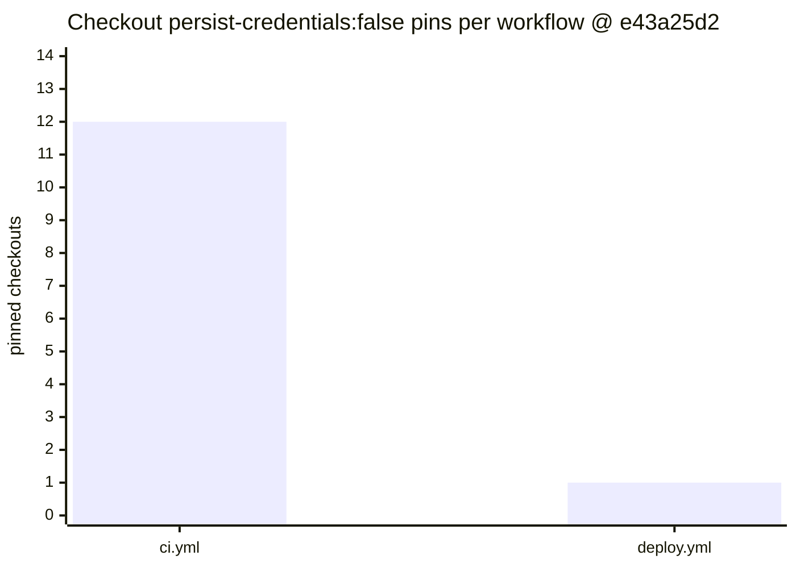

# q-mp-489 — CI permissions / persist-credentials pin re-audit (tip post914)

**Task id:** `q-mp-489`  
**Role:** worker (report-only docs + data; **no** workflow edits)  
**Tip measured (live):** `cursor/mp-tip-post914` @ `e43a25d2`  
**Measured on:** 2026-10-10 (UTC) · stamp `2026-10-10T09:51:47Z`  
**Verdict:** **PASS** — least-privilege pins still hold; do not widen.

Machine-readable twin: [`ci-permissions-persist-credentials-pin-audit-q-mp-489.json`](./ci-permissions-persist-credentials-pin-audit-q-mp-489.json).  
Visual: [`ci-permissions-persist-credentials-pin-audit-q-mp-489.svg`](./ci-permissions-persist-credentials-pin-audit-q-mp-489.svg).

Leaves open prior audits **contained** (documented here only; no PR comments per worker constraints):

- [#924](https://github.com/fuzzywigg/math-pentathlon/pull/924) `q-mp-439` — tip stamp `9b19c5e8` / base `cursor/mp-tip-post898`; audit doc + JSON + SVG already on tip via folds. Leave open; this sibling is the post914 remeasure.
- [#903](https://github.com/fuzzywigg/math-pentathlon/pull/903) `q-mp-414` — tip stamp `7f8a7147` / base `cursor/mp-tip-post865`; audit doc + JSON already on tip. Leave open.
- [#853](https://github.com/fuzzywigg/math-pentathlon/pull/853) `q-mp-363` — tip stamp `97487de6` / base `cursor/mp-tip-post830`; audit doc + JSON already on tip. Leave open.
- [#783](https://github.com/fuzzywigg/math-pentathlon/pull/783) `q-mp-279` — tip stamp `74a1596f` / base `cursor/mp-tip-post755`; audit doc + unit pin already on tip. Leave open.

## Spec drift (post898 → post914)

| Claim (backlog `q-mp-489` @ 10g)                                                                                  | Live post914 @ `e43a25d2`                                                                                 |
| ----------------------------------------------------------------------------------------------------------------- | --------------------------------------------------------------------------------------------------------- |
| Tip post914 (cut from alpha `753052a6` after tip `#914`)                                                          | Tip SHA **`e43a25d2`** (`docs(q-mp-026n): point wiki development tip pointer at post914`)                 |
| “Live `.github/workflows/ci.yml` has `permissions: contents: read` and `persist-credentials: false` on every checkout; `check:workflows` OK” | **Confirmed:** `ci.yml` **12** + `deploy.yml` **1** (same as `q-mp-439` / `q-mp-414` / `q-mp-363` / `q-mp-279`) |
| Tip already carries post898 `q-mp-439` audit — re-stamp for post914 SHA                                           | Prior tip sibling `q-mp-439` @ post898 `9b19c5e8` present under `docs/dev/…-q-mp-439.{md,json,svg}`       |
| Suggested basename `ci-permissions-pin-audit-post914-2026-10-10`                                                  | Series filename kept as `…-pin-audit-q-mp-489.{md,json,svg}` for discoverability beside prior audits     |
| Unit-file context                                                                                                 | Live `find tests/unit -name '*.ts' \| wc -l` → **3260** (context only; not a workflow pin)                |

No workflow permission / apt / network-in-tests changes in this task.

## Hard-rule checklist

| Pin                                    | Required                                | Live @ `e43a25d2`                                | Status |
| -------------------------------------- | --------------------------------------- | ------------------------------------------------ | ------ |
| Workflow `permissions.contents`        | `read`                                  | `ci.yml:16`, `deploy.yml:12`                     | PASS   |
| Every `actions/checkout`               | `persist-credentials: false`            | 12× `ci.yml` + 1× `deploy.yml`                   | PASS   |
| Extra write scopes on CI               | none                                    | `ci.yml` permissions = `{ contents: read }` only | PASS   |
| Deploy extra write                     | `deployments: write` only (allowlisted) | `deploy.yml:13`                                  | PASS   |
| `persist-credentials: true`            | absent                                  | none in `.github/workflows/`                     | PASS   |
| apt in CI                              | forbidden                               | no `apt` / `apt-get` hits in workflows           | PASS   |
| Permission widening / network-in-tests | forbidden                               | workflows untouched by this PR                   | PASS   |

Enforced by `npm run check:workflows` (`scripts/check-workflows.mjs`) and unit pins in `tests/unit/workflow-contract.test.ts` + `tests/unit/ci-permissions-persist-credentials-pin.test.ts` (unchanged by this PR).

## Summary table

| Workflow     | `permissions`                                                  | Checkout count | `persist-credentials: false` |
| ------------ | -------------------------------------------------------------- | -------------: | ---------------------------: |
| `ci.yml`     | `contents: read` only (`:15–16`)                               |         **12** |                       **12** |
| `deploy.yml` | `contents: read` + allowlisted `deployments: write` (`:11–13`) |          **1** |                        **1** |

## `ci.yml` pin sites (`e43a25d2`)

Top-level permissions:

```text
15:permissions:
16:  contents: read
```

Twelve jobs, each with `actions/checkout` + `persist-credentials: false`:

| Job                 | Checkout line | `persist-credentials: false` | Pin |
| ------------------- | ------------: | ---------------------------: | --- |
| `lint`              |            28 |                           30 | ✅  |
| `audit`             |            51 |                           53 | ✅  |
| `build`             |            68 |                           70 | ✅  |
| `unit`              |           117 |                          119 | ✅  |
| `e2e`               |           140 |                          142 | ✅  |
| `e2e-fullgame`      |           185 |                          187 | ✅  |
| `mobile-touch`      |           238 |                          240 | ✅  |
| `zoom-reflow`       |           290 |                          292 | ✅  |
| `forced-colors`     |           343 |                          345 | ✅  |
| `e2e-cross-browser` |           396 |                          398 | ✅  |
| `knip`              |           442 |                          444 | ✅  |
| `visual-baseline`   |           471 |                          473 | ✅  |

**Count:** 12 checkouts ↔ 12 `persist-credentials: false`. No `persist-credentials: true`. No `contents: write` in the permissions block (comments may mention the forbidden scope).

## `deploy.yml` pin sites

```text
11:permissions:
12:  contents: read
13:  deployments: write
…
24:      - uses: actions/checkout@…
26:          persist-credentials: false
```

`deployments: write` is the only allowlisted extra scope in `scripts/check-workflows.mjs` (`EXTRA_WRITE_ALLOWLIST`).

## Visual — pin coverage @ `e43a25d2`





Inline SVG twin: [`ci-permissions-persist-credentials-pin-audit-q-mp-489.svg`](./ci-permissions-persist-credentials-pin-audit-q-mp-489.svg).

## Open-PR narrow

| Open draft                                                               | Overlap                                                                                         | Action                                                         |
| ------------------------------------------------------------------------ | ----------------------------------------------------------------------------------------------- | -------------------------------------------------------------- |
| [#924](https://github.com/fuzzywigg/math-pentathlon/pull/924) `q-mp-439` | Same series; stamps post898 `9b19c5e8`; tip already carries its doc + JSON + SVG                | **contained** — leave open (no comment per worker constraints) |
| [#903](https://github.com/fuzzywigg/math-pentathlon/pull/903) `q-mp-414` | Same series; stamps post865 `7f8a7147`; tip already carries its doc + JSON                      | **contained** — leave open                                     |
| [#853](https://github.com/fuzzywigg/math-pentathlon/pull/853) `q-mp-363` | Same series; stamps post830 `97487de6`; tip already carries its doc + JSON                      | **contained** — leave open                                     |
| [#783](https://github.com/fuzzywigg/math-pentathlon/pull/783) `q-mp-279` | Same series; stamps older tip `74a1596f` / base post755; tip already carries its doc + unit pin | **contained** — leave open                                     |
| Open tip drafts `#939`–`#957` into post914                               | No other open draft owns `q-mp-489` / post914 CI permissions re-audit                           | This draft is the live remeasure                               |
| Tip fold [#949](https://github.com/fuzzywigg/math-pentathlon/pull/949)   | Tip owner folds `#929`–`#957`; head may move                                                    | Remeasured on live tip SHA before opening this PR              |

## Remeasure commands (before = tip HEAD; after = this sibling only)

```bash
git rev-parse HEAD
# e43a25d22b081819664bc631e4fe34f793847004

rg -n 'permissions:|persist-credentials|contents:' .github/workflows/ci.yml
rg -n 'permissions:|persist-credentials|contents:|deployments:' .github/workflows/deploy.yml
npm run check:workflows
npm run check:dev-docs
npx vitest run --project unit-shared tests/unit/ci-permissions-persist-credentials-pin.test.ts
npm run verify
npm run test:unit
```

### Before metrics (tip `e43a25d2`, workflows unchanged)

| Metric                                | Value                                   |
| ------------------------------------- | --------------------------------------- |
| `ci.yml` `permissions.contents`       | `read`                                  |
| `ci.yml` checkout / persist-false     | **12 / 12**                             |
| `deploy.yml` permissions              | `contents: read` + `deployments: write` |
| `deploy.yml` checkout / persist-false | **1 / 1**                               |
| `check:workflows`                     | OK — 2 file(s)                          |
| `check:dev-docs`                      | docs scanned **229**; problems **0**    |
| Unit files (`tests/unit/**/*.ts`)     | **3260**                                |

### After metrics (docs/data only)

Same workflow pin counts (files under `.github/workflows/` untouched). `check:dev-docs` gains this sibling (+ JSON + SVG).

## Non-goals

- No edits to workflow job steps, triggers, caches, or permissions.
- No permission widening (`contents: write`, `pull-requests`, etc.).
- No apt in CI; no network-in-tests enablement.
- No AI / rules / scoring / copy / ratchet / knip / `src/` / test-behavior changes.
- No ratchet JSON.
- No comments / labels / closes on other PRs.
