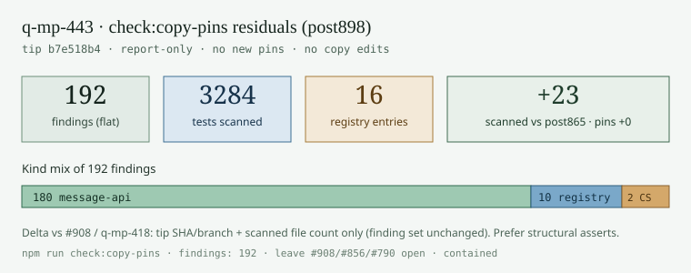
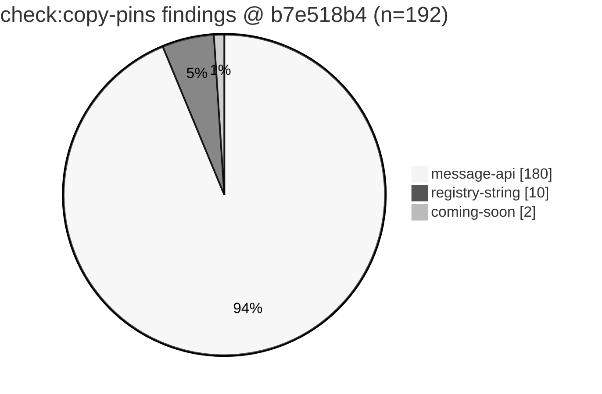
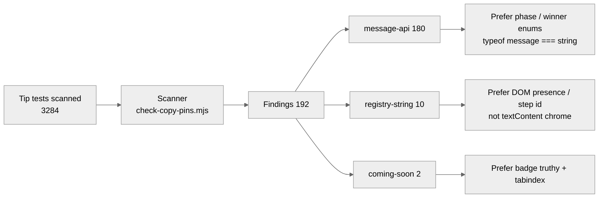

# check:copy-pins residual inventory — tip post898

**Task id:** `q-mp-443` (P3, report-only refresh)  
**Tip base:** `cursor/mp-tip-post898` @ `b7e518b4` (`b7e518b4afe04556fa7e87ecba7ce97229b05bc7`)  
**Measured at:** `2026-10-10T08:32:07Z` (UTC)  
**Prior inventory:** [`docs/dev/copy-pins-residual-inventory-post865-2026-10-10.md`](./copy-pins-residual-inventory-post865-2026-10-10.md) (`q-mp-418` / tip post865 @ `7f8a7147`, **192** findings)  
**Machine summary:** [`copy-pins-residual-inventory-post898-2026-10-10.json`](./copy-pins-residual-inventory-post898-2026-10-10.json)  
**Visual:** [`copy-pins-residual-inventory-post898-2026-10-10.svg`](./copy-pins-residual-inventory-post898-2026-10-10.svg)  
**Deliverable:** docs/data/chart only — **no new pins**, no player-facing copy edits, no test changes.

## Acceptance (from backlog q-mp-443)

- [x] Re-run `npm run check:copy-pins` on live tip post898 (remeasure; backlog stamped findings **192** / post865 inventory)
- [x] Dated residual inventory under `docs/dev/` (`…-post898-2026-10-10.md` + `.json` + `.svg`; file / line / kind + visual)
- [x] Tip SHA recorded; no new pins; no player-facing copy / product edits
- [x] Leave open `#908` / `#856` / `#790` with **contained** (do not close; no comment per worker brief)
- [x] Verify: `npm run check:copy-pins` ; `npm run check:dev-docs`

## Duplicate check (open tip drafts)

| PR | Base | Title | Overlap |
| --- | --- | --- | --- |
| [#908](https://github.com/fuzzywigg/math-pentathlon/pull/908) | post865 | q-mp-418 residual inventory | **CONTAINED** — historical post865 stamp; refresh lives here. Left open (hard rule: do not close). |
| [#856](https://github.com/fuzzywigg/math-pentathlon/pull/856) | post830 | q-mp-362 residual inventory | **CONTAINED** — historical post830 stamp; still open. |
| [#790](https://github.com/fuzzywigg/math-pentathlon/pull/790) | post755 | q-mp-275 residual inventory | **CONTAINED** — historical post755 stamp; still open. |
| [#741](https://github.com/fuzzywigg/math-pentathlon/pull/741) | post728 | q-mp-232 residual inventory | **CONTAINED** — already contained by later tips; still historical |
| Open drafts into `cursor/mp-tip-post898` (#915–#921) | post898 | UI cov / a11y / backlog | None owns a post898 `check:copy-pins` residual inventory refresh |

No open draft into `cursor/mp-tip-post898` already owns this refresh → full task proceeds.

## Method

```text
npm run check:copy-pins -- --self-test   # review 7/8 positives + negatives
npm run check:copy-pins                  # report-only tip scan (exit 0)
node scripts/check-copy-pins.mjs --json  # machine-readable findings
npm run check:copy-pins -- --fail        # opt-in; exit 1 when findings > 0
npm run check:dev-docs                   # report-only path/link check
```

Scanner: [`scripts/check-copy-pins.mjs`](../../scripts/check-copy-pins.mjs) (policy in [`docs/dev/check-copy-pins.md`](./check-copy-pins.md)).  
CI: lint job runs `npm run check:copy-pins -- --fail` with `continue-on-error: true` (surfaces findings; does not fail blocking lint).

## Live tip snapshot (post898 vs post865)

| Metric | post865 (`q-mp-418`) | **post898 (this refresh)** | Δ |
| --- | ---: | ---: | ---: |
| Tip SHA | `7f8a7147` | `b7e518b4` | tip advanced (post865 → post898 cut + folds; tip head `b7e518b4`) |
| Tests scanned | 3261 | **3284** | **+23** |
| Copy-registry entries | 16 | **16** | 0 |
| Findings | 192 | **192** | **0 (flat)** |
| Test files with ≥1 finding | 62 | **62** | 0 |
| `message-api` | 180 | **180** | 0 |
| `registry-string` | 10 | **10** | 0 |
| `coming-soon` | 2 | **2** | 0 |
| Default exit | 0 | 0 | — |
| `--fail` exit | 1 | 1 | — |
| `--self-test` | PASS (8/8) | PASS (8/8) | — |

**Verdict:** Residual pin count is **flat at 192** through tip folds post755 → post785 → post830 → post865 → post898. New scanned test files landed (+23 vs post865 inventory) without adding copy pins. Kind mix and top-file ranking unchanged. `engine-coverage-round-burn-1008.test.ts` still 9 hits at lines 311, 313, 317, 324, 330, 336, 461, 847, 853 (same as post865 / post830 / post755).

Spec note: backlog `q-mp-443` cited live findings **192** and tip inventories stamped post865/post830; re-measured here on live `cursor/mp-tip-post898` @ `b7e518b4`.

## Visual — residual shape







### Kind bar (ASCII)

```text
message-api      ████████████████████████████████████ 180
registry-string  ██ 10
coming-soon      █ 2
```

## Kind breakdown

| Kind | Count | Meaning |
| --- | ---: | --- |
| `message-api` | 180 | `expect(...getPhaseMessage / getCurrentPhaseMessage / alias...)` with `toBe` / `toEqual` / `toMatch` / `toContain` |
| `registry-string` | 10 | Matcher arg pins a harvested return-literal phrase from `getPhaseMessage` / `getCurrentPhaseMessage` bodies |
| `coming-soon` | 2 | Matcher arg pins literal `"Coming Soon"` / `/Coming Soon/` |

## Copy registry — which player-facing strings are harvested

Harvested from `return` string/template literals inside `export function getPhaseMessage` / `getCurrentPhaseMessage` under `src/games/*/rules.ts` + `game-state.ts`, plus menu badge `"Coming Soon"` from `src/ui/game-selector.ts` (length / distinctiveness filters apply — see script). Registry size unchanged at **16**.

| Registry value | Source | `registry-string` / `coming-soon` hits | Residual note |
| --- | --- | ---: | --- |
| "Coming Soon" | `src/ui/game-selector.ts` | 2 | Flagged only as `coming-soon` (2 hits). |
| "'s turn - Select a shield to distribute" | `src/games/calla/rules.ts` | 0 | Related `message-api` regexes pin `/Select a shield/` etc. |
| "is distributing cubes..." | `src/games/calla/rules.ts` | 2 | `registry-string` + `message-api` exact/toContain pins. |
| "It's a tie!" | `src/games/calla/rules.ts` | 2 | `registry-string` on status banners; related win/tie `message-api` pins elsewhere. |
| "'s turn - Select 1-3 blocks from the bank" | `src/games/hex-a-gone/rules.ts` | 0 | Heavy `message-api` `/Select 1-3/` coverage. |
| "block(s) selected. Select more or confirm." | `src/games/hex-a-gone/rules.ts` | 0 | `message-api` pins `/1 block/`, `/2 block/`. |
| ": Place your blocks (" | `src/games/hex-a-gone/rules.ts` | 0 | `message-api` `/Place your blocks/`. |
| "remaining)" | `src/games/hex-a-gone/rules.ts` | 0 | `message-api` `/2 remaining/` etc. |
| ": Click a green square to move" | `src/games/kings-quadraphages/game-state.ts` | 0 | Review-8-style `/green square/` still via `message-api`. |
| ": Click your King to select it" | `src/games/kings-quadraphages/game-state.ts` | 1 | `registry-string` on `.status-turn` textContent. |
| ": Place a Quadraphage" | `src/games/kings-quadraphages/game-state.ts` | 3 | Direct fragment + tutorial title/message soft matches (`Place a Quadraphage` needle). |
| "Game Over! Tie!" | `src/games/kings-quadraphages/game-state.ts` | 1 | `registry-string` + `message-api` exact `toBe`. |
| "Game Over!" | `src/games/kings-quadraphages/game-state.ts` | 0 | Substring of longer game-over pins; many `message-api` `/wins\|Tie/`. |
| "'s turn - Draw chains from the bucket" | `src/games/star-track/rules.ts` | 0 | `message-api` `/Draw chains/`. |
| ": Choose a chain to move" | `src/games/star-track/rules.ts` | 1 | Soft needle `"Choose a chain"` on choice-label textContent; `message-api` `/Choose a chain/`. |
| "It's a draw! All chains exhausted." | `src/games/star-track/rules.ts` | 0 | `message-api` `/draw/` / Blue-win pins. |

### Reading the registry table

- **Direct pin** = non-zero `registry-string` / `coming-soon` column: tests lock that exact phrase (or Coming Soon) in a matcher argument.
- **Indirect pin** = zero in that column but a non-empty residual note about `message-api`: phase-message APIs are still sniffed with regex/substring that freeze the same chrome when copy changes.
- Soft needles (`Place a Quadraphage`, `Choose a chain`, …) are fragments harvested from longer registry values — the scanner reports the needle in `detail` while counting against the parent entry.
- Clearing either bucket is **optional tip-owner cleanup**. New drafts must not add pins (prefer structural asserts).

## Residual families (where the 192 live)

| Family | Approx. findings | Prefer (structural) | Avoid |
| --- | ---: | ---: | --- |
| `burn-wave*` phase / format / progress matrices | ~138 | `state.phase` / `turnPhase` enums; `typeof getPhaseMessage(s) === 'string'`; length &gt; 0 | `toMatch(/Select 1-3/)`, `toBe('Blue wins!')` |
| Core rules / game-state unit tests (`calla-rules`, `hex-a-gone-rules`, `star-track-rules`, `kings-quadraphages-*`, `game-state.test`) | ~19 | Winner / phase / legal-move / score fields | Exact status chrome strings |
| `overnight-*` / `overnight-wave*` (incl. tutorial titles, status banners) | ~21 | DOM presence / class / tutorial step **id**; engine phase after action | `.textContent).toBe("It's a tie!")`, tutorial title copy |
| `engine-coverage*` (burn-1008 rounds) | ~14 | Targeted engine transitions already covered elsewhere | Empty-string `getPhaseMessage` pins; status regex matrices |
| Menu selector / Coming Soon | 2 | `expect(badge).toBeTruthy()`; `tabindex="-1"` on disabled cards | `textContent).toBe('Coming Soon')` |

### Recommended migration order (noisiest first — tip-owner optional)

1. **Hex-a-gone phase-message matrices** (`burn-wave41/47-hex-a-gone-phase-messages`, `burn-wave42-hexagone-phase-message-deepen`) — replace `toContain('Select 1-3…')` / win `toBe` with `phase` / `winner` / `selectedBlocks.length`.
2. **Star-track phase matrices** (`burn-wave41-star-progress-phase-over`, `burn-wave43/44-star-*`) — pin `phase` enum + `winner`; keep `typeof getPhaseMessage === 'string'` if needed.
3. **Calla distributing-cubes / tie banners** (overnight-wave56–58 registry-string + message-api) — assert `.status-turn` presence / `phase === 'animating'` / `winner === 'tie'`.
4. **Kings tutorial titles / Place a Quadraphage** (overnight-wave56/63/67 + game-state exacts) — assert tutorial step **id** / `turnPhase`, not title/message HTML.
5. **Coming Soon badge** (2 hits) — badge truthy + disabled `tabindex`.

### Hard-rule reminder

Do **not** “fix” these findings by editing player-facing copy or `*/rules.ts` message bodies. Do **not** add new pins. Optional cleanup = rewrite asserts to structure/engine state only.

## Top files by finding count

| Count | File |
| ---: | --- |
| 9 | `tests/unit/burn-wave41-hex-a-gone-phase-messages.test.ts` |
| 9 | `tests/unit/burn-wave47-hex-a-gone-phase-messages.test.ts` |
| 9 | `tests/unit/engine-coverage-round-burn-1008.test.ts` |
| 7 | `tests/unit/burn-wave14-phase-format.test.ts` |
| 7 | `tests/unit/burn-wave15-phase-format.test.ts` |
| 7 | `tests/unit/burn-wave41-star-progress-phase-over.test.ts` |
| 7 | `tests/unit/burn-wave42-hexagone-phase-message-deepen.test.ts` |
| 6 | `tests/unit/game-state.test.ts` |
| 5 | `tests/unit/burn-wave41-handshake-kings-phase-timer.test.ts` |
| 5 | `tests/unit/burn-wave43-star-phase-message-matrix.test.ts` |
| 5 | `tests/unit/burn-wave44-star-track-phase-message-matrix.test.ts` |
| 4 | `tests/unit/burn-wave14-state-phase.test.ts` |
| 4 | `tests/unit/burn-wave41-calla-gameover-phase-msg.test.ts` |
| 4 | `tests/unit/burn-wave42-kings-phase-message-matrix.test.ts` |
| 4 | `tests/unit/burn-wave43-calla-gameover-tie-win.test.ts` |
| 4 | `tests/unit/burn-wave43-hexagone-place-pass-win.test.ts` |
| 4 | `tests/unit/calla-rules.test.ts` |
| 4 | `tests/unit/kings-quadraphages-supply-exhaustion.test.ts` |
| 4 | `tests/unit/overnight-calla-phase-message-matrix.test.ts` |
| 3 | `tests/unit/burn-wave10-win-draw-ai.test.ts` |

## Full finding inventory (file / line / kind)

Live tip scan @ `b7e518b4`. Snippets truncated for readability.

| File | Line | Kind | Detail | Snippet |
| --- | ---: | --- | --- | --- |
| `tests/unit/burn-wave10-secondary-ui.test.ts` | 168 | `message-api` | assert pins hagPhaseMsg() return text | `expect(container.textContent).toContain(hagPhaseMsg(fresh).slice(0, 8));` |
| `tests/unit/burn-wave10-secondary-ui.test.ts` | 182 | `message-api` | assert pins starPhaseMsg() return text | `expect(container.textContent).toMatch(` |
| `tests/unit/burn-wave10-win-draw-ai.test.ts` | 400 | `message-api` | assert pins hagPhaseMsg() return text | `expect(hagPhaseMsg(fresh)).toMatch(/Select/i);` |
| `tests/unit/burn-wave10-win-draw-ai.test.ts` | 515 | `message-api` | assert pins starPhaseMsg() return text | `expect(starPhaseMsg(over)).toMatch(/wins\|Blue/i);` |
| `tests/unit/burn-wave10-win-draw-ai.test.ts` | 713 | `message-api` | assert pins callaPhaseMsg() return text | `expect(callaPhaseMsg(state)).toMatch(/Blue\|select/i);` |
| `tests/unit/burn-wave14-phase-format.test.ts` | 100 | `message-api` | assert pins hagMsg() return text | `expect(hagMsg(fresh)).toMatch(/Select 1-3/);` |
| `tests/unit/burn-wave14-phase-format.test.ts` | 102 | `message-api` | assert pins hagMsg() return text | `expect(hagMsg(one)).toMatch(/1 block/);` |
| `tests/unit/burn-wave14-phase-format.test.ts` | 104 | `message-api` | assert pins hagMsg() return text | `expect(hagMsg(two)).toMatch(/2 block/);` |
| `tests/unit/burn-wave14-phase-format.test.ts` | 109 | `message-api` | assert pins callaMsg() return text | `expect(callaMsg(createCalla())).toMatch(/Select a shield/);` |
| `tests/unit/burn-wave14-phase-format.test.ts` | 129 | `message-api` | assert pins starMsg() return text | `expect(starMsg(fresh)).toMatch(/Draw chains/);` |
| `tests/unit/burn-wave14-phase-format.test.ts` | 131 | `message-api` | assert pins starMsg() return text | `expect(starMsg(state)).toMatch(/Choose a chain/);` |
| `tests/unit/burn-wave14-phase-format.test.ts` | 142 | `message-api` | assert pins starMsg() return text | `expect(starMsg(state)).toMatch(/wins\|draw/i);` |
| `tests/unit/burn-wave14-rules-phase.test.ts` | 220 | `message-api` | assert pins hagPhaseMsg() return text | `expect(hagPhaseMsg(state)).toMatch(/2 remaining/);` |
| `tests/unit/burn-wave14-rules-phase.test.ts` | 478 | `message-api` | assert pins callaPhaseMsg() return text | `expect(callaPhaseMsg({ ...createCalla(), phase: 'animating' })).toMatch(` |
| `tests/unit/burn-wave14-rules-phase.test.ts` | 493 | `message-api` | assert pins starPhaseMsg() return text | `expect(starPhaseMsg(selecting)).toMatch(/Choose a chain/);` |
| `tests/unit/burn-wave14-state-phase.test.ts` | 81 | `message-api` | assert pins getCurrentPhaseMessage() return text | `expect(getCurrentPhaseMessage(opening)).toContain('King');` |
| `tests/unit/burn-wave14-state-phase.test.ts` | 83 | `message-api` | assert pins getCurrentPhaseMessage() return text | `expect(getCurrentPhaseMessage(selected)).toContain('green');` |
| `tests/unit/burn-wave14-state-phase.test.ts` | 89 | `message-api` | assert pins getCurrentPhaseMessage() return text | `expect(getCurrentPhaseMessage(over)).toContain('Game Over');` |
| `tests/unit/burn-wave14-state-phase.test.ts` | 90 | `message-api` | assert pins getCurrentPhaseMessage() return text | `expect(getCurrentPhaseMessage(over)).toContain('Player 1');` |
| `tests/unit/burn-wave15-phase-format.test.ts` | 100 | `message-api` | assert pins hagMsg() return text | `expect(hagMsg(fresh)).toMatch(/Select 1-3/);` |
| `tests/unit/burn-wave15-phase-format.test.ts` | 102 | `message-api` | assert pins hagMsg() return text | `expect(hagMsg(one)).toMatch(/1 block/);` |
| `tests/unit/burn-wave15-phase-format.test.ts` | 104 | `message-api` | assert pins hagMsg() return text | `expect(hagMsg(two)).toMatch(/2 block/);` |
| `tests/unit/burn-wave15-phase-format.test.ts` | 109 | `message-api` | assert pins callaMsg() return text | `expect(callaMsg(createCalla())).toMatch(/Select a shield/);` |
| `tests/unit/burn-wave15-phase-format.test.ts` | 129 | `message-api` | assert pins starMsg() return text | `expect(starMsg(fresh)).toMatch(/Draw chains/);` |
| `tests/unit/burn-wave15-phase-format.test.ts` | 131 | `message-api` | assert pins starMsg() return text | `expect(starMsg(state)).toMatch(/Choose a chain/);` |
| `tests/unit/burn-wave15-phase-format.test.ts` | 142 | `message-api` | assert pins starMsg() return text | `expect(starMsg(state)).toMatch(/wins\|draw/i);` |
| `tests/unit/burn-wave15-rules-phase.test.ts` | 253 | `message-api` | assert pins hagPhaseMsg() return text | `expect(hagPhaseMsg(state)).toMatch(/2 remaining/);` |
| `tests/unit/burn-wave15-rules-phase.test.ts` | 511 | `message-api` | assert pins callaPhaseMsg() return text | `expect(callaPhaseMsg({ ...createCalla(), phase: 'animating' })).toMatch(` |
| `tests/unit/burn-wave15-rules-phase.test.ts` | 526 | `message-api` | assert pins starPhaseMsg() return text | `expect(starPhaseMsg(selecting)).toMatch(/Choose a chain/);` |
| `tests/unit/burn-wave24-stats-selector-ui.test.ts` | 289 | `coming-soon` | assert pins "Coming Soon" menu copy | `expect(card.querySelector('.game-card-badge')?.textContent).toBe(` |
| `tests/unit/burn-wave40-calla-makemove-reject-phase.test.ts` | 39 | `message-api` | assert pins getPhaseMessage() return text | `expect(getPhaseMessage(state)).toMatch(/Blue\|Select/i);` |
| `tests/unit/burn-wave40-calla-makemove-reject-phase.test.ts` | 53 | `message-api` | assert pins getPhaseMessage() return text | `expect(getPhaseMessage(tie)).toMatch(/tie/i);` |
| `tests/unit/burn-wave40-calla-makemove-reject-phase.test.ts` | 55 | `message-api` | assert pins getPhaseMessage() return text | `expect(getPhaseMessage(p2)).toMatch(/Red\|wins/i);` |
| `tests/unit/burn-wave40-hexagone-selectblock-reject-matrix.test.ts` | 53 | `message-api` | assert pins getPhaseMessage() return text | `expect(getPhaseMessage(committed)).toMatch(/Place\|remaining/i);` |
| `tests/unit/burn-wave40-star-bucket-lt2-settle.test.ts` | 22 | `message-api` | assert pins getPhaseMessage() return text | `expect(getPhaseMessage(next)).toMatch(/draw/i);` |
| `tests/unit/burn-wave41-calla-capture-gameover.test.ts` | 66 | `message-api` | assert pins getPhaseMessage() return text | `expect(getPhaseMessage(next)).toMatch(/Blue wins/);` |
| `tests/unit/burn-wave41-calla-capture-gameover.test.ts` | 80 | `message-api` | assert pins getPhaseMessage() return text | `expect(getPhaseMessage(next)).toMatch(/tie/i);` |
| `tests/unit/burn-wave41-calla-capture-gameover.test.ts` | 99 | `message-api` | assert pins getPhaseMessage() return text | `expect(getPhaseMessage(state)).toBe('Red wins!');` |
| `tests/unit/burn-wave41-calla-gameover-phase-msg.test.ts` | 38 | `message-api` | assert pins getPhaseMessage() return text | `expect(getPhaseMessage(createInitialState())).toMatch(/Blue.*Select/i);` |
| `tests/unit/burn-wave41-calla-gameover-phase-msg.test.ts` | 39 | `message-api` | assert pins getPhaseMessage() return text | `expect(` |
| `tests/unit/burn-wave41-calla-gameover-phase-msg.test.ts` | 45 | `message-api` | assert pins getPhaseMessage() return text | `expect(` |
| `tests/unit/burn-wave41-calla-gameover-phase-msg.test.ts` | 83 | `message-api` | assert pins getPhaseMessage() return text | `expect(getPhaseMessage(next)).toMatch(/Blue wins/);` |
| `tests/unit/burn-wave41-calla-phase-messages.test.ts` | 18 | `message-api` | assert pins getPhaseMessage() return text | `expect(getPhaseMessage(p1)).toMatch(/Blue.*Select a shield/);` |
| `tests/unit/burn-wave41-calla-phase-messages.test.ts` | 20 | `message-api` | assert pins getPhaseMessage() return text | `expect(getPhaseMessage(p2)).toMatch(/Red.*Select a shield/);` |
| `tests/unit/burn-wave41-calla-phase-messages.test.ts` | 29 | `message-api` | assert pins getPhaseMessage() return text | `expect(getPhaseMessage(state)).toMatch(/Red is distributing/);` |
| `tests/unit/burn-wave41-handshake-calla-timer-format.test.ts` | 28 | `message-api` | assert pins getPhaseMessage() return text | `expect(getPhaseMessage(over)).toContain('Blue wins');` |
| `tests/unit/burn-wave41-handshake-kings-phase-timer.test.ts` | 14 | `message-api` | assert pins getCurrentPhaseMessage() return text | `expect(getCurrentPhaseMessage(open)).toContain('Player 1');` |
| `tests/unit/burn-wave41-handshake-kings-phase-timer.test.ts` | 15 | `message-api` | assert pins getCurrentPhaseMessage() return text | `expect(getCurrentPhaseMessage(open)).toContain('King');` |
| `tests/unit/burn-wave41-handshake-kings-phase-timer.test.ts` | 19 | `message-api` | assert pins getCurrentPhaseMessage() return text | `expect(getCurrentPhaseMessage(selected)).toContain('green');` |
| `tests/unit/burn-wave41-handshake-kings-phase-timer.test.ts` | 27 | `message-api` | assert pins getCurrentPhaseMessage() return text | `expect(getCurrentPhaseMessage(placing)).toContain('Quadraphage');` |
| `tests/unit/burn-wave41-handshake-kings-phase-timer.test.ts` | 35 | `message-api` | assert pins getCurrentPhaseMessage() return text | `expect(getCurrentPhaseMessage(over)).toContain('Player 2 wins');` |
| `tests/unit/burn-wave41-hex-a-gone-full-flow.test.ts` | 20 | `message-api` | assert pins getPhaseMessage() return text | `expect(getPhaseMessage(state)).toMatch(/Select 1-3/);` |
| `tests/unit/burn-wave41-hex-a-gone-full-flow.test.ts` | 91 | `message-api` | assert pins getPhaseMessage() return text | `expect(getPhaseMessage(state)).toContain('Red');` |
| `tests/unit/burn-wave41-hex-a-gone-phase-messages.test.ts` | 19 | `message-api` | assert pins getPhaseMessage() return text | `expect(getPhaseMessage(open)).toContain('Select 1-3 blocks');` |
| `tests/unit/burn-wave41-hex-a-gone-phase-messages.test.ts` | 20 | `message-api` | assert pins getPhaseMessage() return text | `expect(getPhaseMessage(open)).toContain('Blue');` |
| `tests/unit/burn-wave41-hex-a-gone-phase-messages.test.ts` | 23 | `message-api` | assert pins getPhaseMessage() return text | `expect(getPhaseMessage(state)).toContain('1 block(s) selected');` |
| `tests/unit/burn-wave41-hex-a-gone-phase-messages.test.ts` | 26 | `message-api` | assert pins getPhaseMessage() return text | `expect(getPhaseMessage(state)).toContain('2 block(s) selected');` |
| `tests/unit/burn-wave41-hex-a-gone-phase-messages.test.ts` | 29 | `message-api` | assert pins getPhaseMessage() return text | `expect(getPhaseMessage(state)).toContain('Place your blocks');` |
| `tests/unit/burn-wave41-hex-a-gone-phase-messages.test.ts` | 30 | `message-api` | assert pins getPhaseMessage() return text | `expect(getPhaseMessage(state)).toContain('2 remaining');` |
| `tests/unit/burn-wave41-hex-a-gone-phase-messages.test.ts` | 37 | `message-api` | assert pins getPhaseMessage() return text | `expect(getPhaseMessage(over)).toBe('Red wins!');` |
| `tests/unit/burn-wave41-hex-a-gone-phase-messages.test.ts` | 40 | `message-api` | assert pins getPhaseMessage() return text | `expect(getPhaseMessage(blueWin)).toBe('Blue wins!');` |
| `tests/unit/burn-wave41-hex-a-gone-phase-messages.test.ts` | 48 | `message-api` | assert pins getPhaseMessage() return text | `expect(getPhaseMessage(state)).toContain("Red's turn");` |
| `tests/unit/burn-wave41-hex-phase-pass-move.test.ts` | 19 | `message-api` | assert pins getPhaseMessage() return text | `expect(getPhaseMessage(open)).toMatch(/Blue.*Select 1-3/i);` |
| `tests/unit/burn-wave41-hex-phase-pass-move.test.ts` | 22 | `message-api` | assert pins getPhaseMessage() return text | `expect(getPhaseMessage(one)).toMatch(/1 block\(s\) selected/i);` |
| `tests/unit/burn-wave41-hex-phase-pass-move.test.ts` | 29 | `message-api` | assert pins getPhaseMessage() return text | `expect(getPhaseMessage(placing)).toMatch(/Place your blocks.*2 remaining/i);` |
| `tests/unit/burn-wave41-kings-select-move-phase.test.ts` | 47 | `message-api` | assert pins getCurrentPhaseMessage() return text | `expect(getCurrentPhaseMessage(open)).toContain('Click your King');` |
| `tests/unit/burn-wave41-kings-select-move-phase.test.ts` | 49 | `message-api` | assert pins getCurrentPhaseMessage() return text | `expect(getCurrentPhaseMessage(selected)).toContain('green');` |
| `tests/unit/burn-wave41-kings-select-move-phase.test.ts` | 55 | `message-api` | assert pins getCurrentPhaseMessage() return text | `expect(getCurrentPhaseMessage(over)).toContain('Player 2 wins');` |
| `tests/unit/burn-wave41-star-progress-phase-over.test.ts` | 45 | `message-api` | assert pins getPhaseMessage() return text | `expect(getPhaseMessage(draw)).toContain('Draw chains');` |
| `tests/unit/burn-wave41-star-progress-phase-over.test.ts` | 46 | `message-api` | assert pins getPhaseMessage() return text | `expect(getPhaseMessage(draw)).toContain('Blue');` |
| `tests/unit/burn-wave41-star-progress-phase-over.test.ts` | 49 | `message-api` | assert pins getPhaseMessage() return text | `expect(getPhaseMessage(select)).toContain('Choose a chain');` |
| `tests/unit/burn-wave41-star-progress-phase-over.test.ts` | 56 | `message-api` | assert pins getPhaseMessage() return text | `expect(getPhaseMessage(p1Win)).toContain('Blue wins');` |
| `tests/unit/burn-wave41-star-progress-phase-over.test.ts` | 64 | `message-api` | assert pins getPhaseMessage() return text | `expect(getPhaseMessage(p2Win)).toContain('Red wins');` |
| `tests/unit/burn-wave41-star-progress-phase-over.test.ts` | 71 | `message-api` | assert pins getPhaseMessage() return text | `expect(getPhaseMessage(tie)).toContain('draw');` |
| `tests/unit/burn-wave41-star-progress-phase-over.test.ts` | 77 | `message-api` | assert pins getPhaseMessage() return text | `expect(getPhaseMessage(unknown)).toBe('');` |
| `tests/unit/burn-wave41-star-track-bucket-exhaust-draw.test.ts` | 32 | `message-api` | assert pins getPhaseMessage() return text | `expect(getPhaseMessage(next)).toMatch(/draw/i);` |
| `tests/unit/burn-wave41-star-track-bucket-exhaust-draw.test.ts` | 45 | `message-api` | assert pins getPhaseMessage() return text | `expect(getPhaseMessage(next)).toMatch(/Blue wins/);` |
| `tests/unit/burn-wave41-star-track-phase-message-matrix.test.ts` | 21 | `message-api` | assert pins getPhaseMessage() return text | `expect(getPhaseMessage({ ...base, phase: 'drawChains' })).toMatch(/Draw chains/);` |
| `tests/unit/burn-wave41-star-track-phase-message-matrix.test.ts` | 22 | `message-api` | assert pins getPhaseMessage() return text | `expect(getPhaseMessage({ ...base, phase: 'selectChain' })).toMatch(/Choose a chain/);` |
| `tests/unit/burn-wave41-star-track-phase-message-matrix.test.ts` | 23 | `message-api` | assert pins getPhaseMessage() return text | `expect(getPhaseMessage({ ...base, phase: 'moving' as 'drawChains' })).toBe('');` |
| `tests/unit/burn-wave41-star-track-progress-phase-matrix.test.ts` | 37 | `message-api` | assert pins getPhaseMessage() return text | `expect(getPhaseMessage(draw)).toMatch(/Draw chains/);` |
| `tests/unit/burn-wave41-star-track-progress-phase-matrix.test.ts` | 39 | `message-api` | assert pins getPhaseMessage() return text | `expect(getPhaseMessage(select)).toMatch(/Choose a chain/);` |
| `tests/unit/burn-wave41-star-track-progress-phase-matrix.test.ts` | 45 | `message-api` | assert pins getPhaseMessage() return text | `expect(getPhaseMessage(over)).toMatch(/Red wins/);` |
| `tests/unit/burn-wave42-hexagone-phase-message-deepen.test.ts` | 13 | `message-api` | assert pins getPhaseMessage() return text | `expect(getPhaseMessage(state)).toContain('Select 1-3');` |
| `tests/unit/burn-wave42-hexagone-phase-message-deepen.test.ts` | 15 | `message-api` | assert pins getPhaseMessage() return text | `expect(getPhaseMessage(state)).toContain('1 block');` |
| `tests/unit/burn-wave42-hexagone-phase-message-deepen.test.ts` | 17 | `message-api` | assert pins getPhaseMessage() return text | `expect(getPhaseMessage(state)).toContain('2 block');` |
| `tests/unit/burn-wave42-hexagone-phase-message-deepen.test.ts` | 24 | `message-api` | assert pins getPhaseMessage() return text | `expect(getPhaseMessage(state)).toContain('Place your blocks');` |
| `tests/unit/burn-wave42-hexagone-phase-message-deepen.test.ts` | 25 | `message-api` | assert pins getPhaseMessage() return text | `expect(getPhaseMessage(state)).toContain('1 remaining');` |
| `tests/unit/burn-wave42-hexagone-phase-message-deepen.test.ts` | 32 | `message-api` | assert pins getPhaseMessage() return text | `expect(getPhaseMessage(p1Win)).toBe('Blue wins!');` |
| `tests/unit/burn-wave42-hexagone-phase-message-deepen.test.ts` | 34 | `message-api` | assert pins getPhaseMessage() return text | `expect(getPhaseMessage(p2Win)).toBe('Red wins!');` |
| `tests/unit/burn-wave42-kings-move-place-turn.test.ts` | 18 | `message-api` | assert pins getCurrentPhaseMessage() return text | `expect(getCurrentPhaseMessage(s)).toMatch(/Click your King/);` |
| `tests/unit/burn-wave42-kings-move-place-turn.test.ts` | 21 | `message-api` | assert pins getCurrentPhaseMessage() return text | `expect(getCurrentPhaseMessage(s)).toMatch(/green square/);` |
| `tests/unit/burn-wave42-kings-phase-message-matrix.test.ts` | 13 | `message-api` | assert pins getCurrentPhaseMessage() return text | `expect(getCurrentPhaseMessage(s)).toContain('Player 1');` |
| `tests/unit/burn-wave42-kings-phase-message-matrix.test.ts` | 15 | `message-api` | assert pins getCurrentPhaseMessage() return text | `expect(getCurrentPhaseMessage(s)).toMatch(/green/);` |
| `tests/unit/burn-wave42-kings-phase-message-matrix.test.ts` | 17 | `message-api` | assert pins getCurrentPhaseMessage() return text | `expect(getCurrentPhaseMessage(s)).toMatch(/Quadraphage/);` |
| `tests/unit/burn-wave42-kings-phase-message-matrix.test.ts` | 23 | `message-api` | assert pins getCurrentPhaseMessage() return text | `expect(getCurrentPhaseMessage(over)).toMatch(/Player 2 wins/);` |
| `tests/unit/burn-wave42-star-draw-recycle-unused.test.ts` | 22 | `message-api` | assert pins getPhaseMessage() return text | `expect(getPhaseMessage(open)).toMatch(/Draw chains/);` |
| `tests/unit/burn-wave42-star-draw-recycle-unused.test.ts` | 24 | `message-api` | assert pins getPhaseMessage() return text | `expect(getPhaseMessage(drawn)).toMatch(/Choose a chain/);` |
| `tests/unit/burn-wave42-star-win-race-clamp.test.ts` | 44 | `message-api` | assert pins getPhaseMessage() return text | `expect(getPhaseMessage(over)).toMatch(/Red wins/);` |
| `tests/unit/burn-wave42-star-win-race-clamp.test.ts` | 57 | `message-api` | assert pins getPhaseMessage() return text | `expect(getPhaseMessage(over)).toMatch(/draw/i);` |
| `tests/unit/burn-wave43-calla-gameover-tie-win.test.ts` | 44 | `message-api` | assert pins getPhaseMessage() return text | `expect(getPhaseMessage(createInitialState())).toMatch(/Select/);` |
| `tests/unit/burn-wave43-calla-gameover-tie-win.test.ts` | 45 | `message-api` | assert pins getPhaseMessage() return text | `expect(getPhaseMessage(base({ phase: 'animating' }))).toMatch(/distributing/);` |
| `tests/unit/burn-wave43-calla-gameover-tie-win.test.ts` | 46 | `message-api` | assert pins getPhaseMessage() return text | `expect(getPhaseMessage(base({ phase: 'gameOver', winner: 'tie' }))).toMatch(/tie/i);` |
| `tests/unit/burn-wave43-calla-gameover-tie-win.test.ts` | 47 | `message-api` | assert pins getPhaseMessage() return text | `expect(getPhaseMessage(base({ phase: 'gameOver', winner: 'player1' }))).toMatch(/wins/);` |
| `tests/unit/burn-wave43-hexagone-place-pass-win.test.ts` | 63 | `message-api` | assert pins getPhaseMessage() return text | `expect(getPhaseMessage(createInitialState())).toMatch(/Select/);` |
| `tests/unit/burn-wave43-hexagone-place-pass-win.test.ts` | 65 | `message-api` | assert pins getPhaseMessage() return text | `expect(getPhaseMessage(sel)).toMatch(/selected/);` |
| `tests/unit/burn-wave43-hexagone-place-pass-win.test.ts` | 67 | `message-api` | assert pins getPhaseMessage() return text | `expect(getPhaseMessage(place)).toMatch(/Place/);` |
| `tests/unit/burn-wave43-hexagone-place-pass-win.test.ts` | 69 | `message-api` | assert pins getPhaseMessage() return text | `expect(getPhaseMessage(over)).toMatch(/wins/);` |
| `tests/unit/burn-wave43-star-phase-message-matrix.test.ts` | 9 | `message-api` | assert pins getPhaseMessage() return text | `expect(getPhaseMessage(base)).toContain('Draw chains');` |
| `tests/unit/burn-wave43-star-phase-message-matrix.test.ts` | 10 | `message-api` | assert pins getPhaseMessage() return text | `expect(` |
| `tests/unit/burn-wave43-star-phase-message-matrix.test.ts` | 13 | `message-api` | assert pins getPhaseMessage() return text | `expect(` |
| `tests/unit/burn-wave43-star-phase-message-matrix.test.ts` | 16 | `message-api` | assert pins getPhaseMessage() return text | `expect(` |
| `tests/unit/burn-wave43-star-phase-message-matrix.test.ts` | 19 | `message-api` | assert pins getPhaseMessage() return text | `expect(` |
| `tests/unit/burn-wave44-star-track-phase-message-matrix.test.ts` | 9 | `message-api` | assert pins getPhaseMessage() return text | `expect(getPhaseMessage(s)).toMatch(/Draw chains/i);` |
| `tests/unit/burn-wave44-star-track-phase-message-matrix.test.ts` | 10 | `message-api` | assert pins getPhaseMessage() return text | `expect(getPhaseMessage({ ...s, phase: 'selectChain' })).toMatch(/Choose/i);` |
| `tests/unit/burn-wave44-star-track-phase-message-matrix.test.ts` | 11 | `message-api` | assert pins getPhaseMessage() return text | `expect(getPhaseMessage({ ...s, phase: 'gameOver', winner: 'player1' })).toMatch(/wins/i);` |
| `tests/unit/burn-wave44-star-track-phase-message-matrix.test.ts` | 12 | `message-api` | assert pins getPhaseMessage() return text | `expect(getPhaseMessage({ ...s, phase: 'gameOver', winner: null })).toMatch(/draw/i);` |
| `tests/unit/burn-wave44-star-track-phase-message-matrix.test.ts` | 19 | `message-api` | assert pins getPhaseMessage() return text | `expect(getPhaseMessage(s)).toBe('');` |
| `tests/unit/burn-wave44-ui-selector-disabled-no-nav.test.ts` | 32 | `coming-soon` | assert pins "Coming Soon" menu copy | `expect(card.querySelector('.game-card-badge')?.textContent).toMatch(/Coming Soon/i);` |
| `tests/unit/burn-wave47-hex-a-gone-full-flow.test.ts` | 20 | `message-api` | assert pins getPhaseMessage() return text | `expect(getPhaseMessage(state)).toMatch(/Select 1-3/);` |
| `tests/unit/burn-wave47-hex-a-gone-full-flow.test.ts` | 91 | `message-api` | assert pins getPhaseMessage() return text | `expect(getPhaseMessage(state)).toContain('Red');` |
| `tests/unit/burn-wave47-hex-a-gone-phase-messages.test.ts` | 19 | `message-api` | assert pins getPhaseMessage() return text | `expect(getPhaseMessage(open)).toContain('Select 1-3 blocks');` |
| `tests/unit/burn-wave47-hex-a-gone-phase-messages.test.ts` | 20 | `message-api` | assert pins getPhaseMessage() return text | `expect(getPhaseMessage(open)).toContain('Blue');` |
| `tests/unit/burn-wave47-hex-a-gone-phase-messages.test.ts` | 23 | `message-api` | assert pins getPhaseMessage() return text | `expect(getPhaseMessage(state)).toContain('1 block(s) selected');` |
| `tests/unit/burn-wave47-hex-a-gone-phase-messages.test.ts` | 26 | `message-api` | assert pins getPhaseMessage() return text | `expect(getPhaseMessage(state)).toContain('2 block(s) selected');` |
| `tests/unit/burn-wave47-hex-a-gone-phase-messages.test.ts` | 29 | `message-api` | assert pins getPhaseMessage() return text | `expect(getPhaseMessage(state)).toContain('Place your blocks');` |
| `tests/unit/burn-wave47-hex-a-gone-phase-messages.test.ts` | 30 | `message-api` | assert pins getPhaseMessage() return text | `expect(getPhaseMessage(state)).toContain('2 remaining');` |
| `tests/unit/burn-wave47-hex-a-gone-phase-messages.test.ts` | 37 | `message-api` | assert pins getPhaseMessage() return text | `expect(getPhaseMessage(over)).toBe('Red wins!');` |
| `tests/unit/burn-wave47-hex-a-gone-phase-messages.test.ts` | 40 | `message-api` | assert pins getPhaseMessage() return text | `expect(getPhaseMessage(blueWin)).toBe('Blue wins!');` |
| `tests/unit/burn-wave47-hex-a-gone-phase-messages.test.ts` | 48 | `message-api` | assert pins getPhaseMessage() return text | `expect(getPhaseMessage(state)).toContain("Red's turn");` |
| `tests/unit/burn-wave47-star-track-bucket-exhaust-draw.test.ts` | 32 | `message-api` | assert pins getPhaseMessage() return text | `expect(getPhaseMessage(next)).toMatch(/draw/i);` |
| `tests/unit/burn-wave47-star-track-bucket-exhaust-draw.test.ts` | 45 | `message-api` | assert pins getPhaseMessage() return text | `expect(getPhaseMessage(next)).toMatch(/Blue wins/);` |
| `tests/unit/burn-wave47-star-track-phase-message-matrix.test.ts` | 21 | `message-api` | assert pins getPhaseMessage() return text | `expect(getPhaseMessage({ ...base, phase: 'drawChains' })).toMatch(/Draw chains/);` |
| `tests/unit/burn-wave47-star-track-phase-message-matrix.test.ts` | 22 | `message-api` | assert pins getPhaseMessage() return text | `expect(getPhaseMessage({ ...base, phase: 'selectChain' })).toMatch(/Choose a chain/);` |
| `tests/unit/burn-wave47-star-track-phase-message-matrix.test.ts` | 23 | `message-api` | assert pins getPhaseMessage() return text | `expect(getPhaseMessage({ ...base, phase: 'moving' as 'drawChains' })).toBe('');` |
| `tests/unit/burn-wave47-star-track-progress-phase-matrix.test.ts` | 37 | `message-api` | assert pins getPhaseMessage() return text | `expect(getPhaseMessage(draw)).toMatch(/Draw chains/);` |
| `tests/unit/burn-wave47-star-track-progress-phase-matrix.test.ts` | 39 | `message-api` | assert pins getPhaseMessage() return text | `expect(getPhaseMessage(select)).toMatch(/Choose a chain/);` |
| `tests/unit/burn-wave47-star-track-progress-phase-matrix.test.ts` | 45 | `message-api` | assert pins getPhaseMessage() return text | `expect(getPhaseMessage(over)).toMatch(/Red wins/);` |
| `tests/unit/calla-rules.test.ts` | 82 | `message-api` | assert pins getPhaseMessage() return text | `expect(getPhaseMessage(playing)).toMatch(/Blue/);` |
| `tests/unit/calla-rules.test.ts` | 89 | `message-api` | assert pins getPhaseMessage() return text | `expect(getPhaseMessage(over)).toMatch(/wins/i);` |
| `tests/unit/calla-rules.test.ts` | 149 | `message-api` | assert pins getPhaseMessage() return text | `expect(getPhaseMessage(animating)).toMatch(/distributing/i);` |
| `tests/unit/calla-rules.test.ts` | 156 | `message-api` | assert pins getPhaseMessage() return text | `expect(getPhaseMessage(tie)).toMatch(/tie/i);` |
| `tests/unit/engine-coverage-calla-targeted.test.ts` | 103 | `message-api` | assert pins getPhaseMessage() return text | `expect(getPhaseMessage(ended)).toMatch(/Blue wins/);` |
| `tests/unit/engine-coverage-calla-targeted.test.ts` | 116 | `message-api` | assert pins getPhaseMessage() return text | `expect(getPhaseMessage(ended)).toMatch(/tie/i);` |
| `tests/unit/engine-coverage-hex-a-gone-targeted.test.ts` | 84 | `message-api` | assert pins getPhaseMessage() return text | `expect(getPhaseMessage(full)).toContain("Blue's turn");` |
| `tests/unit/engine-coverage-kings-quadraphages-targeted.test.ts` | 115 | `message-api` | assert pins getCurrentPhaseMessage() return text | `expect(getCurrentPhaseMessage(ended)).toBe('Game Over! Tie!');` |
| `tests/unit/engine-coverage-round-3-burn-1008.test.ts` | 270 | `message-api` | assert pins getCurrentPhaseMessage() return text | `expect(getCurrentPhaseMessage(forged)).toBe('notAPhase');` |
| `tests/unit/engine-coverage-round-burn-1008.test.ts` | 311 | `message-api` | assert pins getCurrentPhaseMessage() return text | `expect(getCurrentPhaseMessage(open)).toMatch(/Click your King/);` |
| `tests/unit/engine-coverage-round-burn-1008.test.ts` | 313 | `message-api` | assert pins getCurrentPhaseMessage() return text | `expect(getCurrentPhaseMessage(selected)).toMatch(/green square/);` |
| `tests/unit/engine-coverage-round-burn-1008.test.ts` | 317 | `message-api` | assert pins getCurrentPhaseMessage() return text | `expect(getCurrentPhaseMessage(afterMove)).toMatch(/Place a Quadraphage/);` |
| `tests/unit/engine-coverage-round-burn-1008.test.ts` | 324 | `message-api` | assert pins getCurrentPhaseMessage() return text | `expect(getCurrentPhaseMessage(p1Win)).toMatch(/Player 1 wins/);` |
| `tests/unit/engine-coverage-round-burn-1008.test.ts` | 330 | `message-api` | assert pins getCurrentPhaseMessage() return text | `expect(getCurrentPhaseMessage(p2Win)).toMatch(/Player 2 wins/);` |
| `tests/unit/engine-coverage-round-burn-1008.test.ts` | 336 | `message-api` | assert pins getCurrentPhaseMessage() return text | `expect(getCurrentPhaseMessage(tie)).toMatch(/Tie/);` |
| `tests/unit/engine-coverage-round-burn-1008.test.ts` | 461 | `message-api` | assert pins getCurrentPhaseMessage() return text | `expect(getCurrentPhaseMessage(forged)).toBe('notAPhase');` |
| `tests/unit/engine-coverage-round-burn-1008.test.ts` | 847 | `message-api` | assert pins hagPhase() return text | `expect(hagPhase(weird)).toBe('');` |
| `tests/unit/engine-coverage-round-burn-1008.test.ts` | 853 | `message-api` | assert pins hagPhase() return text | `expect(hagPhase(over)).toMatch(/Red wins/);` |
| `tests/unit/game-state.test.ts` | 279 | `message-api` | assert pins getCurrentPhaseMessage() return text | `expect(getCurrentPhaseMessage(state)).toBe(` |
| `tests/unit/game-state.test.ts` | 285 | `message-api` | assert pins getCurrentPhaseMessage() return text | `expect(getCurrentPhaseMessage(state)).toBe(` |
| `tests/unit/game-state.test.ts` | 291 | `message-api` | assert pins getCurrentPhaseMessage() return text | `expect(getCurrentPhaseMessage(state)).toBe('Player 1: Place a Quadraphage');` |
| `tests/unit/game-state.test.ts` | 295 | `message-api` | assert pins getCurrentPhaseMessage() return text | `expect(getCurrentPhaseMessage(state)).toBe(` |
| `tests/unit/game-state.test.ts` | 305 | `message-api` | assert pins getCurrentPhaseMessage() return text | `expect(getCurrentPhaseMessage(state)).toBe('Game Over! Player 1 wins!');` |
| `tests/unit/game-state.test.ts` | 308 | `message-api` | assert pins getCurrentPhaseMessage() return text | `expect(getCurrentPhaseMessage(state)).toBe('Game Over! Player 2 wins!');` |
| `tests/unit/hex-a-gone-rules.test.ts` | 159 | `message-api` | assert pins getPhaseMessage() return text | `expect(getPhaseMessage(fresh)).toMatch(/Select 1-3/);` |
| `tests/unit/hex-a-gone-rules.test.ts` | 162 | `message-api` | assert pins getPhaseMessage() return text | `expect(getPhaseMessage(selected)).toMatch(/1 block/);` |
| `tests/unit/hex-a-gone-rules.test.ts` | 165 | `message-api` | assert pins getPhaseMessage() return text | `expect(getPhaseMessage(placing)).toMatch(/Place your blocks/);` |
| `tests/unit/kings-quadraphages-supply-exhaustion.test.ts` | 69 | `message-api` | assert pins getCurrentPhaseMessage() return text | `expect(getCurrentPhaseMessage(state)).toBe('Game Over! Tie!');` |
| `tests/unit/kings-quadraphages-supply-exhaustion.test.ts` | 93 | `message-api` | assert pins getCurrentPhaseMessage() return text | `expect(getCurrentPhaseMessage(moved)).not.toMatch(/Place a Quadraphage/);` |
| `tests/unit/kings-quadraphages-supply-exhaustion.test.ts` | 109 | `message-api` | assert pins getCurrentPhaseMessage() return text | `expect(getCurrentPhaseMessage(ended)).toBe('Game Over! Player 1 wins!');` |
| `tests/unit/kings-quadraphages-supply-exhaustion.test.ts` | 158 | `registry-string` | assert pins copy from src/games/kings-quadraphages/game-state.ts: "Game Over! Tie!" | `expect(el.querySelector('.status-turn')?.textContent).toBe(` |
| `tests/unit/overnight-calla-phase-message-matrix.test.ts` | 9 | `message-api` | assert pins getPhaseMessage() return text | `expect(getPhaseMessage(s)).toMatch(/Select/i);` |
| `tests/unit/overnight-calla-phase-message-matrix.test.ts` | 10 | `message-api` | assert pins getPhaseMessage() return text | `expect(getPhaseMessage({ ...s, phase: 'animating' })).toMatch(/distribut/i);` |
| `tests/unit/overnight-calla-phase-message-matrix.test.ts` | 11 | `message-api` | assert pins getPhaseMessage() return text | `expect(getPhaseMessage({ ...s, phase: 'gameOver', winner: 'player1' })).toMatch(/wins/i);` |
| `tests/unit/overnight-calla-phase-message-matrix.test.ts` | 12 | `message-api` | assert pins getPhaseMessage() return text | `expect(getPhaseMessage({ ...s, phase: 'gameOver', winner: 'tie' })).toMatch(/tie/i);` |
| `tests/unit/overnight-hexagone-phase-message-matrix.test.ts` | 9 | `message-api` | assert pins getPhaseMessage() return text | `expect(getPhaseMessage(s)).toMatch(/Select/i);` |
| `tests/unit/overnight-hexagone-phase-message-matrix.test.ts` | 11 | `message-api` | assert pins getPhaseMessage() return text | `expect(getPhaseMessage(placing)).toMatch(/Place/i);` |
| `tests/unit/overnight-hexagone-phase-message-matrix.test.ts` | 13 | `message-api` | assert pins getPhaseMessage() return text | `expect(getPhaseMessage(over)).toMatch(/wins/i);` |
| `tests/unit/overnight-wave50-calla-rules-p2-sweep-default.test.ts` | 24 | `message-api` | assert pins getPhaseMessage() return text | `expect(getPhaseMessage(next)).toBe('Red wins!');` |
| `tests/unit/overnight-wave50-calla-rules-p2-sweep-default.test.ts` | 32 | `message-api` | assert pins getPhaseMessage() return text | `expect(getPhaseMessage(weird)).toBe('');` |
| `tests/unit/overnight-wave52-star-render-chain-choices.test.ts` | 18 | `registry-string` | assert pins copy from src/games/star-track/rules.ts: "Choose a chain" | `expect(container.querySelector('.star-track-choice-label')?.textContent).toBe(` |
| `tests/unit/overnight-wave55-kings-phase-message-p2-gameover.test.ts` | 11 | `message-api` | assert pins getCurrentPhaseMessage() return text | `expect(` |
| `tests/unit/overnight-wave55-kings-status-turn-exact.test.ts` | 14 | `registry-string` | assert pins copy from src/games/kings-quadraphages/game-state.ts: ": Click your King to select it" | `expect(el.querySelector('.status-turn')?.textContent).toBe(` |
| `tests/unit/overnight-wave56-kings-tutorial-turn-history.test.ts` | 10 | `registry-string` | assert pins copy from src/games/kings-quadraphages/game-state.ts: "Place a Quadraphage" | `expect(turn?.message).toMatch(/Place a Quadraphage/);` |
| `tests/unit/overnight-wave56-ramrod-tie-banner-copy.test.ts` | 22 | `registry-string` | assert pins copy from src/games/calla/rules.ts: "It's a tie!" | `expect(root.querySelector('.ramrod-status')?.textContent).toBe(` |
| `tests/unit/overnight-wave57-par55-controller-tie-banner-exact.test.ts` | 17 | `registry-string` | assert pins copy from src/games/calla/rules.ts: "It's a tie!" | `expect(root.querySelector('.par55-status')?.textContent).toBe("It's a tie!");` |
| `tests/unit/overnight-wave58-calla-phase-animating-exact.test.ts` | 14 | `message-api` | assert pins getPhaseMessage() return text | `expect(getPhaseMessage(state)).toBe('Blue is distributing cubes...');` |
| `tests/unit/overnight-wave58-calla-phase-animating-exact.test.ts` | 17 | `registry-string` | assert pins copy from src/games/calla/rules.ts: "is distributing cubes..." | `expect(el.querySelector('.status-turn')?.textContent).toBe(` |
| `tests/unit/overnight-wave58-calla-phase-animating-exact.test.ts` | 28 | `message-api` | assert pins getPhaseMessage() return text | `expect(getPhaseMessage(state)).toBe('Red is distributing cubes...');` |
| `tests/unit/overnight-wave58-handshake-calla-juggle-ramrod.test.ts` | 63 | `registry-string` | assert pins copy from src/games/calla/rules.ts: "is distributing cubes..." | `expect(status.textContent).toContain('Blue is distributing cubes...');` |
| `tests/unit/overnight-wave63-kings-tutorial-place-intro-title.test.ts` | 10 | `registry-string` | assert pins copy from src/games/kings-quadraphages/game-state.ts: ": Place a Quadraphage" | `expect(intro?.title).toBe('Step 2: Place a Quadraphage');` |
| `tests/unit/overnight-wave67-kings-tutorial-turn-structure-strongs.test.ts` | 10 | `registry-string` | assert pins copy from src/games/kings-quadraphages/game-state.ts: "Place a Quadraphage" | `expect(step?.message).toContain('<strong>Place a Quadraphage</strong>');` |
| `tests/unit/star-track-rules.test.ts` | 218 | `message-api` | assert pins getPhaseMessage() return text | `expect(getPhaseMessage(state)).toContain('draw');` |
| `tests/unit/star-track-rules.test.ts` | 223 | `message-api` | assert pins getPhaseMessage() return text | `expect(getPhaseMessage(state)).toContain('Blue');` |

## Failures / CI posture

| Check | Result |
| --- | --- |
| `npm run check:copy-pins -- --self-test` | **PASS** — review 7/8 examples flagged; all five negatives stay 0 |
| `npm run check:copy-pins` | **exit 0** — prints 192 findings (report-only) |
| `npm run check:copy-pins -- --fail` | **exit 1** — same 192 findings; opt-in / CI continue-on-error |
| Scanner crashes / parse errors | **none** observed |
| False-positive self-test negatives | **none** |

There is no separate “failure list” beyond the 192 true-positive residual pins. The tool is working as designed: tip still carries pre-review burn/overnight characterization tests that lock phase chrome. Count is unchanged vs post755 / post785 / post830 / post865 evidence (**192**).

## Out of scope (this PR)

- Adding or removing pins in `tests/`
- Editing `src/` player-facing strings or phase-message implementations
- Changing CI from report-only / continue-on-error to a hard gate
- AI search / scoring / difficulty / timing; Hex Hard 450ms; Stars & Bars history cap

## Verification commands + results

```text
$ git rev-parse HEAD
  b7e518b4afe04556fa7e87ecba7ce97229b05bc7

$ npm run check:copy-pins -- --self-test
Self-test OK
EXIT 0

$ npm run check:copy-pins
check-copy-pins: report-only (not a CI gate)
  tests scanned: 3284
  copy-registry entries: 16
  findings: 192
Report-only: exit 0

$ npm run check:copy-pins -- --fail
EXIT 1   # expected while residual pins remain

$ npm run check:dev-docs
check-dev-doc-links (report-only)
  docs root:       docs/dev/
  docs scanned:    215
  path checks:     6017
  symbol checks:   391
  md link checks:  381
  problems:        0
  all referenced paths/symbols resolved
Report-only: exit 0
EXIT 0
```

Next action: fold into tip by the tip owner.
