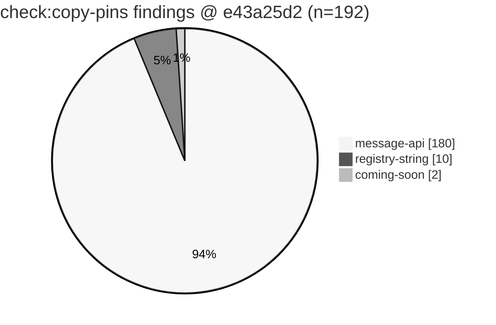
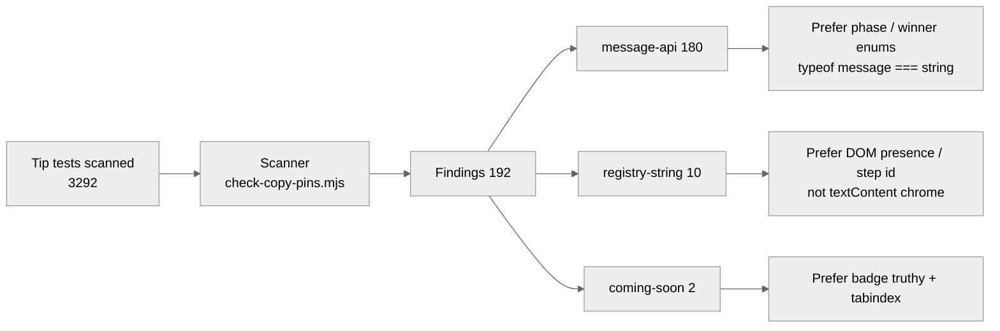

# check:copy-pins residual inventory — tip post914 (delta vs #922)

**Task id:** `q-mp-493` (P3, report-only refresh)  
**Tip base:** `cursor/mp-tip-post914` @ `e43a25d2` (`e43a25d22b081819664bc631e4fe34f793847004`)  
**Measured at:** `2026-10-10T09:52:06Z` (UTC)  
**Prior inventory (contained):** [`docs/dev/copy-pins-residual-inventory-post898-2026-10-10.md`](./copy-pins-residual-inventory-post898-2026-10-10.md) (`q-mp-443` / [#922](https://github.com/fuzzywigg/math-pentathlon/pull/922) · tip post898 @ `85522638`, **192** findings)  
**Machine summary:** [`copy-pins-residual-inventory-post914-2026-10-10.json`](./copy-pins-residual-inventory-post914-2026-10-10.json)  
**Visual:** [`copy-pins-residual-inventory-post914-2026-10-10.svg`](./copy-pins-residual-inventory-post914-2026-10-10.svg)  
**Deliverable:** docs/data/chart only — **no new pins**, no player-facing copy edits, no test changes.

## Acceptance (from backlog q-mp-493)

- [x] Re-measure `npm run check:copy-pins` on live tip post914 (not stale backlog stamp alone)
- [x] Dated residual inventory under `docs/dev/` (`…-post914-2026-10-10.md` + `.json` + `.svg`)
- [x] Tip SHA recorded; prefers structural-assert guidance; no player-facing copy / rules-text product edits
- [x] Leave open `#922` / `#908` / `#856` / `#790` with **contained** (do not close; no comment per worker brief)
- [x] Narrow to the delta when unchanged vs `#922` (finding set identical)
- [x] `npm run check:dev-docs` clean

## Duplicate check (open tip drafts)

| PR | Base | Title | Overlap |
| --- | --- | --- | --- |
| [#922](https://github.com/fuzzywigg/math-pentathlon/pull/922) | post898 | q-mp-443 residual inventory | **CONTAINED** — finding set identical; this PR only restamps tip SHA + scanned count. Left open. |
| [#908](https://github.com/fuzzywigg/math-pentathlon/pull/908) | post865 | q-mp-418 residual inventory | **CONTAINED** — historical post865 stamp. |
| [#856](https://github.com/fuzzywigg/math-pentathlon/pull/856) | post830 | q-mp-362 residual inventory | **CONTAINED** — historical post830 stamp. |
| [#790](https://github.com/fuzzywigg/math-pentathlon/pull/790) | post755 | q-mp-275 residual inventory | **CONTAINED** — historical post755 stamp. |
| Open drafts into `cursor/mp-tip-post914` (#939–#957) | post914 | docs / UI cov / mutation / backlog | None owns a post914 `check:copy-pins` residual inventory refresh |

No open draft into `cursor/mp-tip-post914` already owns this refresh → proceed (delta-only vs `#922`).

## Method

```text
npm run check:copy-pins -- --self-test   # review 7/8 positives + negatives
npm run check:copy-pins                  # report-only tip scan (exit 0)
node scripts/check-copy-pins.mjs --json  # machine-readable findings
npm run check:copy-pins -- --fail        # opt-in; exit 1 when findings > 0
npm run check:dev-docs                   # report-only path/link check
```

Scanner: [`scripts/check-copy-pins.mjs`](../../scripts/check-copy-pins.mjs) (policy in [`docs/dev/check-copy-pins.md`](./check-copy-pins.md)).  
CI: lint job runs `npm run check:copy-pins -- --fail` with `continue-on-error: true`.

## Live tip snapshot — delta vs #922 / post898

| Metric | post898 (`#922` / `q-mp-443`) | **post914 (this refresh)** | Δ |
| --- | ---: | ---: | ---: |
| Tip branch | `cursor/mp-tip-post898` | `cursor/mp-tip-post914` | tip advanced |
| Tip SHA | `85522638` | `e43a25d2` | tip cut + folds (`#949` wiki tip pointer) |
| Tests scanned | 3285 | **3292** | **+7** |
| Copy-registry entries | 16 | **16** | 0 |
| Findings | 192 | **192** | **0 (flat)** |
| Test files with ≥1 finding | 62 | **62** | 0 |
| `message-api` / `registry-string` / `coming-soon` | 180 / 10 / 2 | **180 / 10 / 2** | 0 |
| Finding keys (`file:line:kind`) vs `#922` JSON | — | **identical** (0 added / 0 removed) | 0 |
| Snippet deep-equal vs `#922` JSON | — | **true** | — |
| Default exit | 0 | 0 | — |
| `--fail` exit | 1 | 1 | — |
| `--self-test` | PASS (8/8) | PASS (8/8) | — |

**Verdict:** Residual pin count stays **flat at 192** through tip folds post755 → … → post898 → **post914**. New scanned test files (+7 vs post898 inventory; backlog stamped **3291**, live **3292**) landed without adding copy pins. Kind mix, top-file ranking, and the full `file:line:kind` set are unchanged vs `#922`.

Spec note: backlog `q-mp-493` cited findings **192** / registry **16** / tests scanned **3291** on tip post914; live re-measure @ `e43a25d2` is **3292** scanned (same findings/registry).

## Visual — residual shape






### Kind bar (ASCII)

```text
message-api      ████████████████████████████████████ 180
registry-string  ██ 10
coming-soon      █ 2
```

## Why this doc is narrow (contains #922)

Because the finding inventory is **byte-identical** to [`copy-pins-residual-inventory-post898-2026-10-10.json`](./copy-pins-residual-inventory-post898-2026-10-10.json) (verified `JSON.stringify(findings)` deep-equal), this refresh does **not** re-paste the 192-row file/line/kind table. Full residual families, registry harvest table, migration order, and per-finding snippets remain authoritative in the post898 inventory (`#922` / `q-mp-443`). Machine JSON for this tip still embeds the full `findings[]` array for tooling.

### Hard-rule reminder

Do **not** “fix” these findings by editing player-facing copy or `*/rules.ts` message bodies. Do **not** add new pins. Optional cleanup = rewrite asserts to structure/engine state only. Hex Hard stays **450ms**.

## Top files by finding count (unchanged vs #922)

| Count | File |
| ---: | --- |
| 9 | `tests/unit/burn-wave41-hex-a-gone-phase-messages.test.ts` |
| 9 | `tests/unit/burn-wave47-hex-a-gone-phase-messages.test.ts` |
| 9 | `tests/unit/engine-coverage-round-burn-1008.test.ts` |
| 7 | `tests/unit/burn-wave14-phase-format.test.ts` |
| 7 | `tests/unit/burn-wave15-phase-format.test.ts` |
| 7 | `tests/unit/burn-wave41-star-progress-phase-over.test.ts` |
| 7 | `tests/unit/burn-wave42-hexagone-phase-message-deepen.test.ts` |
| 6 | `tests/unit/game-state.test.ts` |
| 5 | `tests/unit/burn-wave41-handshake-kings-phase-timer.test.ts` |
| 5 | `tests/unit/burn-wave43-star-phase-message-matrix.test.ts` |
| 5 | `tests/unit/burn-wave44-star-track-phase-message-matrix.test.ts` |

`engine-coverage-round-burn-1008.test.ts` still 9 hits at lines 311, 313, 317, 324, 330, 336, 461, 847, 853.

## Failures / CI posture

| Check | Result |
| --- | --- |
| `npm run check:copy-pins -- --self-test` | **PASS** — review 7/8 examples flagged; all five negatives stay 0 |
| `npm run check:copy-pins` | **exit 0** — prints 192 findings (report-only) |
| `npm run check:copy-pins -- --fail` | **exit 1** — same 192 findings; opt-in / CI continue-on-error |
| Scanner crashes / parse errors | **none** observed |
| False-positive self-test negatives | **none** |

## Out of scope (this PR)

- Adding or removing pins in `tests/`
- Editing `src/` player-facing strings or phase-message implementations
- Changing CI from report-only / continue-on-error to a hard gate
- AI search / scoring / difficulty / timing; Hex Hard 450ms; Stars & Bars history cap
- Re-listing the full 192-row inventory (unchanged; see `#922` / post898 doc)

## Verification commands + results

```text
$ git rev-parse HEAD
  e43a25d22b081819664bc631e4fe34f793847004

$ npm run check:copy-pins -- --self-test
Self-test OK
EXIT 0

$ node scripts/check-copy-pins.mjs --json
  filesScanned: 3292
  registrySize: 16
  findingCount: 192
  kinds: message-api 180 / coming-soon 2 / registry-string 10

$ npm run check:copy-pins
check-copy-pins: report-only (not a CI gate)
  tests scanned: 3292
  copy-registry entries: 16
  findings: 192
Report-only: exit 0

$ npm run check:copy-pins -- --fail
EXIT 1   # expected while residual pins remain

$ rg -n 'hard:\s*450' src/games/hex/ai.ts
  21:  hard: 450,

$ npm run check:dev-docs
  (run on this PR head after docs land; expect problems: 0)
```

Next action: fold into tip by the tip owner.
