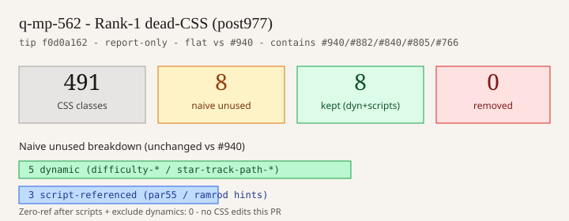

# Dead-CSS Rank-1 rescan — tip post977

**Task id:** `q-mp-562` (P3 docs with real visuals)  
**Tip base:** `cursor/mp-tip-post977` @ `f0d0a162` (`f0d0a162620f324bfa8cef244a665555113d9f44`)  
**Measured at:** `2026-10-10T14:52:23Z` (UTC)  
**Deliverable:** dated residual inventory + keep/remove visual; remove only verified-unused Rank-1 CSS (none found). Report what changed vs tip-folded `#940` (`q-mp-461` post914). Contains open `#940` / `#882` / `#840` / `#805` / `#766`. Spec source: backlog `q-mp-562` (written against post949; remeasured on live post977 after tip fold `#977`).

## Acceptance (from backlog q-mp-562; remeasured on post977)

- [x] Re-run CSS class scan equivalent to `scripts/report-dead-code.mjs` `scanCssClasses()` on live tip post977
- [x] Dated residual inventory under `docs/dev/` with keep/remove table visual
- [x] Delete only selectors with **zero** TS/HTML/script/test refs and **no** dynamic construction — **none** this pass (report-only; docs/chart only — task constraint: do not delete CSS)
- [x] Dynamic families marked **kept/dynamic** (not deleted)
- [x] Script/e2e-referenced leftovers kept
- [x] Prior Rank-1 removals still absent from `src/`
- [x] Report delta vs tip-folded `#940` post914 scan
- [x] No player-facing copy / rules / AI / ratchet JSON / CSS product edits

## Duplicate check (open tip drafts)

| PR                                                              | Title                              | Overlap                                                                                      |
| --------------------------------------------------------------- | ---------------------------------- | -------------------------------------------------------------------------------------------- |
| [#940](https://github.com/fuzzywigg/math-pentathlon/pull/940)   | q-mp-461 Rank-1 dead CSS (post914) | **CONTAINED** — same scan method + identical live metrics; this PR is the post977 re-measure |
| [#882](https://github.com/fuzzywigg/math-pentathlon/pull/882)   | q-mp-391 Rank-1 dead CSS (post865) | **CONTAINED** — older tip; metrics identical                                                 |
| [#840](https://github.com/fuzzywigg/math-pentathlon/pull/840)   | q-mp-341 Rank-1 dead CSS (post785) | **CONTAINED** — older tip; metrics identical                                                 |
| [#805](https://github.com/fuzzywigg/math-pentathlon/pull/805)   | q-mp-305 Rank-1 dead CSS (post755) | **CONTAINED** — older tip; metrics identical                                                 |
| [#766](https://github.com/fuzzywigg/math-pentathlon/pull/766)   | q-mp-241 Rank-1 dead CSS (post748) | **CONTAINED** — tip already has removals + older inventory                                   |
| [#736](https://github.com/fuzzywigg/math-pentathlon/pull/736)   | q-mp-211 `.move-history-panel`     | Contained / already absent on tip                                                            |
| [#710](https://github.com/fuzzywigg/math-pentathlon/pull/710)   | q-mp-176 `.game-card-division`     | Contained / already absent on tip                                                            |
| [#690](https://github.com/fuzzywigg/math-pentathlon/pull/690)   | q-mp-154 calla/sd CSS              | Contained / already absent on tip                                                            |
| [#1009](https://github.com/fuzzywigg/math-pentathlon/pull/1009) | q-mp-090s backlog 10s              | Spec owner only (lists q-mp-562); no CSS edits                                               |

No other open draft into `cursor/mp-tip-post977` owns a fresh Rank-1 CSS rescan (`gh pr list --base cursor/mp-tip-post977 --state open` was empty at start). Open `#1002`–`#1011` target post949 and do not own this rescan.

## What changed since `#940` (post914 @ `753052a6`)

| Check                                                  | Result                                                                     |
| ------------------------------------------------------ | -------------------------------------------------------------------------- |
| `git diff 753052a6..f0d0a162 -- ':(glob)src/**/*.css'` | **empty** (no CSS source edits on tip between post914 fold and post977)    |
| `git log 753052a6..f0d0a162 -- ':(glob)src/**/*.css'`  | **empty** (no CSS commits across post949 `#949` + post977 `#977` tip cuts) |
| CSS classes defined                                    | **491 → 491** (flat)                                                       |
| Naive unused (no scripts)                              | **8 → 8** (same 8 selectors)                                               |
| Zero-ref removable                                     | **0 → 0** (flat clean)                                                     |
| Removals applied                                       | **0 → 0** (report-only both passes)                                        |

Tip cuts `#949` + `#977` plus folds through round-18/19 backlog docs did **not** change Rank-1 CSS class reachability vs the post914 rescan. Spec baseline tip name post949 is superseded by live post977 `f0d0a162`; CSS surface remains flat. Corpus (TS/HTML/tests) growth between tips did not introduce or retire class tokens that alter the Rank-1 unused set.

## Method

1. Walk `src/**/*.css` for class selectors (same regex as `scripts/report-dead-code.mjs`).
2. Search corpus: `src/**/*.{ts,tsx,html}`, `tests/**/*.{ts,tsx,html,mjs}`, `scripts/**/*.{mjs,js,ts}`, `index.html`.
3. Flag classes with zero whole-token hits outside defining CSS.
4. Exclude known dynamic prefixes (`difficulty-*`, `star-track-path-*`).
5. Manual `rg` proof; leave any selector with script/e2e string refs.
6. Do **not** delete when zero-ref count is 0 (this task is report-only).

## Keep / remove visual



| Bucket                                                      | Count | Action            |
| ----------------------------------------------------------- | ----: | ----------------- |
| CSS classes defined                                         |   491 | —                 |
| Naive unused (TS/HTML/tests only; no scripts)               |     8 | classify          |
| Of which dynamic (`difficulty-*`, `star-track-path-*`)      |     5 | kept/dynamic      |
| Of which script-referenced (`par55-*` / `ramrod-turn-hint`) |     3 | kept              |
| Zero-ref after scripts + excluding dynamics                 | **0** | nothing to remove |
| Removed this PR                                             | **0** | report-only       |

### Before / after vs `#940` post914 rescan (`q-mp-461`)

| Metric                    | post914 (`#940`) | post977 (this PR) |      Δ |
| ------------------------- | ---------------: | ----------------: | -----: |
| CSS classes defined       |              491 |           **491** |      0 |
| Naive unused (no scripts) |                8 |             **8** |      0 |
| Zero-ref removable        |                0 |             **0** |      0 |
| Removals applied          |                0 |             **0** | report |

## Naive unused (8) — dispositions

Class names are plain text (not `` `symbol` | `path` `` rows) so `check:dev-docs` does not treat CSS selectors as TS exports.

| CSS class               | Disposition                                                                      | Defining file                   |
| ----------------------- | -------------------------------------------------------------------------------- | ------------------------------- |
| difficulty-beginner     | kept/dynamic — `difficulty-${game.difficulty}` in `src/ui/game-selector.ts`      | src/style.css                   |
| difficulty-intermediate | kept/dynamic                                                                     | src/style.css                   |
| difficulty-advanced     | kept/dynamic                                                                     | src/style.css                   |
| star-track-path-p1      | kept/dynamic — `star-track-path-${p1\|p2}` in `src/games/star-track/board-ui.ts` | src/ui/styles/game-play.css     |
| star-track-path-p2      | kept/dynamic                                                                     | src/ui/styles/game-play.css     |
| par55-cell              | kept — script refs in `scripts/runtime-perf.mjs`, `scripts/render-perf.mjs`      | src/ui/styles/forced-colors.css |
| par55-turn-hint         | kept — script ref in `scripts/par-55-deep-playtest.mjs`                          | src/games/par-55/par-55.css     |
| ramrod-turn-hint        | kept — script ref in `scripts/ramrod-deep-playtest.mjs`                          | src/games/ramrod/ramrod.css     |

### Dynamic families (do not delete)

These concrete CSS classes have no literal TS token hits but are applied via templates / `classList` construction:

- `difficulty-${game.difficulty}` → `.difficulty-beginner|intermediate|advanced`
- `star-track-path-${p1|p2}` → `.star-track-path-p1|p2`

## Verified removals (this PR)

**None.** Zero-ref re-scan after including `scripts/` and excluding dynamic prefixes is empty. Task constraint: report-only (docs/data/chart files only); do not delete CSS.

## Prior Rank-1 removals still absent

`rg` over `src tests scripts index.html` for:

- `par55-btn-primary` / `ramrod-btn-primary` (q-mp-241)
- `game-card-division` (q-mp-176)
- `calla-teaching-hint` / `sd-hands-container` (q-mp-154)
- `move-history-panel` (q-mp-211)

→ no hits (docs-only under `docs/dev/`).

## Inventory sync

- `docs/dev/dead-code-inventory.md` — changelog note pointing at this post977 rescan (no new removed rows)
- Open `#940` / `#882` / `#840` / `#805` / `#766` left open with disposition **contained** (do not close; this worker does not comment on other PRs)

## Reproduce

```bash
# Equivalent to scanCssClasses() + scripts corpus (see method above)
node scripts/report-dead-code.mjs   # full inventory rewrite (optional; not required for this report)

rg -n 'par55-btn-primary|ramrod-btn-primary|game-card-division|calla-teaching-hint|sd-hands-container|move-history-panel' \
  src tests scripts index.html
# → empty

npm run check:dev-docs
```
