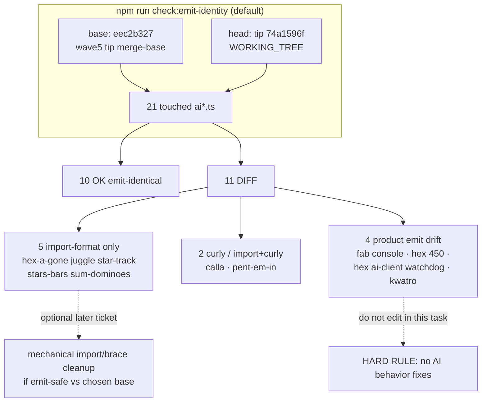

# q-mp-264 — `check:emit-identity` FAIL inventory (2026-10-09)

> **Superseded stamp:** tip post785 refresh lives in [`emit-identity-fail-inventory-2026-10-10.md`](./emit-identity-fail-inventory-2026-10-10.md) (`q-mp-343`). FAIL set unchanged (11); tip SHA only.

**Task id:** `q-mp-264`  
**Role:** worker (docs / report-only)  
**Tip audited:** `cursor/mp-tip-post755` @ `74a1596f` (full `74a1596f71aab5d6616ff486b2a4eb2a70b5123b`)  
**Scope:** Inventory of the live default `npm run check:emit-identity` failure set. **No `src/` edits. No AI file edits.**

## Purpose

Document what the default emit-identity checker reports on tip post755 so tip owners can decide disposition (accept historical baseline vs a later mechanical import/brace-only cleanup ticket). This PR does **not** “fix” identity by editing AI product code.

## Hard rules (explicit non-goals)

- **No** AI search / scoring / difficulty / timing / RNG behavior changes
- **No** player-facing copy or rules-text edits
- **No** edits under `*/rules.ts`, legal-move, or scoring paths
- **No** Stars & Bars history cap
- Hex Hard stays **450ms** — tip HEAD already has `hard: 450` in `src/games/hex/ai.ts`; this inventory does **not** touch that line
- Do **not** collide with undrafted `q-mp-247` (`return-await` on fab/fiar/queens `ai-client.ts` only)

## Duplicate check

| Related draft / prior | Overlap | Action |
| --- | --- | --- |
| Open drafts into `cursor/mp-tip-post755` | **None** at audit time | Proceed |
| `#749` q-mp-229 emit-identity npm script (folded via `#755`) | Wired `check:emit-identity`; no FAIL inventory | Complementary |
| `#560` OWNER OPTION AI type-only emit-identical | Historical type-ratchet clear vs Batch-6 tip | Different base/ref; leave open |
| `#775` q-mp-090g backlog round 7 (lists `q-mp-264`) | Spec only | This doc is the deliverable |
| Undrafted `q-mp-247` ai-client `return-await` | fab/fiar/queens clients only | **Out of scope**; not in the 11 DIFF set |

No open draft already owns `emit-identity-fail-inventory-2026-10-09.md` → full task proceeds.

## Method (live tip)

Default checker (`scripts/check-emit-identity.mjs` with no args):

| Field | Value |
| --- | --- |
| **Command** | `npm run check:emit-identity` |
| **base** | `eec2b327c1e65586537cbe03b1c29b93065dee03` (`git merge-base HEAD origin/cursor/integration-fold-wave5-tip-4af0`) |
| **head** | `WORKING_TREE` (= tip `74a1596f`) |
| **File set** | 21 `src/games/**/ai*.ts` touched between base and head |
| **Result** | **FAIL: 11** not emit-identical; **10** OK |

`--normalize` (whitespace collapse) still reports the same **11** DIFFs — import multiline→singleline and brace wraps are structural emit changes, not pure spacing. `--minify` is **not** used for this inventory (minify mode currently DIFFs all 21 touched AI files and is a separate proof path for brace-only curly:all).

```text
$ git rev-parse HEAD
  74a1596f71aab5d6616ff486b2a4eb2a70b5123b

$ npm run check:emit-identity
  base: eec2b327c1e65586537cbe03b1c29b93065dee03
  head: WORKING_TREE
  files: 21
  FAIL: 11 file(s) not emit-identical.

$ rg -n 'hard:\s*450' src/games/hex/ai.ts
  21:  hard: 450,
```

## Spec staleness note

Backlog `q-mp-264` titled the set “11 AI import-brace diffs” and claimed diffs were “import formatting, not search/scoring/timing.” **Live tip evidence is mixed.** Five files are import-format-only; two are curly-brace (one also has import collapse); four carry real emit drift (console strip, Hex Hard deadline constant vs wave5 base, Hex worker watchdog, Kwatro scoring/difficulty/budget). Hard rule: trust the live tree over the ticket summary.

## Classification of the 11 DIFFs

| # | Path | Class | Emit delta (base → tip head) | Tip-owner note |
| ---: | --- | --- | --- | --- |
| 1 | `src/games/hex-a-gone/ai.ts` | **import-format** | Multiline `import { getAvailableShapes }` → one-line | Mechanical / style only |
| 2 | `src/games/juggle/ai.ts` | **import-format** | Multiline types import → one-line | Mechanical / style only |
| 3 | `src/games/star-track/ai.ts` | **import-format** | Multiline types import → one-line | Mechanical / style only |
| 4 | `src/games/stars-bars/ai.ts` | **import-format** | Multiline types import → one-line | Mechanical / style only |
| 5 | `src/games/sum-dominoes/ai.ts` | **import-format** | Multiline `getDiceSum` import → one-line | Mechanical / style only |
| 6 | `src/games/calla/ai.ts` | **curly-brace** | Bare `if` → braced `if { … }` in terminal score | Brace-only; no search/scoring change |
| 7 | `src/games/pent-em-in/ai.ts` | **import-format + curly-brace** | Types import collapse + braced bounds `continue` | Mechanical |
| 8 | `src/games/fab-a-diffy/ai.ts` | **console-strip** | Removes four `console.error` calls in `applyAIMoveSteps` | Runtime emit change (logging only); **not** import-brace |
| 9 | `src/games/hex/ai.ts` | **timing-constant (intentional tip)** | `AI_PLAY_DEADLINE_MS.hard`: **2500 → 450** | Tip HEAD is correct per hard rule; do **not** revert to 2500 to “pass” identity vs wave5 base |
| 10 | `src/games/hex/ai-client.ts` | **watchdog / client control-flow** | Adds deadline local, `setTimeout` watchdog, `Promise.race`, cancel/dispose + sync fallback | Product emit drift; leave to tip owner; **not** `q-mp-247` |
| 11 | `src/games/kwatro-sinko/ai.ts` | **scoring / difficulty / timing** | `AI_THINK_BUDGET_MS`, randomness retune, `countOnNumbered`, evacuate weighting, think-budget early return, export | **Forbidden** for worker “fix”; owner-only if future product ticket |

### OK (emit-identical) among the 21 touched

`contig-60/ai.ts`, `fiar/ai.ts`, `frac-fact/ai.ts`, `fraction-pinball/ai.ts`, `kings-quadraphages/ai.ts`, `par-55/ai.ts`, `prime-gold/ai.ts`, `queens-guards/ai.ts`, `ramrod/ai.ts`, `remainder-islands/ai.ts`.

## Visual map



## Tip-owner disposition (recommendation)

1. **Accept baseline for tip-vs-wave5 default run** — the default merge-base (`eec2b327`) is an old wave5 ancestor; the 11 DIFFs are accumulated tip history, not a CI-blocking ratchet (emit-identity is not in `npm run verify` / CI `lint`). Documented here so agents stop treating the FAIL as an urgent AI rewrite.
2. **Optional future mechanical ticket (non-AI behavior)** — only for classes **import-format** and **curly-brace** (#1–#7), and only if the tip owner wants byte identity against a **chosen** base for a type-only proof. Prefer Prettier-stable single-line imports + brace style matched on both sides of the compare; prove with `check:emit-identity --base <ref> --files-from …`.
3. **Do not “fix” #8–#11 via worker AI edits** — console strip, Hex Hard **450**, hex client watchdog, and Kwatro retune are product/history; Hex Hard must stay **450ms**.
4. **Leave `q-mp-247` alone** — fab/fiar/queens `ai-client.ts` `return-await` are not in this FAIL set.

## Acceptance checklist

- [x] Dated inventory committed (`docs/dev/emit-identity-fail-inventory-2026-10-09.md`)
- [x] Explicit forbid of AI behavior / scoring / difficulty / timing edits
- [x] Hex Hard **450ms** called out as untouched (tip already correct)
- [x] Live classification supersedes stale “all import-brace” backlog wording
- [x] Docs-only; no `src/games/**/ai*.ts` edits

## Verify (commands for this docs PR)

```bash
npm run check:emit-identity
rg -n 'hard:\s*450' src/games/hex/ai.ts
npm run check:dev-docs
npm run lint
npm run typecheck
npm run test:unit
```
