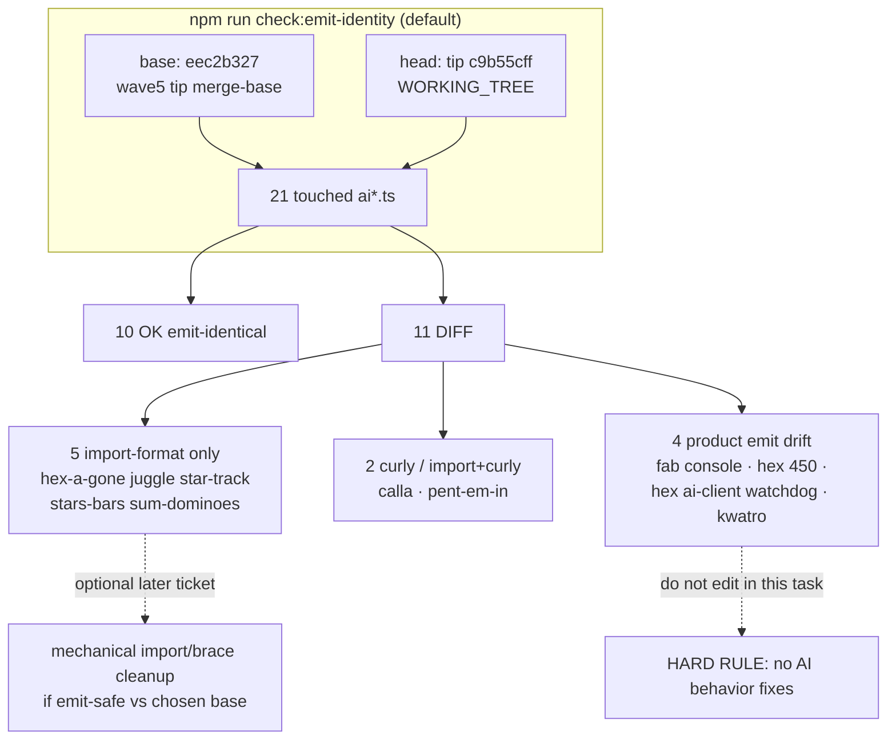

# q-mp-343 — `check:emit-identity` FAIL inventory refresh (2026-10-10)

**Task id:** `q-mp-343`  
**Role:** worker (docs / report-only)  
**Tip audited:** `cursor/mp-tip-post785` @ `c9b55cff` (full `c9b55cff8c3832ff502179fe66f14ecaa400e95d`)  
**Prior inventory:** [`emit-identity-fail-inventory-2026-10-09.md`](./emit-identity-fail-inventory-2026-10-09.md) (`q-mp-264`, tip post755 @ `74a1596f`) — leave open `#780` with `contained`  
**Machine summary:** [`emit-identity-fail-inventory-2026-10-10.json`](./emit-identity-fail-inventory-2026-10-10.json)  
**Scope:** Re-measure default `npm run check:emit-identity` on live post785 tip. **No `src/` edits. No AI file edits.**

## Purpose

Publish a dated FAIL inventory stamped to tip post785 so agents stop relying on the post755/`74a1596f` stamp in `#780`. This PR does **not** “fix” identity by editing AI product code. Spec backlog claimed tip `21719062`; live tip HEAD at audit is `c9b55cff` (post785 tip advanced after squash-merge / folds) — trust the live tree.

## Hard rules (explicit non-goals)

- **No** AI search / scoring / difficulty / timing / RNG behavior changes
- **No** player-facing copy or rules-text edits
- **No** edits under `*/rules.ts`, legal-move, or scoring paths
- **No** Stars & Bars history cap
- Hex Hard stays **450ms** — tip HEAD already has `hard: 450` in `src/games/hex/ai.ts`; this inventory does **not** touch that line
- Do **not** collide with undrafted `q-mp-247` (`return-await` on fab/fiar/queens `ai-client.ts` only)
- Do **not** start AI brace/import cleanup here

## Duplicate check

| Related draft / prior | Overlap | Action |
| --- | --- | --- |
| Open drafts into `cursor/mp-tip-post785` | `#825`–`#833`, `#831` backlog | None own emit-identity FAIL inventory refresh |
| `#780` q-mp-264 inventory (post755 @ `74a1596f`) | Same 11 DIFF set; older tip stamp | Leave open; comment `contained` |
| `#813` owl UI cov r16 / `#822` no-shadow controllers | Orthogonal | No overlap |
| `#749` emit-identity npm script | Tooling only | Complementary |
| `#560` OWNER OPTION AI type-only | Different base/ref | Leave open |
| Undrafted `q-mp-247` ai-client `return-await` | fab/fiar/queens clients | **Out of scope**; not in the 11 DIFF set |

No open draft already owns a post785-dated FAIL inventory → full refresh proceeds.

## Method (live tip)

Default checker (`scripts/check-emit-identity.mjs` with no args):

| Field | Value |
| --- | --- |
| **Command** | `npm run check:emit-identity` |
| **base** | `eec2b327c1e65586537cbe03b1c29b93065dee03` (`git merge-base HEAD origin/cursor/integration-fold-wave5-tip-4af0`) |
| **head** | `WORKING_TREE` (= tip `c9b55cff`) |
| **File set** | 21 `src/games/**/ai*.ts` touched between base and head |
| **Result** | **FAIL: 11** not emit-identical; **10** OK |

`--normalize` (whitespace collapse) still reports the same **11** DIFFs.

```text
$ git rev-parse HEAD
  c9b55cff8c3832ff502179fe66f14ecaa400e95d

$ npm run check:emit-identity
  base: eec2b327c1e65586537cbe03b1c29b93065dee03
  head: WORKING_TREE
  files: 21
  FAIL: 11 file(s) not emit-identical.

$ rg -n 'hard:\s*450' src/games/hex/ai.ts
  21:  hard: 450,
```

## Before → after metrics (report-only refresh)

| Metric | Before (`#780` @ post755 `74a1596f`) | After (this audit @ post785 `c9b55cff`) |
| --- | ---: | ---: |
| Touched AI files compared | 21 | 21 |
| OK emit-identical | 10 | 10 |
| FAIL (DIFF) | **11** | **11** (unchanged; intentionally not cleared) |
| Tip SHA stamp | `74a1596f` | **`c9b55cff`** |
| Base (wave5 merge-base) | `eec2b327` | `eec2b327` (same) |

**Delta vs `#780`:** tip SHA / tip branch only. DIFF path set and class mix are identical.

## Spec staleness note

Backlog `q-mp-343` titles the set “11 non-emit-identical AI files (brace/import merge style).” **Live tip evidence remains mixed** (same as `q-mp-264`): five import-format-only; two curly / import+curly; four product emit drift. Hard rule: trust the live tree over the ticket summary. Evidence snapshot SHA `21719062` in the backlog is superseded by live tip `c9b55cff`.

## Classification of the 11 DIFFs

| # | Path | Class | Emit delta (base → tip head) | Tip-owner note |
| ---: | --- | --- | --- | --- |
| 1 | `src/games/hex-a-gone/ai.ts` | **import-format** | Multiline `import { getAvailableShapes }` → one-line | Mechanical / style only |
| 2 | `src/games/juggle/ai.ts` | **import-format** | Multiline types import → one-line | Mechanical / style only |
| 3 | `src/games/star-track/ai.ts` | **import-format** | Multiline types import → one-line | Mechanical / style only |
| 4 | `src/games/stars-bars/ai.ts` | **import-format** | Multiline types import → one-line | Mechanical / style only |
| 5 | `src/games/sum-dominoes/ai.ts` | **import-format** | Multiline `getDiceSum` import → one-line | Mechanical / style only |
| 6 | `src/games/calla/ai.ts` | **curly-brace** | Bare `if` → braced `if { … }` in terminal score | Brace-only; no search/scoring change |
| 7 | `src/games/pent-em-in/ai.ts` | **import-format + curly-brace** | Types import collapse + braced bounds `continue` | Mechanical |
| 8 | `src/games/fab-a-diffy/ai.ts` | **console-strip** | Removes four `console.error` calls in `applyAIMoveSteps` | Runtime emit change (logging only); **not** import-brace |
| 9 | `src/games/hex/ai.ts` | **timing-constant (intentional tip)** | `AI_PLAY_DEADLINE_MS.hard`: **2500 → 450** | Tip HEAD is correct per hard rule; do **not** revert to 2500 to “pass” identity vs wave5 base |
| 10 | `src/games/hex/ai-client.ts` | **watchdog / client control-flow** | Adds deadline local, `setTimeout` watchdog, `Promise.race`, cancel/dispose + sync fallback | Product emit drift; leave to tip owner; **not** `q-mp-247` |
| 11 | `src/games/kwatro-sinko/ai.ts` | **scoring / difficulty / timing** | `AI_THINK_BUDGET_MS`, randomness retune, `countOnNumbered`, evacuate weighting, think-budget early return, export | **Forbidden** for worker “fix”; owner-only if future product ticket |

### OK (emit-identical) among the 21 touched

`contig-60/ai.ts`, `fiar/ai.ts`, `frac-fact/ai.ts`, `fraction-pinball/ai.ts`, `kings-quadraphages/ai.ts`, `par-55/ai.ts`, `prime-gold/ai.ts`, `queens-guards/ai.ts`, `ramrod/ai.ts`, `remainder-islands/ai.ts`.

## Visual map



## Tip-owner disposition (recommendation)

1. **Accept baseline for tip-vs-wave5 default run** — merge-base `eec2b327` is an old wave5 ancestor; the 11 DIFFs are accumulated tip history, not a CI-blocking ratchet (emit-identity is not in `npm run verify` / CI `lint`).
2. **Optional future mechanical ticket (non-AI behavior)** — only for classes **import-format** and **curly-brace** (#1–#7), and only if the tip owner wants byte identity against a **chosen** base. Prove with `check:emit-identity --base <ref> --files-from …`.
3. **Do not “fix” #8–#11 via worker AI edits** — console strip, Hex Hard **450**, hex client watchdog, and Kwatro retune are product/history; Hex Hard must stay **450ms**.
4. **Leave `q-mp-247` alone** — fab/fiar/queens `ai-client.ts` `return-await` are not in this FAIL set.
5. **`#780` is contained** — same FAIL set; this doc re-stamps the inventory to post785 tip `c9b55cff`.

## Acceptance checklist

- [x] Dated inventory committed (`docs/dev/emit-identity-fail-inventory-2026-10-10.md` + `.json`)
- [x] Tip SHA stamped (`c9b55cff` on `cursor/mp-tip-post785`)
- [x] Explicit forbid of AI behavior / scoring / difficulty / timing edits
- [x] Hex Hard **450ms** restated (tip already correct; untouched)
- [x] Live classification supersedes stale “all brace/import” backlog wording
- [x] Docs/data only; no `src/` / AI / test behavior edits
- [x] `#780` left open with `contained`

## Verify (commands for this docs PR)

```bash
npm run check:emit-identity
rg -n 'hard:\s*450' src/games/hex/ai.ts
npm run check:dev-docs
npm run verify
```
