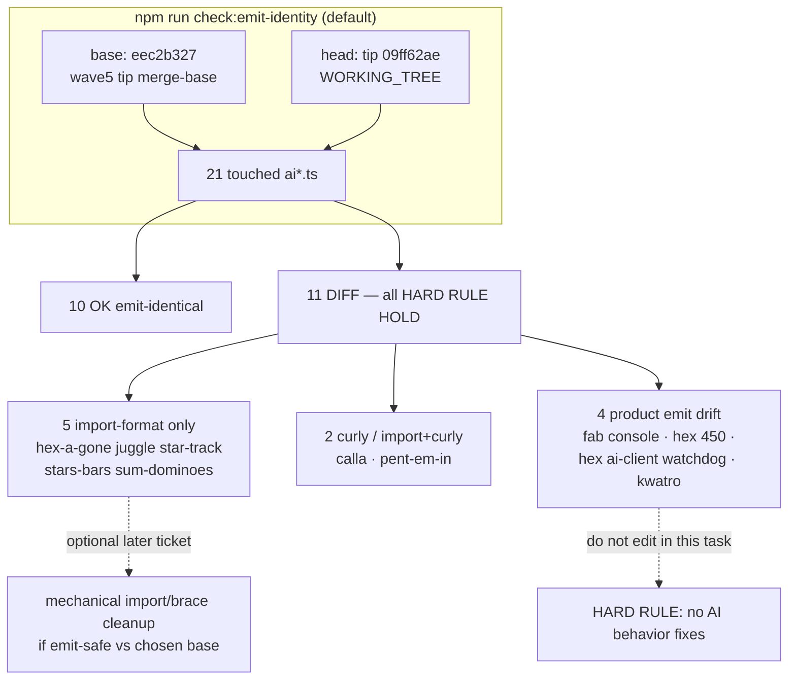

# q-mp-559 — `check:emit-identity` FAIL inventory (tip post977 remasure of post949)

**Task id:** `q-mp-559`  
**Role:** worker (docs / report-only)  
**Tip audited:** `cursor/mp-tip-post977` @ `09ff62ae` (full `09ff62ae035793514422e22453a098ae46d5f92e`)  
**Measured at:** `2026-10-10T15:17:20Z` (UTC)  
**Backlog basename:** `emit-identity-fail-inventory-post949-2026-10-10` (spec tip post949 is merged; live tip is post977)  
**Prior inventory:** [`emit-identity-fail-inventory-post914-2026-10-10.md`](./emit-identity-fail-inventory-post914-2026-10-10.md) (`q-mp-462`, tip post914 stamp `753052a6`; open draft `#939`) — leave open with `contained`  
**Older siblings:** [`emit-identity-fail-inventory-post865-2026-10-10.md`](./emit-identity-fail-inventory-post865-2026-10-10.md) (`q-mp-393` / `#881`); [`emit-identity-fail-inventory-2026-10-10.md`](./emit-identity-fail-inventory-2026-10-10.md) (`q-mp-343` / `#839`) — leave open with `contained`  
**Machine summary:** [`emit-identity-fail-inventory-post949-2026-10-10.json`](./emit-identity-fail-inventory-post949-2026-10-10.json)  
**Visual:** [`emit-identity-fail-inventory-post949-2026-10-10.svg`](./emit-identity-fail-inventory-post949-2026-10-10.svg)  
**Scope:** Re-measure default `npm run check:emit-identity` on live post977 tip. **No `src/` edits. No AI file edits. Do not propose fixes as code or patches.**

## Purpose

Publish a dated FAIL inventory stamped to tip post977 so agents stop relying on the post914/`753052a6` stamp in `#939` / `q-mp-462`. Backlog `q-mp-559` was written against tip post949 claiming **FAIL: 11** under `src/games/*/ai.ts` or `ai-client.ts` (brace/merge style). Tip post949 folded; **live tip at audit is `cursor/mp-tip-post977` @ `09ff62ae`** — trust the live tree. This PR does **not** “fix” identity by editing AI product code.

## Hard rules (explicit non-goals)

- **No** AI search / scoring / difficulty / timing / RNG behavior changes
- **No** player-facing copy or rules-text edits
- **No** edits under `*/rules.ts`, legal-move, or scoring paths
- **No** Stars & Bars history cap
- Hex Hard stays **450ms** — tip HEAD already has `hard: 450` in `src/games/hex/ai.ts`; this inventory does **not** touch that line
- **Zero** edits to any `src` file, especially `src/games/*/ai.ts`, `ai-client.ts`, or `src/core/ai-worker/**`
- Do **not** start AI brace/import cleanup here
- All **11** DIFF paths are **HARD RULE HOLD** (AI files) — report only
- Leave `#939` / `q-mp-462` alone (noted **contained** in this PR body only)

## Duplicate check

| Related draft / prior | Base | Overlap | Action |
| --- | --- | --- | --- |
| Open drafts into `cursor/mp-tip-post977` (`#1002`–`#1021`) | post977 | **None** own a post977/post949-dated emit-identity FAIL inventory | — |
| `#939` q-mp-462 inventory (post914 stamp) | post914 | Same 11 DIFF set; older tip stamp | Leave open; **contained** |
| `#881` q-mp-393 inventory (post865 stamp) | post865 | Same 11 DIFF set; older tip stamp | Leave open; **contained** |
| `#839` q-mp-343 inventory (post785 stamp) | post785 | Same 11 DIFF set; older tip stamp | Leave open; **contained** |
| `#780` q-mp-264 inventory | older tip | Same 11 DIFF set; older tip stamp | Leave open; **contained** |
| `#749` emit-identity npm script | older tip | Tooling only | Complementary |
| `#560` OWNER OPTION AI type-only | wave5 tip | Different base/ref | Leave open |
| `#1009` q-mp-090s backlog 10s | post977 | Spec source only | Leave open |
| `#1012` tip fold post977 | alpha | Tip owner fold vehicle | Leave open |

No open draft into post977 owns a post977-remeasured FAIL inventory → full refresh proceeds.

## Method (live tip)

Default checker (`scripts/check-emit-identity.mjs` with no args):

| Field | Value |
| --- | --- |
| **Command** | `npm run check:emit-identity` |
| **base** | `eec2b327c1e65586537cbe03b1c29b93065dee03` (`git merge-base HEAD origin/cursor/integration-fold-wave5-tip-4af0`) |
| **head** | `WORKING_TREE` (= tip `09ff62ae`) |
| **File set** | 21 `src/games/**/ai*.ts` touched between base and head |
| **Result** | **FAIL: 11** not emit-identical; **10** OK |

`--normalize` (whitespace collapse) still reports the same **11** DIFFs.

```text
$ git rev-parse HEAD
  09ff62ae035793514422e22453a098ae46d5f92e

$ npm run check:emit-identity
  base: eec2b327c1e65586537cbe03b1c29b93065dee03
  head: WORKING_TREE
  files: 21
  FAIL: 11 file(s) not emit-identical.
  (exit 1 — expected; report-only helper, not in npm run verify)

$ npm run check:emit-identity -- --normalize
  FAIL: 11 file(s) not emit-identical.

$ rg -n 'hard:\s*450' src/games/hex/ai.ts
  21:  hard: 450,
```

## Before → after metrics (report-only refresh)

| Metric | Before (`#939` / q-mp-462 stamp) | After (this audit @ post977 `09ff62ae`) |
| --- | ---: | ---: |
| Touched AI files compared | 21 | 21 |
| OK emit-identical | 10 | 10 |
| FAIL (DIFF) | **11** | **11** (unchanged; intentionally not cleared) |
| Tip branch stamp | `cursor/mp-tip-post914` | **`cursor/mp-tip-post977`** |
| Tip SHA stamp | `753052a6` | **`09ff62ae`** |
| Base (wave5 merge-base) | `eec2b327` | `eec2b327` (same) |

**Delta vs `#939`:** tip SHA / tip branch only. DIFF path set and class mix are identical.

## Spec staleness note

Backlog `q-mp-559` titles the set against tip post949 (`cursor/mp-tip-post949`) with “11 AI brace/merge” DIFFs. **Live tip evidence remains mixed** (same as `q-mp-462` / `q-mp-393` / `q-mp-343` / `q-mp-264`): five import-format-only; two curly / import+curly; four product emit drift. Hard rule: trust the live tree over the ticket summary. Tip cut post977 @ `09ff62ae` supersedes the backlog’s post949 base label.

## Classification of the 11 DIFFs (all HARD RULE HOLD)

| # | Path | Class | Emit delta (base → tip head) | Tip-owner note |
| ---: | --- | --- | --- | --- |
| 1 | `src/games/hex-a-gone/ai.ts` | **import-format** | Multiline `import { getAvailableShapes }` → one-line | Mechanical / style only; **HOLD** |
| 2 | `src/games/juggle/ai.ts` | **import-format** | Multiline types import → one-line | Mechanical / style only; **HOLD** |
| 3 | `src/games/star-track/ai.ts` | **import-format** | Multiline types import → one-line | Mechanical / style only; **HOLD** |
| 4 | `src/games/stars-bars/ai.ts` | **import-format** | Multiline types import → one-line | Mechanical / style only; **HOLD** |
| 5 | `src/games/sum-dominoes/ai.ts` | **import-format** | Multiline `getDiceSum` import → one-line | Mechanical / style only; **HOLD** |
| 6 | `src/games/calla/ai.ts` | **curly-brace** | Bare `if` → braced `if { … }` in terminal score | Brace-only; no search/scoring change; **HOLD** |
| 7 | `src/games/pent-em-in/ai.ts` | **import-format + curly-brace** | Types import collapse + braced bounds `continue` | Mechanical; **HOLD** |
| 8 | `src/games/fab-a-diffy/ai.ts` | **console-strip** | Removes four `console.error` calls in `applyAIMoveSteps` | Runtime emit change (logging only); **HOLD** |
| 9 | `src/games/hex/ai.ts` | **timing-constant (intentional tip)** | `AI_PLAY_DEADLINE_MS.hard`: **2500 → 450** | Tip HEAD is correct per hard rule; do **not** revert to 2500; **HOLD** |
| 10 | `src/games/hex/ai-client.ts` | **watchdog / client control-flow** | Adds deadline local, `setTimeout` watchdog, `Promise.race`, cancel/dispose + sync fallback | Product emit drift; leave to tip owner; **HOLD** |
| 11 | `src/games/kwatro-sinko/ai.ts` | **scoring / difficulty / timing** | `AI_THINK_BUDGET_MS`, randomness retune, `countOnNumbered`, evacuate weighting, think-budget early return, export | **Forbidden** for worker “fix”; owner-only if future product ticket; **HOLD** |

### OK (emit-identical) among the 21 touched

`contig-60/ai.ts`, `fiar/ai.ts`, `frac-fact/ai.ts`, `fraction-pinball/ai.ts`, `kings-quadraphages/ai.ts`, `par-55/ai.ts`, `prime-gold/ai.ts`, `queens-guards/ai.ts`, `ramrod/ai.ts`, `remainder-islands/ai.ts`.

## Visual map




## Tip-owner disposition (recommendation)

1. **Accept baseline for tip-vs-wave5 default run** — merge-base `eec2b327` is an old wave5 ancestor; the 11 DIFFs are accumulated tip history, not a CI-blocking ratchet (emit-identity is not in `npm run verify` / CI `lint`).
2. **Optional future mechanical ticket (non-AI behavior)** — only for classes **import-format** and **curly-brace** (#1–#7), and only if the tip owner wants byte identity against a **chosen** base. Prove with `check:emit-identity --base <ref> --files-from …`.
3. **Do not “fix” #8–#11 via worker AI edits** — console strip, Hex Hard **450**, hex client watchdog, and Kwatro retune are product/history; Hex Hard must stay **450ms**.
4. **`#939` / `#881` / `#839` are contained** — same FAIL set; this doc re-stamps the inventory to post977 tip `09ff62ae`.

## Acceptance checklist

- [x] Dated inventory committed (`docs/dev/emit-identity-fail-inventory-post949-2026-10-10.md` + `.json` + `.svg`)
- [x] Tip SHA stamped (`09ff62ae` on `cursor/mp-tip-post977`)
- [x] Explicit forbid of AI behavior / scoring / difficulty / timing edits; AI files marked **HOLD**
- [x] Hex Hard **450ms** restated (tip already correct; untouched)
- [x] Live classification supersedes stale “all brace/import” backlog wording
- [x] Docs/data/chart only; no `src/` / AI / test behavior edits
- [x] `#939` / `#881` / `#839` left open with `contained` (noted in PR body only; no comments on other PRs)

## Verify (commands for this docs PR)

```bash
npm run check:emit-identity
rg -n 'hard:\s*450' src/games/hex/ai.ts
npm run check:dev-docs
npm run verify
```
