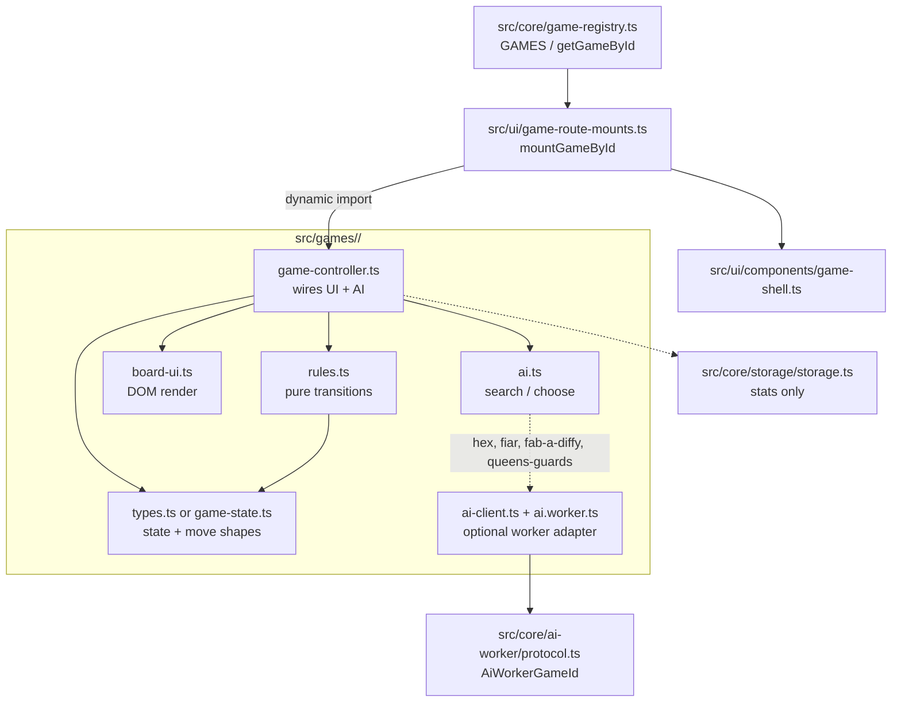

# Engine developer references

Contributor-only maps of what each game **engine module does in code**. Not player-facing rules, tutorials, or How-to copy.

| Related docs | Scope |
| --- | --- |
| [Wiki architecture (#475)](../../wiki/architecture.md) | App shell: router → registry → mounts → Big Toads |
| [Game route lifecycle (`q-mp-070`)](./game-lifecycle.md) | Sequence: route → mount → controller → board-ui / 3D → destroy |
| [Game registry](../../wiki/game-registry.md) | Catalog ids / divisions / menu wiring |
| [Adding a game](../../wiki/adding-a-game.md) | Checklist for a new module |
| [Docs sync (#496)](https://github.com/fuzzywigg/math-pentathlon/pull/496) | README / CONTRIBUTING / wiki command accuracy |
| [State round-trip](../../state-roundtrip-2026-10-07.md) | Mid-game serialize codecs |
| [Rules decisions](../../RULES-DECISIONS-2026-10-07.md) | Owner yes/no checklist |
| [Tutorial vs engine](../../tutorial-engine-mismatches-2026-10-07.md) | Copy mismatches (docs only) |
| [Board3D WebGL lifecycle (q-mp-072)](./board3d-webgl-lifecycle.md) | `load-three` · `tablet-gl` · context-lost · dispose + SwiftShader shots |

This folder does **not** replace #475 or #496 — link out instead of restating them.

## Module map



Worker AI games (protocol allow-list): `hex`, `fiar`, `fab-a-diffy`, `queens-guards`.

## Games index

| Id | Doc | Division | State type | Dedicated serialize | Worker AI |
| --- | --- | --- | --- | --- | --- |
| `kings-quadraphages` | [Kings & Quadraphages](./kings-quadraphages.md) | I | `GameState` | yes | no |
| `hex` | [Hex](./hex.md) | I | `HexGameState` | no | yes |
| `star-track` | [Star Track](./star-track.md) | I | `StarTrackGameState` | no | no |
| `hex-a-gone` | [Hex-a-Gone!](./hex-a-gone.md) | I | `HexAGoneGameState` | no | no |
| `calla` | [Calla](./calla.md) | I | `CallaGameState` | no | no |
| `sum-dominoes` | [Sum Dominoes & Dice](./sum-dominoes.md) | II | `SumDominoesState` | no | no |
| `par-55` | [Par 55](./par-55.md) | II | `Par55State` | no | no |
| `ramrod` | [Ramrod](./ramrod.md) | II | `RamrodState` | no | no |
| `kwatro-sinko` | [Kwatro-Sinko](./kwatro-sinko.md) | II | `KwaState` | no | no |
| `fiar` | [FIAR](./fiar.md) | II | `FiarGameState` | no | yes |
| `juggle` | [Juggle](./juggle.md) | III | `JuggleState` | no | no |
| `contig-60` | [Contig 60](./contig-60.md) | III | `ContigState` | no | no |
| `stars-bars` | [Stars & Bars](./stars-bars.md) | III | `StarsState` | no | no |
| `fab-a-diffy` | [Fab-a-Diffy](./fab-a-diffy.md) | III | `FabADiffyState` | no | yes |
| `queens-guards` | [Queens & Guards](./queens-guards.md) | III | `QueensGuardsState` | no | yes |
| `prime-gold` | [Prime Gold](./prime-gold.md) | IV | `PrimeGoldState` | no | no |
| `remainder-islands` | [Remainder Islands](./remainder-islands.md) | IV | `RemainderIslandsState` | no | no |
| `pent-em-in` | [Pent 'Em In](./pent-em-in.md) | IV | `PentEmInState` | no | no |
| `frac-fact` | [Frac Fact](./frac-fact.md) | IV | `FracFactState` | no | no |
| `fraction-pinball` | [Fraction Pinball](./fraction-pinball.md) | IV | `FractionPinballState` | no | no |

## Link checker

Report-only (always exit 0):

```bash
node scripts/check-dev-doc-links.mjs
```

Verifies file paths and the Symbol/File tables in these docs resolve in the tree.
