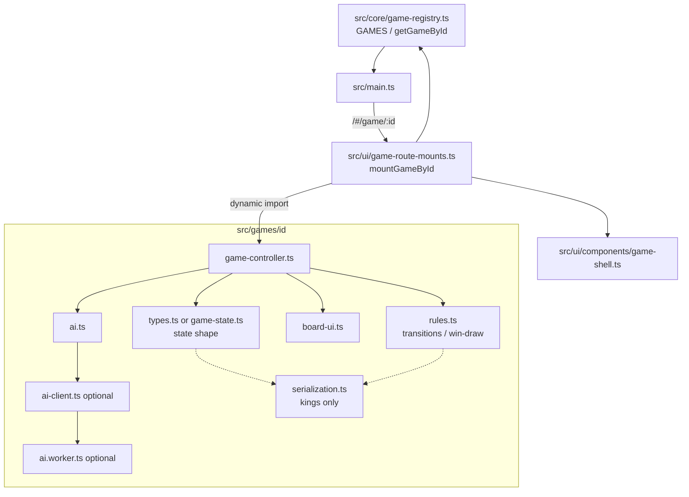

# Engine developer reference

Contributor-only docs for the 20 Math Pentathlon game engines. **Not player-facing.**

These pages describe what the **code** does (state, moves, phases, win/draw helpers, serialization, tests, TODOs). They do not restate or edit official rules text. Where code and existing docs disagree, see each page’s **Questions for Andrew**.

## Scope boundaries

| In scope | Out of scope |
| -------- | ------------ |
| `docs/dev/engines/*.md` + `scripts/check-dev-doc-links.mjs` | Any `src/` changes |
| Engine/module wiring for contributors | Player-facing copy, tutorials, rules text |
| Linking to wiki architecture | Replacing [#475](https://github.com/fuzzywigg/math-pentathlon/issues/475) wiki architecture |
| Linking to docs-sync | Overlapping [#496](https://github.com/fuzzywigg/math-pentathlon/issues/496) docs sync |

Wiki architecture / registry / testing docs: [docs/wiki/architecture.md](../../wiki/architecture.md), [docs/wiki/game-registry.md](../../wiki/game-registry.md), [docs/wiki/development.md](../../wiki/development.md) (#475).

## Module map

Registry → lazy mount → engine → UI → AI adapter:



Typical game folder (most engines): `types.ts` + `rules.ts` + `board-ui.ts` + `game-controller.ts` + `ai.ts`. Kings & Quadraphages uses `game-state.ts` + `serialization.ts` instead of `types.ts`. Worker AI today: Hex, FIAR, Fab-a-Diffy, Queens & Guards.

Mid-game board persistence is **not** productized for 19/20 games. Kings has a serialize codec unused by its controller. Round-trip tests use `tests/unit/helpers/state-roundtrip.ts` (`jsonRoundTrip` / Map revive). App progress storage: `math-pentathlon-progress` in `src/core/storage/storage.ts` (stats/profile only).

## Games index

| Id | Division | Doc |
| -- | -------- | --- |
| `kings-quadraphages` | I | [kings-quadraphages.md](./kings-quadraphages.md) |
| `hex` | I | [hex.md](./hex.md) |
| `star-track` | I | [star-track.md](./star-track.md) |
| `hex-a-gone` | I | [hex-a-gone.md](./hex-a-gone.md) |
| `calla` | I | [calla.md](./calla.md) |
| `sum-dominoes` | II | [sum-dominoes.md](./sum-dominoes.md) |
| `par-55` | II | [par-55.md](./par-55.md) |
| `ramrod` | II | [ramrod.md](./ramrod.md) |
| `kwatro-sinko` | II | [kwatro-sinko.md](./kwatro-sinko.md) |
| `fiar` | II | [fiar.md](./fiar.md) |
| `juggle` | III | [juggle.md](./juggle.md) |
| `contig-60` | III | [contig-60.md](./contig-60.md) |
| `stars-bars` | III | [stars-bars.md](./stars-bars.md) |
| `fab-a-diffy` | III | [fab-a-diffy.md](./fab-a-diffy.md) |
| `queens-guards` | III | [queens-guards.md](./queens-guards.md) |
| `prime-gold` | IV | [prime-gold.md](./prime-gold.md) |
| `remainder-islands` | IV | [remainder-islands.md](./remainder-islands.md) |
| `pent-em-in` | IV | [pent-em-in.md](./pent-em-in.md) |
| `frac-fact` | IV | [frac-fact.md](./frac-fact.md) |
| `fraction-pinball` | IV | [fraction-pinball.md](./fraction-pinball.md) |

## Verifying references

Report-only (always exit 0):

```bash
node scripts/check-dev-doc-links.mjs
```

Each game doc ends with a ` ```dev-doc-refs ` fence listing `path` or `path#Symbol` entries the checker validates.

```dev-doc-refs
src/core/game-registry.ts#GAMES
src/ui/game-route-mounts.ts#mountGameById
src/core/storage/storage.ts
tests/unit/helpers/state-roundtrip.ts#jsonRoundTrip
docs/wiki/architecture.md
docs/wiki/game-registry.md
docs/wiki/development.md
docs/wiki/games.md
docs/wiki/adding-a-game.md
docs/RULES-DECISIONS-2026-10-07.md
scripts/check-dev-doc-links.mjs
```
