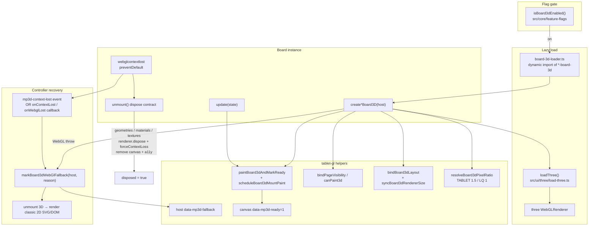
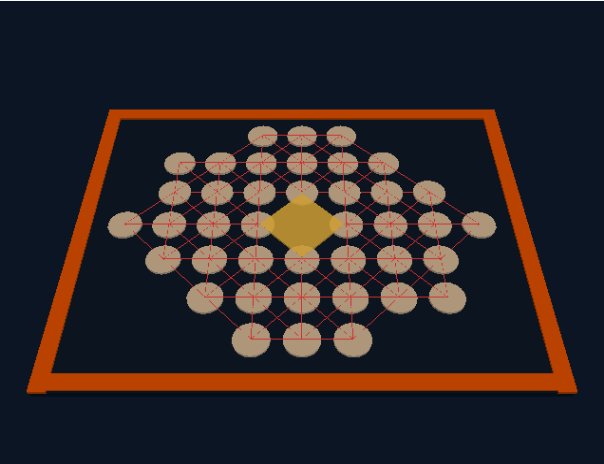
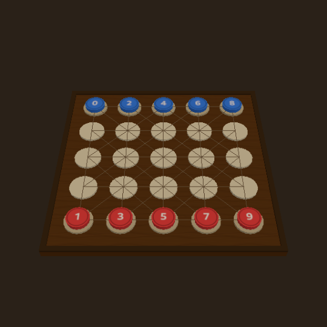
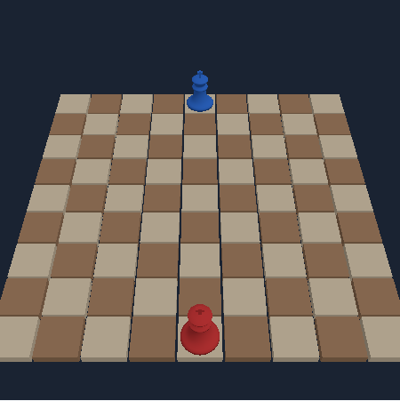
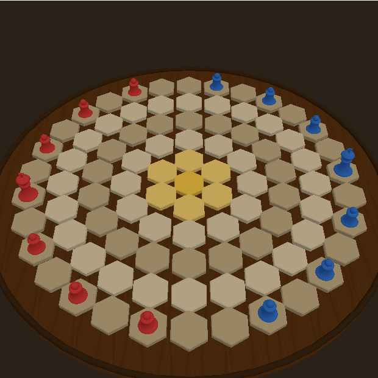
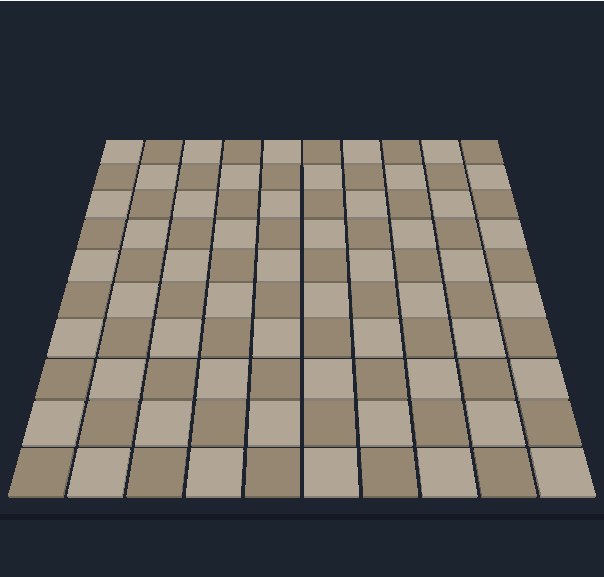
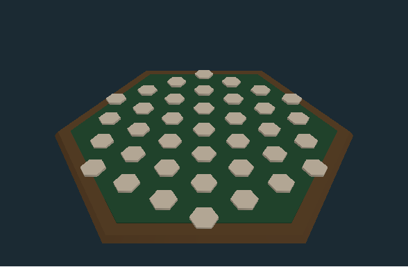
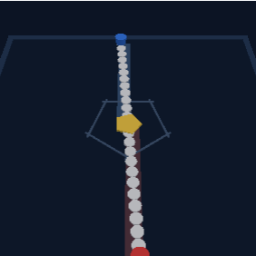
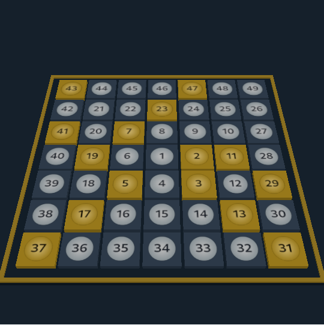

# Board3D WebGL lifecycle (`load-three` · `tablet-gl` · context-lost · dispose)

Task id: `q-mp-072`

Tip SHA documented: `9748c908` (`cursor/integration-fold-wave5-tip-4af0`).

**Depends on:** [q-mp-031 (#589)](https://github.com/fuzzywigg/math-pentathlon/pull/589) — `webglcontextlost` lifecycle tests for pent-em-in + star-track (draft). Context-lost → 2D fallback inventory also covered in [`runtime-error-path-audit.md`](../runtime-error-path-audit.md) (R-GL-01…08).

**Scope:** docs + SwiftShader screenshots only. No `src/` edits, no player-facing copy, no `visual-baseline` / `gallery` changes.

## Why these modules exist

Eight practice games ship an optional Three.js board behind the `board3d` flag. The shell must never statically pull Three.js into the initial graph; tablet / CI software-GL (SwiftShader) needs shared pixel-ratio, paint-ready, and fallback helpers; and a lost WebGL context must tear down GPU resources then remount the classic 2D board.

| Piece | Path | Role |
| --- | --- | --- |
| Lazy Three import | [`src/ui/three/load-three.ts`](../../../src/ui/three/load-three.ts) | Isolated `import('three')` so unit tests can mock and game chunks stay lazy |
| Shared GL helpers | [`src/ui/three/tablet-gl.ts`](../../../src/ui/three/tablet-gl.ts) | DPR cap, `board3dLQ`, preserveDrawingBuffer, paint-ready / fallback attrs, layout + visibility |
| Per-game 3D board | eight `src/ui/three/*-board-3d.ts` modules | Renderer, scene, `webglcontextlost` handler, `unmount()` dispose |
| Per-game loader | eight `board-3d-loader.ts` files under `src/games/` | Dynamic import gate kept in the game package |
| Controller | each game’s `game-controller.ts` under `src/games/` | Flag gate, mount, context-lost → 2D remount |

## Lifecycle diagram



## `load-three`

[`src/ui/three/load-three.ts`](../../../src/ui/three/load-three.ts) is a one-liner wrapper:

```ts
export function loadThree(): Promise<ThreeModule> {
  return import('three');
}
```

Boards call `await loadThree()` inside `create*Board3D` instead of a static `import 'three'`. That keeps Three out of the main/game initial chunk graph and lets lifecycle unit tests `vi.doMock('../../src/ui/three/load-three', …)` with a fake `WebGLRenderer`.

## `tablet-gl`

[`src/ui/three/tablet-gl.ts`](../../../src/ui/three/tablet-gl.ts) is the shared tablet / CI software-GL profile used by all eight boards:

| Export | Contract |
| --- | --- |
| `TABLET_PIXEL_RATIO_CAP` (1.5) / `BOARD_3D_LQ_PIXEL_RATIO_CAP` (1) | Cap drawing-buffer size; LQ via `?board3dLQ=1` or `mp-board3d-lq` |
| `shouldPreserveDrawingBuffer()` | On for Playwright (`navigator.webdriver`) or explicit opt-in |
| `paintBoard3dAndMarkReady` | Try paint → set `data-mp3d-ready="1"`; one rAF retry on throw (SwiftShader first-frame) |
| `scheduleBoard3dMountPaint` | Double-rAF after mount so layout settles under software GL; returns cancel for unmount |
| `markBoard3dWebGlFallback` / `clearBoard3dWebGlFallback` | Host `data-mp3d-fallback` so e2e fails fast instead of waiting on a missing canvas |
| `bindBoard3dLayout` + `syncBoard3dRendererSize` | window / visualViewport / ResizeObserver → DPR + camera aspect |
| `bindPageVisibility` / `canPaint3d` | Skip paints while `document.hidden` |

See also [`docs/mp3d-e2e-flake-2026-10-07.md`](../../mp3d-e2e-flake-2026-10-07.md) for the SwiftShader ready-signal story.

## Context-lost → 2D fallback

Every board listens for `webglcontextlost`, calls `preventDefault()`, then notifies the controller. Controllers remount the classic 2D board and set `data-mp3d-fallback="context-lost"` (event path) or tear down via callback (hex / star-track).

| Board | Notify | Controller recovery | Lifecycle test |
| --- | --- | --- | --- |
| `kings-quadraphages` | `mp3d-context-lost` | remount 2D + `markBoard3dWebGlFallback` | `mp3d-kings-board-3d-lifecycle.test.ts` |
| `queens-guards` | `mp3d-context-lost` | remount 2D + mark | `mp3d-queens-guards-board-3d-lifecycle.test.ts` |
| `fiar` | `mp3d-context-lost` | remount 2D + mark | `mp3d-fiar-board-3d-lifecycle.test.ts` |
| `kwatro-sinko` | `mp3d-context-lost` | remount 2D + mark | `mp3d-kwatro-sinko-board-3d-lifecycle.test.ts` |
| `pent-em-in` | `mp3d-context-lost` | remount 2D + mark | `mp3d-pent-em-in-board-3d-lifecycle.test.ts` (#589) |
| `prime-gold` | `mp3d-context-lost` | remount 2D + mark | `mp3d-prime-gold-board-3d-lifecycle.test.ts` (#567) |
| `hex-a-gone` | `onWebglLost` callback | `fallBackTo2dBoard()` | pattern + unavailable throw |
| `star-track` | `onContextLost` callback | `fallbackTo2dBoard()` | `mp3d-star-track-board-3d-lifecycle.test.ts` (#589) |

Mount failure (no context / `WebGLRenderer` throw) uses the same `markBoard3dWebGlFallback(host, 'webgl-unavailable')` path and keeps the 2D board.

## Dispose contract (`unmount`)

Shared contract across the eight `*-board-3d.ts` modules:

1. **Idempotent** — `if (disposed) return;` then `disposed = true`.
2. **Cancel pending paints** — cancel the `scheduleBoard3dMountPaint` handle so a late rAF cannot render after teardown.
3. **Drop listeners** — `webglcontextlost`, pointer, layout, visibility; clear any `window.__mp3d*` e2e hooks.
4. **Detach scene graph** — remove meshes / root from the scene (shared geos stay until step 5).
5. **GPU dispose** — geometries, materials, textures (maps / label atlases), then `renderer.dispose()` and optional `renderer.forceContextLoss?.()`.
6. **DOM** — remove canvas + a11y grid from the host; strip host 3D classes.

Context-lost handlers either call the same `unmount` (event-path boards) or invoke the controller callback, which unmounts then re-renders 2D. Controllers must not leave a half-dead renderer attached when falling back.

## SwiftShader screenshots (8 boards)

Captured under Chromium with Playwright’s SwiftShader ANGLE args (`--use-gl=angle`, `--use-angle=swiftshader-webgl`, `--enable-unsafe-swiftshader`) and `board3dLQ` enabled — the same profile as CI mp3d specs. Artifacts live under [`docs/screenshots/mp3d/`](../../screenshots/mp3d/) (not `gallery/` / not `visual-baseline`).

| Board | Screenshot |
| --- | --- |
| FIAR |  |
| Kwatro-Sinko |  |
| Kings & Quadraphages |  |
| Queens & Guards |  |
| Pent 'Em In |  |
| Hex-a-Gone |  |
| Star Track |  |
| Prime Gold |  |

## Related reading

- [`docs/dev/engines/README.md`](./README.md) — engine module index
- [`docs/dev/runtime-error-path-audit.md`](../runtime-error-path-audit.md) — R-GL inventory
- [`docs/mp3d-e2e-flake-2026-10-07.md`](../../mp3d-e2e-flake-2026-10-07.md) — SwiftShader ready-signal fix notes
- [`docs/e2e-3d-timeouts-2026-10-07.md`](../../e2e-3d-timeouts-2026-10-07.md) — `board3dLQ` + ready waits
- Per-board 3D specs under [`docs/mp3d/`](../../mp3d/)
