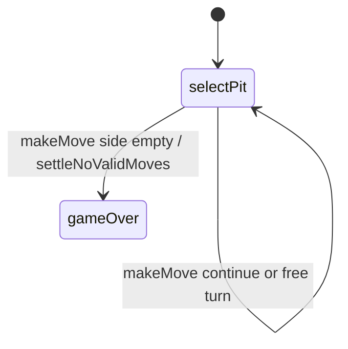

# Calla — engine reference

> Contributor-only. Describes **code** under `src/games/calla/`. Not player-facing rules copy.
>
> Broader wiring: [wiki architecture (#475)](../../wiki/architecture.md) · [game registry](../../wiki/game-registry.md) · [docs sync (#496)](https://github.com/fuzzywigg/math-pentathlon/pull/496).
> Do not duplicate those docs here.

- **Registry id:** `calla` (Division I)
- **Mount:** `src/ui/game-route-mounts.ts` → `case 'calla'` → `src/games/calla/game-controller.ts`
- **UI:** `src/games/calla/board-ui.ts`
- **Rules / state:** `src/games/calla/rules.ts`, `src/games/calla/types.ts`
- **AI adapter:** `src/games/calla/ai.ts`

## State shape

Primary type: `CallaGameState` in `src/games/calla/types.ts`.

| Field |
| --- |
| `player1Pits` |
| `player2Pits` |
| `player1Calla` |
| `player2Calla` |
| `currentPlayer` |
| `phase` |
| `animatingPit` |
| `lastSownPit` |
| `moveHistory` |
| `winner` |

```ts
export interface CallaGameState {
  // Player 1's pits (indices 0-4, left to right from P1's view)
  player1Pits: number[];
  // Player 2's pits (indices 0-4, left to right from P2's view)
  player2Pits: number[];
  // Player stores (Callas)
  player1Calla: number;
  player2Calla: number;

  // Current turn
  currentPlayer: Player;
  phase: GamePhase;

  // Animation state
  animatingPit: number | null;
  lastSownPit: { side: 'player1' | 'player2' | 'calla'; index: number } | null;

  // Move history
  moveHistory: MoveRecord[];

  // Winner
  winner: Player | 'tie' | null;
}
```

## Move types

- `MoveRecord` — `src/games/calla/types.ts`

```ts
export interface MoveRecord {
  player: Player;
  pitIndex: number;
  cubesDistributed: number;
  captured: number;
  gotFreeTurn: boolean;
  moveNumber: number;
}
```

### Apply / advance functions

- `makeMove` — `src/games/calla/rules.ts`
- `settleNoValidMoves` — `src/games/calla/rules.ts`

## Turn / phase state machine

Phase type: `GamePhase` in `src/games/calla/types.ts`.

```ts
export type GamePhase = 'selectPit' | 'animating' | 'gameOver';
```



## Win / draw detection

| Function | File | What the code does |
| --- | --- | --- |
| `isGameOver` | `src/games/calla/rules.ts` | `phase === gameOver` or winner set. |
| `makeMove` | `src/games/calla/rules.ts` | Empty side scoops remaining into Callas; compare stores (`tie` if equal). |
| `settleNoValidMoves` | `src/games/calla/rules.ts` | Soft-lock settle when current seat has no pits. |

## Serialization format

No dedicated codec. No `Map`/`Set` → JSON / `structuredClone`.

Shared progress storage (`src/core/storage/storage.ts`) persists stats/profile only, not in-progress boards.

## AI adapter

- `getAIMove` — `src/games/calla/ai.ts`
- `analyzeMoves` — `src/games/calla/ai.ts`
- `isAITurn` — `src/games/calla/ai.ts`

## Tests that cover this engine

Imports from `src/games/calla/` (non-exhaustive; prefer these first):

- `tests/unit/burn-wave35-calla-empty-valids-ai-null.test.ts`
- `tests/unit/burn-wave40-calla-makemove-reject-phase.test.ts`
- `tests/unit/burn-wave41-calla-ai-analyze.test.ts`
- `tests/unit/burn-wave41-calla-gameover-phase-msg.test.ts`
- `tests/unit/burn-wave41-calla-phase-messages.test.ts`
- `tests/unit/burn-wave41-calla-valid-pits-phase.test.ts`
- `tests/unit/burn-wave43-calla-ai-analyze-difficulties.test.ts`
- `tests/unit/burn-wave43-calla-gameover-tie-win.test.ts`
- `tests/unit/calla-ai.test.ts`
- `tests/unit/calla-rules.test.ts`
- `tests/unit/overnight-calla-ai-p2-seat-move.test.ts`
- `tests/unit/overnight-calla-phase-message-matrix.test.ts`
- `tests/unit/overnight-wave50-calla-ai-analyze-reasons.test.ts`
- `tests/unit/overnight-wave50-calla-ai-animating-winner-gate.test.ts`
- `tests/unit/overnight-wave50-calla-ai-win-easy-random.test.ts`
- `tests/unit/overnight-wave50-calla-controller-ai-chain.test.ts`
- `tests/unit/overnight-wave50-calla-controller-ai-timer.test.ts`
- `tests/unit/overnight-wave50-calla-rules-p2-capture.test.ts`
- `tests/unit/helpers/state-roundtrip-games.ts`

Also exercised by cross-game suites that import the module where listed above (round-trip helper, undo-audit props, registry/mount smoke).

## Known TODOs in code comments

- `src/games/calla/types.ts` — GamePhase includes unused `"animating"` — not assigned in `rules.ts`.

## Key symbols (link-check table)

| Symbol | File |
| --- | --- |
| `CallaGameState` | `src/games/calla/types.ts` |
| `MoveRecord` | `src/games/calla/types.ts` |
| `makeMove` | `src/games/calla/rules.ts` |
| `settleNoValidMoves` | `src/games/calla/rules.ts` |
| `GamePhase` | `src/games/calla/types.ts` |
| `isGameOver` | `src/games/calla/rules.ts` |
| `getAIMove` | `src/games/calla/ai.ts` |
| `analyzeMoves` | `src/games/calla/ai.ts` |
| `isAITurn` | `src/games/calla/ai.ts` |
| *(module)* | `src/games/calla/game-controller.ts` |
| *(module)* | `src/games/calla/board-ui.ts` |
| *(module)* | `src/games/calla/rules.ts` |
| *(module)* | `src/games/calla/ai.ts` |
| *(module)* | `src/games/calla/tutorial.ts` |
| *(module)* | `src/ui/game-route-mounts.ts` |
| *(module)* | `src/core/game-registry.ts` |

## Questions for Andrew

Flagged code-vs-docs disagreements only (no rules text edited here). See also `docs/RULES-DECISIONS-2026-10-07.md` and `docs/tutorial-engine-mismatches-2026-10-07.md`.

- None specific beyond the shared decision checklist (or already aligned in RULES/tutorial mismatch docs).
