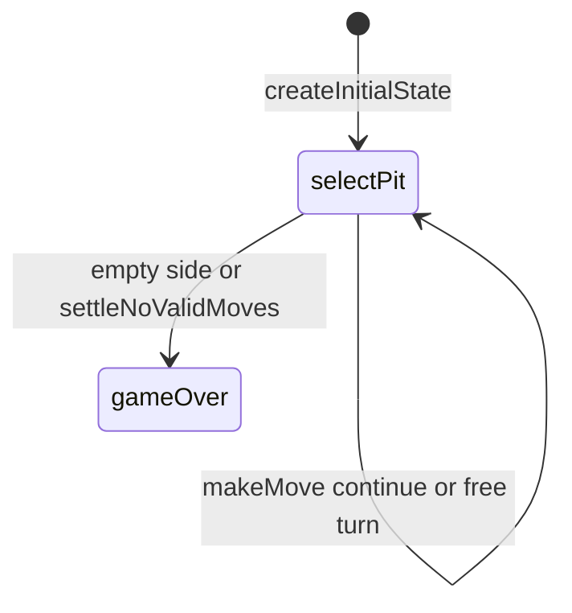

# Calla engine (`calla`)

> Contributor reference for what the **code** does. Not player-facing.
> Do not treat this as official rules text. Wiki architecture: [docs/wiki/architecture.md](../../wiki/architecture.md) ([#475](https://github.com/fuzzywigg/math-pentathlon/issues/475)).
> Docs-sync work: see [#496](https://github.com/fuzzywigg/math-pentathlon/issues/496) — this page does not replace it.

**Division:** Division I · **Registry id:** `calla`

## Module files

- `src/games/calla/types.ts`
- `src/games/calla/rules.ts`
- `src/games/calla/index.ts`

**AI adapter**

- `src/games/calla/ai.ts`

**UI entry**

- `src/games/calla/board-ui.ts`
- `src/games/calla/game-controller.ts`

## State shape

Primary type `CallaGameState` in `src/games/calla/types.ts`.

- `player1Pits` / `player2Pits: number[]`
- `player1Calla` / `player2Calla: number`
- `phase: GamePhase` — `'selectPit' | 'animating' | 'gameOver'`
- `animatingPit` / `lastSownPit`
- `winner: Player | 'tie' | null`
- `moveHistory: MoveRecord[]`

## Move types

Apply `makeMove(state, pitIndex)`. Soft-lock: `settleNoValidMoves`.

Apply / query API:

- `makeMove`
- `settleNoValidMoves`
- `canSelectPit` / `getValidPits`
- `isGameOver`

## Turn / phase state machine

Phases in code: `selectPit`, `animating (unused by makeMove)`, `gameOver`.



## Win / draw detection

- Scoop + compare Callas when a side empties or soft-lock settles
- `winner` may be `'tie'`
- `isGameOver`

## Serialization format

No codec. Optional barrel `index.ts`. In-memory `getGameState()`.

## Tests that cover this engine

- `tests/unit/engine-coverage-calla-targeted.test.ts`
- `tests/unit/calla-rules.test.ts`
- `tests/unit/calla-ai.test.ts`
- `tests/unit/burn-wave41-calla-capture-free-turn.test.ts`
- `tests/unit/burn-wave43-calla-gameover-tie-win.test.ts`
- `tests/unit/burn-wave40-calla-makemove-reject-phase.test.ts`
- `tests/unit/state-roundtrip-fuzz.test.ts`
- `tests/unit/undo-audit-core-games-props.test.ts`

## Known TODOs (from code comments)

- Dead phase `'animating'` never assigned by `makeMove`.

## Questions for Andrew

Yes/no decisions; recommendations are non-binding.

- **Q:** Drive `'animating'` from controller or drop from `GamePhase`?
  - **Recommendation:** Drive from controller, or remove.
- **Q:** Keep soft-lock settle as official end (RULES CA1)?
  - **Recommendation:** Yes — keep.

## Related reading

- Index: [README.md](./README.md)
- Wiki games catalog: [docs/wiki/games.md](../../wiki/games.md)
- Wiki architecture (#475): [docs/wiki/architecture.md](../../wiki/architecture.md)
- Adding a game: [docs/wiki/adding-a-game.md](../../wiki/adding-a-game.md)
- Rules decision log (do not edit rules here): [docs/RULES-DECISIONS-2026-10-07.md](../../RULES-DECISIONS-2026-10-07.md)

```dev-doc-refs
src/games/calla/types.ts#CallaGameState
src/games/calla/types.ts#GamePhase
src/games/calla/types.ts#createInitialState
src/games/calla/rules.ts#makeMove
src/games/calla/rules.ts#isGameOver
src/games/calla/rules.ts#settleNoValidMoves
src/games/calla/ai.ts#getAIMove
src/games/calla/game-controller.ts#initGame
src/games/calla/board-ui.ts#renderBoard
tests/unit/engine-coverage-calla-targeted.test.ts
tests/unit/calla-rules.test.ts
src/core/game-registry.ts#GAMES
src/ui/game-route-mounts.ts#mountGameById
```
