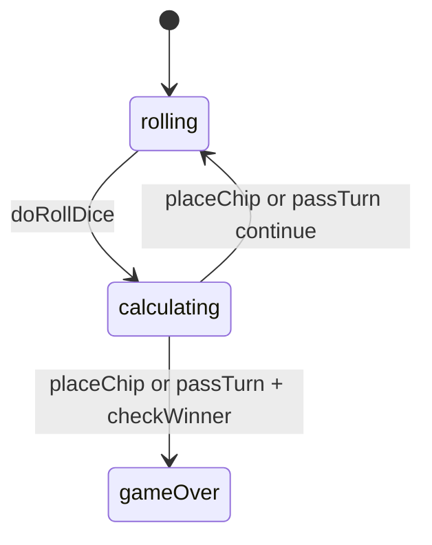

# Contig 60 — engine reference

> Contributor-only. Describes **code** under `src/games/contig-60/`. Not player-facing rules copy.
>
> Broader wiring: [wiki architecture (#475)](../../wiki/architecture.md) · [game registry](../../wiki/game-registry.md) · [docs sync (#496)](https://github.com/fuzzywigg/math-pentathlon/pull/496).
> Do not duplicate those docs here.

- **Registry id:** `contig-60` (Division III)
- **Mount:** `src/ui/game-route-mounts.ts` → `case 'contig-60'` → `src/games/contig-60/game-controller.ts`
- **UI:** `src/games/contig-60/board-ui.ts`
- **Rules / state:** `src/games/contig-60/rules.ts`, `src/games/contig-60/types.ts`
- **AI adapter:** `src/games/contig-60/ai.ts`

## State shape

Primary type: `ContigState` in `src/games/contig-60/types.ts`.

| Field |
| --- |
| `cells` |
| `grid` |
| `currentPlayer` |
| `currentDice` |
| `currentExpression` |
| `scores` |
| `consecutivePasses` |
| `winner` |
| `moveHistory` |
| `phase` |

```ts
export interface ContigState {
  cells: Map<number, ContigCell>; // Map from value to cell
  grid: (number | null)[][]; // 2D grid for adjacency (value at each position)
  currentPlayer: Player;
  currentDice: [number, number, number] | null; // Current dice roll
  currentExpression: string | null; // Expression being built
  scores: { player1: number; player2: number };
  consecutivePasses: { player1: number; player2: number };
  winner: ContigWinner | null;
  moveHistory: ContigMove[];
  phase: 'rolling' | 'calculating' | 'placing' | 'gameOver';
}
```

## Move types

- `ContigMove` — `src/games/contig-60/types.ts`

```ts
export interface ContigMove {
  player: Player;
  dice: [number, number, number];
  expression: string;
  result: number;
  points: number;
  moveNumber: number;
}
```

### Apply / advance functions

- `doRollDice` — `src/games/contig-60/rules.ts`
- `placeChip` — `src/games/contig-60/rules.ts`
- `passTurn` — `src/games/contig-60/rules.ts`

## Turn / phase state machine

Phase field is an inline string union on `ContigState` in `src/games/contig-60/types.ts` (not a separate exported `GamePhase` alias).



## Win / draw detection

| Function | File | What the code does |
| --- | --- | --- |
| `checkWinner` | `src/games/contig-60/rules.ts` | 5-in-a-row via `countNInARows` / `checkFiveInRow`; full board / settle → `alignmentTiebreak`. |
| `alignmentTiebreak` | `src/games/contig-60/rules.ts` | Most 4s, then most 3s, else `draw`. |
| `isBoardFull` | `src/games/contig-60/rules.ts` | Board occupancy check for settle. |

## Serialization format

No dedicated codec. **`cells: Map`** — Map-aware JSON / `structuredClone`.

Shared progress storage (`src/core/storage/storage.ts`) persists stats/profile only, not in-progress boards.

## AI adapter

- `getAIPlacement` — `src/games/contig-60/ai.ts`
- `executeAITurn` — `src/games/contig-60/ai.ts`
- `isAITurn` — `src/games/contig-60/ai.ts`

## Tests that cover this engine

Imports from `src/games/contig-60/` (non-exhaustive; prefer these first):

- `tests/unit/burn-wave40-contig60-pass-elim-phase.test.ts`
- `tests/unit/burn-wave40-contig60-points-phase-noop.test.ts`
- `tests/unit/burn-wave41-contig-ai-execute-difficulties.test.ts`
- `tests/unit/burn-wave41-contig-ai-placement-hard.test.ts`
- `tests/unit/burn-wave41-contig-diagonal-five-win.test.ts`
- `tests/unit/burn-wave41-contig-pass-elim-winner.test.ts`
- `tests/unit/burn-wave41-contig-pass-winner.test.ts`
- `tests/unit/burn-wave41-contig-place-pass-winner.test.ts`
- `tests/unit/burn-wave41-contig-roll-phase.test.ts`
- `tests/unit/burn-wave42-contig-ai-block-threat.test.ts`
- `tests/unit/burn-wave42-contig-ai-chain-extend.test.ts`
- `tests/unit/burn-wave42-contig-ai-randomness-top3.test.ts`
- `tests/unit/burn-wave42-contig-winner-points-matrix.test.ts`
- `tests/unit/burn-wave43-contig-fullboard-points-win.test.ts`
- `tests/unit/burn-wave44-contig-winner-fullboard-points.test.ts`
- `tests/unit/burn-wave45-contig-ai-block-diagonal-threat.test.ts`
- `tests/unit/burn-wave45-contig-ai-center-row-bias.test.ts`
- `tests/unit/burn-wave45-contig-ai-chain-extend-strength.test.ts`
- `tests/unit/helpers/state-roundtrip-games.ts`

Also exercised by cross-game suites that import the module where listed above (round-trip helper, undo-audit props, registry/mount smoke).

## Known TODOs in code comments

- `src/games/contig-60/types.ts` — Phase union includes `"placing"` never set by `rules.ts` (controller exhaustiveness only).

## Key symbols (link-check table)

| Symbol | File |
| --- | --- |
| `ContigState` | `src/games/contig-60/types.ts` |
| `ContigMove` | `src/games/contig-60/types.ts` |
| `doRollDice` | `src/games/contig-60/rules.ts` |
| `placeChip` | `src/games/contig-60/rules.ts` |
| `passTurn` | `src/games/contig-60/rules.ts` |
| `checkWinner` | `src/games/contig-60/rules.ts` |
| `alignmentTiebreak` | `src/games/contig-60/rules.ts` |
| `isBoardFull` | `src/games/contig-60/rules.ts` |
| `getAIPlacement` | `src/games/contig-60/ai.ts` |
| `executeAITurn` | `src/games/contig-60/ai.ts` |
| `isAITurn` | `src/games/contig-60/ai.ts` |
| *(module)* | `src/games/contig-60/game-controller.ts` |
| *(module)* | `src/games/contig-60/board-ui.ts` |
| *(module)* | `src/games/contig-60/rules.ts` |
| *(module)* | `src/games/contig-60/ai.ts` |
| *(module)* | `src/games/contig-60/tutorial.ts` |
| *(module)* | `src/ui/game-route-mounts.ts` |
| *(module)* | `src/core/game-registry.ts` |

## Questions for Andrew

Flagged code-vs-docs disagreements only (no rules text edited here). See also `docs/RULES-DECISIONS-2026-10-07.md` and `docs/tutorial-engine-mismatches-2026-10-07.md`.

- **CT1:** Simultaneous 5-in-a-row prefers player1 by `checkWinner` order.
  - Recommendation: **Yes** — Confirm preferred seat on simultaneous lines.
