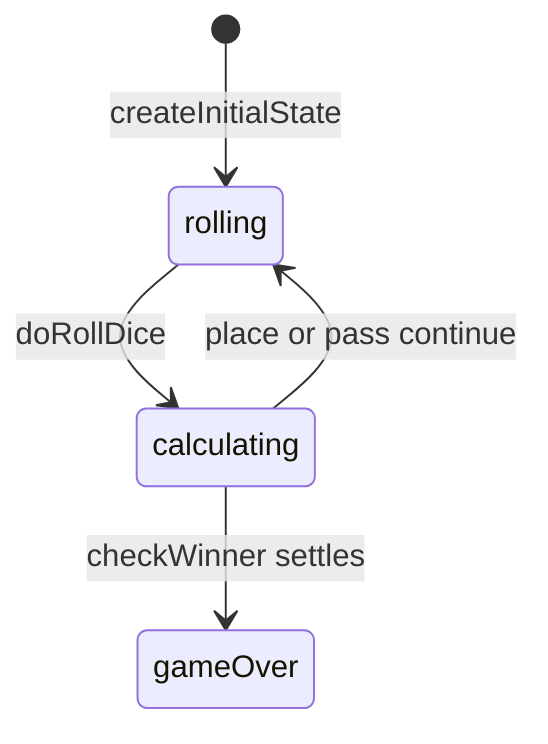

# Contig 60 engine (`contig-60`)

> Contributor reference for what the **code** does. Not player-facing.
> Do not treat this as official rules text. Wiki architecture: [docs/wiki/architecture.md](../../wiki/architecture.md) ([#475](https://github.com/fuzzywigg/math-pentathlon/issues/475)).
> Docs-sync work: see [#496](https://github.com/fuzzywigg/math-pentathlon/issues/496) — this page does not replace it.

**Division:** Division III · **Registry id:** `contig-60`

## Module files

- `src/games/contig-60/types.ts`
- `src/games/contig-60/rules.ts`

**AI adapter**

- `src/games/contig-60/ai.ts`

**UI entry**

- `src/games/contig-60/board-ui.ts`
- `src/games/contig-60/game-controller.ts`

## State shape

Primary type `ContigState` in `src/games/contig-60/types.ts`.

- `cells: Map<number, ContigCell>` / `grid`
- `currentDice` / `currentExpression` / `scores`
- `consecutivePasses`
- `phase: 'rolling' | 'calculating' | 'placing' | 'gameOver'`
- `winner: ContigWinner | null` (`Player | 'draw'`)
- `moveHistory: ContigMove[]`

## Move types

History `ContigMove`. Apply `doRollDice`, `placeChip(state, value, expression)`, `passTurn`. Init in `types.ts`.

Apply / query API:

- `doRollDice` → always `calculating`
- `placeChip` / `passTurn` + `checkWinner`
- `alignmentTiebreak` / `isBoardFull` / `hasValidMoves`

## Turn / phase state machine

Phases in code: `rolling`, `calculating`, `placing (typed, never assigned)`, `gameOver`.



## Win / draw detection

- `checkWinner(state, options?)` → `ContigWinner | null`
- Immediate 5-in-a-row; full board / settle → most 4s then 3s else `'draw'`

## Serialization format

`cells` Map needs revive. No product board save.

## Tests that cover this engine

- `tests/unit/contig-60-rules.test.ts`
- `tests/unit/contig-60-end-rules.test.ts`
- `tests/unit/contig-60-ai.test.ts`
- `tests/unit/burn-wave35-contig-60-fullboard-score-tie.test.ts`
- `tests/unit/burn-wave41-contig-diagonal-five-win.test.ts`
- `tests/unit/burn-wave41-contig-place-pass-winner.test.ts`
- `tests/unit/state-roundtrip-fuzz.test.ts`

## Known TODOs (from code comments)

- No tagged TODOs. `'placing'` phase never assigned by rules.

## Questions for Andrew

Yes/no decisions; recommendations are non-binding.

- **Q:** Keep unused `'placing'` in the phase union?
  - **Recommendation:** No — remove unless controller will use it.
- **Q:** Simultaneous 5-in-a-row prefers player1 (RULES CT1) — confirm?
  - **Recommendation:** Yes — keep until official tiebreak exists.

## Related reading

- Index: [README.md](./README.md)
- Wiki games catalog: [docs/wiki/games.md](../../wiki/games.md)
- Wiki architecture (#475): [docs/wiki/architecture.md](../../wiki/architecture.md)
- Adding a game: [docs/wiki/adding-a-game.md](../../wiki/adding-a-game.md)
- Rules decision log (do not edit rules here): [docs/RULES-DECISIONS-2026-10-07.md](../../RULES-DECISIONS-2026-10-07.md)

```dev-doc-refs
src/games/contig-60/types.ts#ContigState
src/games/contig-60/types.ts#createInitialState
src/games/contig-60/rules.ts#doRollDice
src/games/contig-60/rules.ts#placeChip
src/games/contig-60/rules.ts#passTurn
src/games/contig-60/rules.ts#checkWinner
src/games/contig-60/rules.ts#alignmentTiebreak
src/games/contig-60/ai.ts#executeAITurn
src/games/contig-60/game-controller.ts#initGame
src/games/contig-60/board-ui.ts#renderBoard
tests/unit/contig-60-rules.test.ts
tests/unit/contig-60-end-rules.test.ts
src/core/game-registry.ts#GAMES
src/ui/game-route-mounts.ts#mountGameById
```
