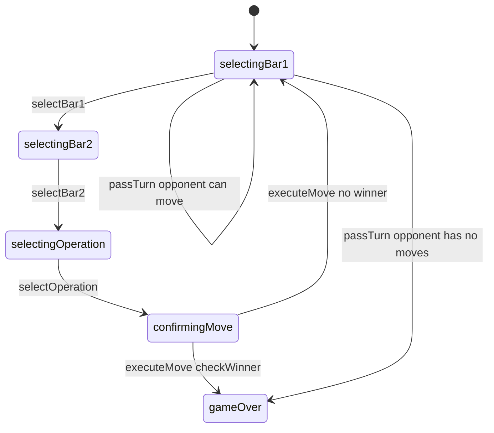

# Fab-a-Diffy — engine reference

> Contributor-only. Describes **code** under `src/games/fab-a-diffy/`. Not player-facing rules copy.
>
> Broader wiring: [wiki architecture (#475)](../../wiki/architecture.md) · [game registry](../../wiki/game-registry.md) · [docs sync (#496)](https://github.com/fuzzywigg/math-pentathlon/pull/496).
> Do not duplicate those docs here.

- **Registry id:** `fab-a-diffy` (Division III)
- **Mount:** `src/ui/game-route-mounts.ts` → `case 'fab-a-diffy'` → `src/games/fab-a-diffy/game-controller.ts`
- **UI:** `src/games/fab-a-diffy/board-ui.ts`
- **Rules / state:** `src/games/fab-a-diffy/rules.ts`, `src/games/fab-a-diffy/types.ts`
- **AI adapter:** `src/games/fab-a-diffy/ai.ts` + worker client

## State shape

Primary type: `FabADiffyState` in `src/games/fab-a-diffy/types.ts`.

| Field |
| --- |
| `fractionBars` |
| `answerBars` |
| `currentPlayer` |
| `selectedBar1` |
| `selectedBar2` |
| `selectedOperation` |
| `phase` |
| `winner` |
| `moveHistory` |
| `scores` |

```ts
export interface FabADiffyState {
  fractionBars: Map<string, FractionBar>; // Available fraction bars
  answerBars: Map<string, AnswerBar>; // Target answers on board
  currentPlayer: Player;
  selectedBar1: string | null;
  selectedBar2: string | null;
  selectedOperation: FractionOperation | null;
  phase: GamePhase;
  winner: Player | null;
  moveHistory: FabMove[];
  scores: { player1: number; player2: number };
}
```

## Move types

- `FabMove` — `src/games/fab-a-diffy/types.ts`

```ts
export interface FabMove {
  player: Player;
  bar1Id: string;
  bar2Id: string;
  operation: FractionOperation;
  resultId: string;
  moveNumber: number;
}
```

- `AIMove` — `src/games/fab-a-diffy/ai.ts`

```ts
export interface AIMove {
  bar1Id: string;
  bar2Id: string;
  operation: FractionOperation;
  answerId: string;
  hint?: string;
}
```

### Apply / advance functions

- `selectBar1` — `src/games/fab-a-diffy/rules.ts`
- `selectBar2` — `src/games/fab-a-diffy/rules.ts`
- `selectOperation` — `src/games/fab-a-diffy/rules.ts`
- `executeMove` — `src/games/fab-a-diffy/rules.ts`
- `passTurn` — `src/games/fab-a-diffy/rules.ts`
- `applyAIMoveSteps` — `src/games/fab-a-diffy/ai.ts`

## Turn / phase state machine

Phase type: `GamePhase` in `src/games/fab-a-diffy/types.ts`.

```ts
export type GamePhase =
  | 'selectingBar1' // Choose first fraction bar
  | 'selectingBar2' // Choose second fraction bar
  | 'selectingOperation' // Choose operation (+, -, ×, ÷)
  | 'confirmingMove' // Confirm the move
  | 'gameOver';
```



## Win / draw detection

| Function | File | What the code does |
| --- | --- | --- |
| `checkWinner` | `src/games/fab-a-diffy/rules.ts` | All answers claimed → majority (equal → player2); nearly all bars used → majority or null tie. |
| `hasAnyValidMove` | `src/games/fab-a-diffy/rules.ts` | Whether any legal pair/op/answer remains. |
| `passTurn` | `src/games/fab-a-diffy/rules.ts` | Can settle via private `determineWinner` when no moves. |

## Serialization format

No dedicated codec. **`fractionBars` + `answerBars` Maps** — Map/Set-aware JSON / `structuredClone`.

Shared progress storage (`src/core/storage/storage.ts`) persists stats/profile only, not in-progress boards.

## AI adapter

- `searchAIMove` — `src/games/fab-a-diffy/ai.ts`
- `getAIMove` — `src/games/fab-a-diffy/ai.ts`
- `applyAIMoveSteps` — `src/games/fab-a-diffy/ai.ts`
- `executeAITurn` — `src/games/fab-a-diffy/ai.ts`
- `getAIMoveAsync` — `src/games/fab-a-diffy/ai-client.ts`
- Worker module: `src/games/fab-a-diffy/ai.worker.ts`
- Shared protocol: `src/core/ai-worker/protocol.ts` (`AiWorkerGameId` includes this game)

## Tests that cover this engine

Imports from `src/games/fab-a-diffy/` (non-exhaustive; prefer these first):

- `tests/unit/burn-wave35-fab-a-diffy-win-draw-settle.test.ts`
- `tests/unit/fab-a-diffy-ai-play-deadline.test.ts`
- `tests/unit/fab-a-diffy-ai.test.ts`
- `tests/unit/fab-a-diffy-rules.test.ts`
- `tests/unit/burn-wave35-fab-a-diffy-format-helpers.test.ts`
- `tests/unit/fab-a-diffy-playability-polish.test.ts`
- `tests/unit/ai-determinism-2026-10-07.test.ts`
- `tests/unit/ai-move-time-midgame.bench.test.ts`
- `tests/unit/ai-worker-parity-fab.test.ts`
- `tests/unit/burn-wave10-win-draw-ai.test.ts`
- `tests/unit/burn-wave11-win-draw-ai.test.ts`
- `tests/unit/burn-wave12-win-draw-ai.test.ts`
- `tests/unit/burn-wave13-win-draw-ai.test.ts`
- `tests/unit/burn-wave14-phase-format.test.ts`
- `tests/unit/burn-wave14-rules-phase.test.ts`
- `tests/unit/burn-wave15-phase-format.test.ts`
- `tests/unit/burn-wave15-rules-phase.test.ts`
- `tests/unit/burn-wave16-ai-accuracy.test.ts`
- `tests/unit/helpers/state-roundtrip-games.ts`

Also exercised by cross-game suites that import the module where listed above (round-trip helper, undo-audit props, registry/mount smoke).

## Known TODOs in code comments

None found under `src/games/fab-a-diffy/` (`TODO` / `FIXME` / `Andrew` comment scan).

## Key symbols (link-check table)

| Symbol | File |
| --- | --- |
| `FabADiffyState` | `src/games/fab-a-diffy/types.ts` |
| `FabMove` | `src/games/fab-a-diffy/types.ts` |
| `AIMove` | `src/games/fab-a-diffy/ai.ts` |
| `selectBar1` | `src/games/fab-a-diffy/rules.ts` |
| `selectBar2` | `src/games/fab-a-diffy/rules.ts` |
| `selectOperation` | `src/games/fab-a-diffy/rules.ts` |
| `executeMove` | `src/games/fab-a-diffy/rules.ts` |
| `passTurn` | `src/games/fab-a-diffy/rules.ts` |
| `applyAIMoveSteps` | `src/games/fab-a-diffy/ai.ts` |
| `GamePhase` | `src/games/fab-a-diffy/types.ts` |
| `checkWinner` | `src/games/fab-a-diffy/rules.ts` |
| `hasAnyValidMove` | `src/games/fab-a-diffy/rules.ts` |
| `searchAIMove` | `src/games/fab-a-diffy/ai.ts` |
| `getAIMove` | `src/games/fab-a-diffy/ai.ts` |
| `executeAITurn` | `src/games/fab-a-diffy/ai.ts` |
| `getAIMoveAsync` | `src/games/fab-a-diffy/ai-client.ts` |
| *(module)* | `src/games/fab-a-diffy/game-controller.ts` |
| *(module)* | `src/games/fab-a-diffy/board-ui.ts` |
| *(module)* | `src/games/fab-a-diffy/rules.ts` |
| *(module)* | `src/games/fab-a-diffy/ai.ts` |
| *(module)* | `src/games/fab-a-diffy/tutorial.ts` |
| *(module)* | `src/games/fab-a-diffy/ai-client.ts` |
| *(module)* | `src/games/fab-a-diffy/ai.worker.ts` |
| *(module)* | `src/core/ai-worker/protocol.ts` |
| *(module)* | `src/ui/game-route-mounts.ts` |
| *(module)* | `src/core/game-registry.ts` |

## Questions for Andrew

Flagged code-vs-docs disagreements only (no rules text edited here). See also `docs/RULES-DECISIONS-2026-10-07.md` and `docs/tutorial-engine-mismatches-2026-10-07.md`.

- **FA1:** Equal answer claims award `player2` (not draw); bars-used path can tie.
  - Recommendation: **Yes** — Yes — equal claims should draw.
