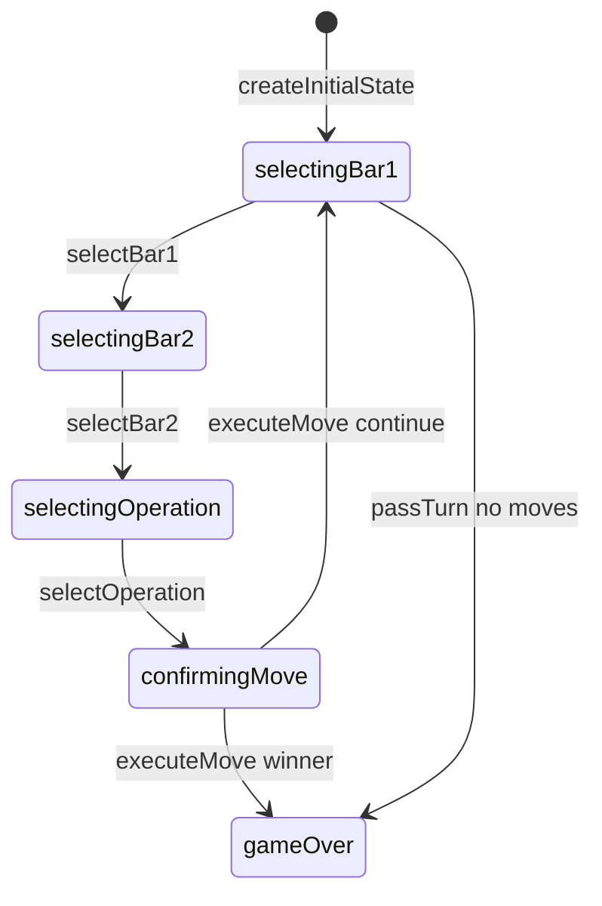

# Fab-a-Diffy engine (`fab-a-diffy`)

> Contributor reference for what the **code** does. Not player-facing.
> Do not treat this as official rules text. Wiki architecture: [docs/wiki/architecture.md](../../wiki/architecture.md) ([#475](https://github.com/fuzzywigg/math-pentathlon/issues/475)).
> Docs-sync work: see [#496](https://github.com/fuzzywigg/math-pentathlon/issues/496) — this page does not replace it.

**Division:** Division III · **Registry id:** `fab-a-diffy`

## Module files

- `src/games/fab-a-diffy/types.ts`
- `src/games/fab-a-diffy/rules.ts`

**AI adapter**

- `src/games/fab-a-diffy/ai.ts`
- `src/games/fab-a-diffy/ai-client.ts`
- `src/games/fab-a-diffy/ai.worker.ts`

**UI entry**

- `src/games/fab-a-diffy/board-ui.ts`
- `src/games/fab-a-diffy/game-controller.ts`

## State shape

Primary type `FabADiffyState` in `src/games/fab-a-diffy/types.ts`.

- `fractionBars: Map<string, FractionBar>`
- `answerBars: Map<string, AnswerBar>`
- `selectedBar1` / `selectedBar2` / `selectedOperation`
- `phase: GamePhase` (bar1 → bar2 → operation → confirm → …)
- `scores` / `winner` / `moveHistory: FabMove[]`

## Move types

History `FabMove`. Apply `selectBar1`, `selectBar2`, `selectOperation`, `executeMove`, `passTurn`, `clearSelection`.

Apply / query API:

- `executeMove(state, answerId)`
- `checkWinner(answerBars, fractionBars)`
- `passTurn` / `hasAnyValidMove`

## Turn / phase state machine

Phases in code: `selectingBar1`, `selectingBar2`, `selectingOperation`, `confirmingMove`, `gameOver`.



## Win / draw detection

- `checkWinner` — all answers claimed: equal claims → **player2** (not draw)
- Near-exhausted bars: equal → `null`
- `passTurn` may settle via private `determineWinner(scores)`

## Serialization format

Maps need revive. AI uses `structuredClone` in `ai-client.ts`. No product board save.

## Tests that cover this engine

- `tests/unit/fab-a-diffy-rules.test.ts`
- `tests/unit/fab-a-diffy-ai.test.ts`
- `tests/unit/ai-worker-parity-fab.test.ts`
- `tests/unit/burn-wave35-fab-a-diffy-win-draw-settle.test.ts`
- `tests/unit/burn-wave43-fab-check-winner-tie-null.test.ts`
- `tests/unit/burn-wave44-fab-check-winner-all-claimed.test.ts`
- `tests/unit/state-roundtrip-fuzz.test.ts`

## Known TODOs (from code comments)

- No tagged TODOs. `CONFIG.TOTAL_ROUNDS` unused by rules. `passTurn` comment mentions both-pass but one pass can end.

## Questions for Andrew

Yes/no decisions; recommendations are non-binding.

- **Q:** Equal answer claims → player2 instead of draw (RULES FA1)?
  - **Recommendation:** No — prefer draw; change only after confirm.
- **Q:** Is unused `CONFIG.TOTAL_ROUNDS` dead, or missing turn-cap logic?
  - **Recommendation:** Treat as dead until a turn-cap is specified.

## Related reading

- Index: [README.md](./README.md)
- Wiki games catalog: [docs/wiki/games.md](../../wiki/games.md)
- Wiki architecture (#475): [docs/wiki/architecture.md](../../wiki/architecture.md)
- Adding a game: [docs/wiki/adding-a-game.md](../../wiki/adding-a-game.md)
- Rules decision log (do not edit rules here): [docs/RULES-DECISIONS-2026-10-07.md](../../RULES-DECISIONS-2026-10-07.md)

```dev-doc-refs
src/games/fab-a-diffy/types.ts#FabADiffyState
src/games/fab-a-diffy/types.ts#GamePhase
src/games/fab-a-diffy/rules.ts#createInitialState
src/games/fab-a-diffy/rules.ts#executeMove
src/games/fab-a-diffy/rules.ts#checkWinner
src/games/fab-a-diffy/rules.ts#passTurn
src/games/fab-a-diffy/rules.ts#hasAnyValidMove
src/games/fab-a-diffy/ai.ts#getAIMove
src/games/fab-a-diffy/ai-client.ts#getAIMoveAsync
src/games/fab-a-diffy/game-controller.ts#initGame
src/games/fab-a-diffy/board-ui.ts#renderFractionBarPool
tests/unit/fab-a-diffy-rules.test.ts
tests/unit/ai-worker-parity-fab.test.ts
src/core/game-registry.ts#GAMES
src/ui/game-route-mounts.ts#mountGameById
```
