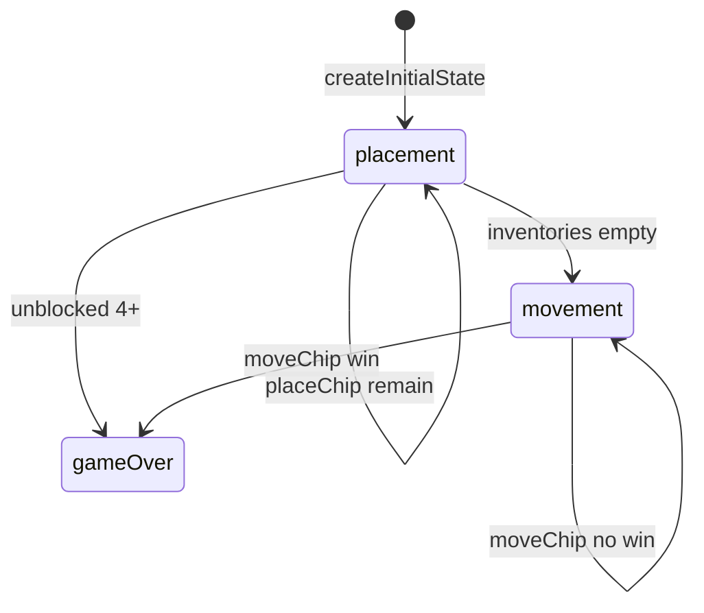

# FIAR engine (`fiar`)

> Contributor reference for what the **code** does. Not player-facing.
> Do not treat this as official rules text. Wiki architecture: [docs/wiki/architecture.md](../../wiki/architecture.md) ([#475](https://github.com/fuzzywigg/math-pentathlon/issues/475)).
> Docs-sync work: see [#496](https://github.com/fuzzywigg/math-pentathlon/issues/496) — this page does not replace it.

**Division:** Division II · **Registry id:** `fiar`

## Module files

- `src/games/fiar/types.ts`
- `src/games/fiar/rules.ts`
- `src/games/fiar/layout.ts`

**AI adapter**

- `src/games/fiar/ai.ts`
- `src/games/fiar/ai-client.ts`
- `src/games/fiar/ai.worker.ts`

**UI entry**

- `src/games/fiar/board-ui.ts`
- `src/games/fiar/game-controller.ts`
- `src/games/fiar/board-3d-loader.ts`

## State shape

Primary type `FiarGameState` in `src/games/fiar/types.ts`.

- `board: FiarBoard` (Maps/Sets + layout)
- `phase: GamePhase` — `'placement' | 'movement' | 'gameOver'`
- `chipsPlaced` / `chipInventory` / `selectedChipKind`
- `selectedNode` / `winningPath` / `winningPathColor`
- `starter` / `winner` / `moveHistory: FiarMove[]`

## Move types

`FiarMove` with `type: 'place' | 'move'`. Init in `types.ts`. Layout graph in `layout.ts`.

Apply / query API:

- `placeChip` / `moveChip`
- `checkWinner` / `findAnyWinningPath` / `isDraw`
- `isPathBlocked` / `getValidMoves`
- `applyAIMove` (ai.ts)

## Turn / phase state machine

Phases in code: `placement`, `movement`, `gameOver`.



## Win / draw detection

- `findAnyWinningPath` → `PathResult | null`
- `checkWinner` → `Player | null`
- `isDraw` — movement with no selectable nodes (phase may stay `movement`)
- Acting player wins even if path color differs

## Serialization format

No serialize module. Worker uses `structuredClone` in `ai-client.ts`. Maps/Sets need tagged JSON revive.

## Tests that cover this engine

- `tests/unit/engine-coverage-fiar-targeted.test.ts`
- `tests/unit/fiar-rules.test.ts`
- `tests/unit/fiar-official-rules.test.ts`
- `tests/unit/fiar-ai.test.ts`
- `tests/unit/ai-worker-parity-fiar.test.ts`
- `tests/unit/burn-wave35-fiar-draw-settle-movement.test.ts`
- `tests/unit/burn-wave41-fiar-paths-winner-matrix.test.ts`
- `tests/unit/state-roundtrip-fuzz.test.ts`

## Known TODOs (from code comments)

- `layout.ts` TODO(Andrew): whether 4 red-orange diamond-border diagonals are playable (`INCLUDE_DIAMOND_BORDER_EDGES = false`).

## Questions for Andrew

Yes/no decisions; recommendations are non-binding.

- **Q:** Do diamond-border diagonals count as playable lines (layout TODO)?
  - **Recommendation:** No until confirmed — keep flag false.
- **Q:** Force `phase: 'gameOver'` when `isDraw` is true?
  - **Recommendation:** Yes.

## Related reading

- Index: [README.md](./README.md)
- Wiki games catalog: [docs/wiki/games.md](../../wiki/games.md)
- Wiki architecture (#475): [docs/wiki/architecture.md](../../wiki/architecture.md)
- Adding a game: [docs/wiki/adding-a-game.md](../../wiki/adding-a-game.md)
- Rules decision log (do not edit rules here): [docs/RULES-DECISIONS-2026-10-07.md](../../RULES-DECISIONS-2026-10-07.md)

```dev-doc-refs
src/games/fiar/types.ts#FiarGameState
src/games/fiar/types.ts#GamePhase
src/games/fiar/types.ts#FiarMove
src/games/fiar/types.ts#createInitialState
src/games/fiar/rules.ts#placeChip
src/games/fiar/rules.ts#moveChip
src/games/fiar/rules.ts#checkWinner
src/games/fiar/rules.ts#isDraw
src/games/fiar/rules.ts#findAnyWinningPath
src/games/fiar/ai.ts#getAIMove
src/games/fiar/ai-client.ts#getAIMoveAsync
src/games/fiar/layout.ts#INCLUDE_DIAMOND_BORDER_EDGES
src/games/fiar/game-controller.ts#initGame
src/games/fiar/board-ui.ts#renderBoard
tests/unit/engine-coverage-fiar-targeted.test.ts
src/core/game-registry.ts#GAMES
src/ui/game-route-mounts.ts#mountGameById
```
