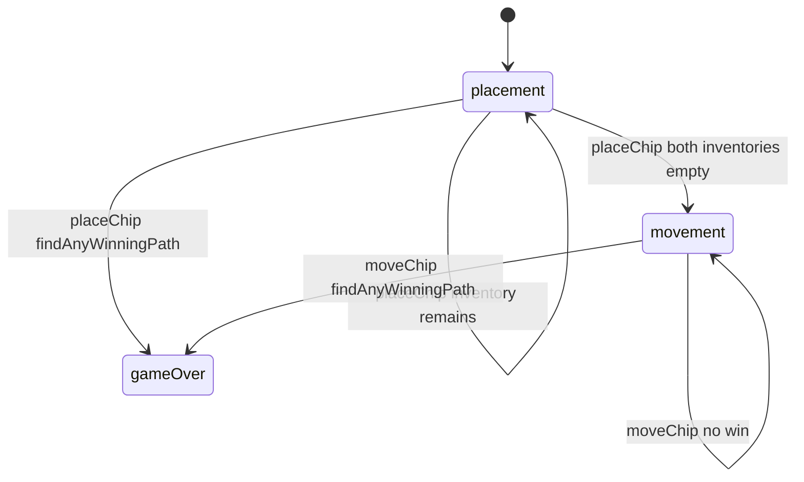

# FIAR — engine reference

> Contributor-only. Describes **code** under `src/games/fiar/`. Not player-facing rules copy.
>
> Broader wiring: [wiki architecture (#475)](../../wiki/architecture.md) · [game registry](../../wiki/game-registry.md) · [docs sync (#496)](https://github.com/fuzzywigg/math-pentathlon/pull/496).
> Do not duplicate those docs here.

- **Registry id:** `fiar` (Division II)
- **Mount:** `src/ui/game-route-mounts.ts` → `case 'fiar'` → `src/games/fiar/game-controller.ts`
- **UI:** `src/games/fiar/board-ui.ts`
- **Rules / state:** `src/games/fiar/rules.ts`, `src/games/fiar/types.ts`
- **AI adapter:** `src/games/fiar/ai.ts` + worker client

## State shape

Primary type: `FiarGameState` in `src/games/fiar/types.ts`.

| Field |
| --- |
| `board` |
| `currentPlayer` |
| `phase` |
| `chipsPlaced` |
| `chipInventory` |
| `selectedChipKind` |
| `selectedNode` |
| `winner` |
| `winningPath` |
| `winningPathColor` |
| `starter` |
| `moveHistory` |

```ts
export interface FiarGameState {
  board: FiarBoard;
  currentPlayer: Player;
  phase: GamePhase;
  /** How many chips each seat has placed (plain + marked). */
  chipsPlaced: { player1: number; player2: number };
  /** Remaining chips in hand, by kind. */
  chipInventory: { player1: ChipInventory; player2: ChipInventory };
  /** Chip kind the current player will place next. */
  selectedChipKind: ChipKind;
  selectedNode: string | null;
  winner: Player | null;
  /** Node ids of the chips that formed the winning path (may include gaps between). */
  winningPath: string[] | null;
  /** Color of the chips on the winning path (may differ from winner). */
  winningPathColor: Player | null;
  starter: Player;
  moveHistory: FiarMove[];
}
```

## Move types

- `FiarMove` — `src/games/fiar/types.ts`

```ts
export interface FiarMove {
  player: Player;
  type: 'place' | 'move';
  nodeId: string;
  fromNodeId?: string;
  chipKind?: ChipKind;
  moveNumber: number;
}
```

- `AIMove` — `src/games/fiar/ai.ts`

```ts
export interface AIMove {
  type: 'place' | 'move';
  nodeId?: string;
  chipKind?: ChipKind;
  from?: string;
  to?: string;
}
```

### Apply / advance functions

- `placeChip` — `src/games/fiar/rules.ts`
- `moveChip` — `src/games/fiar/rules.ts`
- `selectChip` — `src/games/fiar/rules.ts`
- `applyAIMove` — `src/games/fiar/ai.ts`

## Turn / phase state machine

Phase type: `GamePhase` in `src/games/fiar/types.ts`.

```ts
export type GamePhase = 'placement' | 'movement' | 'gameOver';
```



## Win / draw detection

| Function | File | What the code does |
| --- | --- | --- |
| `findAnyWinningPath` | `src/games/fiar/rules.ts` | First unblocked same-color path length ≥ `WIN_LENGTH`. |
| `checkWinner` | `src/games/fiar/rules.ts` | Legacy helper returning path color. |
| `isDraw` | `src/games/fiar/rules.ts` | Observational: movement phase with no selectable nodes (controller must apply `gameOver`). |

## Serialization format

No dedicated codec. Board uses **`Map`/`Set`** — Map/Set-aware JSON / `structuredClone`. AI client clones with `structuredClone`.

Shared progress storage (`src/core/storage/storage.ts`) persists stats/profile only, not in-progress boards.

## AI adapter

- `searchAIMove` — `src/games/fiar/ai.ts`
- `getAIMove` — `src/games/fiar/ai.ts`
- `applyAIMove` — `src/games/fiar/ai.ts`
- `getAIMoveAsync` — `src/games/fiar/ai-client.ts`
- Worker module: `src/games/fiar/ai.worker.ts`
- Shared protocol: `src/core/ai-worker/protocol.ts` (`AiWorkerGameId` includes this game)

## Tests that cover this engine

Imports from `src/games/fiar/` (non-exhaustive; prefer these first):

- `tests/unit/ai-worker-parity-fiar.test.ts`
- `tests/unit/burn-wave40-fiar-chips-exhausted-phase.test.ts`
- `tests/unit/burn-wave41-fiar-move-phase-reject.test.ts`
- `tests/unit/burn-wave41-fiar-paths-winner-matrix.test.ts`
- `tests/unit/burn-wave42-fiar-ai-apply-move.test.ts`
- `tests/unit/burn-wave42-fiar-ai-apply-noop-wrong-type.test.ts`
- `tests/unit/burn-wave42-fiar-ai-apply-place-history.test.ts`
- `tests/unit/burn-wave42-fiar-ai-blocked-path-eval.test.ts`
- `tests/unit/burn-wave42-fiar-ai-gameover-null.test.ts`
- `tests/unit/burn-wave42-fiar-ai-hard-placement.test.ts`
- `tests/unit/burn-wave42-fiar-ai-medium-mid-place.test.ts`
- `tests/unit/burn-wave42-fiar-ai-minimax-empty-place.test.ts`
- `tests/unit/burn-wave42-fiar-ai-move-phase.test.ts`
- `tests/unit/burn-wave42-fiar-ai-movement-easy.test.ts`
- `tests/unit/burn-wave42-fiar-ai-movement-medium.test.ts`
- `tests/unit/burn-wave42-fiar-ai-movement-null-empty.test.ts`
- `tests/unit/burn-wave42-fiar-ai-place-apply.test.ts`
- `tests/unit/burn-wave42-fiar-ai-randomness-move.test.ts`
- `tests/unit/helpers/state-roundtrip-games.ts`

Also exercised by cross-game suites that import the module where listed above (round-trip helper, undo-audit props, registry/mount smoke).

## Known TODOs in code comments

- `src/games/fiar/layout.ts:73` — TODO(Math Pentathlon / Andrew): confirm whether the 4 red-orange diagonals that form the yellow diamond outline count as playable connecting lines. `INCLUDE_DIAMOND_BORDER_EDGES = false` (24 vs 28 lines).

## Key symbols (link-check table)

| Symbol | File |
| --- | --- |
| `FiarGameState` | `src/games/fiar/types.ts` |
| `FiarMove` | `src/games/fiar/types.ts` |
| `AIMove` | `src/games/fiar/ai.ts` |
| `placeChip` | `src/games/fiar/rules.ts` |
| `moveChip` | `src/games/fiar/rules.ts` |
| `selectChip` | `src/games/fiar/rules.ts` |
| `applyAIMove` | `src/games/fiar/ai.ts` |
| `GamePhase` | `src/games/fiar/types.ts` |
| `findAnyWinningPath` | `src/games/fiar/rules.ts` |
| `checkWinner` | `src/games/fiar/rules.ts` |
| `isDraw` | `src/games/fiar/rules.ts` |
| `searchAIMove` | `src/games/fiar/ai.ts` |
| `getAIMove` | `src/games/fiar/ai.ts` |
| `getAIMoveAsync` | `src/games/fiar/ai-client.ts` |
| *(module)* | `src/games/fiar/game-controller.ts` |
| *(module)* | `src/games/fiar/board-ui.ts` |
| *(module)* | `src/games/fiar/rules.ts` |
| *(module)* | `src/games/fiar/ai.ts` |
| *(module)* | `src/games/fiar/tutorial.ts` |
| *(module)* | `src/games/fiar/ai-client.ts` |
| *(module)* | `src/games/fiar/ai.worker.ts` |
| *(module)* | `src/core/ai-worker/protocol.ts` |
| *(module)* | `src/ui/game-route-mounts.ts` |
| *(module)* | `src/core/game-registry.ts` |

## Questions for Andrew

Flagged code-vs-docs disagreements only (no rules text edited here). See also `docs/RULES-DECISIONS-2026-10-07.md` and `docs/tutorial-engine-mismatches-2026-10-07.md`.

- **FI1 / H2:** No loop/repetition draw in movement phase.
  - Recommendation: **Yes** — B — repetition draw.
- **FI2:** `isDraw` does not auto-set `gameOver` in rules; controller must apply.
  - Recommendation: **Yes** — Yes — rules should end the game.
- **layout TODO:** Diamond-border diagonals playable?
  - Recommendation: **No** — No — keep default OFF until kit map confirmed.
