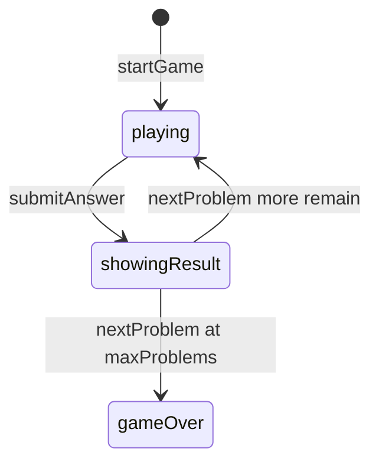

# Frac Fact — engine reference

> Contributor-only. Describes **code** under `src/games/frac-fact/`. Not player-facing rules copy.
>
> Broader wiring: [wiki architecture (#475)](../../wiki/architecture.md) · [game registry](../../wiki/game-registry.md) · [docs sync (#496)](https://github.com/fuzzywigg/math-pentathlon/pull/496).
> Do not duplicate those docs here.

- **Registry id:** `frac-fact` (Division IV)
- **Mount:** `src/ui/game-route-mounts.ts` → `case 'frac-fact'` → `src/games/frac-fact/game-controller.ts`
- **UI:** `src/games/frac-fact/board-ui.ts`
- **Rules / state:** `src/games/frac-fact/rules.ts`, `src/games/frac-fact/types.ts`
- **AI adapter:** `src/games/frac-fact/ai.ts`

## State shape

Primary type: `FracFactState` in `src/games/frac-fact/types.ts`.

| Field |
| --- |
| `currentPlayer` |
| `phase` |
| `currentProblem` |
| `selectedAnswer` |
| `isCorrect` |
| `problemsCompleted` |
| `maxProblems` |
| `player1Stats` |
| `player2Stats` |
| `difficulty` |
| `winner` |
| `problemHistory` |

```ts
export interface FracFactState {
  currentPlayer: Player;
  phase: GamePhase;

  // Current problem
  currentProblem: FractionProblem | null;
  selectedAnswer: Fraction | null;
  isCorrect: boolean | null;

  // Problems completed
  problemsCompleted: number;
  maxProblems: number; // Total problems in the game

  // Player stats
  player1Stats: PlayerStats;
  player2Stats: PlayerStats;

  // Difficulty
  difficulty: Difficulty;

  // Winner (null until game over)
  winner: Player | null;

  // Problem history
  problemHistory: ProblemResult[];
}
```

## Move types

- `ProblemResult` — `src/games/frac-fact/types.ts`

```ts
export interface ProblemResult {
  problem: FractionProblem;
  player: Player;
  selectedAnswer: Fraction;
  isCorrect: boolean;
  timeSpent: number; // in milliseconds
}
```

### Apply / advance functions

- `startGame` — `src/games/frac-fact/rules.ts`
- `submitAnswer` — `src/games/frac-fact/rules.ts`
- `nextProblem` — `src/games/frac-fact/rules.ts`

## Turn / phase state machine

Phase type: `GamePhase` in `src/games/frac-fact/types.ts`.

```ts
export type GamePhase = 'playing' | 'showingResult' | 'gameOver';
```



## Win / draw detection

| Function | File | What the code does |
| --- | --- | --- |
| `nextProblem` | `src/games/frac-fact/rules.ts` | After `maxProblems` (`DEFAULT_MAX_PROBLEMS` = 10 total), higher score wins / null tie. |
| `checkAnswer` | `src/games/frac-fact/rules.ts` | Equivalence check for the current problem (not seat settle). |

## Serialization format

No dedicated codec. No `Map`/`Set` → JSON / `structuredClone`.

Shared progress storage (`src/core/storage/storage.ts`) persists stats/profile only, not in-progress boards.

## AI adapter

- `getAIAnswer` — `src/games/frac-fact/ai.ts`
- `isAITurn` — `src/games/frac-fact/ai.ts`

## Tests that cover this engine

Imports from `src/games/frac-fact/` (non-exhaustive; prefer these first):

- `tests/unit/burn-wave35-frac-fact-ai-null-hard.test.ts`
- `tests/unit/burn-wave40-fracfact-hard-ops-phase.test.ts`
- `tests/unit/burn-wave41-frac-fact-ai-easy-medium-miss.test.ts`
- `tests/unit/burn-wave41-frac-fact-hard-ops-p2win.test.ts`
- `tests/unit/burn-wave42-frac-ai-answer-difficulties.test.ts`
- `tests/unit/frac-fact-ai-input-guard.test.ts`
- `tests/unit/frac-fact-ai.test.ts`
- `tests/unit/frac-fact-rules.test.ts`
- `tests/unit/overnight-frac-ai-accuracy-miss.test.ts`
- `tests/unit/overnight-frac-ai-teaching-miss.test.ts`
- `tests/unit/overnight-frac-isaiturn-phase-matrix.test.ts`
- `tests/unit/overnight-frac-nextproblem-p2-win.test.ts`
- `tests/unit/overnight-wave50-frac-render-choices-phase-gate.test.ts`
- `tests/unit/overnight-wave50-frac-render-gameover-winners.test.ts`
- `tests/unit/overnight-wave52-frac-ai-default-difficulty-medium.test.ts`
- `tests/unit/overnight-wave54-frac-ai-default-difficulty-medium.test.ts`
- `tests/unit/overnight-wave54-frac-ai-easy-skip-teach-accuracy-miss.test.ts`
- `tests/unit/overnight-wave54-frac-ai-showingresult-null.test.ts`
- `tests/unit/helpers/state-roundtrip-games.ts`

Also exercised by cross-game suites that import the module where listed above (round-trip helper, undo-audit props, registry/mount smoke).

## Known TODOs in code comments

None found under `src/games/frac-fact/` (`TODO` / `FIXME` / `Andrew` comment scan).

## Key symbols (link-check table)

| Symbol | File |
| --- | --- |
| `FracFactState` | `src/games/frac-fact/types.ts` |
| `ProblemResult` | `src/games/frac-fact/types.ts` |
| `startGame` | `src/games/frac-fact/rules.ts` |
| `submitAnswer` | `src/games/frac-fact/rules.ts` |
| `nextProblem` | `src/games/frac-fact/rules.ts` |
| `GamePhase` | `src/games/frac-fact/types.ts` |
| `checkAnswer` | `src/games/frac-fact/rules.ts` |
| `getAIAnswer` | `src/games/frac-fact/ai.ts` |
| `isAITurn` | `src/games/frac-fact/ai.ts` |
| *(module)* | `src/games/frac-fact/game-controller.ts` |
| *(module)* | `src/games/frac-fact/board-ui.ts` |
| *(module)* | `src/games/frac-fact/rules.ts` |
| *(module)* | `src/games/frac-fact/ai.ts` |
| *(module)* | `src/games/frac-fact/tutorial.ts` |
| *(module)* | `src/ui/game-route-mounts.ts` |
| *(module)* | `src/core/game-registry.ts` |

## Questions for Andrew

Flagged code-vs-docs disagreements only (no rules text edited here). See also `docs/RULES-DECISIONS-2026-10-07.md` and `docs/tutorial-engine-mismatches-2026-10-07.md`.

- **Wiki blurb:** `docs/wiki/games.md` Frac Fact description reads like Fab-a-Diffy (bars). Engine is multiple-choice fraction arithmetic.
  - Recommendation: **Yes** — Yes — fix wiki blurb in a docs-sync pass (#496 territory); leave engine alone.
- **Problem count:** Tutorial "10 each" vs engine 10 total (~5 each).
  - Recommendation: **Yes** — Confirm intended problem budget.
