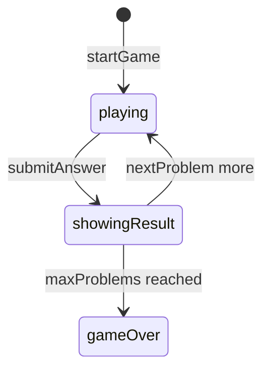

# Frac Fact engine (`frac-fact`)

> Contributor reference for what the **code** does. Not player-facing.
> Do not treat this as official rules text. Wiki architecture: [docs/wiki/architecture.md](../../wiki/architecture.md) ([#475](https://github.com/fuzzywigg/math-pentathlon/issues/475)).
> Docs-sync work: see [#496](https://github.com/fuzzywigg/math-pentathlon/issues/496) — this page does not replace it.

**Division:** Division IV · **Registry id:** `frac-fact`

## Module files

- `src/games/frac-fact/types.ts`
- `src/games/frac-fact/rules.ts`

**AI adapter**

- `src/games/frac-fact/ai.ts`

**UI entry**

- `src/games/frac-fact/board-ui.ts`
- `src/games/frac-fact/game-controller.ts`

## State shape

Primary type `FracFactState` in `src/games/frac-fact/types.ts`.

- `currentProblem` / `selectedAnswer` / `isCorrect`
- `phase: GamePhase` — `'playing' | 'showingResult' | 'gameOver'`
- `problemsCompleted` / `maxProblems` (default 10)
- `player1Stats` / `player2Stats`
- `difficulty` / `winner` / `problemHistory`

## Move types

Quiz API: `startGame`, `submitAnswer`, `nextProblem` (not a board `Move` union).

Apply / query API:

- `generateProblem` / `checkAnswer`
- `submitAnswer` / `nextProblem`
- `startGame`

## Turn / phase state machine

Phases in code: `playing`, `showingResult`, `gameOver`.



## Win / draw detection

- Inline in `nextProblem` when `problemsCompleted >= maxProblems`
- Higher score wins; tie → `winner: null`
- `checkAnswer` → `boolean` (equivalence)

## Serialization format

No codec. Fractions as plain objects. Fuzz `jsonRoundTrip`.

## Tests that cover this engine

- `tests/unit/frac-fact-rules.test.ts`
- `tests/unit/frac-fact-ai.test.ts`
- `tests/unit/burn-wave41-frac-fact-next-problem-cycle.test.ts`
- `tests/unit/burn-wave41-frac-fact-streak-bonus-submit.test.ts`
- `tests/unit/burn-wave41-frac-fact-submit-playing.test.ts`
- `tests/unit/state-roundtrip-fuzz.test.ts`

## Known TODOs (from code comments)

- No tagged TODOs under `src/games/frac-fact/`.

## Questions for Andrew

Yes/no decisions; recommendations are non-binding.

- **Q:** Tutorial “10 problems each” vs engine **10 total** (~5 each) — which (RULES FF1)?
  - **Recommendation:** Keep 10 total unless product wants 10 each.
- **Q:** Wiki “fraction bars matched to answer bars” vs multiple-choice UI — update registry blurb?
  - **Recommendation:** Yes — blurb is outdated; change via docs-sync (#496), not here.

## Related reading

- Index: [README.md](./README.md)
- Wiki games catalog: [docs/wiki/games.md](../../wiki/games.md)
- Wiki architecture (#475): [docs/wiki/architecture.md](../../wiki/architecture.md)
- Adding a game: [docs/wiki/adding-a-game.md](../../wiki/adding-a-game.md)
- Rules decision log (do not edit rules here): [docs/RULES-DECISIONS-2026-10-07.md](../../RULES-DECISIONS-2026-10-07.md)

```dev-doc-refs
src/games/frac-fact/types.ts#FracFactState
src/games/frac-fact/types.ts#GamePhase
src/games/frac-fact/types.ts#createInitialState
src/games/frac-fact/rules.ts#startGame
src/games/frac-fact/rules.ts#submitAnswer
src/games/frac-fact/rules.ts#nextProblem
src/games/frac-fact/rules.ts#checkAnswer
src/games/frac-fact/ai.ts#getAIAnswer
src/games/frac-fact/game-controller.ts#initGame
src/games/frac-fact/board-ui.ts#renderProblem
tests/unit/frac-fact-rules.test.ts
src/core/game-registry.ts#GAMES
src/ui/game-route-mounts.ts#mountGameById
```
