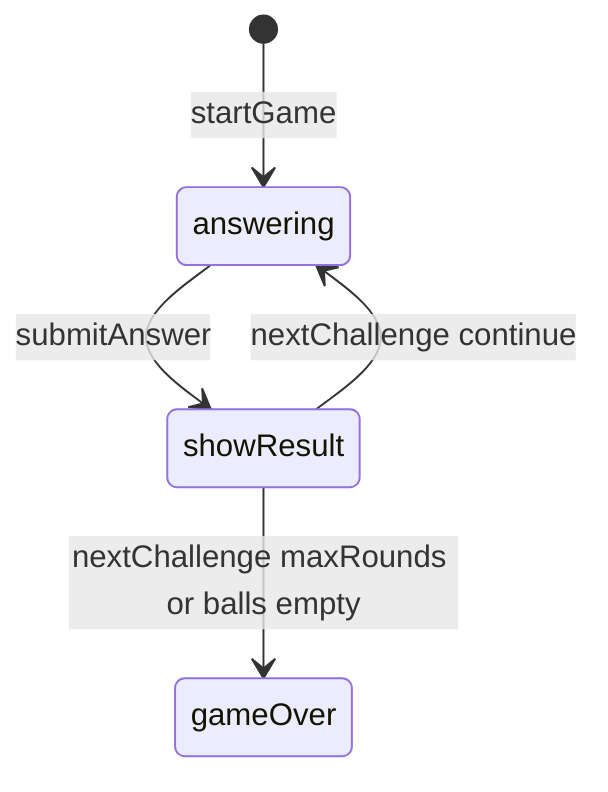

# Fraction Pinball — engine reference

> Contributor-only. Describes **code** under `src/games/fraction-pinball/`. Not player-facing rules copy.
>
> Broader wiring: [wiki architecture (#475)](../../wiki/architecture.md) · [game registry](../../wiki/game-registry.md) · [docs sync (#496)](https://github.com/fuzzywigg/math-pentathlon/pull/496).
> Do not duplicate those docs here.

- **Registry id:** `fraction-pinball` (Division IV)
- **Mount:** `src/ui/game-route-mounts.ts` → `case 'fraction-pinball'` → `src/games/fraction-pinball/game-controller.ts`
- **UI:** `src/games/fraction-pinball/board-ui.ts`
- **Rules / state:** `src/games/fraction-pinball/rules.ts`, `src/games/fraction-pinball/types.ts`
- **AI adapter:** `src/games/fraction-pinball/ai.ts`

## State shape

Primary type: `FractionPinballState` in `src/games/fraction-pinball/types.ts`.

| Field |
| --- |
| `currentPlayer` |
| `phase` |
| `currentChallenge` |
| `selectedAnswer` |
| `isCorrect` |
| `targets` |
| `player1Stats` |
| `player2Stats` |
| `roundNumber` |
| `maxRounds` |
| `winner` |

```ts
export interface FractionPinballState {
  currentPlayer: Player;
  phase: GamePhase;

  // Current challenge
  currentChallenge: ConversionChallenge | null;
  selectedAnswer: string | null;
  isCorrect: boolean | null;

  // Pinball targets
  targets: PinballTarget[];

  // Player stats
  player1Stats: PlayerStats;
  player2Stats: PlayerStats;

  // Game progress
  roundNumber: number;
  maxRounds: number;

  // Winner
  winner: Player | null;
}
```

## Move types

- `ConversionChallenge` — `src/games/fraction-pinball/types.ts`

```ts
export interface ConversionChallenge {
  id: string;
  type: 'fractionToDecimal' | 'decimalToFraction';
  fraction: Fraction;
  decimal: number;
  answerChoices: string[]; // Mix of fractions and decimals as display strings
  correctAnswer: string;
}
```

### Apply / advance functions

- `startGame` — `src/games/fraction-pinball/rules.ts`
- `submitAnswer` — `src/games/fraction-pinball/rules.ts`
- `nextChallenge` — `src/games/fraction-pinball/rules.ts`

## Turn / phase state machine

Phase type: `GamePhase` in `src/games/fraction-pinball/types.ts`.

```ts
export type GamePhase =
  | 'answering' // Answer the conversion question
  | 'showResult' // Show if correct
  | 'gameOver';
```



## Win / draw detection

| Function | File | What the code does |
| --- | --- | --- |
| `nextChallenge` | `src/games/fraction-pinball/rules.ts` | Ends when rounds exceed `maxRounds` or both `ballsRemaining <= 0`; higher score / null tie. |
| `checkAnswer` | `src/games/fraction-pinball/rules.ts` | String equality on `correctAnswer`. |
| `hitRandomTarget` | `src/games/fraction-pinball/rules.ts` | Target weighting helper for scoring feedback. |

## Serialization format

No dedicated codec. No `Map`/`Set` → JSON / `structuredClone`.

Shared progress storage (`src/core/storage/storage.ts`) persists stats/profile only, not in-progress boards.

## AI adapter

- `getAIAnswer` — `src/games/fraction-pinball/ai.ts`
- `isAITurn` — `src/games/fraction-pinball/ai.ts`

## Tests that cover this engine

Imports from `src/games/fraction-pinball/` (non-exhaustive; prefer these first):

- `tests/unit/burn-wave41-pinball-generate-check-ai.test.ts`
- `tests/unit/burn-wave41-pinball-submit-ball-drain.test.ts`
- `tests/unit/burn-wave41-pinball-submit-wrong-phase.test.ts`
- `tests/unit/burn-wave42-pinball-ai-answer-matrix.test.ts`
- `tests/unit/burn-wave42-pinball-next-settle-winner.test.ts`
- `tests/unit/burn-wave42-pinball-submit-phase-reject.test.ts`
- `tests/unit/burn-wave48-pinball-submit-wrong-ball-drain.test.ts`
- `tests/unit/fraction-pinball-ai.test.ts`
- `tests/unit/fraction-pinball-rules.test.ts`
- `tests/unit/overnight-pinball-ai-accuracy-miss.test.ts`
- `tests/unit/overnight-pinball-ai-default-difficulty-medium.test.ts`
- `tests/unit/overnight-pinball-ai-easy-accuracy-miss-after-teach-skip.test.ts`
- `tests/unit/overnight-pinball-ai-player2-seat-answer.test.ts`
- `tests/unit/overnight-pinball-ai-sole-choice-fallback.test.ts`
- `tests/unit/overnight-pinball-ai-teaching-miss.test.ts`
- `tests/unit/overnight-pinball-ai-wrong-choice-index-last.test.ts`
- `tests/unit/overnight-wave55-pinball-ai-easy-teach-miss.test.ts`
- `tests/unit/overnight-wave55-pinball-ai-hard-accuracy-hit.test.ts`
- `tests/unit/helpers/state-roundtrip-games.ts`

Also exercised by cross-game suites that import the module where listed above (round-trip helper, undo-audit props, registry/mount smoke).

## Known TODOs in code comments

None found under `src/games/fraction-pinball/` (`TODO` / `FIXME` / `Andrew` comment scan).

## Key symbols (link-check table)

| Symbol | File |
| --- | --- |
| `FractionPinballState` | `src/games/fraction-pinball/types.ts` |
| `ConversionChallenge` | `src/games/fraction-pinball/types.ts` |
| `startGame` | `src/games/fraction-pinball/rules.ts` |
| `submitAnswer` | `src/games/fraction-pinball/rules.ts` |
| `nextChallenge` | `src/games/fraction-pinball/rules.ts` |
| `GamePhase` | `src/games/fraction-pinball/types.ts` |
| `checkAnswer` | `src/games/fraction-pinball/rules.ts` |
| `hitRandomTarget` | `src/games/fraction-pinball/rules.ts` |
| `getAIAnswer` | `src/games/fraction-pinball/ai.ts` |
| `isAITurn` | `src/games/fraction-pinball/ai.ts` |
| *(module)* | `src/games/fraction-pinball/game-controller.ts` |
| *(module)* | `src/games/fraction-pinball/board-ui.ts` |
| *(module)* | `src/games/fraction-pinball/rules.ts` |
| *(module)* | `src/games/fraction-pinball/ai.ts` |
| *(module)* | `src/games/fraction-pinball/tutorial.ts` |
| *(module)* | `src/ui/game-route-mounts.ts` |
| *(module)* | `src/core/game-registry.ts` |

## Questions for Andrew

Flagged code-vs-docs disagreements only (no rules text edited here). See also `docs/RULES-DECISIONS-2026-10-07.md` and `docs/tutorial-engine-mismatches-2026-10-07.md`.

- None specific beyond the shared decision checklist (or already aligned in RULES/tutorial mismatch docs).
