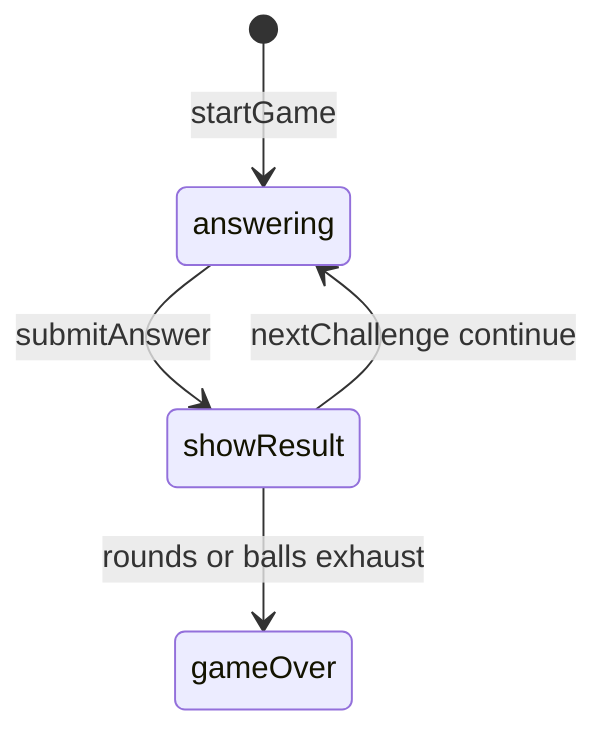

# Fraction Pinball engine (`fraction-pinball`)

> Contributor reference for what the **code** does. Not player-facing.
> Do not treat this as official rules text. Wiki architecture: [docs/wiki/architecture.md](../../wiki/architecture.md) ([#475](https://github.com/fuzzywigg/math-pentathlon/issues/475)).
> Docs-sync work: see [#496](https://github.com/fuzzywigg/math-pentathlon/issues/496) — this page does not replace it.

**Division:** Division IV · **Registry id:** `fraction-pinball`

## Module files

- `src/games/fraction-pinball/types.ts`
- `src/games/fraction-pinball/rules.ts`

**AI adapter**

- `src/games/fraction-pinball/ai.ts`

**UI entry**

- `src/games/fraction-pinball/board-ui.ts`
- `src/games/fraction-pinball/game-controller.ts`

## State shape

Primary type `FractionPinballState` in `src/games/fraction-pinball/types.ts`.

- `currentChallenge` / `selectedAnswer` / `isCorrect`
- `phase: GamePhase` — `'answering' | 'showResult' | 'gameOver'`
- `targets: PinballTarget[]`
- `player1Stats` / `player2Stats` (incl. `ballsRemaining`)
- `roundNumber` / `maxRounds` / `winner`

## Move types

Quiz API: `startGame`, `submitAnswer`, `nextChallenge`. Helpers `generateChallenge`, `checkAnswer`, `hitRandomTarget`.

Apply / query API:

- `submitAnswer` / `nextChallenge`
- `hitRandomTarget` for scoring flavor
- `checkAnswer` — string equality to `correctAnswer`

## Turn / phase state machine

Phases in code: `answering`, `showResult`, `gameOver`.



## Win / draw detection

- Inline in `nextChallenge`: round > maxRounds OR both out of balls
- Higher score wins; tie → `winner: null`

## Serialization format

No codec / no move history. Fuzz `jsonRoundTrip`.

## Tests that cover this engine

- `tests/unit/fraction-pinball-rules.test.ts`
- `tests/unit/fraction-pinball-ai.test.ts`
- `tests/unit/engine-coverage-fraction-pinball-targeted.test.ts`
- `tests/unit/fraction-pinball-deep-playability.test.ts`
- `tests/unit/burn-wave35-fraction-pinball-format-helpers.test.ts`
- `tests/unit/state-roundtrip-fuzz.test.ts`

## Known TODOs (from code comments)

- No tagged TODOs. `PinballTarget.hit` appears unused by submit/hit helpers.

## Questions for Andrew

Yes/no decisions; recommendations are non-binding.

- **Q:** Confirm early end when both out of balls (beyond max rounds)?
  - **Recommendation:** Yes — keep.
- **Q:** Is `PinballTarget.hit` dead — remove or set on hit?
  - **Recommendation:** Set on hit if UI needs it; else remove later.

## Related reading

- Index: [README.md](./README.md)
- Wiki games catalog: [docs/wiki/games.md](../../wiki/games.md)
- Wiki architecture (#475): [docs/wiki/architecture.md](../../wiki/architecture.md)
- Adding a game: [docs/wiki/adding-a-game.md](../../wiki/adding-a-game.md)
- Rules decision log (do not edit rules here): [docs/RULES-DECISIONS-2026-10-07.md](../../RULES-DECISIONS-2026-10-07.md)

```dev-doc-refs
src/games/fraction-pinball/types.ts#FractionPinballState
src/games/fraction-pinball/types.ts#GamePhase
src/games/fraction-pinball/types.ts#createInitialState
src/games/fraction-pinball/rules.ts#startGame
src/games/fraction-pinball/rules.ts#submitAnswer
src/games/fraction-pinball/rules.ts#nextChallenge
src/games/fraction-pinball/rules.ts#checkAnswer
src/games/fraction-pinball/rules.ts#hitRandomTarget
src/games/fraction-pinball/ai.ts#getAIAnswer
src/games/fraction-pinball/game-controller.ts#initGame
src/games/fraction-pinball/board-ui.ts#renderChallenge
tests/unit/engine-coverage-fraction-pinball-targeted.test.ts
tests/unit/fraction-pinball-rules.test.ts
src/core/game-registry.ts#GAMES
src/ui/game-route-mounts.ts#mountGameById
```
