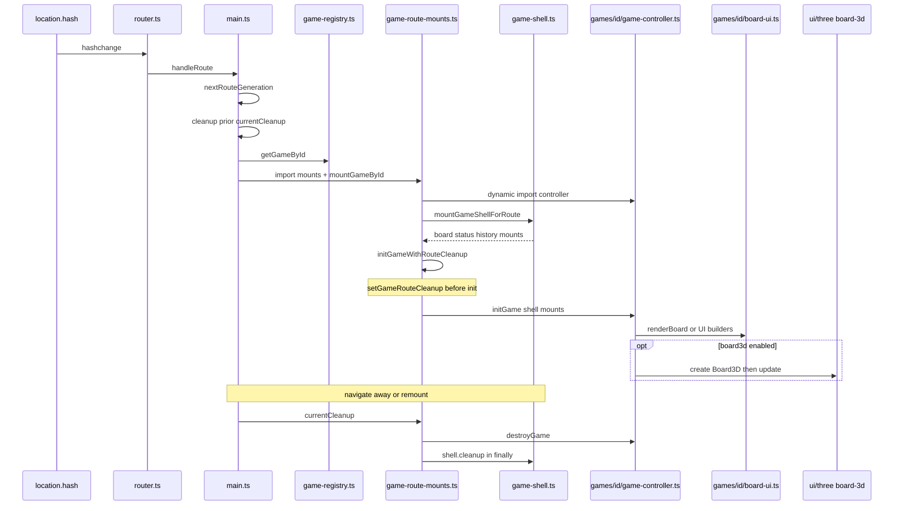
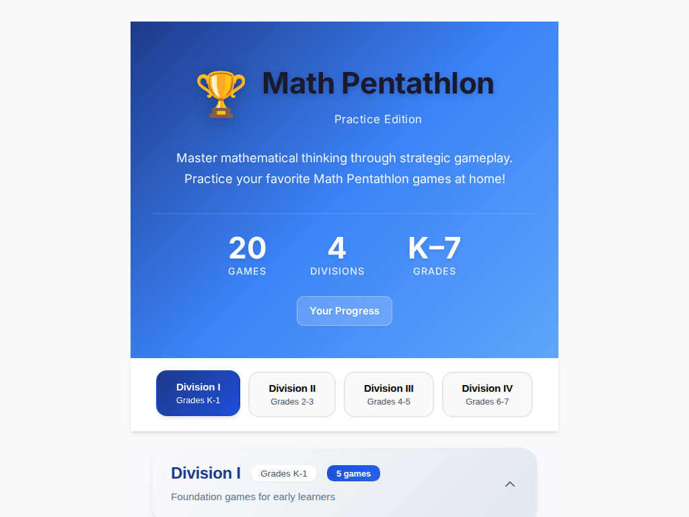
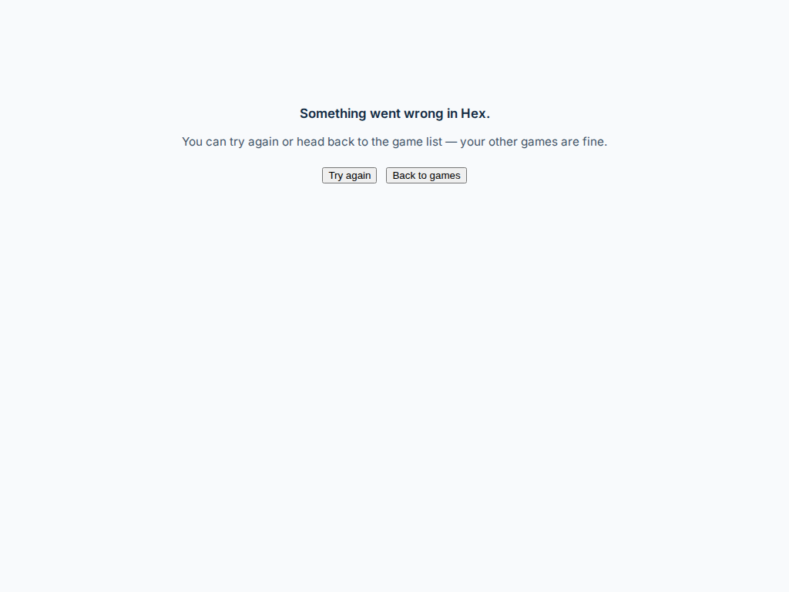
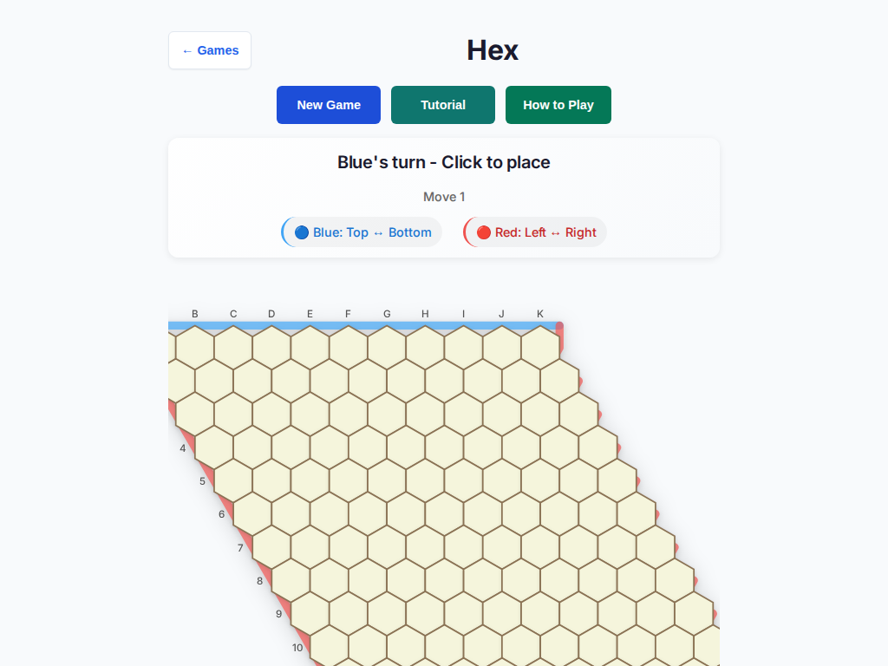

# Game route lifecycle

> Contributor-only. Maps **route → mount → controller → board-ui / 3D → destroy** from the live tip tree. Not player-facing rules or How-to copy.
>
> Broader layers: [wiki architecture](../../wiki/architecture.md) · [engines README](./README.md) · [game registry](../../wiki/game-registry.md).
> Cleanup history: [#480](https://github.com/fuzzywigg/math-pentathlon/pull/480) (destroy wiring), [#568](https://github.com/fuzzywigg/math-pentathlon/pull/568) (try/finally shell cleanup), [#594](https://github.com/fuzzywigg/math-pentathlon/pull/594) / `q-mp-030` (hex + fraction-pinball mount `clearElement`).

Task id: `q-mp-070`.

## Sequence (happy path + leave)

GitHub-rendered mermaid. Optional 3D path runs only when `isBoard3dEnabled()` is true (typically `#/game/:id?board3d=1`).



## Shared symbols

| Symbol | File | Role |
| --- | --- | --- |
| `handleRoute` | `src/core/router.ts` | Dispatch current hash path |
| `navigate` | `src/core/router.ts` | Set `location.hash` |
| `nextRouteGeneration` | `src/core/route-generation.ts` | Bump gen on each game/home/stats entry |
| `isCurrentRouteGeneration` | `src/core/route-generation.ts` | Stale-mount guard after awaits |
| `getGameById` | `src/core/game-registry.ts` | Resolve registry id → catalog entry |
| `mountGameById` | `src/ui/game-route-mounts.ts` | `switch` → per-game render |
| `setGameRouteCleanup` | `src/ui/game-route-mounts.ts` | `try destroyGame` / `finally shell.cleanup` |
| `initGameWithRouteCleanup` | `src/ui/game-route-mounts.ts` | Register cleanup, then `initGame` |
| `mountGameShell` | `src/ui/components/game-shell.ts` | Shared chrome + board/status hosts |
| `isBoard3dEnabled` | `src/core/feature-flags.ts` | Optional Three.js boards |
| `clearElement` | `src/core/dom-security.ts` | Drop mount DOM / listeners (q-mp-030) |

Bootstrap entry for `/game/:id` is `renderGame` in `src/main.ts` (sets `currentCleanup`, lazy-imports mounts + play CSS, then `mountGameById`).

## Cleanup contract

Ordered obligations when leaving a game route (menu, another game, stats, crash-UI `onBeforeShow`):

1. **`main.cleanup()`** runs `currentCleanup` then disposes the game error boundary (`src/main.ts`).
2. **Route wrapper** (`setGameRouteCleanup`): call `destroyGame()`, and **always** call `shell.cleanup()` in a `finally` so a throwing destroy cannot strand document keydown / modal listeners ([#568](https://github.com/fuzzywigg/math-pentathlon/pull/568)).
3. **`initGameWithRouteCleanup`**: register that wrapper **before** `initGame`; if init throws, best-effort `destroyGame` + `shell.cleanup` + clear `currentCleanup`, then rethrow ([#568](https://github.com/fuzzywigg/math-pentathlon/pull/568)).
4. **Per-controller `destroyGame`** (ideal / q-mp-030 target):
   - Invalidate AI work: bump generation and/or `clearTimeout` / cancel worker requests / `dispose*AiWorker` where the game has them.
   - Tear down 3D: `unmountBoard3d()` (dispose geometries, listeners, WebGL) when a board exists.
   - **Clear mount hosts** with `clearElement(...)` before nulling refs so click listeners and detached DOM do not survive remount — fixed for hex + fraction-pinball in [#594](https://github.com/fuzzywigg/math-pentathlon/pull/594) (`q-mp-030`; draft depends on fold into tip).
   - Null controller mount refs (`boardContainer` / `statusContainer` / `gameContainer` / `activeContainer` as applicable).

Tip snapshot note: several Division II/III controllers still expose **stub** `destroyGame` bodies after the alpha restore (empty or comment-only). Route wiring still calls them via `initGameWithRouteCleanup`; shell cleanup still runs. Hex / fraction-pinball on tip already cancel timers/worker and null refs; `#594` adds the mount `clearElement` step.

## Per-game map

Every row’s controller exports `initGame` + `destroyGame`. Board UI column names the primary exported render helper(s). 3D column is the lazy loader + `create*Board3D` factory (absent = 2D-only).

| Game | Mount | Controller | Board UI | 3D (optional) | destroyGame (tip) |
| --- | --- | --- | --- | --- | --- |
| [Kings & Quadraphages](./kings-quadraphages.md) | `case 'kings-quadraphages'` → `src/ui/game-route-mounts.ts` | `initGame` / `destroyGame` → `src/games/kings-quadraphages/game-controller.ts` | `renderBoard` → `src/games/kings-quadraphages/board-ui.ts` | `loadKingsQuadraphagesBoard3DModule` → `src/games/kings-quadraphages/board-3d-loader.ts`; `createKingsQuadraphagesBoard3D` → `src/ui/three/kings-quadraphages-board-3d.ts` | active: context-lost listener, `unmountBoard3d`, null mounts |
| [Hex](./hex.md) | `case 'hex'` → `src/ui/game-route-mounts.ts` | `initGame` / `destroyGame` → `src/games/hex/game-controller.ts` | `renderBoard` → `src/games/hex/board-ui.ts` | — | active: AI gen + timer + worker dispose, null mounts; **#594 adds `clearElement` on board/status** |
| [Star Track](./star-track.md) | `case 'star-track'` → `src/ui/game-route-mounts.ts` | `initGame` / `destroyGame` → `src/games/star-track/game-controller.ts` | `renderBoard` → `src/games/star-track/board-ui.ts` | `loadStarTrackBoard3DModule` → `src/games/star-track/board-3d-loader.ts`; `createStarTrackBoard3D` → `src/ui/three/star-track-board-3d.ts` | active: `unmountBoard3d`, null mounts |
| [Hex-a-Gone!](./hex-a-gone.md) | `case 'hex-a-gone'` → `src/ui/game-route-mounts.ts` | `initGame` / `destroyGame` → `src/games/hex-a-gone/game-controller.ts` | `renderBoard` → `src/games/hex-a-gone/board-ui.ts` | `loadHexAGoneBoard3DModule` → `src/games/hex-a-gone/board-3d-loader.ts`; `createHexAGoneBoard3D` → `src/ui/three/hex-a-gone-board-3d.ts` | active: `unmountBoard3d`, null mounts |
| [Calla](./calla.md) | `case 'calla'` → `src/ui/game-route-mounts.ts` | `initGame` / `destroyGame` → `src/games/calla/game-controller.ts` | `renderBoard` → `src/games/calla/board-ui.ts` | — | stub after alpha restore |
| [Sum Dominoes](./sum-dominoes.md) | `case 'sum-dominoes'` → `src/ui/game-route-mounts.ts` | `initGame` / `destroyGame` → `src/games/sum-dominoes/game-controller.ts` | `renderBoard` → `src/games/sum-dominoes/board-ui.ts` | — | stub (empty body) |
| [Par 55](./par-55.md) | `case 'par-55'` → `src/ui/game-route-mounts.ts` | `initGame` / `destroyGame` → `src/games/par-55/game-controller.ts` | `renderBoard` → `src/games/par-55/board-ui.ts` | — | stub after alpha restore |
| [Ramrod](./ramrod.md) | `case 'ramrod'` → `src/ui/game-route-mounts.ts` | `initGame` / `destroyGame` → `src/games/ramrod/game-controller.ts` | `renderBoard` → `src/games/ramrod/board-ui.ts` | — | stub after alpha restore |
| [Kwatro-Sinko](./kwatro-sinko.md) | `case 'kwatro-sinko'` → `src/ui/game-route-mounts.ts` | `initGame` / `destroyGame` → `src/games/kwatro-sinko/game-controller.ts` | `renderBoard` → `src/games/kwatro-sinko/board-ui.ts` | `loadKwatroSinkoBoard3DModule` → `src/games/kwatro-sinko/board-3d-loader.ts`; `createKwatroSinkoBoard3D` → `src/ui/three/kwatro-sinko-board-3d.ts` | active: AI timer, `unmountBoard3d`, null active refs |
| [FIAR](./fiar.md) | `case 'fiar'` → `src/ui/game-route-mounts.ts` | `initGame` / `destroyGame` → `src/games/fiar/game-controller.ts` | `renderBoard` → `src/games/fiar/board-ui.ts` | `loadFiarBoard3DModule` → `src/games/fiar/board-3d-loader.ts`; `createFiarBoard3D` → `src/ui/three/fiar-board-3d.ts` | active: AI gen/timer/worker, context-lost, `unmountBoard3d`, null mounts |
| [Juggle](./juggle.md) | `case 'juggle'` → `src/ui/game-route-mounts.ts` | `initGame` / `destroyGame` → `src/games/juggle/game-controller.ts` | `renderBoard` → `src/games/juggle/board-ui.ts` | — | stub (empty body) |
| [Contig 60](./contig-60.md) | `case 'contig-60'` → `src/ui/game-route-mounts.ts` | `initGame` / `destroyGame` → `src/games/contig-60/game-controller.ts` | `renderBoard` → `src/games/contig-60/board-ui.ts` | — | stub after alpha restore |
| [Stars & Bars](./stars-bars.md) | `case 'stars-bars'` → `src/ui/game-route-mounts.ts` | `initGame` / `destroyGame` → `src/games/stars-bars/game-controller.ts` | `renderBoard` → `src/games/stars-bars/board-ui.ts` | — | stub after alpha restore |
| [Fab-a-Diffy](./fab-a-diffy.md) | `case 'fab-a-diffy'` → `src/ui/game-route-mounts.ts` | `initGame` / `destroyGame` → `src/games/fab-a-diffy/game-controller.ts` | `renderAnswerBoard` → `src/games/fab-a-diffy/board-ui.ts` | — | stub (empty body) |
| [Queens & Guards](./queens-guards.md) | `case 'queens-guards'` → `src/ui/game-route-mounts.ts` | `initGame` / `destroyGame` → `src/games/queens-guards/game-controller.ts` | `renderBoard` → `src/games/queens-guards/board-ui.ts` | `loadQueensGuardsBoard3DModule` → `src/games/queens-guards/board-3d-loader.ts`; `createQueensGuardsBoard3D` → `src/ui/three/queens-guards-board-3d.ts` | active: AI gen/worker, context-lost, `unmountBoard3d`, null mounts |
| [Prime Gold](./prime-gold.md) | `case 'prime-gold'` → `src/ui/game-route-mounts.ts` | `initGame` / `destroyGame` → `src/games/prime-gold/game-controller.ts` | `renderBoard` → `src/games/prime-gold/board-ui.ts` | `loadPrimeGoldBoard3DModule` → `src/games/prime-gold/board-3d-loader.ts`; `createPrimeGoldBoard3D` → `src/ui/three/prime-gold-board-3d.ts` | active: AI timer, `unmountBoard3d`, null active refs |
| [Remainder Islands](./remainder-islands.md) | `case 'remainder-islands'` → `src/ui/game-route-mounts.ts` | `initGame` / `destroyGame` → `src/games/remainder-islands/game-controller.ts` | `renderBoard` → `src/games/remainder-islands/board-ui.ts` | — | active: AI gen + timers, null `gameContainer` |
| [Pent 'Em In](./pent-em-in.md) | `case 'pent-em-in'` → `src/ui/game-route-mounts.ts` | `initGame` / `destroyGame` → `src/games/pent-em-in/game-controller.ts` | `renderBoard` → `src/games/pent-em-in/board-ui.ts` | `loadPentEmInBoard3DModule` → `src/games/pent-em-in/board-3d-loader.ts`; `createPentEmInBoard3D` → `src/ui/three/pent-em-in-board-3d.ts` | active: AI timer, context-lost, `unmountBoard3d`, null mounts |
| [Frac Fact](./frac-fact.md) | `case 'frac-fact'` → `src/ui/game-route-mounts.ts` | `initGame` / `destroyGame` → `src/games/frac-fact/game-controller.ts` | `renderProblem` → `src/games/frac-fact/board-ui.ts` | — | active: AI + result timers, null `gameContainer` |
| [Fraction Pinball](./fraction-pinball.md) | `case 'fraction-pinball'` → `src/ui/game-route-mounts.ts` | `initGame` / `destroyGame` → `src/games/fraction-pinball/game-controller.ts` | `renderPinballBoard` → `src/games/fraction-pinball/board-ui.ts` | — | active: AI gen + timers, null mount; **#594 adds `clearElement` on `gameContainer`** |

### Symbol → file pins (link checker)

Rows use the `| \`Symbol\` | \`path\` |` shape scanned by `npm run check:dev-docs`.

| Symbol | File |
| --- | --- |
| `mountGameById` | `src/ui/game-route-mounts.ts` |
| `setGameRouteCleanup` | `src/ui/game-route-mounts.ts` |
| `initGameWithRouteCleanup` | `src/ui/game-route-mounts.ts` |
| `mountGameShell` | `src/ui/components/game-shell.ts` |
| `handleRoute` | `src/core/router.ts` |
| `nextRouteGeneration` | `src/core/route-generation.ts` |
| `getGameById` | `src/core/game-registry.ts` |
| `isBoard3dEnabled` | `src/core/feature-flags.ts` |
| `clearElement` | `src/core/dom-security.ts` |
| `initGame` | `src/games/hex/game-controller.ts` |
| `destroyGame` | `src/games/hex/game-controller.ts` |
| `renderBoard` | `src/games/hex/board-ui.ts` |
| `initGame` | `src/games/fraction-pinball/game-controller.ts` |
| `destroyGame` | `src/games/fraction-pinball/game-controller.ts` |
| `renderPinballBoard` | `src/games/fraction-pinball/board-ui.ts` |
| `initGame` | `src/games/kings-quadraphages/game-controller.ts` |
| `destroyGame` | `src/games/kings-quadraphages/game-controller.ts` |
| `renderBoard` | `src/games/kings-quadraphages/board-ui.ts` |
| `createKingsQuadraphagesBoard3D` | `src/ui/three/kings-quadraphages-board-3d.ts` |
| `initGame` | `src/games/star-track/game-controller.ts` |
| `destroyGame` | `src/games/star-track/game-controller.ts` |
| `createStarTrackBoard3D` | `src/ui/three/star-track-board-3d.ts` |
| `initGame` | `src/games/hex-a-gone/game-controller.ts` |
| `destroyGame` | `src/games/hex-a-gone/game-controller.ts` |
| `createHexAGoneBoard3D` | `src/ui/three/hex-a-gone-board-3d.ts` |
| `initGame` | `src/games/calla/game-controller.ts` |
| `destroyGame` | `src/games/calla/game-controller.ts` |
| `renderBoard` | `src/games/calla/board-ui.ts` |
| `initGame` | `src/games/sum-dominoes/game-controller.ts` |
| `destroyGame` | `src/games/sum-dominoes/game-controller.ts` |
| `initGame` | `src/games/par-55/game-controller.ts` |
| `destroyGame` | `src/games/par-55/game-controller.ts` |
| `initGame` | `src/games/ramrod/game-controller.ts` |
| `destroyGame` | `src/games/ramrod/game-controller.ts` |
| `initGame` | `src/games/kwatro-sinko/game-controller.ts` |
| `destroyGame` | `src/games/kwatro-sinko/game-controller.ts` |
| `createKwatroSinkoBoard3D` | `src/ui/three/kwatro-sinko-board-3d.ts` |
| `initGame` | `src/games/fiar/game-controller.ts` |
| `destroyGame` | `src/games/fiar/game-controller.ts` |
| `loadFiarBoard3DModule` | `src/games/fiar/board-3d-loader.ts` |
| `createFiarBoard3D` | `src/ui/three/fiar-board-3d.ts` |
| `initGame` | `src/games/juggle/game-controller.ts` |
| `destroyGame` | `src/games/juggle/game-controller.ts` |
| `initGame` | `src/games/contig-60/game-controller.ts` |
| `destroyGame` | `src/games/contig-60/game-controller.ts` |
| `initGame` | `src/games/stars-bars/game-controller.ts` |
| `destroyGame` | `src/games/stars-bars/game-controller.ts` |
| `initGame` | `src/games/fab-a-diffy/game-controller.ts` |
| `destroyGame` | `src/games/fab-a-diffy/game-controller.ts` |
| `renderAnswerBoard` | `src/games/fab-a-diffy/board-ui.ts` |
| `initGame` | `src/games/queens-guards/game-controller.ts` |
| `destroyGame` | `src/games/queens-guards/game-controller.ts` |
| `createQueensGuardsBoard3D` | `src/ui/three/queens-guards-board-3d.ts` |
| `initGame` | `src/games/prime-gold/game-controller.ts` |
| `destroyGame` | `src/games/prime-gold/game-controller.ts` |
| `createPrimeGoldBoard3D` | `src/ui/three/prime-gold-board-3d.ts` |
| `initGame` | `src/games/remainder-islands/game-controller.ts` |
| `destroyGame` | `src/games/remainder-islands/game-controller.ts` |
| `initGame` | `src/games/pent-em-in/game-controller.ts` |
| `destroyGame` | `src/games/pent-em-in/game-controller.ts` |
| `createPentEmInBoard3D` | `src/ui/three/pent-em-in-board-3d.ts` |
| `initGame` | `src/games/frac-fact/game-controller.ts` |
| `destroyGame` | `src/games/frac-fact/game-controller.ts` |
| `renderProblem` | `src/games/frac-fact/board-ui.ts` |

## Contributor visuals (q-mp-146)

Real Chromium captures from a local `npm run dev` build (1024×768). Prose map above is from `q-mp-070` ([#599](https://github.com/fuzzywigg/math-pentathlon/pull/599) draft; content already on tip). These shots are additive — regenerate with the test-only harness below (no `src/` edits).

Crash UI is pinned by `tests/unit/game-error-boundary.test.ts` / `src/ui/game-error-boundary.ts` and triggered the same way as `tests/e2e/console-clean-on-load.spec.ts` (dispatch `ErrorEvent` with `.error` set). Never edit product code to force the boundary for docs.

| Step | Screenshot |
| --- | --- |
| Menu (game selector) |  |
| Game mounted (Hex shell + board) |  |
| After **← Games** (destroy → menu) |  |
| Crash-boundary reset UI |  |
| After **Try again** remount |  |

```bash
npx playwright test -c playwright.lifecycle-visuals.config.ts
# optional software GL:
PLAYWRIGHT_SWIFTSHADER=1 npx playwright test -c playwright.lifecycle-visuals.config.ts
```

Harness: `scripts/capture-lifecycle-visuals-q-mp-146.spec.ts` · config: `playwright.lifecycle-visuals.config.ts`

## Related tests (reference only)

| Suite | Path on tip |
| --- | --- |
| Route cleanup try/finally + init-before-register | `tests/unit/runtime-error-path-audit.test.ts` |
| destroyGame timer / generation pins | `tests/unit/destroy-game-cleanup.test.ts` |
| Game error boundary crash / reset UI | `tests/unit/game-error-boundary.test.ts` |
| E2E boundary probe + Try again | `tests/e2e/console-clean-on-load.spec.ts` |
| q-mp-030 hex + pinball mount clear | Lands with [#594](https://github.com/fuzzywigg/math-pentathlon/pull/594) (not yet on tip) |
| Lifecycle screenshot capture (docs only) | `scripts/capture-lifecycle-visuals-q-mp-146.spec.ts` |

## Link checker

```bash
npm run check:dev-docs
```
