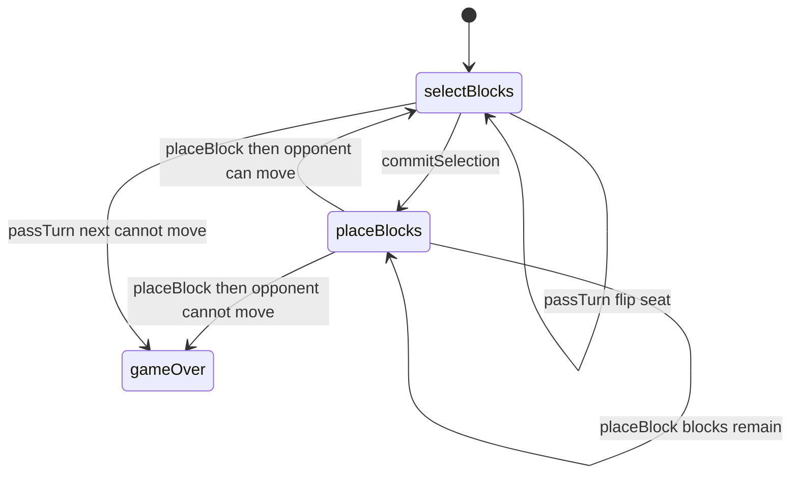

# Hex-a-Gone! — engine reference

> Contributor-only. Describes **code** under `src/games/hex-a-gone/`. Not player-facing rules copy.
>
> Broader wiring: [wiki architecture (#475)](../../wiki/architecture.md) · [game registry](../../wiki/game-registry.md) · [docs sync (#496)](https://github.com/fuzzywigg/math-pentathlon/pull/496).
> Do not duplicate those docs here.

- **Registry id:** `hex-a-gone` (Division I)
- **Mount:** `src/ui/game-route-mounts.ts` → `case 'hex-a-gone'` → `src/games/hex-a-gone/game-controller.ts`
- **UI:** `src/games/hex-a-gone/board-ui.ts`
- **Rules / state:** `src/games/hex-a-gone/rules.ts`, `src/games/hex-a-gone/types.ts`
- **AI adapter:** `src/games/hex-a-gone/ai.ts`

## State shape

Primary type: `HexAGoneGameState` in `src/games/hex-a-gone/types.ts`.

| Field |
| --- |
| `board` |
| `boardWidth` |
| `boardHeight` |
| `placedBlocks` |
| `nextBlockId` |
| `bank` |
| `currentPlayer` |
| `phase` |
| `turnSelection` |
| `selectedBlockForPlacement` |
| `moveHistory` |
| `winner` |

```ts
export interface HexAGoneGameState {
  // Board state - hexagonal grid of cells
  board: BoardCell[];
  boardWidth: number;
  boardHeight: number;

  // Placed blocks
  placedBlocks: PlacedBlock[];
  nextBlockId: number;

  // Bank of available blocks
  bank: Record<BlockShape, number>;

  // Current turn
  currentPlayer: Player;
  phase: GamePhase;
  turnSelection: TurnSelection;

  // Selected block for placement preview
  selectedBlockForPlacement: BlockShape | null;

  // Move history
  moveHistory: MoveRecord[];

  // Winner
  winner: Player | null;
}
```

## Move types

- `MoveRecord` — `src/games/hex-a-gone/types.ts`

```ts
export interface MoveRecord {
  player: Player;
  blocksPlaced: BlockShape[];
  moveNumber: number;
}
```

### Apply / advance functions

- `selectBlock` — `src/games/hex-a-gone/rules.ts`
- `commitSelection` — `src/games/hex-a-gone/rules.ts`
- `selectBlockForPlacement` — `src/games/hex-a-gone/rules.ts`
- `placeBlock` — `src/games/hex-a-gone/rules.ts`
- `passTurn` — `src/games/hex-a-gone/rules.ts`

## Turn / phase state machine

Phase type: `GamePhase` in `src/games/hex-a-gone/types.ts`.

```ts
export type GamePhase = 'selectBlocks' | 'placeBlocks' | 'gameOver';
```



## Win / draw detection

| Function | File | What the code does |
| --- | --- | --- |
| `isGameOver` | `src/games/hex-a-gone/rules.ts` | Phase/winner flags. |
| `canPlayerMove` | `src/games/hex-a-gone/rules.ts` | Bank non-empty and any empty cell (not fit-aware). |
| `placeBlock` | `src/games/hex-a-gone/rules.ts` | Last successful placer wins when next seat fails `canPlayerMove`. |

## Serialization format

No dedicated codec. No `Map`/`Set` → JSON / `structuredClone`.

Shared progress storage (`src/core/storage/storage.ts`) persists stats/profile only, not in-progress boards.

## AI adapter

- `getAISelection` — `src/games/hex-a-gone/ai.ts`
- `getAIPlacement` — `src/games/hex-a-gone/ai.ts`
- `executeAITurn` — `src/games/hex-a-gone/ai.ts`
- `isAITurn` — `src/games/hex-a-gone/ai.ts`

## Tests that cover this engine

Imports from `src/games/hex-a-gone/` (non-exhaustive; prefer these first):

- `tests/unit/burn-wave41-hex-a-gone-ai-turn.test.ts`
- `tests/unit/burn-wave41-hex-a-gone-phase-messages.test.ts`
- `tests/unit/burn-wave42-hexagone-ai-empty-bank-null.test.ts`
- `tests/unit/burn-wave42-hexagone-ai-late-game-selection.test.ts`
- `tests/unit/burn-wave42-hexagone-available-shapes-filter.test.ts`
- `tests/unit/burn-wave42-hexagone-is-ai-turn-matrix.test.ts`
- `tests/unit/burn-wave42-hexagone-phase-message-deepen.test.ts`
- `tests/unit/burn-wave42-hexagone-place-win-empty-bank.test.ts`
- `tests/unit/burn-wave42-hexagone-place-win-full-board.test.ts`
- `tests/unit/burn-wave42-hexagone-place-wrong-phase-identity.test.ts`
- `tests/unit/burn-wave43-hexagone-ai-null-execute.test.ts`
- `tests/unit/burn-wave43-hexagone-fill-board-win.test.ts`
- `tests/unit/burn-wave43-hexagone-place-pass-win.test.ts`
- `tests/unit/burn-wave47-hex-a-gone-ai-turn.test.ts`
- `tests/unit/burn-wave47-hex-a-gone-phase-messages.test.ts`
- `tests/unit/burn-wave47-hexagone-ai-empty-bank-null.test.ts`
- `tests/unit/burn-wave47-hexagone-ai-late-game-selection.test.ts`
- `tests/unit/burn-wave47-hexagone-available-shapes-filter.test.ts`
- `tests/unit/helpers/state-roundtrip-games.ts`

Also exercised by cross-game suites that import the module where listed above (round-trip helper, undo-audit props, registry/mount smoke).

## Known TODOs in code comments

None found under `src/games/hex-a-gone/` (`TODO` / `FIXME` / `Andrew` comment scan).

## Key symbols (link-check table)

| Symbol | File |
| --- | --- |
| `HexAGoneGameState` | `src/games/hex-a-gone/types.ts` |
| `MoveRecord` | `src/games/hex-a-gone/types.ts` |
| `selectBlock` | `src/games/hex-a-gone/rules.ts` |
| `commitSelection` | `src/games/hex-a-gone/rules.ts` |
| `selectBlockForPlacement` | `src/games/hex-a-gone/rules.ts` |
| `placeBlock` | `src/games/hex-a-gone/rules.ts` |
| `passTurn` | `src/games/hex-a-gone/rules.ts` |
| `GamePhase` | `src/games/hex-a-gone/types.ts` |
| `isGameOver` | `src/games/hex-a-gone/rules.ts` |
| `canPlayerMove` | `src/games/hex-a-gone/rules.ts` |
| `getAISelection` | `src/games/hex-a-gone/ai.ts` |
| `getAIPlacement` | `src/games/hex-a-gone/ai.ts` |
| `executeAITurn` | `src/games/hex-a-gone/ai.ts` |
| `isAITurn` | `src/games/hex-a-gone/ai.ts` |
| *(module)* | `src/games/hex-a-gone/game-controller.ts` |
| *(module)* | `src/games/hex-a-gone/board-ui.ts` |
| *(module)* | `src/games/hex-a-gone/rules.ts` |
| *(module)* | `src/games/hex-a-gone/ai.ts` |
| *(module)* | `src/games/hex-a-gone/tutorial.ts` |
| *(module)* | `src/ui/game-route-mounts.ts` |
| *(module)* | `src/core/game-registry.ts` |

## Questions for Andrew

Flagged code-vs-docs disagreements only (no rules text edited here). See also `docs/RULES-DECISIONS-2026-10-07.md` and `docs/tutorial-engine-mismatches-2026-10-07.md`.

- **H5 / HG1:** `canPlayerMove` ignores whether remaining shapes actually fit empty cells.
  - Recommendation: **Yes** — Yes — stuck means no legal place.
