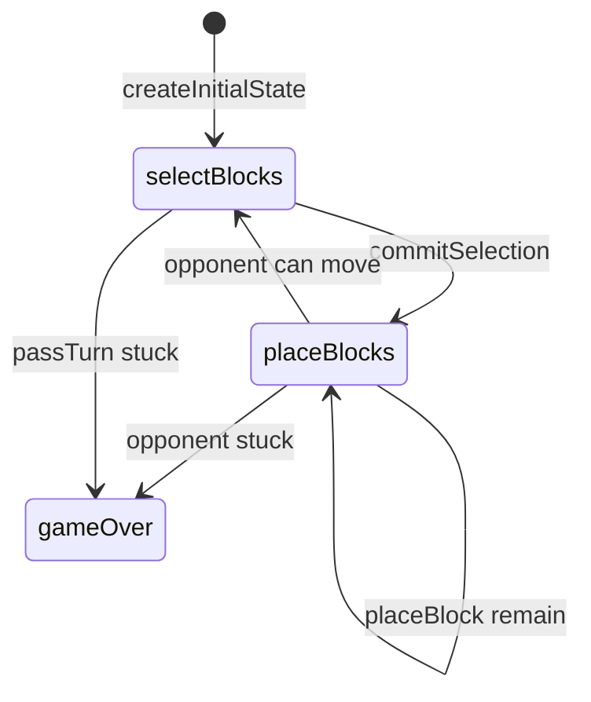

# Hex-a-Gone! engine (`hex-a-gone`)

> Contributor reference for what the **code** does. Not player-facing.
> Do not treat this as official rules text. Wiki architecture: [docs/wiki/architecture.md](../../wiki/architecture.md) ([#475](https://github.com/fuzzywigg/math-pentathlon/issues/475)).
> Docs-sync work: see [#496](https://github.com/fuzzywigg/math-pentathlon/issues/496) — this page does not replace it.

**Division:** Division I · **Registry id:** `hex-a-gone`

## Module files

- `src/games/hex-a-gone/types.ts`
- `src/games/hex-a-gone/rules.ts`

**AI adapter**

- `src/games/hex-a-gone/ai.ts`

**UI entry**

- `src/games/hex-a-gone/board-ui.ts`
- `src/games/hex-a-gone/game-controller.ts`
- `src/games/hex-a-gone/board-3d-loader.ts`

## State shape

Primary type `HexAGoneGameState` in `src/games/hex-a-gone/types.ts`.

- `board: BoardCell[]`
- `bank: Record<BlockShape, number>`
- `phase: GamePhase` — `'selectBlocks' | 'placeBlocks' | 'gameOver'`
- `turnSelection` / `selectedBlockForPlacement`
- `placedBlocks` / `nextBlockId`
- `winner: Player | null`
- `moveHistory: MoveRecord[]`

## Move types

Apply `selectBlock` / `deselectBlock` / `commitSelection` / `selectBlockForPlacement` / `placeBlock` / `passTurn`.

Apply / query API:

- `commitSelection`
- `placeBlock`
- `passTurn`
- `canPlayerMove` / `isGameOver`

## Turn / phase state machine

Phases in code: `selectBlocks`, `placeBlocks`, `gameOver`.



## Win / draw detection

- Last placer wins when opponent `!canPlayerMove`
- `isGameOver`
- `canPlayerMove` is not fit-aware
- No explicit draw path

## Serialization format

No codec. In-memory controller state.

## Tests that cover this engine

- `tests/unit/engine-coverage-hex-a-gone-targeted.test.ts`
- `tests/unit/hex-a-gone-rules.test.ts`
- `tests/unit/hex-a-gone-ai.test.ts`
- `tests/unit/burn-wave41-hex-a-gone-full-flow.test.ts`
- `tests/unit/burn-wave41-hex-a-gone-pass-stuck.test.ts`
- `tests/unit/burn-wave35-hex-a-gone-mutual-stuck-settle.test.ts`
- `tests/unit/burn-wave42-hexagone-place-win-full-board.test.ts`
- `tests/unit/state-roundtrip-fuzz.test.ts`

## Known TODOs (from code comments)

- Comments mark simplified 1-cell footprints; `BLOCK_SIZES` multi-cell sizes unused by placement.

## Questions for Andrew

Yes/no decisions; recommendations are non-binding.

- **Q:** Make `canPlayerMove` fit-aware vs 1-cell `getShapeCells` (RULES HG1)?
  - **Recommendation:** Yes — real footprints or drop unused size tables.

## Related reading

- Index: [README.md](./README.md)
- Wiki games catalog: [docs/wiki/games.md](../../wiki/games.md)
- Wiki architecture (#475): [docs/wiki/architecture.md](../../wiki/architecture.md)
- Adding a game: [docs/wiki/adding-a-game.md](../../wiki/adding-a-game.md)
- Rules decision log (do not edit rules here): [docs/RULES-DECISIONS-2026-10-07.md](../../RULES-DECISIONS-2026-10-07.md)

```dev-doc-refs
src/games/hex-a-gone/types.ts#HexAGoneGameState
src/games/hex-a-gone/types.ts#GamePhase
src/games/hex-a-gone/types.ts#createInitialState
src/games/hex-a-gone/types.ts#BLOCK_SIZES
src/games/hex-a-gone/rules.ts#commitSelection
src/games/hex-a-gone/rules.ts#placeBlock
src/games/hex-a-gone/rules.ts#passTurn
src/games/hex-a-gone/rules.ts#isGameOver
src/games/hex-a-gone/rules.ts#canPlayerMove
src/games/hex-a-gone/ai.ts#executeAITurn
src/games/hex-a-gone/game-controller.ts#initGame
src/games/hex-a-gone/board-ui.ts#renderBoard
tests/unit/engine-coverage-hex-a-gone-targeted.test.ts
src/core/game-registry.ts#GAMES
src/ui/game-route-mounts.ts#mountGameById
```
