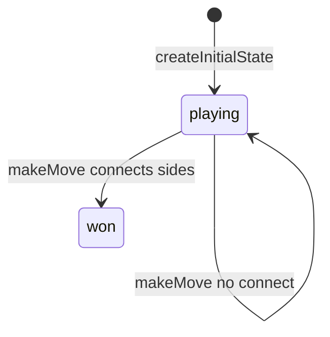

# Hex engine (`hex`)

> Contributor reference for what the **code** does. Not player-facing.
> Do not treat this as official rules text. Wiki architecture: [docs/wiki/architecture.md](../../wiki/architecture.md) ([#475](https://github.com/fuzzywigg/math-pentathlon/issues/475)).
> Docs-sync work: see [#496](https://github.com/fuzzywigg/math-pentathlon/issues/496) — this page does not replace it.

**Division:** Division I · **Registry id:** `hex`

## Module files

- `src/games/hex/types.ts`
- `src/games/hex/rules.ts`

**AI adapter**

- `src/games/hex/ai.ts`
- `src/games/hex/ai-client.ts`
- `src/games/hex/ai.worker.ts`

**UI entry**

- `src/games/hex/board-ui.ts`
- `src/games/hex/game-controller.ts`

## State shape

Primary type `HexGameState` in `src/games/hex/types.ts`.

- `board: HexBoard`
- `currentPlayer: Player`
- `winner: Player | null`
- `boardSize: number` (default 11)
- `moveHistory: HexMove[]`

## Move types

`HexMove { player, position, moveNumber }`. Apply `makeMove(state, pos)`.

Apply / query API:

- `makeMove`
- `isValidMove` / `getValidMoves`
- `checkWinner` / `getWinningPath`

## Turn / phase state machine

Phases in code: `playing (implicit)`, `won (winner set; no phase enum)`.



## Win / draw detection

- `checkWinner` → `boolean`
- `makeMove` sets `winner` on connection
- No draw API — full board may leave `winner: null`

## Serialization format

No codec. In-memory `getGameState()`. Fuzz JSON / `structuredClone`.

## Tests that cover this engine

- `tests/unit/hex-rules.test.ts`
- `tests/unit/hex-ai.test.ts`
- `tests/unit/hex-neighbors.test.ts`
- `tests/unit/hex-coordinates.test.ts`
- `tests/unit/hex-deep-playability.test.ts`
- `tests/unit/ai-worker-parity-queens-hex.test.ts`
- `tests/unit/burn-wave35-hex-postwin-empty-valids.test.ts`
- `tests/unit/burn-wave29-hex-types-consistency.test.ts`
- `tests/unit/state-roundtrip-fuzz.test.ts`
- `tests/unit/undo-audit-core-games-props.test.ts`

## Known TODOs (from code comments)

- No tagged TODOs under `src/games/hex/`.

## Questions for Andrew

Yes/no decisions; recommendations are non-binding.

- **Q:** Full board with no path — explicit draw (RULES HX1)?
  - **Recommendation:** Yes — expose draw/`gameOver`.

## Related reading

- Index: [README.md](./README.md)
- Wiki games catalog: [docs/wiki/games.md](../../wiki/games.md)
- Wiki architecture (#475): [docs/wiki/architecture.md](../../wiki/architecture.md)
- Adding a game: [docs/wiki/adding-a-game.md](../../wiki/adding-a-game.md)
- Rules decision log (do not edit rules here): [docs/RULES-DECISIONS-2026-10-07.md](../../RULES-DECISIONS-2026-10-07.md)

```dev-doc-refs
src/games/hex/types.ts#HexGameState
src/games/hex/types.ts#HexMove
src/games/hex/types.ts#createInitialState
src/games/hex/rules.ts#makeMove
src/games/hex/rules.ts#checkWinner
src/games/hex/rules.ts#getValidMoves
src/games/hex/rules.ts#getWinningPath
src/games/hex/ai.ts#getBestMove
src/games/hex/ai-client.ts#getBestMoveAsync
src/games/hex/ai.worker.ts
src/games/hex/game-controller.ts#initGame
src/games/hex/board-ui.ts#renderBoard
tests/unit/hex-rules.test.ts
tests/unit/ai-worker-parity-queens-hex.test.ts
src/core/game-registry.ts#GAMES
src/ui/game-route-mounts.ts#mountGameById
```
