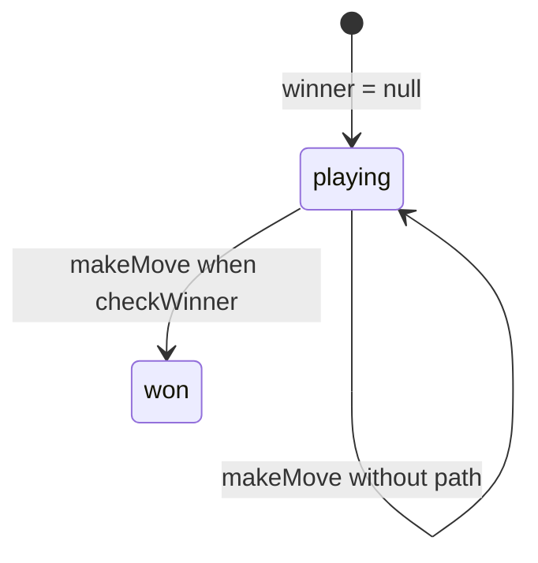

# Hex — engine reference

> Contributor-only. Describes **code** under `src/games/hex/`. Not player-facing rules copy.
>
> Broader wiring: [wiki architecture (#475)](../../wiki/architecture.md) · [game registry](../../wiki/game-registry.md) · [docs sync (#496)](https://github.com/fuzzywigg/math-pentathlon/pull/496).
> Do not duplicate those docs here.

- **Registry id:** `hex` (Division I)
- **Mount:** `src/ui/game-route-mounts.ts` → `case 'hex'` → `src/games/hex/game-controller.ts`
- **UI:** `src/games/hex/board-ui.ts`
- **Rules / state:** `src/games/hex/rules.ts`, `src/games/hex/types.ts`
- **AI adapter:** `src/games/hex/ai.ts` + worker client

## State shape

Primary type: `HexGameState` in `src/games/hex/types.ts`.

| Field |
| --- |
| `board` |
| `currentPlayer` |
| `winner` |
| `boardSize` |
| `moveHistory` |

```ts
export interface HexGameState {
  board: HexBoard;
  currentPlayer: Player;
  winner: Player | null;
  boardSize: number;
  moveHistory: HexMove[];
}
```

## Move types

- `HexMove` — `src/games/hex/types.ts`

```ts
export interface HexMove {
  player: Player;
  position: HexPosition;
  moveNumber: number;
}
```

- `HexPosition` — `src/games/hex/types.ts`

```ts
export interface HexPosition {
  row: number;
  col: number;
}
```

### Apply / advance functions

- `makeMove` — `src/games/hex/rules.ts`

## Turn / phase state machine

No `GamePhase` / `TurnPhase` field. Turn progress uses `currentPlayer` / `winner` (and capture restore where applicable) on `HexGameState`.



## Win / draw detection

| Function | File | What the code does |
| --- | --- | --- |
| `checkWinner` | `src/games/hex/rules.ts` | BFS connection: player1 top–bottom, player2 left–right. |
| `getWinningPath` | `src/games/hex/rules.ts` | Returns cells on a winning path if present. |
| `getValidMoves` | `src/games/hex/rules.ts` | Empty-cell list; full board with no path leaves winner null. |

## Serialization format

No dedicated mid-game codec. State is arrays/plain objects → Map/Set-aware JSON / `structuredClone` (see `docs/state-roundtrip-2026-10-07.md`). Progress storage does not persist boards.

Shared progress storage (`src/core/storage/storage.ts`) persists stats/profile only, not in-progress boards.

## AI adapter

- `searchBestMove` — `src/games/hex/ai.ts`
- `getBestMove` — `src/games/hex/ai.ts`
- `getRandomMove` — `src/games/hex/ai.ts`
- `getBestMoveAsync` — `src/games/hex/ai-client.ts`
- Worker module: `src/games/hex/ai.worker.ts`
- Shared protocol: `src/core/ai-worker/protocol.ts` (`AiWorkerGameId` includes this game)

## Tests that cover this engine

Imports from `src/games/hex/` (non-exhaustive; prefer these first):

- `tests/unit/ai-worker-parity-queens-hex.test.ts`
- `tests/unit/burn-wave35-hex-postwin-empty-valids.test.ts`
- `tests/unit/burn-wave42-hex-ai-block-opponent.test.ts`
- `tests/unit/burn-wave42-hex-ai-block-p1-threat-as-p2.test.ts`
- `tests/unit/burn-wave42-hex-ai-fullboard-null-matrix.test.ts`
- `tests/unit/burn-wave42-hex-ai-hard-midgame-legal.test.ts`
- `tests/unit/burn-wave42-hex-ai-immediate-win.test.ts`
- `tests/unit/burn-wave42-hex-ai-near-block-both-paths.test.ts`
- `tests/unit/burn-wave42-hex-ai-opening-fallback.test.ts`
- `tests/unit/burn-wave42-hex-ai-p2-immediate-win.test.ts`
- `tests/unit/burn-wave42-hex-ai-player2-seat.test.ts`
- `tests/unit/burn-wave42-hex-game-ai-center-block.test.ts`
- `tests/unit/burn-wave42-hex-game-winning-path.test.ts`
- `tests/unit/hex-ai.test.ts`
- `tests/unit/hex-aria-ai-turn-no-placement.test.ts`
- `tests/unit/hex-rules.test.ts`
- `tests/unit/overnight-wave51-hex-render-board-winner-blocks-click.test.ts`
- `tests/unit/overnight-wave51-hex-render-winning-class.test.ts`
- `tests/unit/helpers/state-roundtrip-games.ts`

Also exercised by cross-game suites that import the module where listed above (round-trip helper, undo-audit props, registry/mount smoke).

## Known TODOs in code comments

None found under `src/games/hex/` (`TODO` / `FIXME` / `Andrew` comment scan).

## Key symbols (link-check table)

| Symbol | File |
| --- | --- |
| `HexGameState` | `src/games/hex/types.ts` |
| `HexMove` | `src/games/hex/types.ts` |
| `HexPosition` | `src/games/hex/types.ts` |
| `makeMove` | `src/games/hex/rules.ts` |
| `checkWinner` | `src/games/hex/rules.ts` |
| `getWinningPath` | `src/games/hex/rules.ts` |
| `getValidMoves` | `src/games/hex/rules.ts` |
| `searchBestMove` | `src/games/hex/ai.ts` |
| `getBestMove` | `src/games/hex/ai.ts` |
| `getRandomMove` | `src/games/hex/ai.ts` |
| `getBestMoveAsync` | `src/games/hex/ai-client.ts` |
| *(module)* | `src/games/hex/game-controller.ts` |
| *(module)* | `src/games/hex/board-ui.ts` |
| *(module)* | `src/games/hex/rules.ts` |
| *(module)* | `src/games/hex/ai.ts` |
| *(module)* | `src/games/hex/tutorial.ts` |
| *(module)* | `src/games/hex/ai-client.ts` |
| *(module)* | `src/games/hex/ai.worker.ts` |
| *(module)* | `src/core/ai-worker/protocol.ts` |
| *(module)* | `src/ui/game-route-mounts.ts` |
| *(module)* | `src/core/game-registry.ts` |

## Questions for Andrew

Flagged code-vs-docs disagreements only (no rules text edited here). See also `docs/RULES-DECISIONS-2026-10-07.md` and `docs/tutorial-engine-mismatches-2026-10-07.md`.

- **HX1:** Full board with no connection leaves `winner: null` and empty `getValidMoves` — no explicit draw/finished phase.
  - Recommendation: **Yes** — Yes — add an explicit draw settle when no moves remain.
