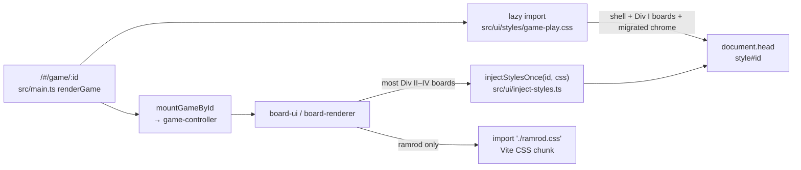
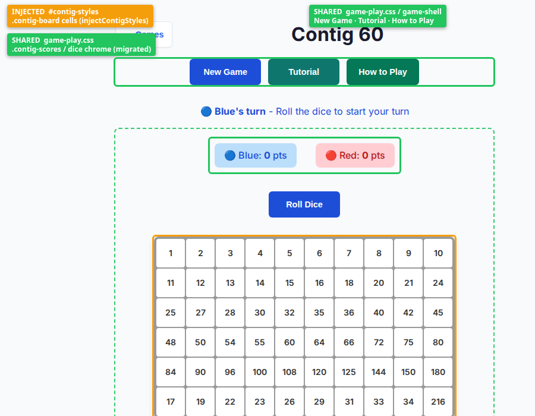

# injectStyles / board CSS ownership (`q-mp-122`)

Contributor map of how per-game board styles reach the DOM versus the shared play stylesheet. **Docs only** — read from tip `7d59901c`. Not player-facing copy.

**Related on tip:** [`injectStylesOnce` unit coverage (`q-mp-106` / #632 folded)](../../../tests/unit/inject-styles-once.test.ts); [Ramrod CSS extracted to Vite chunk (`q-mp-110` / #636 folded)](../../../src/games/ramrod/ramrod.css).

## Two layers



| Layer | Path | When it loads | Owns |
| --- | --- | --- | --- |
| Shared play CSS | `src/ui/styles/game-play.css` | Lazy with every game route (`src/main.ts` + idle-warm) | Game shell chrome, tutorial/Ollie, vs-AI seat overrides, **full** Hex / Star Track / Hex-a-Gone / Calla board sections, Kings `.board` / `.cell*`, and **migrated chrome** for Contig / Sum Dominoes / Queens (see map) |
| Idempotent inject | `src/ui/inject-styles.ts` → `injectStylesOnce(id, css)` | First call from a board-ui `inject*Styles()` | Per-game rules under a stable `<style id="…">` in `document.head`; second call with the same `id` is a no-op |
| Vite CSS import | `src/games/ramrod/ramrod.css` | With the ramrod board-ui module | Full Ramrod board rules (keeps the JS chunk under gzip budget); still registers a tiny `#ramrod-styles` handshake marker via `injectStylesOnce` |

`injectStylesOnce` itself (live):

```ts
// src/ui/inject-styles.ts
export function injectStylesOnce(id: string, css: string): void {
  if (document.getElementById(id)) return;
  const style = document.createElement('style');
  style.id = id;
  style.textContent = css;
  document.head.appendChild(style);
}
```

## Ownership map (20 registry games)

Scanned from live `src/games/*/board-ui.ts` (and Kings `board-renderer.ts`) on tip. “Shared” always includes shell classes from `game-play.css` (`.button-row`, `.move-history`, `.status-*`, tutorial, Ollie, mode modal, vs-AI seat rules).

### A — Full board CSS in `game-play.css` (no per-game inject)

| Game id | Board style home | Notes |
| --- | --- | --- |
| `hex` | `game-play.css` § HEX GAME STYLES | SVG hex board classes (`.hex-board`, `.hex-cell-*`, …) |
| `star-track` | `game-play.css` § STAR TRACK GAME STYLES | Track / piece / chain chrome |
| `hex-a-gone` | `game-play.css` § HEX-A-GONE! GAME STYLES | Bank + hex cells |
| `calla` | `game-play.css` § CALLA GAME STYLES | Pit / store SVG chrome |
| `kings-quadraphages` | `game-play.css` `.board` / `.cell*` (+ `.kings-board` media rules) | Live `board-ui.ts` uses `class="board kings-board"`. Separate `board-renderer.ts` still builds an anonymous `<style>` for a `.game-board` demo path — not the route board. |

### B — `injectStylesOnce` from board-ui

| Game id | Style element id | Inject owns (typical) | Also in `game-play.css` |
| --- | --- | --- | --- |
| `contig-60` | `#contig-styles` | Board grid / cells / dice faces / expression lists | Migrated chrome: `.contig-game-area`, roll/pass, scores, status (§ CONTIG 60 STYLES) |
| `sum-dominoes` | `#sd-styles` | Board / domino tiles / valid cells | `.sd-game-area`, dice strip, roll/pass, hands |
| `queens-guards` | `#qg-styles` | Board grid / status / winner banner | `.qg-game-area`, `.qg-board-container` |
| `fab-a-diffy` | `#fab-styles` | Answer board, bars, op buttons | Focus-visible floors only |
| `fiar` | `#fiar-styles` | Board container, chips, banners | Focus-visible / shared shell |
| `frac-fact` | `#frac-fact-styles` | Choices, continue, fraction chrome | Focus-visible floors |
| `kwatro-sinko` | `#kwa-styles` | Full Kwa layout + SVG board chrome | Shared shell / vs-AI |
| `par-55` | `#par55-styles` | Board, hand blocks, controls | Focus-visible floors |
| `prime-gold` | `#prime-gold-styles` | Grid board + chrome (+ 3D host classes) | Shared shell / vs-AI |
| `remainder-islands` | `#remainder-islands-styles` | Islands, dice equation, controls | Focus-visible floors |
| `ramrod` | `#ramrod-styles` | **Handshake marker only** (`@media` token for unit tests) | Focus-visible for `.ramrod-rod-wrapper`; **full rules** in `src/games/ramrod/ramrod.css` via `import './ramrod.css'` |

### C — Manual inject (same idea, not yet on `injectStylesOnce`)

Prefer migrating these to `injectStylesOnce` when touching the file; behavior is the same (idempotent `<style id>`).

| Game id | Style id / gate | Module |
| --- | --- | --- |
| `fraction-pinball` | `#fraction-pinball-styles` | `injectFractionPinballStyles()` in `board-ui.ts` |
| `juggle` | `#juggle-styles` | `injectJuggleStyles()` |
| `pent-em-in` | `#pent-em-in-styles` | `injectPentEmInStyles()` |
| `stars-bars` | module flag `stylesInjected` (no element id) | `injectStarsStyles()` — unique among boards |

### D — Non-board injector (for completeness)

`src/core/dice/dice-selector.ts` has a private `injectStyles()` that stamps a selector-scoped `<style id>` — not part of the board ownership map, and not `injectStylesOnce`.

## Contributor rules of thumb

1. **Shell / shared chrome** (New Game row, history panel, tutorial overlay, Ollie, mode modal, vs-AI seat colors) → edit `src/ui/styles/game-play.css` only.
2. **Division I boards that already live in `game-play.css`** (Hex, Star Track, Hex-a-Gone, Calla, Kings `.board`) → keep them there; do not re-inject duplicates.
3. **Per-game board paint** for inject games → extend the existing `inject*Styles()` string (or `ramrod.css` for Ramrod). Keep the **stable style id**.
4. **Never** add a second `<style id>` with the same id expecting an update — `injectStylesOnce` keeps the first text forever for that document.
5. **Bundle budget:** large Ramrod CSS belongs in `ramrod.css` (Vite), not the JS chunk; keep `#ramrod-styles` as the tiny handshake marker so existing unit tests stay green.
6. **Coverage:** characterization for the helper is `tests/unit/inject-styles-once.test.ts` (`q-mp-106`).

## Screenshot — injected vs shared (Contig 60)

Chromium + SwiftShader ANGLE (same flags as CI mp3d). Contig is the clearest split: board cells come from `#contig-styles` (inject), while game-area chrome / roll controls / scores were migrated into `game-play.css`, and the outer shell buttons/history come from shared play CSS.



Callouts in the image:

- **Shared (`game-play.css`)** — shell button row / history; Contig chrome (`.contig-game-area`, scores, roll).
- **Injected (`#contig-styles`)** — `.contig-board` cell grid and face paint from `injectContigStyles()`.

## See also

- [Engine docs index](./README.md)
- [Game route lifecycle (`q-mp-070`)](./game-lifecycle.md)
- [Wiki architecture](../../wiki/architecture.md)
- [How to add a game](../../wiki/adding-a-game.md)
