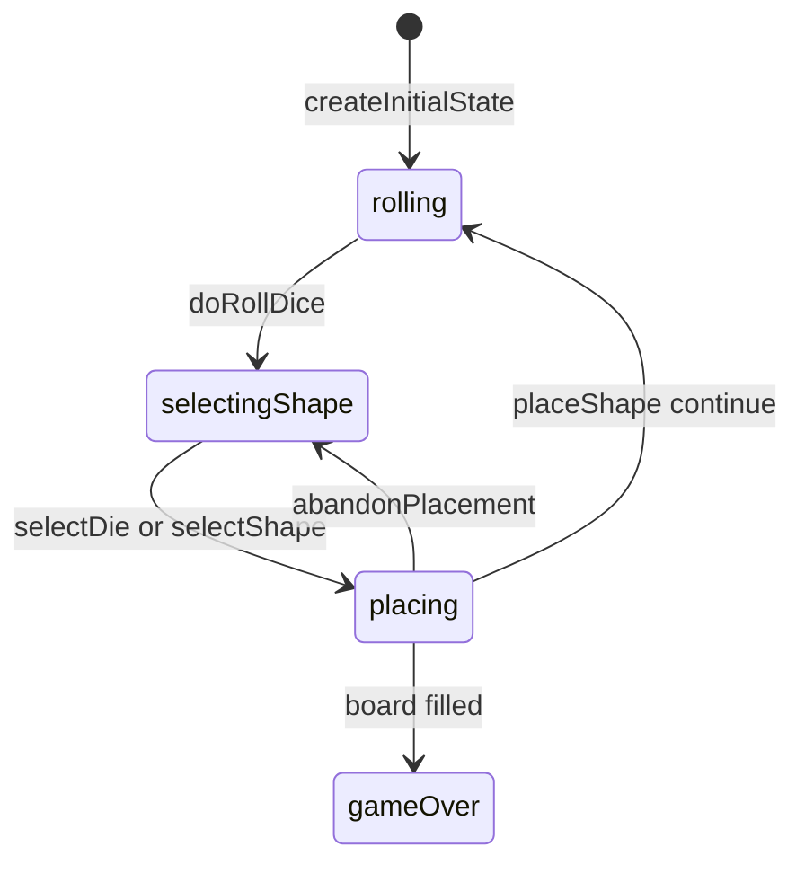

# Juggle engine (`juggle`)

> Contributor reference for what the **code** does. Not player-facing.
> Do not treat this as official rules text. Wiki architecture: [docs/wiki/architecture.md](../../wiki/architecture.md) ([#475](https://github.com/fuzzywigg/math-pentathlon/issues/475)).
> Docs-sync work: see [#496](https://github.com/fuzzywigg/math-pentathlon/issues/496) — this page does not replace it.

**Division:** Division III · **Registry id:** `juggle`

## Module files

- `src/games/juggle/types.ts`
- `src/games/juggle/rules.ts`

**AI adapter**

- `src/games/juggle/ai.ts`

**UI entry**

- `src/games/juggle/board-ui.ts`
- `src/games/juggle/game-controller.ts`

## State shape

Primary type `JuggleState` in `src/games/juggle/types.ts`.

- `boards: { player1: Board; player2: Board }` (9×9)
- `currentDice` / shape selection / rotation / flip / hover
- `phase: 'rolling' | 'selectingShape' | 'placing' | 'gameOver'`
- `winner: Player | null`
- `moveHistory: JuggleMove[]`

## Move types

History `JuggleMove`. Apply `doRollDice`, `selectDie`, `selectShape`, `abandonPlacement`, `rotateShape`, `flipShape`, `placeShape`.

Apply / query API:

- `doRollDice` / `selectDie` / `selectShape`
- `placeShape` — may fill board
- `checkWinner(boards)` / `canMakeAnyMove`

## Turn / phase state machine

Phases in code: `rolling`, `selectingShape`, `placing`, `gameOver`.



## Win / draw detection

- `checkWinner(boards)` → first filled board
- No draw path
- `canMakeAnyMove` exists but no `passTurn`

## Serialization format

No codec. In-memory module state. Fuzz JSON / `structuredClone`.

## Tests that cover this engine

- `tests/unit/juggle-rules.test.ts`
- `tests/unit/juggle-ai.test.ts`
- `tests/unit/juggle-placement-escape.test.ts`
- `tests/unit/burn-wave35-juggle-win-fill-settle.test.ts`
- `tests/unit/burn-wave40-juggle-phase-reject-matrix.test.ts`
- `tests/unit/burn-wave41-juggle-fill-jam-winner.test.ts`
- `tests/unit/burn-wave43-juggle-check-winner-fill.test.ts`
- `tests/unit/state-roundtrip-fuzz.test.ts`

## Known TODOs (from code comments)

- No tagged TODOs under `src/games/juggle/`.

## Questions for Andrew

Yes/no decisions; recommendations are non-binding.

- **Q:** Add `passTurn` when neither die fits (RULES JG1 soft-lock)?
  - **Recommendation:** Yes — if soft-lock is reachable in practice.

## Related reading

- Index: [README.md](./README.md)
- Wiki games catalog: [docs/wiki/games.md](../../wiki/games.md)
- Wiki architecture (#475): [docs/wiki/architecture.md](../../wiki/architecture.md)
- Adding a game: [docs/wiki/adding-a-game.md](../../wiki/adding-a-game.md)
- Rules decision log (do not edit rules here): [docs/RULES-DECISIONS-2026-10-07.md](../../RULES-DECISIONS-2026-10-07.md)

```dev-doc-refs
src/games/juggle/types.ts#JuggleState
src/games/juggle/types.ts#JuggleMove
src/games/juggle/rules.ts#createInitialState
src/games/juggle/rules.ts#doRollDice
src/games/juggle/rules.ts#placeShape
src/games/juggle/rules.ts#checkWinner
src/games/juggle/rules.ts#canMakeAnyMove
src/games/juggle/ai.ts#executeAITurn
src/games/juggle/game-controller.ts#initGame
src/games/juggle/board-ui.ts#renderBoard
tests/unit/juggle-rules.test.ts
src/core/game-registry.ts#GAMES
src/ui/game-route-mounts.ts#mountGameById
```
