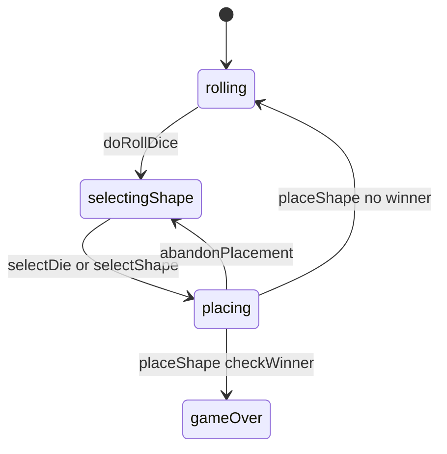

# Juggle — engine reference

> Contributor-only. Describes **code** under `src/games/juggle/`. Not player-facing rules copy.
>
> Broader wiring: [wiki architecture (#475)](../../wiki/architecture.md) · [game registry](../../wiki/game-registry.md) · [docs sync (#496)](https://github.com/fuzzywigg/math-pentathlon/pull/496).
> Do not duplicate those docs here.

- **Registry id:** `juggle` (Division III)
- **Mount:** `src/ui/game-route-mounts.ts` → `case 'juggle'` → `src/games/juggle/game-controller.ts`
- **UI:** `src/games/juggle/board-ui.ts`
- **Rules / state:** `src/games/juggle/rules.ts`, `src/games/juggle/types.ts`
- **AI adapter:** `src/games/juggle/ai.ts`

## State shape

Primary type: `JuggleState` in `src/games/juggle/types.ts`.

| Field |
| --- |
| `boards` |
| `currentPlayer` |
| `currentDice` |
| `selectedCategory` |
| `selectedDieValue` |
| `selectedShape` |
| `selectedRotation` |
| `selectedFlipped` |
| `hoverPosition` |
| `winner` |
| `moveHistory` |
| `phase` |

```ts
export interface JuggleState {
  boards: { player1: Board; player2: Board };
  currentPlayer: Player;
  currentDice: [number, number] | null;
  selectedCategory: ShapeCategory | null;
  /** Face value of the die chosen via selectDie (for accurate move-log chosenDie). */
  selectedDieValue: number | null;
  selectedShape: PolyominoShape | null;
  selectedRotation: 0 | 90 | 180 | 270;
  selectedFlipped: boolean;
  hoverPosition: { row: number; col: number } | null;
  winner: Player | null;
  moveHistory: JuggleMove[];
  phase: 'rolling' | 'selectingShape' | 'placing' | 'gameOver';
}
```

## Move types

- `JuggleMove` — `src/games/juggle/types.ts`

```ts
export interface JuggleMove {
  player: Player;
  dice: [number, number];
  chosenDie: number;
  shapeId: string;
  position: { row: number; col: number };
  rotation: 0 | 90 | 180 | 270;
  flipped: boolean;
  moveNumber: number;
}
```

### Apply / advance functions

- `doRollDice` — `src/games/juggle/rules.ts`
- `selectDie` — `src/games/juggle/rules.ts`
- `selectShape` — `src/games/juggle/rules.ts`
- `placeShape` — `src/games/juggle/rules.ts`
- `abandonPlacement` — `src/games/juggle/rules.ts`

## Turn / phase state machine

Phase field is an inline string union on `JuggleState` in `src/games/juggle/types.ts` (not a separate exported `GamePhase` alias).



## Win / draw detection

| Function | File | What the code does |
| --- | --- | --- |
| `checkWinner` | `src/games/juggle/rules.ts` | First filled 9×9 board via `isBoardFilled`. |
| `canMakeAnyMove` | `src/games/juggle/rules.ts` | Detects jammed rolls; no `passTurn` export in rules. |

## Serialization format

No dedicated codec. No `Map`/`Set` → JSON / `structuredClone`.

Shared progress storage (`src/core/storage/storage.ts`) persists stats/profile only, not in-progress boards.

## AI adapter

- `getAIDieChoice` — `src/games/juggle/ai.ts`
- `getAIShapeChoice` — `src/games/juggle/ai.ts`
- `getAIPlacement` — `src/games/juggle/ai.ts`
- `executeAITurn` — `src/games/juggle/ai.ts`
- `isAITurn` — `src/games/juggle/ai.ts`

## Tests that cover this engine

Imports from `src/games/juggle/` (non-exhaustive; prefer these first):

- `tests/unit/burn-wave35-juggle-ai-null-hard.test.ts`
- `tests/unit/burn-wave35-juggle-win-fill-settle.test.ts`
- `tests/unit/burn-wave40-juggle-phase-reject-matrix.test.ts`
- `tests/unit/burn-wave40-juggle-phase-roll-select-noop.test.ts`
- `tests/unit/burn-wave41-juggle-ai-execute-seat.test.ts`
- `tests/unit/burn-wave41-juggle-ai-live-opening.test.ts`
- `tests/unit/burn-wave41-juggle-fill-jam-winner.test.ts`
- `tests/unit/burn-wave41-juggle-phase-nops.test.ts`
- `tests/unit/burn-wave41-juggle-roll-dice-phase.test.ts`
- `tests/unit/burn-wave41-juggle-roll-phase-gate.test.ts`
- `tests/unit/burn-wave41-juggle-winner-can-move.test.ts`
- `tests/unit/burn-wave43-juggle-ai-null-gates.test.ts`
- `tests/unit/burn-wave43-juggle-ai-placement-difficulties.test.ts`
- `tests/unit/burn-wave43-juggle-ai-shape-choice.test.ts`
- `tests/unit/burn-wave43-juggle-check-winner-fill.test.ts`
- `tests/unit/burn-wave43-juggle-select-shape-phase-gate.test.ts`
- `tests/unit/burn-wave48-juggle-ai-die-late-game-big-penalty.test.ts`
- `tests/unit/burn-wave48-juggle-ai-die-null-gates.test.ts`
- `tests/unit/helpers/state-roundtrip-games.ts`

Also exercised by cross-game suites that import the module where listed above (round-trip helper, undo-audit props, registry/mount smoke).

## Known TODOs in code comments

None found under `src/games/juggle/` (`TODO` / `FIXME` / `Andrew` comment scan).

## Key symbols (link-check table)

| Symbol | File |
| --- | --- |
| `JuggleState` | `src/games/juggle/types.ts` |
| `JuggleMove` | `src/games/juggle/types.ts` |
| `doRollDice` | `src/games/juggle/rules.ts` |
| `selectDie` | `src/games/juggle/rules.ts` |
| `selectShape` | `src/games/juggle/rules.ts` |
| `placeShape` | `src/games/juggle/rules.ts` |
| `abandonPlacement` | `src/games/juggle/rules.ts` |
| `checkWinner` | `src/games/juggle/rules.ts` |
| `canMakeAnyMove` | `src/games/juggle/rules.ts` |
| `getAIDieChoice` | `src/games/juggle/ai.ts` |
| `getAIShapeChoice` | `src/games/juggle/ai.ts` |
| `getAIPlacement` | `src/games/juggle/ai.ts` |
| `executeAITurn` | `src/games/juggle/ai.ts` |
| `isAITurn` | `src/games/juggle/ai.ts` |
| *(module)* | `src/games/juggle/game-controller.ts` |
| *(module)* | `src/games/juggle/board-ui.ts` |
| *(module)* | `src/games/juggle/rules.ts` |
| *(module)* | `src/games/juggle/ai.ts` |
| *(module)* | `src/games/juggle/tutorial.ts` |
| *(module)* | `src/ui/game-route-mounts.ts` |
| *(module)* | `src/core/game-registry.ts` |

## Questions for Andrew

Flagged code-vs-docs disagreements only (no rules text edited here). See also `docs/RULES-DECISIONS-2026-10-07.md` and `docs/tutorial-engine-mismatches-2026-10-07.md`.

- **JG1:** Tutorial/rules decisions expect a jam pass; engine has `canMakeAnyMove` but no `passTurn`.
  - Recommendation: **Yes** — Yes — add a pass/settle path for jammed rolls.
