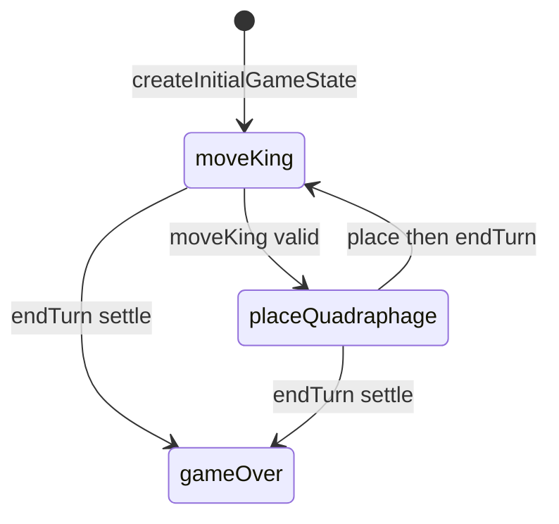

# Kings & Quadraphages engine (`kings-quadraphages`)

> Contributor reference for what the **code** does. Not player-facing.
> Do not treat this as official rules text. Wiki architecture: [docs/wiki/architecture.md](../../wiki/architecture.md) ([#475](https://github.com/fuzzywigg/math-pentathlon/issues/475)).
> Docs-sync work: see [#496](https://github.com/fuzzywigg/math-pentathlon/issues/496) — this page does not replace it.

**Division:** Division I · **Registry id:** `kings-quadraphages`

## Module files

- `src/games/kings-quadraphages/game-state.ts`
- `src/games/kings-quadraphages/board.ts`
- `src/games/kings-quadraphages/rules.ts`
- `src/games/kings-quadraphages/pieces.ts`
- `src/games/kings-quadraphages/serialization.ts`

**AI adapter**

- `src/games/kings-quadraphages/ai.ts`

**UI entry**

- `src/games/kings-quadraphages/board-ui.ts`
- `src/games/kings-quadraphages/game-controller.ts`
- `src/games/kings-quadraphages/board-3d-loader.ts`

## State shape

Primary type `GameState` in `src/games/kings-quadraphages/game-state.ts`.

- `board: Board` — 9×9 `Cell[][]` (`GamePiece | null`)
- `currentPlayer: PlayerOwner`
- `turnPhase: TurnPhase` — `'moveKing' | 'placeQuadraphage' | 'gameOver'`
- `player1Supply` / `player2Supply: number` (start 30)
- `selectedKingPosition: Position | null` (1-based)
- `winner: PlayerOwner | null`
- `moveHistory: MoveHistoryEntry[]`

## Move types

No `Move` union. Actions are pure functions on `GameState`. History `action: 'moveKing' | 'placeQuadraphage'`. AI: `AIMove`.

Apply / query API:

- `selectKing` / `moveKing` / `placeQuadraphage` / `endTurn` (`game-state.ts`)
- `checkWinCondition` / `isDrawCondition` / placement validators (`rules.ts`)

## Turn / phase state machine

Phases in code: `moveKing`, `placeQuadraphage`, `gameOver`.



## Win / draw detection

- `checkWinCondition` → `PlayerOwner | null`
- `isDrawCondition` → `boolean`
- `canCompleteTurn` → `boolean`
- Also settled inside `endTurn`

## Serialization format

Codec in `serialization.ts` (`serializeGameState` / `deserializeGameState` / JSON helpers). `SerializedGameState` version 1. **Not wired** into controller. Stats key `math-pentathlon-progress` only.

## Tests that cover this engine

- `tests/unit/engine-coverage-kings-quadraphages-targeted.test.ts`
- `tests/unit/burn-wave42-kings-serialize-roundtrip.test.ts`
- `tests/unit/burn-wave35-kings-serialize-place-phase.test.ts`
- `tests/unit/burn-wave42-kings-move-place-turn.test.ts`
- `tests/unit/burn-wave41-kings-endturn-settle.test.ts`
- `tests/unit/burn-wave41-kings-win-trap-placements.test.ts`
- `tests/unit/burn-wave42-kings-draw-supply-zero.test.ts`
- `tests/unit/kings-quadraphages-ai.test.ts`
- `tests/unit/kings-quadraphages-supply-exhaustion.test.ts`
- `tests/unit/kings-deep-playability.test.ts`
- `tests/unit/state-roundtrip-fuzz.test.ts`
- `tests/unit/undo-audit-core-games-props.test.ts`

## Known TODOs (from code comments)

- No tagged TODOs under `src/games/kings-quadraphages/`.
- `getBestMove` always uses hard search regardless of difficulty label.

## Questions for Andrew

Yes/no decisions; recommendations are non-binding.

- **Q:** Mutual king trap — draw instead of player1-first from `checkWinCondition` (RULES KQ1/H4)?
  - **Recommendation:** Yes — treat as draw.
- **Q:** Wire serialize codec into product save/load?
  - **Recommendation:** No — keep test/API-only until scoped.

## Related reading

- Index: [README.md](./README.md)
- Wiki games catalog: [docs/wiki/games.md](../../wiki/games.md)
- Wiki architecture (#475): [docs/wiki/architecture.md](../../wiki/architecture.md)
- Adding a game: [docs/wiki/adding-a-game.md](../../wiki/adding-a-game.md)
- Rules decision log (do not edit rules here): [docs/RULES-DECISIONS-2026-10-07.md](../../RULES-DECISIONS-2026-10-07.md)

```dev-doc-refs
src/games/kings-quadraphages/game-state.ts#GameState
src/games/kings-quadraphages/game-state.ts#TurnPhase
src/games/kings-quadraphages/game-state.ts#createInitialGameState
src/games/kings-quadraphages/game-state.ts#moveKing
src/games/kings-quadraphages/game-state.ts#placeQuadraphage
src/games/kings-quadraphages/game-state.ts#endTurn
src/games/kings-quadraphages/rules.ts#checkWinCondition
src/games/kings-quadraphages/rules.ts#isDrawCondition
src/games/kings-quadraphages/serialization.ts#serializeGameState
src/games/kings-quadraphages/serialization.ts#deserializeGameState
src/games/kings-quadraphages/serialization.ts#SerializedGameState
src/games/kings-quadraphages/ai.ts#getAIMove
src/games/kings-quadraphages/game-controller.ts#initGame
src/games/kings-quadraphages/board-ui.ts#renderBoard
tests/unit/engine-coverage-kings-quadraphages-targeted.test.ts
tests/unit/burn-wave42-kings-serialize-roundtrip.test.ts
src/core/game-registry.ts#GAMES
src/ui/game-route-mounts.ts#mountGameById
```
